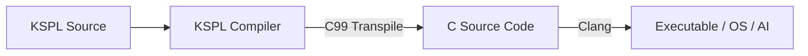

# Kanso Programming Language (KSPL)

> [!CAUTION]
> **This repository is an experiment.** The language, the standard library and every tool may change in ways that break existing code, with no deprecation period. The repository itself may be deleted or replaced without notice. Do not depend on it.

**KSPL** is a statically typed language for systems programming. It has no garbage collection, no implicit memory allocation, and no exception that is missing from a type: only what is written happens. One language covers bare metal on a microcontroller, web servers and AI inference.

"Kanso" (簡素, plainness) names the design philosophy of the whole project. KSPL is its first product. Kanso OS, Kanso Server, the AI engine, Kanso DataBase and Kanso Doc follow the same philosophy (their folders are in "Repository layout" below).

The compiler is written in KSPL itself (self-hosting). It **translates KSPL source into C99**, so a new platform needs only a C compiler, not a port of the toolchain. [Where it is supported](#where-it-is-supported) below lists where it is confirmed to run. A seed compiler written in C is included for bootstrapping.



## 🧭 How it is designed

| Idea | What it means |
| :-- | :-- |
| **No hidden work** | No exception unwinds the stack: failure is a return value. Freeing is chosen per type — `defer`, arenas or reference counting. |
| **Failure and absence appear in the type** | A function that can fail returns `T?E`, handled with `?` / `catch` / `fallback`. A missing value is `Option<\|T\|>`, and `switch` must handle `none`. |
| **Immutable by default** | Unmarked means immutable; `$` marks where rewriting is allowed. |
| **Bounds and initialization are guarded** | A slice checks its index at run time, and reading before initialization is stopped at compile time. Raw pointers remain for low-level control. |
| **Offered as parts, not imposed** | Features for particular domains are standard-library parts, not language rules. Only what is `import`ed is paid for, so an RTOS on a microcontroller stays light. |
| **One means to one purpose** | Nothing can be written two ways: no CLI option aliases, no synonymous APIs, no relative-path search. An `import` path is never searched for; three fixed rules resolve it. |
| **A compiler a tool can read** | The compiler emits its diagnostics as JSON on request (`--diagnostic-format=json`), and `ksplc explain` expands each diagnostic code. An editor, a script or a model reading the output needs nothing else. |
| **AI runs in it** | Inference and training are KSPL too (`ksai/`), with no second language beneath the model, and the same code runs from a microcontroller to a server. |

The reasons for each idea are in [`docs/DESIGN.md`](docs/DESIGN.md); for the last two rows, they are in "16. Models write it, and AI runs in it" in [`docs/DESIGN.md`](docs/DESIGN.md). How an `import` path resolves is in "The three strict rules of path resolution" in [`docs/SPEC-language.md`](docs/SPEC-language.md), and choosing a way of freeing is in "8.4 The memory management model: `defer` / ARC / arenas" there.

## 📊 What works, and how far

A row counts what actually ran, not what was written.

| Target | What it can do | How far it is confirmed |
| :-- | :-- | :-- |
| **The compiler** (`ksplc/`) | C99 generation, generics (one copy per type argument), `T?E`, `defer`, the formatter, the Language Server, the linter | A two-stage bootstrap from the seed, **self-hosting with zero difference**. CI builds it on Linux / macOS / Windows ×2, of which only some are supported ([below](#where-it-is-supported)). The Language Server is tested only with VS Code |
| **The LLVM IR backend** | The language features pass | **Not shipped: a mirror that keeps backend dependencies out of parse/sema/lower** ("6. The backends (Genc / Genllvm) and the runtime ABI" in [`ksplc/docs/DESIGN.md`](ksplc/docs/DESIGN.md)) |
| **The standard library** (`std/`) | Files, time, environment variables, signals, hashing and randomness, thread synchronization, TCP/UDP, HTTP/1.1, asynchronous I/O, JSON, URLs, regular expressions, collection operations | No dependencies by default. Only TLS (OpenSSL) and DB (SQLite) use an optional backend over FFI, **built only on Linux** |
| **The AI engine** (`ksai/`) | Tensor operations, inference, training (backpropagation), fine-tuning with LoRA, tokenizer, safetensors | KSPL alone, with no external library, including continued training on the device |
| **Kanso OS** (`ksos/`) | Cooperative and preemptive scheduling, mutual exclusion and waiting, a heap, peripheral drivers (MMIO), a minimal ARP/IPv4/UDP/TCP/MQTT | Three ports: Cortex-M / Armv6-M / POSIX. **Runs on real silicon (RP2040)**, not only QEMU. Wireless is out of scope (its license does not fit this repository's attribution) |
| **Kanso Server** (`kssrv/`) | Static serving, JSON APIs, inference on a resident model, LoRA training while it runs | Many connections on one thread, in constant resident memory |
| **Edge AI** | A policy trained on a PC and run on a microcontroller alone | **A closed loop on a palm-sized four-wheeled car** (a Freenove car kit plus a Raspberry Pi Pico W). It decides with the PC disconnected (measured timings are in "What has been checked on real hardware" in [ksos](ksos/README.md)) |
| **The document editing system** (`kspage/`) | Prose, tables and presentation material as one document: typing, formatting, table formulas, figures, a table of contents, chapter numbers, printing, HTML export | Runs in a browser (wasm32 + canvas); CI runs the wasm under `node`, and the input handling in a real browser: headless Chromium on Linux. Other browsers and input-method (IME) conversion are untested. **Not complete as an editing system** (what is there and what is not: [kspage](kspage/README.md)) |

**The car shows only that the mechanism runs on a microcontroller.** The prediction does not beat "the same as last time", and the accuracy target is unmet (why: "🤖 The AI on bare metal" in [`ksos/docs/DESIGN.md`](ksos/docs/DESIGN.md); how to read it: [`ksos/docs/HOWTO-bring-up.md`](ksos/docs/HOWTO-bring-up.md)). It is also a small microcontroller on a commercial car kit, not a car a person rides in.

### Phases

**The foundation was built in these phases, in this order, and it is done.** How far each part is confirmed is in its row of the table above.

| Phase | Subject | State |
| :--: | :-- | :--: |
| 0 | Standing on its own: self-hosting from a minimal seed written in C | ✅ |
| 1 | The formatter, the Language Server and the linter | ✅ |
| 2 | A general-purpose language: `std/`, `ksai/`, `ksos/`, and what bare metal needs (inline assembly, `volatile`, custom linker scripts) | ✅ |
| 3 | Demonstrating embedded, IoT and edge AI: the Edge AI loop, its result kept across power cycles in `ksdb/` | ✅ |

**Two things are worked on now, side by side**:

* **AI on microcontrollers**: gesture recognition, a model on the car's RP2040 recognizing a hand waved over its own sensors, trained and run from one KSPL source (its stages are in "Gesture recognition on the RP2040" in [`docs/PLAN.md`](docs/PLAN.md)).
* **The document editing system** ([`kspage/`](kspage/README.md)): what is left in it is in [`kspage/docs/PLAN.md`](kspage/docs/PLAN.md).

### Where it is supported

**Only the first level is supported.** Each row names the operating system, the architecture and the C compiler together. ksplc passes its output to a C compiler, so that compiler partly decides whether a program runs. Why the levels are set this way is in "15.3 'Supported' means someone uses it" in [`docs/DESIGN.md`](docs/DESIGN.md).

| Level | What stands behind it | Environments |
| :-- | :-- | :-- |
| **Supported** | The gates run there in CI, and Kanso is developed there day to day, so a person sees what no gate checks | Linux x86-64 (glibc) with clang, as [`.devcontainer/`](.devcontainer/) sets it up; Windows x64 with MSYS2 UCRT64's clang, which builds the released Windows `ksplc.exe` |
| **Built in CI, not confirmed** | A CI job builds it and runs part of the gates; nobody develops there, so nobody sees what no gate checks | macOS arm64 with Xcode's clang; Windows x64 with LLVM's own clang, which targets MSVC |
| **Untested** | Nothing runs there. It may work, since the output is C99, but nothing has shown it | GCC as the C compiler; MSVC's own `cl.exe` and `clang-cl`; a clang older than the rows above use; Linux on arm64, on musl, or other than the image above; Intel Macs; Windows on Arm; 32-bit hosts; the BSDs |

**A supported environment does not carry every package.** How far each package is confirmed is its row in [the table that opens this section](#-what-works-and-how-far). Which gate runs in which environment is in "What each platform runs" in [`docs/SPEC-gates.md`](docs/SPEC-gates.md).

## 🚀 Getting started

### ⚡ Quick start (write and run your first program)

The steps need a C compiler (`clang`) on the PATH, since `ksplc` passes its output to one.

1. **Get `ksplc`**

  **Build it from source** with `make`. It needs a clone of this repository, a C compiler and Make. On Windows, run these in the MSYS2 UCRT64 shell ("Windows natively, without Docker" in [`docs/HOWTO-build.md`](docs/HOWTO-build.md)).

  ```sh
  make                               # builds ksplc from the seed written in C
  make install                       # puts ksplc into ~/.local/bin, std/ into ~/.local/lib/kspl
  ```

  What `make install` needs, and the three ways it fails, are in "Putting `ksplc` on the PATH" in [`docs/HOWTO-build.md`](docs/HOWTO-build.md).

  **Or download it**, if the Releases page has a zip for your system: `ksplc-<version>-linux-x64.zip`, `ksplc-<version>-macos-arm64.zip` (Apple Silicon) or `ksplc-<version>-windows-x64.zip`. The macOS zip comes from a toolchain that CI builds but nobody confirms ([Where it is supported](#where-it-is-supported)). Unpacking puts `ksplc` (or `ksplc.exe`) and `std/` side by side. On Linux and macOS, `chmod +x ksplc` makes it runnable. It finds that `std/` from any folder; to type `ksplc` from anywhere, see "Working in another folder" in [`docs/HOWTO-set-up-a-project.md`](docs/HOWTO-set-up-a-project.md).

2. **Write your first program**

  Save the following as `hello.kspls` (inside the unpacked folder, if you downloaded `ksplc`).

  ```kspls
  import "std/io"

  fn main()
    io.out().s("Hello, Kanso!\n")
  ```

3. **Run it**

  ```sh
  ksplc run hello.kspls      # inside the unpacked folder: ./ksplc run hello.kspls
  ```

  `run` compiles, links and runs it in one command.

Next, [`docs/HOWTO-set-up-a-project.md`](docs/HOWTO-set-up-a-project.md) continues from here: passing arguments, working in another folder, an executable to distribute, a program split into files, and VS Code. [`docs/TOUR.md`](docs/TOUR.md) teaches the language.

## 📁 Repository layout

Each package's `README.md` is linked from its row.

| Directory / file | Description |
| :--- | :--- |
| **`ksplc/`** | The self-hosting compiler, the bootstrap seed (`seed.c`) and the canonical grammar `kspl.kspeg` ([entry point](ksplc/README.md) / [internal design](ksplc/docs/DESIGN.md)). |
| **`std/`** | The standard library, which the compiler itself depends on; flat, with no folders ([file list](std/README.md) / [design policy](std/docs/DESIGN.md)). |
| **`ksai/`** | The KSPL-native AI engine, with its own matrix computation, training, tokenizer and weight files. Its examples are `examples/llama_engine/` (training a tiny model from scratch) and `examples/qwen_infer/` (a Qwen2.5-family inference CLI); `benches/` measures speed and energy against Python and C ([introduction](ksai/README.md) / [design](ksai/docs/DESIGN.md)). |
| **`kspeg/`** | A parser that runs a PEG grammar directly, KSPL's own (`ksplc/kspl.kspeg`) among them ([introduction](kspeg/README.md) / [notation specification](kspeg/docs/SPEC-notation.md)). |
| **`ksos/`** | The lightweight real-time OS (Kanso OS): one kernel from a bare-metal microcontroller to a Linux host ([introduction](ksos/README.md) / [design](ksos/docs/DESIGN.md) / [what is left](ksos/docs/PLAN.md)). |
| **`kssrv/`** | The server (Kanso Server), on top of `std/net` and `std/http` ([introduction](kssrv/README.md) / [design](kssrv/docs/DESIGN.md) / [what is left](kssrv/docs/PLAN.md)). |
| **`ksdb/`** | A zero-dependency database for inside a device (Kanso DataBase): an append-only record on flash that survives power loss ([introduction](ksdb/README.md) / [design](ksdb/docs/DESIGN.md)). |
| **`kspage/`** | The editing system for prose, tables and presentation material as one document (Kanso Doc), with a browser port (wasm32 + canvas) ([introduction](kspage/README.md) / [design](kspage/docs/DESIGN.md) / [what is left](kspage/docs/PLAN.md)). |
| **`docs/`** | The documents belonging to no single package, such as [the design rationale](docs/DESIGN.md), [the rules every document obeys](docs/SPEC-documents.md) and [what is left](docs/PLAN.md). The table in [`docs/README.md`](docs/README.md) says who each is for. |
| **`tests/`** | The test suites for the language, the toolchain and the OS ([entry point](tests/README.md)). |
| **`tools/`** | Tools for developing Kanso itself, in KSPL where possible, including `ai_assist/` (training the code-completion AI) ([entry point](tools/README.md) / [what is left](tools/docs/PLAN.md)). |
| **`.vscode/`** | Editor settings, syntax highlighting for `.kspls` and `.kspeg`, and the native LSP extension. |
| **`.github/`** | GitHub Actions: `ci.yml` (continuous integration) and `release.yml` (per-OS binaries on a tag push). |
| **`.devcontainer/`** | An identical Dev Containers / Codespaces environment, ready to build and verify right after cloning. |
| **`out/`** | The output: artifacts directly under it, logs in `log/`, temporaries in `tmp/`, per-target artifacts in `ksos_*/`. `make clean` removes it all. |
| **`Makefile`** | Bootstrapping and building; it pulls in `mk/` with `include`. How to use it is in [`docs/CONTRIBUTING.md`](docs/CONTRIBUTING.md). |

## 📜 License

Kanso is published under the [MIT License](LICENSE.md).

Note: **Only the RP2040 files under `ksos/` owe a notice to the Raspberry Pi pico-sdk (BSD-3-Clause)**: its drivers, its stage-2 bootloader and the two tools that make its boot image. Their attribution and files, and the third-party artifacts not bundled (the Qwen weights, vendor materials), are in [`THIRD-PARTY-NOTICES.md`](THIRD-PARTY-NOTICES.md).

## 📖 Further reading

A document's name says its kind ("Document naming" in [`docs/SPEC-documents.md`](docs/SPEC-documents.md)). A folder's listing is its reading order, and the layout table above is the whole map.

* [`docs/README.md`](docs/README.md) — the documents that belong to no single package, and who each is for.
* [`docs/TOUR.md`](docs/TOUR.md) — the language one step at a time, through one program the gates run.
* [`docs/SPEC-language.md`](docs/SPEC-language.md) — the language specification.
* [`docs/CONTRIBUTING.md`](docs/CONTRIBUTING.md) — building from source, the gates, and the rules for changing Kanso.
