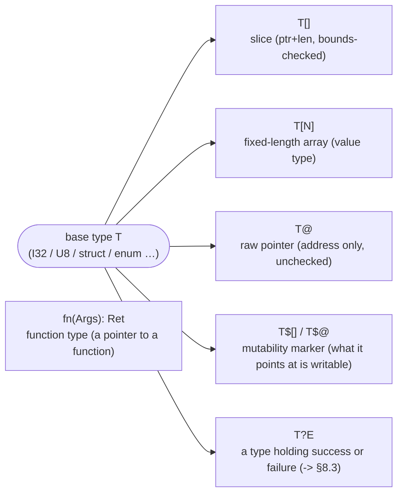
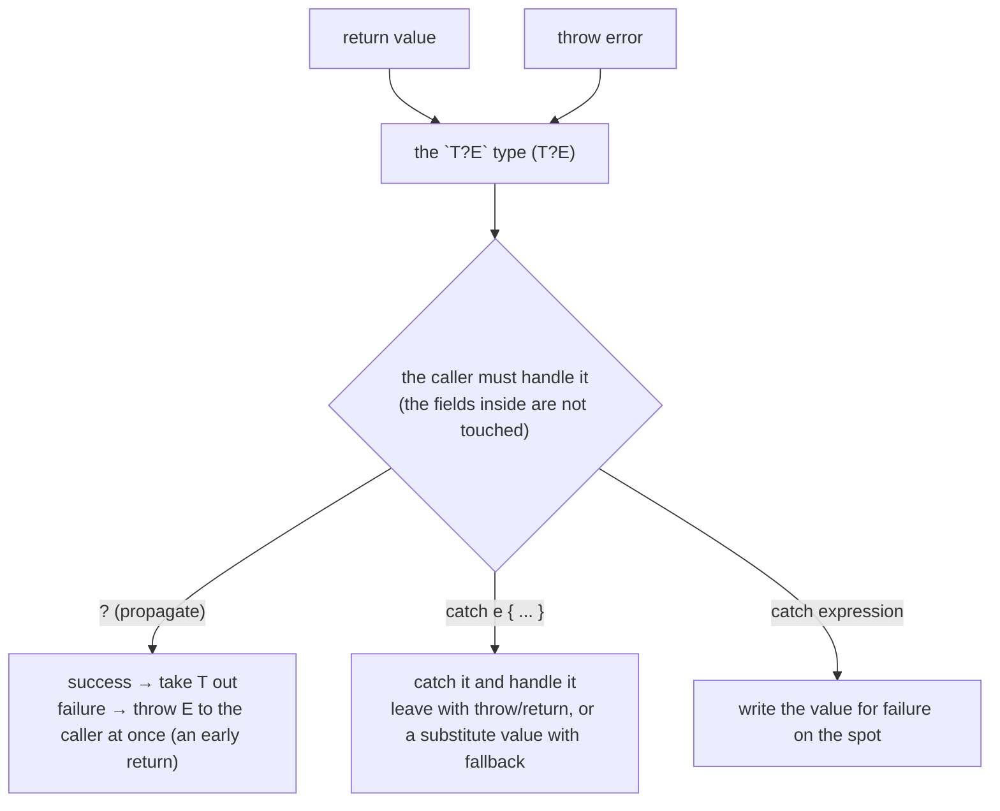

# The KSPL language specification

## Contents

* [1. Overview](#1-overview)
* [2. Lexical structure](#2-lexical-structure)
  * [2.1 Comments](#21-comments)
  * [2.2 Identifiers and naming rules](#22-identifiers-and-naming-rules)
  * [2.3 Literals](#23-literals)
  * [2.4 Trailing commas](#24-trailing-commas)
  * [2.5 Blocks and statement ends (brace and indentation notations)](#25-blocks-and-statement-ends-brace-and-indentation-notations)
* [3. The type system](#3-the-type-system)
  * [3.1 Primitive types](#31-primitive-types)
  * [3.2 Derived types](#32-derived-types)
  * [3.3 Structs (`struct`)](#33-structs-struct)
  * [3.4 Enums (`enum`)](#34-enums-enum)
  * [3.5 Typedefs (`typedef`)](#35-typedefs-typedef)
  * [3.6 The expansion specification for string interpolation](#36-the-expansion-specification-for-string-interpolation)
* [4. Variables and constants](#4-variables-and-constants)
  * [4.1 Declaration patterns](#41-declaration-patterns)
  * [4.2 The two axes of mutability](#42-the-two-axes-of-mutability)
  * [4.3 Places, and the rules for when they may be written](#43-places-and-the-rules-for-when-they-may-be-written)
  * [4.4 Initialization rules and definite initialization](#44-initialization-rules-and-definite-initialization)
  * [4.5 Scope and shadowing](#45-scope-and-shadowing)
  * [4.6 Embedding resources](#46-embedding-resources)
* [5. Implementations and traits](#5-implementations-and-traits)
  * [5.1 Traits (`trait`)](#51-traits-trait)
  * [5.2 Implementations (`impl`) and receivers](#52-implementations-impl-and-receivers)
  * [5.3 Checking trait conformance](#53-checking-trait-conformance)
  * [5.4 Worked example: forbidding copies with `Move_only`](#54-worked-example-forbidding-copies-with-move_only)
  * [5.5 Worked example: synthesizing a field table with `Reflectable`](#55-worked-example-synthesizing-a-field-table-with-reflectable)
* [6. Expressions and operators](#6-expressions-and-operators)
  * [6.1 The operator list and precedence](#61-the-operator-list-and-precedence)
  * [6.2 Pointer arithmetic and implicit dereferencing](#62-pointer-arithmetic-and-implicit-dereferencing)
  * [6.3 Method calls and namespaces](#63-method-calls-and-namespaces)
  * [6.4 Type conversion (`::`) and implicit casts](#64-type-conversion--and-implicit-casts)
  * [6.5 Assignment and compound assignment](#65-assignment-and-compound-assignment)
  * [6.6 Initialization and construction](#66-initialization-and-construction)
  * [6.7 Built-in operators](#67-built-in-operators)
  * [6.8 Integer arithmetic: folding, overflow, division, shifts](#68-integer-arithmetic-folding-overflow-division-shifts)
* [7. Control flow](#7-control-flow)
  * [7.1 Branching](#71-branching)
  * [7.2 Loops](#72-loops)
  * [7.3 Labelled blocks and breaking out of nested constructs](#73-labelled-blocks-and-breaking-out-of-nested-constructs)
* [8. Functions and error handling](#8-functions-and-error-handling)
  * [8.1 Definitions](#81-definitions)
  * [8.2 The entry point](#82-the-entry-point)
  * [8.3 Error handling](#83-error-handling)
  * [8.4 The memory management model: `defer` / ARC / arenas](#84-the-memory-management-model-defer--arc--arenas)
* [9. Files and import](#9-files-and-import)
  * [9.1 import syntax and path resolution](#91-import-syntax-and-path-resolution)
  * [9.2 Which names an import brings in](#92-which-names-an-import-brings-in)
  * [9.3 Adding a method to another file's type](#93-adding-a-method-to-another-files-type)
  * [9.4 Circular imports and visibility](#94-circular-imports-and-visibility)
* [10. Compiler directives and attributes](#10-compiler-directives-and-attributes)
  * [10.1 Dropping in bulk with `#cfg`](#101-dropping-in-bulk-with-cfg)
* [11. C interoperability](#11-c-interoperability)
  * [11.1 Types that cannot cross the C boundary](#111-types-that-cannot-cross-the-c-boundary)
  * [11.2 External functions and opaque structs](#112-external-functions-and-opaque-structs)
  * [11.3 Exposing a KSPL function to C (`#export`)](#113-exposing-a-kspl-function-to-c-export)
  * [11.4 Bare-metal primitives](#114-bare-metal-primitives)
  * [11.5 Naming the library an `extern` block needs (`#link`)](#115-naming-the-library-an-extern-block-needs-link)
* [12. Implementation limits](#12-implementation-limits)
* [13. Conditions that stop execution at run time](#13-conditions-that-stop-execution-at-run-time)
* [14. What the implementation decides](#14-what-the-implementation-decides)
  * [14.1 Implementation-defined - the value is fixed but differs per target](#141-implementation-defined---the-value-is-fixed-but-differs-per-target)
  * [14.2 Undefined - no answer is fixed](#142-undefined---no-answer-is-fixed)
  * [14.3 What must be the same in every implementation](#143-what-must-be-the-same-in-every-implementation)
* [Appendix A: Features not carried, and what to write instead](#appendix-a-features-not-carried-and-what-to-write-instead)
* [Appendix B: The standard library](#appendix-b-the-standard-library)

---

## 1. Overview

KSPL is a statically typed language for systems programming. **Only what is written happens**: code runs, and memory is allocated and freed, exactly where the code says. The type features on top are taken one part at a time, only as far as the program being built needs them. A feature only some kinds of work need is a standard-library part, not a language rule. The reasons for this shape are the [Development Principles](DESIGN.md#development-principles) in `DESIGN.md`.

---

## 2. Lexical structure

Source code is encoded in UTF-8.

### 2.1 Comments

* **Line comment**: from `//` to the end of the line, and the only kind of comment. There is no block comment `/* */` (the reason is in [`docs/DESIGN.md` §9.1](DESIGN.md)).
* **Documentation comment**: a line comment opening with `//<`. It describes the thing on its own line: a declaration, a field, a variant, a parameter or the return type. It stands after what it describes, not before it:

  ```kspls
  priv fn demangle( //< strips the mangling off a symbol
    raw: U8[], //< the mangled symbol as it was written
    file: U8[], //< the source the symbol came from
  ): U8[] //< the original name, or the input unchanged
    return raw
  ```

  * **A parameter's description goes on the parameter's line, a field's on the field's, and the return's on the return type's line.**
  * **A run**: a line holding only a `//<` and its text continues the description above it. It stands one step deeper than the line it continues. Any other line ends the run, a blank line or a plain `//` included. If the thing described has braces, the run goes inside them; otherwise it stands below, one step in.
  * **The summary**: inside a run, a `//<` with no text separates the summary from the detail below it. An editor's hover and `ksplc doc` show it first. It is one line, and it does not open with a `Caution:` or `Note:` label (`ksplc explain W0213`).
  * **The anchor shape**: a description longer than one line stands below a `//<` with no text, which separates nothing. When a declaration's head closes on a later line, a run below it belongs to the closing line. There, a `//<` with no text anchors the declaration's run, and one with text describes the return type.
  * The compiler warns about a `//<` that continues nothing, and about an anchor with nothing under it (`ksplc explain W0209`, `W0210`).
  * **A file's description** is a `//<` run before its first line of code, above its imports, with nothing over it but blank lines.

  The reasons are in "The documentation a declaration carries" in [`DESIGN.md`](DESIGN.md).
* **`///` and `//!` are not documentation comments.** The compiler warns about a comment opening with either, and does not read it (`ksplc explain W0212`). Four or more slashes open an ordinary comment.

A `#!` line (a shebang) is skipped like a comment **on a file's first line only**, so the file can run as a script with `ksplc run`. `#!` has no other meaning (a directive is `##`, an attribute `#`).

### 2.2 Identifiers and naming rules

An identifier starts with a letter (`A-Z`, `a-z`) or `_`, followed by letters, digits or underscores. KSPL's reserved words (keywords) cannot be identifiers.

This naming is recommended; **nothing checks it**.

* `Capital_snake_case`: types, structs (`struct`), enums (`enum`), typedefs (`typedef`)
* `snake_case`: variables, constants (`const`), functions (`fn`), methods, fields, file names
* An enum's variants: `snake_case` too, unlike C. With no run of capitals, they stand apart from the type name.

```kspls
// examples of the naming rules
const max_buffer_size = 1024

struct File_descriptor
  file_id: I32
  is_open: Bool

fn open_file(file_name: U8[]): File_descriptor?Io_error
  ...

```

**C's reserved words (`int` / `long` / `goto` and so on) are usable as identifiers**, except those that are also KSPL's own: `struct` / `enum` / `typedef` / `const` / `if` / `else` / `for` / `switch` / `return` / `break` / `continue` / `case` / `default` / `extern` / `sizeof` / `offsetof`. In the generated C, only local variables, parameters and struct fields keep their bare names, so only those get the suffix `_kw`. Type and function names carry a file-path prefix and never collide. It is a compile error only when the suffixed name already exists in the same scope (`goto` beside `goto_kw`).

**Two more groups get `_kw` and are usable too:**

* **Names the headers of the generated C's preamble `#define` as object-like macros.** Emitted bare, they would expand: `NULL` / `EOF` / `errno` from libc, and `far` / `near` / `pascal` from Windows' `windef.h`. Function-like macros (`max(a,b)`) expand only before a `(`, so this group leaves them out.
* **The words a C compiler keeps for itself**: every name opening with `__`, or with `_` and a capital letter. C99 keeps that space for the compiler: clang reads `__cdecl` as a keyword even on Linux, GCC reads `__thread`, and C11 defines `_Atomic`. The group also holds Microsoft's one-underscore synonyms (`_try` for `__try`, `_int64`), `static_assert` and `L__FUNCTION__` / `L__FUNCSIG__`. Its suffixed form opens the same way and gets `_kw` in turn, so `__try` beside `__try_kw` is not an error.

Names only OS headers define (`st_mtime` / `O_RDONLY` / `AF_INET`) are usable too. The order of the generated C keeps them apart, not this list.

**A debugger shows such a variable with its suffix** (`for` becomes `for_kw`), since it shows the generated C's names. The suffix is always `_kw`; drop it when reading.

### 2.3 Literals

A literal is a value written directly into the source. There are these seven kinds and no others.

| Category | Example notation | Type / notes |
| --- | --- | --- |
| **Integer** | `123`, `-10`<br>`0xFF` (hex)<br>`0b1010` (binary) | Defaults to `I32`; a suffix states the type (`123U8`, `100Sz`). |
| **Floating point** | `3.14`, `-0.5`<br>`2.5e-10` (exponent notation) | Defaults to `F64`; a suffix states the type (`1.0F32`). IEEE 754. |
| **Boolean** | `true`, `false` | `Bool`. |
| **Null** | `null` | **Becomes any pointer type**: the expected type if that is a pointer type, and with no expected type the generic pointer `Void@` (C's `void*`). |
| **Character** | `'a'`, `'\n'`, `'\u0041'` | `U8`. Exactly one byte: `'あ'` (3 bytes in UTF-8) and `'ab'` (2 bytes) are compile errors, and longer text is a string (`U8[]`). **There is no character type**: one byte is a number, so code handling byte sequences needs no cast. The format specifier `\{b:c\}` writes the byte as a character ([3.6](#36-the-expansion-specification-for-string-interpolation); the grounds are in [`DESIGN.md`](DESIGN.md), "Notations not carried"). A C `char*` is received as `Void@` ([11.1](#111-types-that-cannot-cross-the-c-boundary)). |
| **Ordinary string** | `"Hello\n"`<br>`"Line 1`<br>`Line 2"`<br>`"Hello, \{name\}!"` | `U8[]`, or an interpolated string.<br>Escape sequences are interpreted, and **a newline may be written as-is**. A `\{expression\}` makes it an interpolated string ([3.6](#36-the-expansion-specification-for-string-interpolation)). |
| **Raw string** | `"""Path\To\File"""` | `U8[]`, between `"""` and `"""`, with no escapes and no interpolation. Immutable like an ordinary string, and null-terminated. A newline right after the opening `"""` is dropped, and **every line inside ends `\n`**, whatever line ends the file uses. |

**Line ends are the file's spelling, not the program's, and are fixed before the analysis.** A source with `\r\n` line ends and the same source with `\n` are one program. So a text that must hold a `\r` writes the escape in an ordinary string ([`DESIGN.md`](DESIGN.md), "The line terminator is the file's spelling, not the program's").

A numeric literal may carry the digit separator `_` anywhere but first.

#### 2.3.1 The rules that fix a literal's type

**A literal's type is fixed by where it is placed.** The type a position calls for is the expected type: a variable declaration's annotation, an assignment's left side, or a function's argument. The expected type propagates to the right side. A literal within its range takes that type with no suffix (`b: U8 = 255;` and `for $i: Sz = 0; i < len; i += 1` are accepted).

**An integer literal outside the range is a compile error** (`b: U8 = 300;` / `n: I32 = 2147483648;` / `u: U32 = -1;`). A value is never silently changed, just as with implicit narrowing and sign conversion (§6.4). For truncation or a bit pattern, write an explicit cast (`U8::300`, `U32::0xFFFFFFFF`). A literal whose type is fixed is checked against that type. A suffix fixes it (`300U8`), and so does an expected type from a declaration, argument, field and so on. A literal with no fixed type is checked against the type actually computed (below). A literal with more digits than any integer type holds (beyond 64 bits) is an error whatever the expected type.

As a rule, the expected type is not propagated to the right side of a numeric binary operation, so operands of differing widths are promoted to the wider side. Even with `x: I8`, `y: I32 = x + 100;` computes at `I32`'s width; propagating would make it `I8`'s.

The exception is an integer literal with no fixed type. It takes the outer expected type only when that type is the same as the other operand's (for `x: U8`, the `1` of `y: U8 = x + 1;` is a `U8`). Such a literal then has a fixed type, so the range check applies (`y: U8 = x + 300;` is a compile error). So `x + 1` and `1 + x` both need no suffix. **Shifts are outside the exception** (the right side is a shift amount, whose type is independent of the left side's).

**To write the type, use a suffix** (`x + 300U8`). A prefix cast (`x + U8::300`) gives the same type, but it skips the range check and silently truncates (`300U8` is an error, `U8::300` is accepted). Use it only when truncation is the intent.

**An integer literal with no type written must fit the type actually computed**, or it is a compile error. It is judged against one of two types:

* **Inside a binary operation**: the type after promoting both sides. Against a `v: U32`, `v * 0x85ebca6b` is correct as `U32` (`0x85ebca6b` does not fit `I32`), and `x: U64 = 4294967296 + 1;` is correct as `U64`. But `x: = 4294967296 + 1;` stays at the default `I32` after promotion, so it is an error.
* **A declaration with no type annotation**: the initializer's type becomes the declaration's type, so `x: = 2147483648;` does not fit the default `I32` and is an error.

Both are fixed the same way: write the width with a suffix, or write the variable's type (`2147483648U32` / `x: I64 = ...`). A literal is not judged alone, since a wider type may still come later.

#### 2.3.2 Escape sequences

In an ordinary string literal and a character literal, only these ten may follow `\`. In a string, a line terminator may follow it too ([2.3.4](#234-a--at-a-lines-end-carries-a-string-onto-the-next-line)). A raw string (`"""…"""`) interprets no escapes: each `\` of `"""Path\To\File"""` is a backslash beside a letter.

| Notation | Byte | Notation | Byte |
| :-- | :-- | :-- | :-- |
| `\n` | 10 (newline) | `\'` | 39 (`'`) |
| `\r` | 13 (carriage return) | `\"` | 34 (`"`) |
| `\t` | 9 (tab) | `\\` | 92 (`\`) |
| `\0` | 0 (NUL) | `\{` / `\}` | 123 / 125 (`{` / `}`) |
| `\uXXXX` | The 1 to 3 bytes representing code point U+XXXX in UTF-8 | | |

**A notation absent from the table is a compile error** (`"\b"` / `"\x41"` / `"\101"`; the reason is in [`DESIGN.md` §9.1](DESIGN.md)). For the character itself, write no backslash; for the backslash itself, write `\\`. There is no octal or hex notation: a byte written as a number is `0x41U8`.

**In a string, `\{` and `\}` open and close interpolation** (§3.6); only in a character literal do they denote `{` and `}` (`'\{'`). A bare `{` or `}` is written directly in a string, with no doubling.

#### 2.3.3 Writing a code point with `\uXXXX`

**The hex is exactly four digits** (`"\u00E9"` is `é`, `"\u3042"` is `あ`). Too few is a compile error, and a fifth digit is not taken in (`"\u00410"` is the two characters `A` and `0`).

* **In a string it becomes a UTF-8 byte sequence**, which `.len` counts (`"\u3042".len` is 3).
* **A character literal is one byte, so it reaches only U+007F** (`'\u00E9'` is a compile error, and so is `'あ'` written directly).
* **A surrogate code point (U+D800–U+DFFF) cannot be written**: mapped to UTF-8, it gives an invalid byte sequence.
* **Above U+FFFF cannot be written with `\u`**: write the character itself into the source, which is UTF-8 (an emoji is accepted as one character).
* `\u` is expanded only where a literal's bytes are decided; in a comment or a raw string it means nothing.

#### 2.3.4 A `\` at a line's end carries a string onto the next line

**Inside an ordinary string literal, a `\` at the end of the line carries the text on, and stands for no byte.** The line terminator goes with it, and so does the whitespace at the start of the next line, so

```kspls
long: U8[] = "one \
  two"
```

holds exactly `"one two"`, however deeply its block is indented. **The indentation belongs to the layout, never to the text.**

* **The space at the seam is the writer's.** Nothing is added or removed: a break between two words keeps the space already there, and a break inside a word joins it up (`"ab\` + `cd"` is `"abcd"`).
* **Only a string has it**: in a character literal, a `\` at the line's end is a notation absent from the table, so a compile error.
* **A raw string has no escapes**, so a `\` before its line terminator is a backslash followed by a newline.
* **Interpolation is unaffected**: a `\{ … \}` may stand on either side of the seam.

Note: **Diagnostics name the lines as written.** A carried string is still open where the line ends, so the line below keeps its own number. The indentation notation reads the same line ends ([2.5](#25-blocks-and-statement-ends-brace-and-indentation-notations)).

`ksplc fmt` uses the mark to bring a line that runs past the file's width back inside it. Why a mark and not two literals side by side is in [`DESIGN.md`](DESIGN.md), "Carrying a long string literal across lines".

### 2.4 Trailing commas

A comma may also follow the last element of a comma-separated list: a function's arguments, struct and array compound literals, a variant's payload, generic arguments. Adding an element then changes one line of the diff, and reordering lines disturbs no other.

Note: **Declarations inside `{ … }` are not a comma-separated list.** A struct's fields and an enum's variants alike end with `;` ([2.5](#25-blocks-and-statement-ends-brace-and-indentation-notations)). A comma separates only things listed within one notation, such as a payload's fields.

### 2.5 Blocks and statement ends (brace and indentation notations)

**A program is written in one of two notations, which mean the same.** In the brace notation (`.kspl`), `{` `}` and `;` mark blocks and ends. In the indentation notation (`.kspls`), indentation, dedentation and newlines mark them. `ksplc fmt --to=kspl` and `--to=kspls` turn one into the other. The examples in this specification use the indentation notation. Why both are kept is in "The indentation notation (`.kspls`)" in [`DESIGN.md`](DESIGN.md).

**Only blocks and terminators disappear in the indentation notation**; every other brace and `;` stays.

| The job of a brace or `;` | Where it is written | In `.kspls` |
| :-- | :-- | :-- |
| A block | `fn` / `struct` / `enum` / `trait` / `impl` / `extern` / `if` / `else` / `for` / `switch`'s `case` and `default` / `defer` / a labelled block / `catch` and `fn(…)` inside an expression | Indentation |
| A value | `T::{ … }`, `::{ … }`, `import … { … }`, string interpolation `"\{ … \}"` | **Unchanged** |
| A terminator | The `;` of declarations and statements | A newline, or the `}` of a block written on one line |
| A separator | The `;` of a C-style loop header (`for init; cond; step`), before a closure's captures (`fn(x: I32; n: I32)`), and between two statements on one line (`{ a(); b() }`) | **Unchanged** |

**Every declaration inside a block ends with `;`, the last one too**: a `struct`'s fields and an `enum`'s values alike (in `.kspls`, a newline). `,` separates only what is listed within one notation: a payload's fields, arguments, compound literals and generic arguments. A `,` between fields or values is a compile error, and so is an `enum` with no value.

```kspls
struct Reading
  ok: Bool
  value: U32

enum Shade
  light
  mid(level: I32, tone: U8)
```

**A newline ends a statement unless the line continues.** A block's heading carries no mark (no `:` as in Python). A line continues onto the next in these cases:

1. The newline is inside brackets (`(` `[` `{`). Inside brackets a newline never opens a block.
2. The line ends in an operator, `,`, `=` or `:`, or in `as`, `in` or `catch`.
3. The next line starts with `.`, a closing bracket or an operator.

**After `catch`, the column decides.** After `f() catch` or `f() catch e`, a next line at the statement's own column continues the statement, and a deeper line opens the handler. So a line is not broken right after `catch`: `ksplc fmt` lets such a line run past the width instead.

**A line holding only `return`, `throw` or `fallback` is a statement of its own.** A `?` at a line's end is a rethrow (`f()?`) and ends the statement; a `?` at a line's start continues the line before (a wrapped `T?E` type).

**A value split where no mark continues it goes in parentheses.** This applies to a conditional value (`a if c else b`), and to the value of a `return`, `throw` or `fallback`, whose keyword alone is a statement. A break outside every bracket is a compile error whose message names the parentheses, and `ksplc fmt` puts them in.

```kspls
return (func_name.sub_from(mod_prefix.len) if func_name.starts_with(mod_prefix.slice())
  else func_name)
```

**Only a heading's column counts.** A block's body may be indented by any amount, and blocks indented by different widths may stand in one file. A line whose column matches no block is a compile error with no code: it is deeper than a block's heading but shallower than the block's members.

**Indentation is written with spaces.** A tab, U+3000, U+00A0, a form feed or a vertical tab does not count as a column, so a line indented with one is read at column 0.

**A block with no heading carries a label**, in both notations (`release_on_exit:` above the block). A lone `{ … }` is a compile error. A block that needs no name takes the label `_`. It may appear any number of times in one scope, so `break` or `continue` to `_` is a compile error.

**Two forms keep their braces in `.kspls`**:

* a closure with a multi-line body inside a call's arguments, since a newline inside brackets is not a block;
* an empty block, and a block fitting on one line (`f() catch {}`, `fn f() {}`, `case .x {}`). A block holding only a comment counts as empty. No terminator follows such a block, and its last statement takes no `;` (`fn one(x: I32): I32 { return x + 1 }`), so `.kspls` shows a `;` only between two statements on one line.

**`switch` carries no block**: its `case` and `default` do. In `.kspls` the first `case` goes on the `switch`'s line, and each later `case` or `default` at the `switch`'s column.

```kspls
switch e case .spawn_failed
  io.err().s("could not start\n")
case .timed_out
  io.err().s("timed out\n")
```

**Line numbers are the same in both notations.** Reading `.kspls` adds no line: the `{` goes at the end of the heading's line, and the `}` at the end of the block's last line. So a diagnostic, a jump to a definition and a hover point at the line written.

---

## 3. The type system

A type fixes the width a value occupies and what can be done with it. Types are primitive ([3.1](#31-primitive-types)), derived from others ([3.2](#32-derived-types)), or declared (`struct` / `enum` / `typedef`). A group of types sharing a behavior is a `trait` ([5. Implementations and traits](#5-implementations-and-traits)).

### 3.1 Primitive types

| Category | Type name | Size (bits) | Description |
| --- | --- | --- | --- |
| **Signed integer** | `I8`, `I16`, `I32`, `I64` | 8 ... 64 | Two's complement. |
| **Unsigned integer** | `U8`, `U16`, `U32`, `U64` | 8 ... 64 |  |
| **Size** | `Sz` | 32, 64 | A **signed integer** for pointer sizes, array indices and memory offsets (C's `ptrdiff_t`). Its width depends on the architecture and is at least 32 bits ([14.1](#141-implementation-defined---the-value-is-fixed-but-differs-per-target)). A function receiving a length or an index must reject negative values itself ([`DESIGN.md`](DESIGN.md), "Why the size and index type `Sz` is signed"). |
| **Floating point** | `F32`, `F64` | 32, 64 | IEEE 754 single and double precision. |
| **Boolean** | `Bool` | 8 | `true` (1) or `false` (0). |
| **Empty** | `Void` | 0 | Size zero: holds no value. |

**The sign of one byte is not left to the implementation**, unlike C's `char` (signed on x86, unsigned on Arm). KSPL's one byte is `U8`, unsigned on every target (`unsigned char` in the generated C). Otherwise widening `U8::200` to `I32` would give `-56` on one target and `200` on another, and the two backends would disagree ([14.3](#143-what-must-be-the-same-in-every-implementation)).

**Byte order is decided by the implementation** ([14.1](#141-implementation-defined---the-value-is-fixed-but-differs-per-target)): the target's order is used as-is, and the language never reorders. x86-64 and Arm are little-endian.

**Do not make an expression that reads or writes a value depend on byte order.** Data whose order is fixed (network protocols, file formats, register dumps) is read and written with functions that name the order, such as `std/bytes`'s `get_u32_be` / `put_u32_le`.

Caution: Those have no default order. `_be` / `_le` is always written, since a wrong order silently yields a wrong value that no type catches.

Byte order shows only when a multi-byte value is viewed as bytes: through a hand-built descriptor, or a `mem.copy` into a byte sequence ([6.2.1](#621-member-access-and-indexing-through-a-pointer) refuses a slice cast changing the element size). Both put "this is treated as bytes" into the text.

### 3.2 Derived types

Five kinds of type are built from a **base type** (a primitive type or a struct). Each is described below the diagram; the `T?E` type is in [8.3](#83-error-handling).



1. **Slice (`T[]`)**:

* **Definition**: a safe view onto a memory region (a fat pointer). It has two read-only fields: `.ptr`, a raw pointer to the first element (`T@`), and `.len`, the element count (`Sz`).
* **Safety**: every read or write by index is checked against the range at run time.
* **Constraint**: there is no slicing syntax (a subarray written like `arr[start .. end]`). Instead, `std/chars`'s `sub(start, len)` / `sub_from(start)` / `sub_mut(start, len)` return zero-copy views. The element type does not matter: they are generic methods on `impl<|T|> T[]`, so an `I32[]` and a `U8[][]` are sliced alike.

2. **Fixed-length array (`T[N]`)**:

* **Definition**: `N` is a compile-time constant (`U8[10]`). An array variable is the contiguous memory itself, not a pointer to its first element: a value type.
* **Letting the compiler count the elements (`T[_]`)**: when the right side is a compound literal `::{ ... }`, `_` in place of the count takes the number of initial values written.
  * **Only in a variable declaration.** `T[_]` as a struct field's type is a compile error (the field layout needs the size first).

3. **Raw pointer (`T@`)**:

* **Definition**: a value holding only a memory address, written with the postfix `@` on a type. It carries no length, so no bounds check is possible.
* **Use**: C interoperation and hand-written allocators, where no checks apply.
* `ptr[i]` is forbidden on a raw pointer; unchecked access is written `(ptr + i)$` ([6.2.1](#621-member-access-and-indexing-through-a-pointer)).

4. **Function type (`fn(Args...): Ret`)**:

* A pointer to a function, as in `typedef Callback = fn(val: I32): Void;`.
* **It stands wherever a type can**: a parameter, a field, a return, a local, a type argument (`List<|fn(x: I32): I32|>`), an array's element. A call through such a value is checked against the type, whatever holds the value.
* **A postfix after a function type belongs to its result.** `fn(x: I32): I32@` returns a pointer. To apply a postfix to the function type itself, bracket it: `(fn(x: I32): I32)@` is a pointer to a function pointer, and `(fn(x: I32): I32)[4]` an array of four. Diagnostics spell such types the same way.
* **A parameter writes both a name and a type.** A bare name inside `fn(...)` is the parameter's name. So `fn(T): T`, meant as `fn(I32): I32`, is "a parameter named `T` with no type" (a compile error). Inside generics this form can pass silently, since only the return's `T` resolves.

5. **Mutability modifier (`T$[]` / `T$@`)**:

* **Definition**: a `$` directly before a slice's `[]` or a pointer's `@` makes what it points at writable; unmarked is read-only (C's `const T*`). So `U8[]` is a read-only byte slice, `U8$[]` has writable elements, and `U8$@` has a writable target. It is the same idea as the `$` before a name (axis 1 of [4.2](#42-the-two-axes-of-mutability)).
  * Note: Dereferencing's `p$` ([6.2](#62-pointer-arithmetic-and-implicit-dereferencing)) uses the same symbol, but never in the same position. In a type it stands only directly before `@` or `[`; in an expression, only directly after the expression.
* **A receiver taken by value carries the `$` on its name** (`$r: Self`; axis 1 of [4.2](#42-the-two-axes-of-mutability)), since it has no `[]` or `@` to mark.
* **Mutable converts to read-only** implicitly, not the reverse, and only at the outermost step ([6.4](#64-type-conversion--and-implicit-casts)).
* **A read-only type is not a constant**: `$` concerns the type, whether what it points at may be rewritten. A named compile-time constant is a `const` declaration (`const PI = 3.14;`).

**`null` with no expected type** takes `Void@`, like C's `NULL` ([2.3](#23-literals)).

```kspls
// with no expected type the type is Void@
p: = null

// OK: the type is stated
p: User@ = null
```

With a raw pointer's `null`, the writer must guarantee there are contents when dereferencing. For presence and absence **in the type system**, with a compile error where the absent case is not handled, use `Option<|T|>` ("Null safety" in [3.4](#34-enums-enum)).

### 3.3 Structs (`struct`)

A struct gathers named fields into one type. It can be generic, over types and over values fixed at compile time.

**Memory layout**: fields are laid out in declaration order. Size, alignment and field offsets follow the target's C ABI (the generated C and the LLVM IR agree; [14.1](#141-implementation-defined---the-value-is-fixed-but-differs-per-target)), so a struct can be passed straight across an `extern "C"` boundary.

Caution: Code relying on the layout (converting to and from a byte sequence, and the like) must state it with `#packed` / `#align(N)` ([10](#10-compiler-directives-and-attributes)), because the default alignment changes with the target.

**A `struct` with no body (an opaque type)**: `;` in place of a body, with `#size(N)` and `#align(M)` ([10](#10-compiler-directives-and-attributes)), declares a type of that size and alignment whose fields are not shown. The type exists in another artifact. Code that receives it can hold it as a value (a local, a parameter, a return, a field of another struct) but cannot touch its fields.

```kspls
#size(8)
#align(4)
pub struct Point // the body is in another artifact

pub fn make_point(x: I32, y: I32): Point
pub fn box_sum(p: Point): I32
```

* **Write both `#size` and `#align`**; one alone is a compile error. `N` must be a multiple of `M` (C rounds a type's size up to a multiple of its alignment).
* **It cannot take type arguments**: `#size` / `#align` name one layout, and a generic's layout differs per type argument.
* **`#packed` cannot be written**: there are no fields to pack, and `#size` / `#align` already fix the layout.
* **`struct S {}` cannot be written.** A struct with no fields is written one way, `struct S;`.
* **It can be an actual argument to generics** (`Option<|Handle|>` / `List<|Handle|>`): specialization needs the size and alignment, which the declaration names.
* **It cannot be built with `::{ ... }`** ([6.6.3](#663-what-a-literal-cannot-build)); its values come from functions the defining side publishes.
* Caution: **Do not make a type with floating-point fields opaque.** Passed by value as a byte sequence, an opaque type is classified differently by the calling convention. SysV sorts small structs into integer or SSE by their fields' kinds; AArch64 passes an all-float struct in floating-point registers. It links when size and alignment agree, and breaks at run time. `--emit-decls` writes such a type with its fields shown, not opaque.
* **Nothing detects a named size that disagrees with the definition.** Rebuild the declaration whenever you rebuild the definition.

**It cannot hold itself directly** as a field (a compile error): its size would grow without bound. To point at itself it holds a raw pointer (`Self@`).

**Visibility**: a field is reachable only from files in the same package unless it carries `pub`. Fields do not inherit the struct's own visibility: inside a `pub struct`, a field without `pub` still does not leave the package.

```kspls
struct Matrix<|T, const rows: Sz, const cols: Sz|>
  data: T[rows*cols] // the default is within the package
  pub id: I32 // a public field
```

**A member's visibility cannot be written wider than its enclosing declaration's** (a compile error). This covers a struct's fields, and the methods of an `impl` and a `trait`. Code that cannot name the type cannot reach its members either, so the `pub` in `priv struct S { pub x: I32; }` would widen nothing (Principle 5 in [`DESIGN.md`](DESIGN.md)). Narrower is accepted (a `priv` field inside a `pub struct`).

**A generic type's function without a receiver** (a `new` that builds a value, say) is called as `Type<|type arguments|>.function_name(...)`: `List<|I32|>.new()`, `Map<|U8[], V|>.new(arena)`.

**A method can introduce its own type parameters**: `fn select<|U|>(...)` can be written inside `impl<|T|> List<|T|>`, as `std/seq`'s `select` is. The call site binds `U` from its actual arguments, not the receiver (`xs.select(f)`; `xs.select<|Sz|>(f)` is also allowed). The enclosing `impl`'s type arguments cannot be written at a method's call site (`q.get<|U8|>()`). The receiver's instantiation has already fixed them, so write them on the type (`Plain<|I32|>`).

**`impl<|T, U|> List<|T|>` cannot be written** (a compile error): `List<|I32|>` says nothing about `U`, so nothing at the impl position binds it. A free function taking the receiver as its first argument (`map` / `and_then` in `std/lang`) also has every type argument fixed at the call site, but there both type arguments must be written.

**What can be written where a value is passed as a type argument**: an integer or boolean literal, a negated integer literal (`Ring<|-3|>`), or the name of a `const` declaration (`Ring<|512|>` and `Ring<|tx_ring_size|>`). A value fixed at run time (a local variable) is a compile error, and so is an expression computing one (`Ring<|2 + 1|>`): declare a `const` holding it and pass its name. Notations with the same value give the same type: `Ring<|4|>` and `Ring<|cap|>` given `const cap: Sz = 4` are one type.

**The mutable mark (`$`) on a type argument**: a `$` before a type parameter in a declaration (`struct Slice<|$T|>`) makes that position carry immutability onto the actual argument. Unmarked, the argument is immutable.

```kspls
priv struct Box<|$T|>
  p: T$@

b: Box<|$I32|> = ::{ .p = slot@ } // what it points at is mutable (b.p$ = 9 goes through)
r: Box<|I32|> = ::{ .p = slot@ } // what it points at is immutable (r.p$ = 9 is a compile error)
```

* **A `$` written at a position the declaration did not mark is a compile error** (`Plain<|$I32|>`). If it were ignored, its writer would believe the target mutable.
* **At a marked position, one step of weakening is accepted** (`Box<|$I32|>` → `Box<|I32|>`), only in that direction (`Box<|I32|>` → `Box<|$I32|>` is a compile error). The scope and reason are those of the built-in `T$[]` → `T[]` ([6.4](#64-type-conversion--and-implicit-casts)).
* **The two instantiations share one representation in C**: immutability lives only in KSPL's types. They share one C struct (and its tag), `sizeof` is equal, and the conversion emits no cast.
* **A `$` written on an `impl`'s target attaches the `impl` to that instantiation only.** Put the methods that write there.

```kspls
impl<|T|> Box<|$T|> // attaches to the mutable version only
  fn poke(r: Self, v: T)
    r.p$ = v
impl<|T|> Box<|T|> // attaches to both
  fn read(r: Self): T
    return r.p$
```

* **A method's body is specialized per instantiation**, so writing to the element in an `impl` that attaches to both is a compile error on the immutable instantiation.
* **A `$` written on an `impl`'s own type parameter is a compile error** (`impl<|$T|> Box<|T|>`). Only the target's type expression decides which instantiation the `impl` attaches to, so the mark would change nothing ("The mutability marker takes effect only on the target side" in [`DESIGN.md`](DESIGN.md)).
* Calling a mutable-only method on an immutable instantiation is an error saying the method does not exist.
* A `const` type parameter (`<|const N: Sz|>`) takes no `$`: it is a value, with no mutability.

### 3.4 Enums (`enum`)

An enum is either a simple enum, which only picks one of several and whose value can be handled like an integer, or a tagged union, whose choices can each carry different data.

A tag value written by hand (`ok = 0`) may be any expression fixed at compile time, which the compiler computes.

```kspls
// 1. a simple enum (a base type may be given; I32 when omitted)
enum Status: U8
  ok = 0
  err = 1

// 2. a tagged union
enum Event
  quit // no data
  message(text: U8[]) // holds a pointer
  click(x: I32, y: I32) // holds coordinate data
  max // the total element count, for convenience

// 3. a generic enum (a tagged union with type parameters)
enum Tree<|T|>
  leaf(value: T)
  node(left: Tree<|T|>@, right: Tree<|T|>@)
```

**A variant's name comes from `variant_name()`**: the compiler synthesizes `fn variant_name(): U8[]` on every `enum`. It returns the name as declared, without the payload, and string interpolation `\{e\}` uses it too.

```kspls
enum Io_kind
  not_found
  permission_denied(path: U8[])

k: = Io_kind.not_found
io.err().s("failed: \{k\}\n") // failed: not_found
name: = k.variant_name()       // "not_found"
```

On a type with a hand-written `fmt`, that one wins (only `variant_name` is synthesized, never `fmt`). **Interpolation uses `variant_name` only when the interpolated expression is written as a name** (`\{e\}`). For another expression, such as `\{x.field\}`, write `\{x.field.variant_name()\}`. An `enum` with a hand-written `variant_name` gets nothing synthesized (it would be a double definition).

**Generic enums** declare type parameters `<|T|>` as a struct does. The user fills them in (`Tree<|I32|>`), and one copy of the code is built per filled-in type (monomorphization). A value is built with `Tree<|I32|>.leaf(0)` and taken apart with `switch`.

**A tagged union has no built-in `==`.** A simple enum compares like an integer. On an enum whose variants carry data, `==` and `!=` are refused unless it implements `Eq` ("its variants carry data, so it has no built-in '=='; take it apart with 'switch'"). To ask which variant a value is, `switch` on it, or compare `variant_name()`.

**Null safety (`Option<|T|>`)**: `std/lang`'s `Option<|T|>` (`some(value: T)` / `none`) expresses "there may be no value" with a type, not with a raw pointer's `null` (Rust's `Option<T>`, Swift's `Optional<T>`). Its contents come out only through `switch`, and a `switch` missing a case is a compile error ([7.1](#71-branching)). So the `.none` case cannot be forgotten, and an absent value cannot be touched.

Note: **There is exactly one shorter notation, `if name: = expression`** ("An `if` that binds an `Option`" in [7.1](#71-branching)); there is no `guard let`, `?.` or `??`.

```kspls
switch find(id) case .some(u)
  use(u)
case .none {} // the absent case must be written too
```

### 3.5 Typedefs (`typedef`)

A typedef gives an existing type another name: to shorten a long one, or to give a hard-to-read function-pointer type a meaningful name.

* **Syntax**: `(pub | priv)? typedef NewTypeName = an existing type expression;`
* **The word is C's, the order is not.** The new name comes first. C's `typedef I32 Id;` is a syntax error whose note writes the line in this order.

#### 3.5.1 Visibility

A typedef carries a visibility like any other declaration ([9.4](#94-circular-imports-and-visibility)).

```kspls
pub typedef Id = I32 // a public typedef
priv typedef Handler = fn(status: I32): Void // a function pointer limited to this file
```

**A typedef's visibility cannot be wider than that of any name on its right-hand side** (a compile error; the reason is in [`DESIGN.md`](DESIGN.md), "Why a typedef cannot be published wider than its target"). It goes through the check of "The visibility rules at positions where a value leaves" in [9.4](#94-circular-imports-and-visibility) (returns, fields, top-level declarations). That check walks inside the type expression: with `Hidden` `priv`, both `pub typedef A = Hidden;` and `pub typedef Cb = fn(h: Hidden);` are refused. A built-in type can be named from any file, so `pub typedef Id = I32;` is accepted.

**"Keep the implementation closed and publish only the name" is written on the type itself**: declare it `pub` under the public name, with no `pub` on its fields. In shipped declarations a `struct` is opaque by default, so the representation does not appear there either.

#### 3.5.2 A typedef is only another name

A typedef is the same type as the type it names: a typedef and its type, or two typedefs of one type, stand in for each other everywhere with no diagnostic. **A type the compiler keeps apart from another is a struct with one field** (`struct User_id { v: I32 }`). Passing an `Order_id` where a `User_id` is needed is then an error, at no run-time cost.

```kspls
// 1. a typedef of a primitive type
typedef User_id = I32
raw: I32 = 10
uid: User_id = raw // the same type: nothing is reported

// 2. a typedef of a function-pointer type (useful for defining a callback's type)
typedef Callback = fn(status: I32): Void

// 3. a typedef of a generic type (filling in the type arguments to get a concrete type)
typedef String_map = Map<|U8[], I32|>
```

**A type's members are reached through its typedef as through the type itself**: a variant (`Tone.dark` after `typedef Tone = Shade`), a static function (`Nums.new()` after `typedef Nums = List<|I32|>`) and a struct literal (`Pt::{ .x = 1, .y = 2 }`).

**Typedefs may be written in any order, and one may name another** ([4.4.1](#441-top-level-variables)): the compiler follows a chain of typedefs to the underlying type.

```kspls
typedef App_id = Node_id
typedef Node_id = I32
// resolves correctly to I32 even with the definition order reversed
```

**A cycle cannot be written**: a typedef that leads back to itself, directly or through other typedefs, is a compile error (it never reaches an underlying type).

```kspls
typedef A = B
typedef B = A
// error: circular typedef detected
```

### 3.6 The expansion specification for string interpolation

`\{expression\}` inside a string writes the expression's value there. It is not text substitution: at compile time the string becomes **a chain of method calls on the write destination** `w`. A run of characters becomes `w.s("...")`, and `\{x\}` becomes `put(w, x)` (a free function in `std/lang`), so `"Value: \{x\}"` becomes `put(w.s("Value: "), x)`. The destination (the `Writer` from `io.out()`, a `Str_builder`, …) must therefore implement the `Writer` trait, which carries writing methods such as `s()`. Each interpolated value's type must implement the `Formattable` trait, which carries `fmt(w: Writer): Writer` (`Str_builder` implements both).

`put` returns the destination it was given, at its own type. So interpolation on a `Str_builder` keeps the concrete type and can chain `Str_builder`'s own methods (`b.s("n=\{n\}").slice()`). Do not use `Formattable.fmt`'s return value: called through the trait, it has collapsed to `Writer`.

The chain always begins with an `s(...)` on the destination; when `\{…\}` comes first, a step writing the empty string is inserted. Without that step, a destination held by value (the `b` of `$b: = Str_builder.new()`) would reach `put` as a copy, and `b`'s own length would not advance. Only a method's receiver takes an address implicitly.

**Interpolation pours into a Writer; it does not build a value.** It can be written only as an argument in a Writer chain (`io.out().s("...")` / `b.s("...")` / `w.s("...")`). In an assignment to a variable, or as an argument to a plain function, it is a compile error. Where it pours is always written in the source: out to a peer, into the caller's array, or into memory allocated and kept. For the string itself, keep it in an arena with `arena.text().s("...").take()`, or write into a `Str_builder` / `Buf_writer` and chain `.slice()`.

```kspls
io.out().s("n=\{n\}\n") // OK: a Writer chain
$b: = Str_builder.new()
defer b.free()
take(b.s("n=\{n\}").slice()) // OK: chain a slice when a value is needed
x: U8[] = "n=\{n\}" // error: it cannot build a value
take("n=\{n\}") // error: the same reason
```

#### 3.6.1 The default notation for primitives

Under `\{x\}`, a type with no hand-written `fmt` comes out as follows.

| Type | What comes out |
| :-- | :-- |
| `I8` `I16` `I32` `I64` `Sz` | Decimal, with a leading `-` when negative |
| `U8` `U16` `U32` `U64` | Decimal; `U8` too is **a number** ([3.1](#31-primitive-types)), written as a character by `\{b:c\}` |
| `Bool` | `true` / `false` |
| `F32` `F64` | **The shortest round trip**: the fewest digits that read back as the same value, with `.0` even for an integral value (`1.5` / `0.1` / `100.0` / `0.30000000000000004`). An `F32` is shortest at `F32`'s width (`0.1F32` gives `0.1`). Exponential below 10^-6 and at or above 10^21 (`1.5e-7` / `1e+21`; JSON's boundaries). `.N` fixes the digit count |
| `U8[]` (a string) | The contents as-is |
| `enum` | The variant's name (a hand-written `fmt` wins) |

**An unsigned value with its top bit set also comes out correctly in decimal** (`4294967295` for `U32`, `18446744073709551615` for `U64`). Unsigned arithmetic wraps `mod 2^N` ([6.8](#68-integer-arithmetic-folding-overflow-division-shifts)), so such a value can arise and must print.

**A format specifier does not change the answer**: `\{x\}` and `\{x:6\}` differ only in width, never in the number.

#### 3.6.2 Format specifiers

A format specifier follows a `:` after the interpolated expression. Its shape is `[0]?[width]?[,]?[.precision]?[xX]?`, or `c` on its own.

| Specifier | Effect | Applies to |
|---|---|---|
| A leading `0` | Zero padding (space padding without it), placed **inside** the sign (`-0042` / `-0003.50`) | Integers, floating point |
| A digit (for example `5`) | The minimum width; a value that does not fit is written whole | Integers, floating point |
| `,` | A comma every three digits (in the integer part only, for floating point) | Integers, floating point |
| `.N` (for example `.2`) | N digits after the decimal point (the digits of C's `%.Nf`; an exact half goes to even; N up to 19) | Floating point only (without it, the shortest round trip of [3.6.1](#361-the-default-notation-for-primitives)) |
| A trailing `x` / `X` | Hexadecimal (`X` gives `A`-`F`), with no `0x` | Integers only |
| `c` (on its own) | That one byte **as a character** | `U8` only |

Examples (notations, not a program):

```text
"\{n:02\}"       zero-padded width 2      e.g. 7 -> "07"
"\{n:5\}"        space-padded width 5     e.g. 7 -> "    7"
"\{big:,\}"      comma separated          e.g. 1234567 -> "1,234,567"
"\{pi:.2\}"      2 digits after the point e.g. 3.14159 -> "3.14"
"\{v:x\}"        hexadecimal (lower case) e.g. 0xDEADBEEF -> "deadbeef"
"\{v:X\}"        hexadecimal (upper case) e.g. 0xDEADBEEF -> "DEADBEEF"
"\{v:08x\}"      zero-padded width 8 + hexadecimal      e.g. 0xAF -> "000000af"
"\{pi:08.2\}"    zero-padded width 8 + 2 decimal digits e.g. 3.14159 -> "00003.14"
"\{b:c\}"        one byte as a character  e.g. 65 -> "A"
```

**The items go in the order above** (zero padding → width → comma → precision → `x`/`X`). Any other order is a compile error (`\{n:.2,05\}` is reported as "`,05` cannot be read"). A discarded item would vanish without a trace (the reason [10](#10-compiler-directives-and-attributes) refuses an unknown attribute).

**Hexadecimal combines only with zero padding and width**; `,` or `.N` beside it is a compile error.

**`c` stands on its own**: a width, zero padding, `,` or `.N` beside it is a compile error. It is written only on a `U8` (`\{n:c\}` on an `I32` stops with `format spec: type 'I32' does not take 'c'`). Pass a multi-byte character as text (`U8[]`).

**In hexadecimal too the width is a minimum** (as in C's `%x`): `\{v:2x\}` on `0xDEADBEEF` writes eight digits. Cutting to the low digits would silently change the value whenever the width was mistaken for the type.

**A signed integer in hexadecimal writes its type's bits as they are**: `-1` as an `I32` is `ffffffff`, not sixteen digits. `Sz`'s width changes with the target ([3.1](#31-primitive-types)), and so does its digit count.

Note: **For a `0x`, or a digit count fixed regardless of the type, use `strfmt.hex(v, digits)` from `std/strfmt`** ([`../std/README.md`](../std/README.md)).

**The width counts the display after rounding**: `\{x:1.1\}` on `9.99` gives `10.0`, including the digit rounding added.

**A file writing a specifier imports `std/strfmt`.** A specifier desugars to a method `std/strfmt` adds to the number types (`\{n:x\}` calls `n.fmt_hex(…)`), and such a method needs its file imported ("An extension method requires the import" in [9.3](#93-adding-a-method-to-another-files-type)). Without the import, the error names the item as written: `format spec: writing 'x' / 'X' calls 'fmt_hex' in 'std/strfmt', which this file does not import`. A plain `\{x\}` needs no import of its own: it calls `put` in `std/lang`.

The expansion runs before types are fixed, so an interpolation with a specifier becomes **a method call that does not look at the type**. Ordinary method resolution then picks the implementation, in four ways by what was written:

| What was written | Expands to | Implementing types |
|---|---|---|
| Width / `0` / `,` only | `value.fmt_spec(width, zero, comma)` | Integers, floating point |
| Contains `.N` | `value.fmt_prec(width, zero, comma, precision)` | Floating point only |
| Contains `x` / `X` | `value.fmt_hex(width, zero, upper)` | Integers only |
| `c` | `value.fmt_char()` | `U8` only |

**The methods are split per item so that a specifier with nothing to apply to is a compile error.** `\{n:.2\}` on an integer calls a method integers do not implement, and stops at the interpolation's position. One method taking every item as an argument would have to ignore `.2` silently.

## 4. Variables and constants

This chapter fixes how a value is given a name, and whether it can be read or written through that name.

**Unmarked is immutable, and `$` is written only where rewriting is allowed.** Where it goes, and the three terms every rule below uses, are in [4.2](#42-the-two-axes-of-mutability).

### 4.1 Declaration patterns

A name is given in two ways: a variable, whose value goes in at run time, and a `const`, whose value is fixed at translation time.

#### 4.1.1 The shape of a declaration

Declaring a variable needs no keyword such as `var`. The `:` right after the name marks a declaration (the same `name: Type` as a struct's field or a function's parameter), and the `=` marks the initial value. They are separate marks, hence the gap in `x: = 1;`.

Several variables can be declared at once, separated by `,`, each with its own initializer or type (`a: = 1, b: U8 = 2;` / `x: I32, y: I32;`). A C-style loop's first field uses the same shape (`for $i: = 0, $j: = 100; …`; the grounds are in [`docs/DESIGN.md` chapter 9](DESIGN.md)).

**The type annotation can be omitted only on a local variable and a local `const` inside a function.** On a top-level declaration (`const` / a variable / an `extern` variable) it is mandatory. Omitting it is the compile error `top-level declaration '<name>' requires a type annotation` (the grounds are in [`docs/DESIGN.md` §2.1](DESIGN.md)).

```kspls
fn main()
  x: = 2.5 // OK: a local variable is inferred as F64
  const n = 8 // OK: a local const is inferred too

g: = 2.5 // error: a type annotation is mandatory at the top level
g_ok: F64 = 2.5 // OK
const top_n: Sz = 8 // OK
```

| Notation | Evaluated | Description |
| --- | --- | --- |
| `x: T = v;` / `x: = v;` | Run time | **The default**: `x = …` cannot put a different value back in later. Either the type annotation or the initializer suffices; omitting both is a compile error |
| `$x: T = v;` / `$x: = v;` | Run time | A `$` immediately before the name allows putting a value back in with `x = …`. It is **the only notation** for this |
| `const a = 0xff;` | Compile time | A constant whose value is fixed at compile time ([4.1.2](#412-const-compile-time-constants)) |

#### 4.1.2 `const` (compile-time constants)

A `const` is a constant whose value is fixed at compile time. The word `const` is mandatory, and it can be declared at the top level or inside a function.

A top-level `const` (a string slice's contents included) is placed in memory that cannot be written (ROM, such as `.rodata`). Inside a function, the value itself is placed on the stack (RAM). To decide the placement yourself, add the `#section` attribute ([10](#10-compiler-directives-and-attributes)).

**A `const` and a mutable mark ([4.2](#42-the-two-axes-of-mutability)) cannot be written together** (a compile error): a `const`'s contents are immutable, so the mark would be writable but ineffective.

```kspls
const ok: U8[] = "abc" // OK
const bad: U8$[] = "abc" // error: const 'bad' declares writable elements, ...
```

A `const` slice can be initialized only from a string literal, whose data is read-only too.

* **Only the array and slice steps are walked**, nesting included, so an array of mutable slices (`const a: U8$[][4]`) is refused as well. A fixed-length array's element cannot carry a `$` at all ([4.2](#42-the-two-axes-of-mutability)), so any `$` this check meets is on a slice step.
* **It does not descend through a pointer.** What a pointer points at is a separate entity and may be in RAM. So `const p: I32$@ = ram_var@;` is legitimate: the pointer is in ROM, and what it points at is in RAM and rewritable.
* **It does not descend into a `struct`'s fields either.** A `const h: H` against `struct H { pub buf: U8$[]; }` is accepted. Whether a field can be written is decided by its holder (axis 1), so `h.buf[0] = 'X'` is refused at the use site as `cannot assign to immutable variable 'h'`.

### 4.2 The two axes of mutability

`$` can be written in two positions. Before the name, it means "the value this name holds may be put back in". Inside the type, it means "what this value points at may be rewritten". The two are independent: either can be allowed alone, or both (`$p: I32$@`).

#### 4.2.1 Terms: the name, the value, what it points at

| Term | What it refers to | In the example `p: I32$@ = n@;` |
| --- | --- | --- |
| **The name** | The identifier written in the source | `p` |
| **The value** (= that name's binding) | What that name holds right now: an integer, a whole struct, a pointer value, a slice descriptor (ptr+len) | `n`'s address |
| **What it points at** | What that value **points at as a separate place**: a pointer's referent, a slice's elements | The contents of the variable `n` |

**A binding is the tie between a name and the value it holds right now.** "The binding is immutable" means "a different value cannot be put back into that name". It does not mean that what it points at is frozen too. Conversely, a name whose target is immutable can still take a different pointer (given a `$`).

```
  $x: U8$[]
  ^     ^
  |     +--- axis 2: the $ inside the type … "what it points at, its elements" may be rewritten
  +--------- axis 1: the $ before the name … "the value x itself holds" may be put back in
```

1. **Axis 1 (the `$` before the name)**: `x: = 1;` cannot be put back in, `$x: = 1;` can. A parameter's name follows the same rule, and a by-value mutable receiver is written `$r: Self`. This axis also covers rewriting part of the value: assigning to a struct's field or to a fixed-length array's element, and calling a method that does either.
2. **Axis 2 (the `$` immediately before `[]` / `@`)**: the `T$[]` / `T$@` of §3.2, which allows writing to a pointer's referent and to a slice's elements.

**The list of combinations (when the name holds a *pointer or a slice*)**:

| Declaration | Putting a different value back into `p` | Writing to what it points at, or its elements |
| --- | --- | --- |
| `p: T@` / `p: T[]` | **No** | **No** |
| `$p: T@` / `$p: T[]` | Yes | **No** (the type decides this; a `$` before the name does not reach it) |
| `p: T$@` / `p: T$[]` | **No** | Yes |
| `$p: T$@` / `$p: T$[]` | Yes | Yes |

#### 4.2.2 The position of `$` differs between a fixed-length array and a slice

**A fixed-length array's elements are axis 1, and a slice's elements are axis 2.** A fixed-length array's elements are part of the array itself (like a struct's field). A slice's elements live apart from the descriptor (ptr+len).

| Notation | Meaning |
| --- | --- |
| `$a: U8[4]` | A fixed-length array whose elements can be written (and the whole array swapped out) |
| `a: U8[4]` | A fixed-length array whose elements cannot be written |
| `s: U8$[]` | A slice whose elements can be written **even though nothing can be put back into the name** |
| `a: U8$[4]` | **A compile error**: a type-side `$` cannot be written on a fixed-length array's element |

An array is copied when passed, so its permission can sit on the name. A slice or a pointer passes the caller's own elements, so its permission has to travel in the type.

When a struct's field is a fixed-length array, **the receiver** decides whether its elements can be written, as for any other field: with `fn m(r: Self$@)` they can, with `fn m(r: Self@)` they cannot.

**A copy of a fixed-length array as a value does not ask about the elements' immutability.** An array is always duplicated on argument passing and assignment, so the destination's name decides whether the copy's elements can be written. A `U8[4]` value can go into a `$dst: U8[4]`. What the elements point at (a `T@` element's target) is still matched: relaxing that would let a read-only pointer move into an array of mutable pointers.

### 4.3 Places, and the rules for when they may be written

A **place** is an expression referring to where a value is. Only these four expressions make a place; anything else (a call's return value, an arithmetic result, a literal, a compound literal) does not.

| Expression | The place it refers to |
| --- | --- |
| A name `x` | The value that binding holds |
| `x.f` | A field inside the receiver's place |
| `x[i]` | An element inside the receiver's place: a fixed-length array's, or that of a type implementing `Index_place` / `Index_ref`, as `std/lang`'s slice `Slice<\|$T\|>` does (§6.1) |
| `p$` | What a pointer points at |

**Three operations touch a place, and the same three rules decide all three.**

| Operation | Notation |
| --- | --- |
| Write | `place = value` |
| Take as a mutable pointer | Pass `place@` to a `T$@` position |
| Call a method that rewrites the value | `place.m()` (where `m` takes `Self$@`) |

| Rule | Content |
| --- | --- |
| **The path** | No read-only pointer (`T@`) is crossed on the way to the place. **A shape whose type cannot be walked counts as crossed too**: defaulting to allow would leave a hole wherever the permission drops along the path |
| **The root** | The root binding, reached without crossing a pointer or a slice, is mutable (`$x`). Where one is crossed, what gets rewritten is what it points at, not the binding, so this rule does not apply |
| **The step's type** | The type of the step being touched is not immutability-qualified (`T$[]` for an element, `T$@` for what it points at) |

Caution: **The three operations must not reach conflicting conclusions.** Blocking only one leaves the others as escape routes: an assignment is refused but the address taken, or `cs.n = 9` is refused but `cs.bump()` let through. A new operation that touches a place applies these three rules as they are.

**Context does not change the answer.** Whether a place can be written is decided by the expression's shape and type alone. Its position (left-hand side or argument) and the expected type play no part.

#### 4.3.1 The mutability of taking an address `x@` is fixed by `x`'s declaration alone

`x@` is a mutable pointer (`T$@`) **only when there is a `$` before the name `x`**. `x@` points at the variable `x` itself, so the "Putting a different value back into `p`" column of the list above applies. Relaxing this would let an output argument rewrite an immutable variable.

```kspls
n: Sz = 0
f(n@) // error: it cannot be passed to f(p: Sz$@)
$m: Sz = 0
f(m@) // OK
```

* **The expected type at the position has no influence**: the address of a read-only element is always a read-only pointer, and cannot be passed where a mutable pointer is needed.

  ```kspls
  const ro: U8[4] = ::{ 1, 2, 3, 4 }
  priv fn writes(p: U8$@)
    p$ = 9

  writes(ro[0]@) // error: expected 'U8$@', but got 'U8@'
  ```

* **A pointer and a slice are no exception.** The `s@` of `s: U8[]` is a `U8[]@` and cannot be passed to an output argument (`f(out: U8[]$@)`). A type-side `$` answers only whether what it points at, or its elements, can be written.
* Conversely, the `p@` of `$p: I32@` may be an `I32@$@`: what gets rewritten is the pointer value `p` holds, not what that points at.
* Demoting mutable to immutable (`T$@` → `T@`; [6.4](#64-type-conversion--and-implicit-casts)) holds across a typedef too (`M$@` → `M@`, with `typedef M = I32`).

#### 4.3.2 The path to a write destination is checked all the way

A write is allowed only when **every step** on the path there allows writing. What each step rewrites differs:

| Step | What gets rewritten | Requirement |
| --- | --- | --- |
| `p$ = v` | What it points at | `p` is a mutable pointer (`T$@`) |
| `p.f = v` | A field of what it points at | The same (if `p` is a value, a `$` before the name) |
| `p[i] = v` | **An element** | For a slice, the elements are mutable (`T$[]`), whatever the descriptor's mutability: the elements of a `U8$[]@` (an immutable pointer to a mutable slice) can be written. For a fixed-length array, the root binding is mutable (`$a`; `T$[N]` cannot be written, [4.2](#42-the-two-axes-of-mutability)) |
| `(p + i)$ = v` | What it points at | `p` is a mutable pointer: pointer arithmetic does not descend a step, so it keeps `p`'s permission |

```kspls
pm: U8$[]@ = mut_view@
pm[3] = 'W' // OK: the elements are mutable
pi: U8[]@ = imm_view@
pi[0] = 'Z' // error: the elements are immutable
p: U8@ = ro[0]@
(p + 1)$ = 9 // error: what it points at is immutable
```

* A write through an immutable `T@` is refused as `cannot write through a read-only pointer (use '$@' to allow writing through it)`. A write through an immutable `T[]` is refused as `cannot write to an element of a read-only slice or array (use '$[]' to allow writing to elements)`.
* **An element's mutability does not override the permission of the path that reaches it.** Even a `T$[]` step cannot be written when reached across a read-only pointer. So a method holding `r: Self@` (the promise not to write) cannot rewrite an array field's elements either.
* **A mutable mark takes effect only on the step it was written on** (an unmarked step is read-only), so each step of nested view types is given independently:

| Type | Meaning | `p$ = other_slice;` (swapping the descriptor) | `p[0] = v;` (writing to an element) |
| --- | --- | --- | --- |
| `U8$[]$@` | A mutable pointer to a mutable slice | Yes | Yes |
| `U8[]$@` | A mutable pointer to a slice of **immutable elements** | Yes | No |
| `U8$[]@` | An **immutable pointer** to a mutable slice (the descriptor is read-only) | **No** | Yes |
| `U8[]@` | Both read-only | No | No |

#### 4.3.3 The same rule applies to method calls

An `impl`'s receiver is written `r: Self@` for reads only and `r: Self$@` to update fields ([5.2](#52-implementations-impl-and-receivers)).

**A method taking `Self$@` implicitly takes the receiver's address**, so it cannot be called on a read-only place. A method that takes `Self@` has declared that it does not write, so it can.

```kspls
const cs: Box = ::{ .n = 1 }
cs.bump() // error (bump takes Self$@)
cs.peek() // OK (peek takes Self@)
```

**If the receiver is a value (neither a pointer nor a slice), a `$` is needed before the name.** A `Self$@` call rewrites that value itself: the same rule as `v.f = x` needing a `$v`.

```kspls
$b: = Str_builder.new() // ← the '$' is needed
b.s("hello") // s() takes Self$@ and rewrites b's contents

p: Builder$@ = b@
p.s("world") // OK: what gets rewritten is what it points at. '$p' is not needed
```

So a reader can tell whether a variable can change from its `$` alone. The lint [I0601] (an unnecessary `$`) judges by the same rule, so it does not report the `$` of a name on which a mutable method is called.

#### 4.3.4 Stripping immutability with an explicit cast

Stripping immutability with `T$@::(...)` allows writing through that pointer. The need is real at the boundary with a machine register or an external API, and writing `::` is itself the statement of intent.

Only the binding's immutability can be stripped. A mutable slice or pointer cannot be made from memory that is itself read-only (a `const` declaration, a string literal). Writing there would make the generated C rewrite `.rodata` (ROM on freestanding) and fail with no diagnostic. So the compiler stops it as `cannot cast a 'const' declaration to the mutable slice type`.

**Put a `$` on an array a mutable view is made from.** The `U8$[]::buf` of `$buf: U8[64]` is accepted. Drop the `$` and the generated C declaration gains a `const`, so the same cast points at read-only memory. [I0601] counts this `$` as in use, though the write goes through the view and never rewrites the name.

### 4.4 Initialization rules and definite initialization

The initialization rules differ with a variable's scope.

#### 4.4.1 Top-level variables

**Without an initializer, a top-level (global) variable is zero-initialized** at program start, as in C's BSS section. The variable sits in static memory, so an initializer must have a value fixed at compile time. A run-time computation (a function call, reading another variable, dereferencing a pointer) is refused as `top-level variable initializer is not a compile-time constant`. For run-time initialization, call an initialization function from `main`.

**Top-level declarations are not bound by their order.** KSPL compiles in several passes, so code can refer to a function, type or constant defined later in the file. An initializer or an array's length may refer to a `const` declared later in the same file (so may `sizeof`; [6.7](#67-built-in-operators)). Only constants referring to each other are refused, as `circular constant definition detected`.

**The order of initialization is not observable.** Every initializer is computed at compile time, and can read only a `const` or an address, never another top-level variable's value (the error above). An address does not depend on the order. So no expression can depend on which variable was initialized first, and there is no counterpart to C++'s static initialization order problem.

```kspls
const base = 3

count: I32 = base + 4 // OK: settled at compile time
buffer: U8[64] // OK: zero-initialized
table: Config = ::{ .n = 1 } // OK: every element of the compound literal is constant
cursor: U8@ = null // OK
first: U8@ = buffer@ // OK: taking an address is constant (C's "address constant")
word_size: Sz = sizeof(I32) // OK: sizeof is settled at compile time

// alias_of_count: I32 = count; // Error: reading a variable is not constant
// computed: Sz = compute();    // Error: a function call is not constant
```

A `const` names the value itself and has no address; a top-level variable has memory. Both compute their initializer at compile time.

**Zero initialization does not ask what is inside the type.** Even a type with invisible fields ("Visibility" in [3.3](#33-structs-struct)) is filled with zeros, and its author cannot stop this. A type that cannot be built with `::{ ... }` ([6.6.3](#663-what-a-literal-cannot-build)) can still have a place declared for it. A zero appears in three shapes:

* A top-level binding with no initializer (`priv $g: sync.Mutex;`)
* An array or slice literal (`$slots: Rc<|Conn|>[8] = ::{};`, and any element left unfilled)
* A struct literal omitting visible fields (when something invisible sits **inside** such a field)

That is what allocating memory is. Where there is no allocator, the standard shape is to declare `priv $g: sync.Mutex;` and call `g.init()` at startup. The zero value of an ARC handle (`Rc` / `Arc`) is a defined state, "owning nothing". `std/ds`'s containers use it as an empty slot: letting an element go assigns the zero value. Zero filling can break only an invariant the type sets for itself.

Caution: **A type holding an invariant must therefore express the "not yet opened" state in its own API.** Publish `init`, and define the state until it is called. The type can be called in the zero state, and only the type can tell its user that it cannot be used until opened.

A local binding needs no such defense: definite initialization ([4.4.2](#442-local-variables)) refuses a read before a value goes in. Only the top level cannot be defended.

#### 4.4.2 Local variables

**A variable inside a block need not be initialized at its declaration, but must be initialized on every execution path before the value might be read** (definite initialization). The compiler's static control-flow analysis makes any possible uninitialized use a compile error. A declaration split from its initialization needs a `$` before the name, because the value is put in later (§4.2).

```kspls
const pi = 3.14159 // a compile-time constant
global_count: I32 // a top-level variable is implicitly initialized to 0

fn main()
  $x: I32, $y: I32 // uninitialized. `$` is needed because it is assigned later. The type annotation goes on each variable

  // io.out().i(x).s("\n");
  // Error: Variable 'x' used before initialization

  x = 10
  y = 20
  io.out().i(x).s("\n") // OK
```

### 4.5 Scope and shadowing

Scope is per block. Redeclaring a variable in an inner scope (shadowing) is allowed. **Redeclaring a variable within the same scope is a compile error**, which prevents overwriting a variable by accident.

```kspls
x: = "10" // x is U8[]
// x: = parse(x) // Error: redeclaring a variable within the same scope is forbidden

// the inner scope carries a label — a block with no heading cannot be told from a
// continuation of the line above, so a bare one is writable in neither notation
inner:
  x: = parse(x) // OK: shadowing in an inner scope is allowed
```

**A local or a parameter named like a module the file imports hides that module the same way**, for the rest of its scope. Below `io: = 5`, `io.out()` reads the local, since a module's member and a value's are both reached with `.`. It stays legal, and gets a warning at its declaration (`ksplc explain W0505`). A name the file does not bind as a module is free: `import "std/mem" { Arena }` binds `Arena` alone.

### 4.6 Embedding resources

`embed "file path" as identifier;` reads an external binary file at compile time and defines it as a read-only byte array (`U8[]`).

```kspls
// defines a U8[] holding icon.png's contents (a constant array inside), from the assets/ beside this file
embed "./assets/icon.png" as icon
// a package's file, found wherever the package stands
embed "mylib/data/table.bin" as table
```

**The file is found the way an import's is**: by the three rules of [9.1](#91-import-syntax-and-path-resolution), and within the same `uses` limit (a reach past it is a compile error at the `embed`). The one difference is that nothing is added to the name, since an embedded file spells its own extension. It is never the folder the compiler runs in (the grounds are in [`docs/DESIGN.md` §13.4](DESIGN.md)).

---

## 5. Implementations and traits

KSPL has no class inheritance: `impl` attaches methods to a type, and `trait` handles "types with this behavior" as one group.

### 5.1 Traits (`trait`)

A trait lists the names and types of the methods a type should carry. A method whose first argument is a receiver is called per value; one with no receiver is called on the type. No parameter's type can be omitted, the receiver's included.

**The receiver is written as a bare `Self`. `Self@` / `Self$@` are compile errors** (§5.3; the grounds are in [`docs/DESIGN.md` §3.1](DESIGN.md)). To return one's own type and chain, use `Self` as the return type (`std/io`'s `Writer` has this shape).

```kspls
trait Drawable
  fn draw(r: Self)
  fn is_visible(r: Self): Bool
```

**A method can have a default body.** A body written in place of the `;` is copied into each implementation that did not write one; a method of the same name written there is used instead. The copy sits in an `impl`'s block, so `Self` and the `impl`'s own type parameters take effect as they are. The trait's type parameters are replaced by the actual arguments the `impl` wrote: if `impl<|X, Y|> Pair<|X, Y|>: Seqish<|Y|>` implements `trait Seqish<|E|>`, the `E` inside the body is `Y`.

**A method with a default body holds no slot in a trait value's table.** It is called on a concrete type, or through a type parameter bound by the trait; calling it through a trait value is a compile error.

```kspls
trait Seqish<|E|>
  fn head(r: Self): Option<|E|>
  fn head_or(r: Self, alt: E): E // a default body. It may call a declaration-only method
    if v: = r.head()
      return v
    return alt
```

**State the visibility on a method called from outside the package** (`pub fn head_or(…) { … }`). Copied into an `impl`'s block, an unmarked default body takes that block's default (inside the package), and a call from outside is the compile error `cannot access symbol` at the call.

**A copied body does not become wider than the type that implemented it**: a `priv` type inheriting a `pub` default body reaches only as far as that type does ("Visibility" in [3.3](#33-structs-struct)).

**A method including `Self` as a type argument in its return cannot be implemented** (`fn chain(r: Self): Wrap<|Self|>`; the error stands at each `impl`). Without a body, its slot's type would change per implementation. A default body holds no slot, but it could not be copied into a generic implementation, where that `Self` is not resolved. Write such a chaining method per type.

Do not confuse this with a method that returns `Self` itself. That one is accepted when the implementation returns a pointer (`Self$@`; §5.3), so its fix is the opposite, and its error has different wording.

**A method's visibility**: each method inherits the `trait`'s own visibility, and `pub` / `priv` written before it takes precedence (never wider than the `trait`). A `struct`'s fields, by contrast, do not inherit ("Visibility" in [3.3](#33-structs-struct)). The visibility acts on calls through a trait value, not on the conformance check, so the conforming `impl` chooses its methods' visibility independently. It expresses "a published trait whose method only the compiler or the declaring file calls" (the shape of §8.4.2's `Ref_counted`).

```kspls
pub trait Ref_counted
  priv fn retain(r: Self) // the type name is public, but only the declaring file can write a call
  priv fn release(r: Self) // (only the calls the compiler inserts reach it)
```

### 5.2 Implementations (`impl`) and receivers

`impl TargetType (: Trait)?` attaches methods to that type. `: Trait` also declares that the type has all the methods the trait requires. Inside the block, **`Self`** is another name for the target type.

**Only the original value type can be written as an `impl`'s target** (`U8` / `Vector` / `U8[]` and so on). An `impl` directly on a pointer type (`@` / `$@`) is a compile error. A slice may carry the mark: `impl U8$[]` attaches to the mutable instantiation ([9.3](#93-adding-a-method-to-another-files-type)).

How the first argument (the receiver) is written, and nothing else, fixes two things: whether a method receives the target by value or by pointer, and whether it may rewrite it. The two axes of [4.2](#42-the-two-axes-of-mutability) apply as they are.

| Receiver | How it is received | Rebinding `r` | Writing to what it points at, or to the copy |
| --- | --- | --- | --- |
| `r: Self` | A copy of the value | No | No |
| `$r: Self` | A copy of the value | Yes | Yes (the copy only) |
| `r: Self@` | A pointer | No | No |
| `r: Self$@` | A pointer | No | **Yes** (the most common shape of an updating method) |
| `$r: Self@` | A pointer | Yes (a different pointer) | No |

**The call of a method whose receiver is taken by pointer (`Self@` / `Self$@`) implicitly takes an address.** A pointer expression is passed as it is, while a value (a `struct` or a slice) needs the equivalent of `&`. The dividing line is whether the method declared that it writes.

* **With `Self@` (reads only), a call's result, a literal, and a computed result can be the receiver** (`f().m()` / `xs.where(p).to_list(a)`). The compiler places a copy in an automatic variable in the call's block and passes its address. So the lifetime is the same as writing `x: = f(); x.m();`, and no heap allocation happens ("When a temporary can be the receiver" in [`DESIGN.md`](DESIGN.md)).
* **With `Self$@` (writes), it is refused** (`cannot call a method that writes its receiver`): the write would go to a discarded copy, so `make_point().set_n(5)` would do nothing.

**The dividing line is "does it write the receiver's own memory", not whether `Self` is mutable.** `impl U8$[]`'s `fill(r: Self@, …)` is accepted because its receiver is `Self@`, and the write reaches what the descriptor points at. Only the descriptor is copied, so `buf.sub_mut(0, 4).fill(0)` does fill the caller's memory.

A function whose first argument has no relation to its own type takes no receiver (a static function).

**Visibility**: a function inside an `impl` block is closed to the package by default. Put `pub` on each one callable from outside the package; it cannot be wider than the target type ("Visibility" in [3.3](#33-structs-struct)).

1. **An inherent implementation**: methods are added to the type directly.

```kspls
struct Vector
  x: F32
  y: F32

impl Vector
  // a constructor (a static method)
  pub fn new(x: F32, y: F32): Vector
    return Vector::{ .x = x, .y = y }

  // a method (using automatic dereferencing via dot access)
  pub fn length_sq(r: Self@): F32
    return r.x * r.x + r.y * r.y
```

2. **A trait implementation**: written `impl Type: Trait`.

```kspls
impl Vector: Drawable
  fn draw(r: Self@) {
    // the drawing work
  }
  fn is_visible(r: Vector@): Bool
    // received as an immutable reference
    return true
```

### 5.3 Checking trait conformance

For `impl Type: Trait`, the compiler confirms that the type has all the methods the trait requires. They are accepted when:

* **The method is present and takes the same number of arguments**, the receiver included.
* **The argument types are the same** for every argument other than the receiver (the first). `Self` is compared after being replaced by the target type. By value and by pointer (`@`) differ, since these arguments are not converted at the call.
* **The return type is the same** in its underlying type; the difference between a value and a pointer is allowed.
* **When the return is `Self`, the implementation returns a pointer** (`Self$@`; a compile error otherwise), as every implementation of `std/io`'s `Writer` does. The thunk (the intermediary function the compiler inserts) repacks the return into a trait value, which needs a stable address. A returned value would leave it pointing at a temporary, and a stable place would cost a hidden allocation, which the language rules out. To return one's own type by value, express it with a type argument instead of `Self` (the shape of `trait Cast<|Output|>`).

  **The trait still writes a bare `Self`** (`Self@` / `Self$@` cannot be written), because the caller receives a trait value (`Writer`), not a pointer. Receiving it as a concrete type's pointer is a type error. The grounds are those for the receiver ([`docs/DESIGN.md` §3.1](DESIGN.md)).

**The implementation can receive the receiver in any shape**, though the trait writes a bare `Self` ([5.1](#51-traits-trait)). A method declared `r: Self` may be implemented with `r: Self$@` and rewrite the receiver. The change reaches the caller's object, since the thunk converts between value and pointer when the method is called through the trait.

**`Self` cannot be written on a parameter other than the receiver** (a compile error). The thunk does not convert an ordinary argument, so the trait value would be passed straight to a position expecting the implementation's concrete type. To receive one's own type, use a type argument (`trait Eq<|Other|> { fn eq(r: Self, other: Other): Bool; }`).

As a result, **a trait cannot declare that "this method does not rewrite the caller's object"**. A trait value points at the target itself (its address paired with a table of call targets), not at a copy, so `r: Self` does not mean a copy is passed. Only the implementation's receiver shape decides whether the caller's object gets rewritten.

```kspls
trait Bumpable
  fn bump(r: Self) // it looks like a value receiver, but…
impl C: Bumpable
  pub fn bump(r: Self$@)
    r.n += 1 // if the implementation rewrites, it reaches the original
```

To guarantee read-only by type, call the concrete type's method directly, with the receiver `r: Self@`, instead of going through the trait (why, and how other languages handle it: [`docs/DESIGN.md` §3.1](DESIGN.md)).

On a generic trait (such as `Add<|Rhs, Output|>`), a type argument not yet fixed at this check is left out of the comparison, so nothing is wrongly called non-conforming.

**Marker traits (a `trait` with no methods)** mark that a type "has a certain property". Conformance is declared with an empty body, `impl Type: Marker {}`. The generic constraint `<|T: Marker|>` makes passing a type without the property a compile error. There is no run-time cost: the conformance is used only in type checking.

### 5.4 Worked example: forbidding copies with `Move_only`

The representative marker trait is the standard library's `Move_only`. When a binding of a conforming type is passed elsewhere **as a value**, the compiler treats it as a move, and the original binding cannot be used from then on.

```kspls
$mx: = thread.Mutex<|I32|>.new(0) catch
  return
copy: = mx // a move (Mutex<|T|> holds a Move_only Raw_mutex by value)
mx.free() // error: 'mx' was moved out of and cannot be used again
```

* **What it is for**: an owning handle that would be freed twice if duplicated. `thread.Mutex<|T|>` is a value type holding one OS lock handle, so two copies could both call `free()` and destroy the same OS object twice.
* **Reads that are not moves**: a method's or field's receiver (`mx.lock()`, `mx.h`), and the target of taking an address, dereferencing, or indexing (`mx@`, `p$`, `a[i]`). None duplicates the value, so ownership does not move. To borrow, pass a pointer with `@`.
* **Revival**: assigning a different value back into the binding (`mx = ...`) makes it usable again.
* **Structural derivation**: a type with no explicit `impl` is still `Move_only` if even one of a value's parts is, since copying it causes the same double free. The parts are a `struct`'s fields, the payloads of all of an `enum`'s variants, an array's elements, and a Result's success value. `Handle?E` moves as `Option<|Handle|>` does; the error side is an error enum's tag. Pointers and slices are not walked: they are borrowed views, not owning handles, and copying one adds no responsibility to free.
* **The limit**: paths across branches and loops are tracked, but duplication by way of a pointer (writing `p$` elsewhere, and the like) is not detected. With no tracking of a borrow's lifetime, it is not sound.

Only `std.Move_only` **itself** is derived structurally. A trait of the same name declared in your own file needs an explicit `impl`, like any ordinary trait (as with `Ref_counted`; §8.4.2).

**The type system places no constraint on values crossing a thread boundary.** Nothing is required of the `T` of `thread.Thread.spawn<|T|>`. So code touching a single-thread-only `Rc<|T|>` (a non-atomic reference count) from several threads compiles. So does code passing a type holding a raw pointer, or rewrites a top-level variable (a global) from several threads. Such a data race is undefined ([14.2](#142-undefined---no-answer-is-fixed)). There is no marker like Rust's `Send` / `Sync`; the means of preventing races, and the grounds, are in `docs/DESIGN.md` §5.1.

### 5.5 Worked example: synthesizing a field table with `Reflectable`

Declare conformance to `std/reflect`'s `Reflectable` with an **empty body**, and the compiler builds two things from the type's declaration: a field table (a `const` of `Field_info`: names, offsets, and kinds) and the body of `fields()`. `std/json`'s `from_struct` / `into_struct` and `std/db`'s `bind_row` / `read_row` walk it ([`docs/DESIGN.md` §3.2.5](DESIGN.md)).

```kspls
import "std/ds" { List }
import "std/reflect"

priv struct Metrics
  compile_ms: I64
  peak_bytes: I64
priv struct Baseline
  label: Option<|U8[]|>
  cold: Metrics
  runs: List<|Metrics|>
impl Baseline: reflect.Reflectable {} // the compiler assembles the table and fields() (nesting and containers included)
```

* **A key is the field's name itself**; nothing maps it to a different spelling.
* **The types covered are the integers (`I8` / `I16` / `I32` / `I64` / `U8` / `U16` / `U32` / `U64` / `Sz`), `F32` / `F64` / `Bool` / `U8[]`, and a nested `struct` built from them.** So are their `List<|T|>` and `Option<|T|>`. Nesting becomes a nested object (`{"cold":{"ms":1}}`; keys are not flattened), and a `List<|T|>` becomes an array. An `Option<|T|>`'s `.none` writes no key: an absent key reads as `.none`, and an explicit `null` is refused as a kind mismatch.
  * A type holding any other field **is a compile error naming that field**; the field is never silently dropped from the table. Nested and contained types alike are checked: a container of containers (`List<|List<|T|>|>`), an option whose contents are a container or an option, a non-`struct` type, a generic type, and an opaque `struct` that names only its size are all refused.
* **Nothing is synthesized on an `impl` with a body written**: write `fields()` yourself to change the key mapping or to hold a type not covered (the same treatment as `variant_name`; [3.4](#34-enums-enum)).
* **Conformance is matched by fully qualified name**: a `trait Reflectable` declared in your own file does not make derivation work (the same reason as `Ref_counted`; [`docs/DESIGN.md` §3.2.4](DESIGN.md)).

## 6. Expressions and operators

An expression builds a value. This chapter fixes the operators and how strongly they bind ([6.1](#61-the-operator-list-and-precedence)), pointers ([6.2](#62-pointer-arithmetic-and-implicit-dereferencing)), type conversion ([6.4](#64-type-conversion--and-implicit-casts)), how a value is assembled ([6.6](#66-initialization-and-construction)) and what integer arithmetic answers ([6.8](#68-integer-arithmetic-folding-overflow-division-shifts)). Assignment is a statement, not an expression, so it is not in the precedence table ([6.5](#65-assignment-and-compound-assignment)).

### 6.1 The operator list and precedence

A smaller number binds more tightly.

| Precedence | Operators | Description | Associativity |
| --- | --- | --- | --- |
| **1 (high)** | `.`, `[]`, `()`, `@`, `$`, `?` | Member, index, call, take an address, dereference, error propagation | Left |
| **2** | `!`, `~`, `-`, `sizeof`, `offsetof`, `Type::expr` | Logical not, bitwise not, negation, take a size, take a position, type cast (prefix) | Right |
| **3** | `*`, `/`, `%`, `&`, `<<`, `>>` | Multiply and divide, remainder, **bitwise and**, shift | Left |
| **4** | `+`, `-`, `\|`, `^` | Add and subtract, **bitwise or / xor** | Left |
| **5** | `==`, `!=`, `<`, `<=`, `>`, `>=` | Comparison | Left |
| **6** | `&&` | Logical and | Left |
| **7** | `\|\|` | Logical or | Left |
| **8** | `catch` | Catch an error and put a value in its place | Cannot be chained |
| **9 (low)** | `if else` | **The ternary operator** | Right |

Some strengths differ from C. `&` binds more tightly than `+` (it sits with `*`), the other way round from C. **`&` `|` `^` bind more tightly than comparison, the reverse of C**: `a & b == c` is `(a & b) == c` in KSPL but `a & (b == c)` in C. The same text compiles in both and only the answer changes (`6 & 4 == 4` is true in KSPL and false in C). Neither the type nor a run-time check catches it, so write the grouping with parentheses. The check is [W0109] in the development tools specification.

**`Bool` has no arithmetic and no shifts.** `+` `-` `*` `/` `%` `<<` `>>` and unary `-` `~` are refused at translation time when an operand is `Bool`. Only `!`, `&&` `||` (short-circuiting), `&` `|` `^` (not short-circuiting) and `==` `!=` `<` `<=` `>` `>=` (`false < true`) apply to it. To count it as a number, convert it first with `I32::flag`. Allowing the rest would silently change the answer, since `Bool` is `_Bool` in the generated C. `+` would be a second spelling of `||`, and `*` of `&&`. `false - true` would truncate `-1` into `true`. `b1 / b2` with a false divisor would kill the whole process instead of a `panic`, since the divide-by-zero check is attached only to numeric types.

**A cast is on the same level as a unary operator.** `Type::` binds as strongly as `!` or `-` and can take another unary as its operand (both `I32::-x` and `-I32::x` can be written).

**`catch` does not associate** ([8.3.2](#832-catching-an-error-catch)).

**The ternary operator** is written `a if cond else b`, as in Python. The side not chosen is not evaluated. Sides of different numeric types are converted to the wider one, which loses no value (`I32` for an `I8` and an `I32`). Split across lines, it goes in parentheses: `x: = (a if cond` on one line and `else b)` on the next. `ksplc fmt` puts them in ([2.5](#25-blocks-and-statement-ends-brace-and-indentation-notations)).

#### 6.1.1 Operator overloading

Implementing a prescribed trait (`Add` or `Eq` in `std/lang`, and so on) makes `+` and `==` writable on a type of your own. The compiler replaces the operator with the matching method call (desugaring), so nothing is added at run time.

* **Binary and unary operators**: `a + b` becomes `a.add(b)` and `-a` becomes `a.neg()`. Comparisons (`!=` / `<` / `<=` / `>` / `>=`) and unary `!` / `-` are replaced the same way.
* **A prefix cast**: `Dest::a` becomes a call to `a.cast()` if the source type implements `Cast<|Dest|>` ([6.4](#64-type-conversion--and-implicit-casts)).

#### 6.1.2 Indexing

Three traits give `a[i]` on a type of your own three different meanings; this section fixes which is chosen.

* **`Index` / `Index_mut` exchange "a value", not "an element's place" ([4.3](#43-places-and-the-rules-for-when-they-may-be-written))**: a read `a[i]` becomes `a.get(i)`, and a write `a[i] = v` becomes `a.set(i, v)`. On a type implementing only these, two shapes are compile errors:
  * **Taking an element's address** `a[i]@`: `get` returns a copy, so the `@` would be the address of a temporary.
  * **Compound assignment** `a[i] += v`: a read-modify-write cannot be built from a `get`/`set` pair. Write `a.set(i, a.get(i) + v)`.
* **Indexing that returns an element's place (`Index_place`)**: a type implements `Index_place<|Idx, Output|>`, which carries `fn at(r: Self$@, index: Idx): Output$@`. Then `a[i]` is a "place" just like a built-in slice or array ([4.3](#43-places-and-the-rules-for-when-they-may-be-written)). All four shapes work (read, assign, compound-assign, take an address), and a field of a struct element is updated directly, with no copy (`a[i].f = v`). The compiler desugars `a[i]` to `a.at(i)$`.
  * It takes precedence over `Index`/`Index_mut` on a type implementing both; `at` alone covers reading and writing.
  * In the standard library, `List<|T|>` implements it naming `Self$@`, and `Slice<|$T|>` / `Tensor<|T|>` naming `Self@`.
  * **The receiver shape an implementation declared decides whether it is chosen when the receiver is read-only**. `at(r: Self$@, …)` touches the descriptor itself, so it needs a writable receiver. It is not chosen across a read-only place such as `xs: List<|T|>@`, and the choice goes to the next one, `Index_ref`. `at(r: Self@, …)` only reads the descriptor and returns the mutable pointer inside. So it is chosen across a read-only place too, and the elements can be written. A bare `Self` (received by value) counts as needing a writable receiver.
  * **Once it is chosen, the returned pointer's type also decides whether a write is allowed** (the path rule in [4.3](#43-places-and-the-rules-for-when-they-may-be-written)). Through `at(r: Self@, …)`, the returned `Output$@` speaks for the permission, not the path reaching the receiver. So `x.p$ = v` is accepted while walking a pointer field inside the same frame. Why a borrowed view and an owning container answer differently is in [`DESIGN.md`](DESIGN.md), "Where permission lives changes with whether it is owned".
* **Indexing that returns a read-only place (`Index_ref`)**: a type implements `Index_ref<|Idx, Output|>`, which carries `fn at_ref(r: Self, index: Idx): Output@`. Then `a[i]` is a read-only "place". Reading and taking an address are accepted (`a[i]@` is an `Output@`). Assignment and compound assignment are refused because the element type is immutable. The compiler desugars `a[i]` to `a.at_ref(i)$`.
  * **A container whose referent is immutable can implement only this one.** `Index_place.at` promises an `Output$@`, which a type holding only a read-only referent such as `ptr: T@` cannot give. Where the elements' immutability rides on a type argument (`Slice<|T|>`), the declaration does not show it. So it is checked per instantiation and made a compile error. Write a `$` on the `impl`'s target so `Index_place` attaches to the mutable version only ([3.3](#33-structs-struct)).
  * Unlike `Index`, **no copy appears**. `get` duplicates the element, so `a[i].f` carries the whole element to read one field. `Index_ref` is a place, and works in the same shape whatever the element's size.
  * On a type implementing all three, the order of choice is `Index_place` **when it can be chosen** (by the receiver-shape rule above). Next comes `Index_ref` when it cannot, then `Index`/`Index_mut` when neither is present. `List<|T|>` in the standard library implements all three.
* On a built-in slice or array, `s[i]` is a "place" from the start, so all four shapes can be written.

Desugaring applies only to conformance to the `std/lang` trait **itself**, not to a trait of the same name (`Add` and so on) declared in your own file ([9.2](#92-which-names-an-import-brings-in)).

### 6.2 Pointer arithmetic and implicit dereferencing

A value and a pointer are different types, and **only a field access with `.` and a method call need no written dereference**. One `.` serves a value and a pointer alike, so there is no counterpart to C's `->`.

* **Taking an address (`@`)**: a postfix operator giving the address of a "place" ([4.3](#43-places-and-the-rules-for-when-they-may-be-written)).
* **Dereferencing (`$`)**: a postfix operator reaching what a pointer points at. It is written where `.` does not reach: to read or write the pointee itself.

```kspls
val: = 100
ptr: I32@ = val@ // taking an address: I32 -> I32@ (a pointer type)

x: = ptr$ // an explicit dereference: I32@ -> I32

// in the case of a struct pointer
struct Point
  x: I32
p: Point$@ = ... // `$@` because it writes to what it points at

p.x = 10    // OK: dot access on a pointer is dereferenced automatically
val: = p$.x // OK: dereferencing explicitly is fine too

```

**Pointer arithmetic has only three shapes.**

| Notation | The answer | How it counts |
| :-- | :-- | :-- |
| `p + i` / `p - i` | A pointer | `i` is **how many elements** (not a byte count) |
| `p - q` (pointing at the same type) | `Sz` | **How many elements** lie between the two (as C's `ptrdiff_t`) |
| `p += i` / `p -= i` | - | Moves `p` by the same counting (as `p = p + i`) |

**Anything else is a compile error**: the integer on the left (`i + p`), adding two pointers (`p + q`), subtracting pointers whose referent types differ, other operators such as `*` `/` `%`, and compound assignments other than `+=` `-=` (`p *= 2`). The amount to advance by must be an integer: `p += q` is refused, since it does not say "how many elements". For a byte count, multiply by `sizeof`: a difference counts elements, not bytes.

```kspls
cells: I32[4] = ::{ 10, 20, 30, 40 }
d: Sz = cells[3]@ - cells[0]@ // 3 (three elements' worth; not 12)
```

#### 6.2.1 Member access and indexing through a pointer

**`.` and `[]` dereference the receiver's pointer automatically, regardless of the number of steps.** `p.f` is exactly the same code as `p$.f`, and `p[i]` as `p$[i]`; a multiple pointer such as `p: T@@` is peeled down to the entity. Writing the `$` changes nothing, and the linter reports it as unnecessary (`[I0309]`).

But **`[]` is allowed only when what it points at carries its own length**.

| Receiver | `p[i]` | Reason |
| :-- | :-- | :-- |
| `T$[]@` / `T[]@` (a pointer to a slice) | ✅ | The slice carries `len`, so the bound can be checked |
| A pointer to a type implementing `Index` / `Index_place` / `Index_ref` | ✅ | The implementation defines the index's meaning and range |
| `T$@` (a raw pointer to a scalar) | ❌ | No length, so the index's range cannot be checked |

**A cast to a slice cannot change the element size.** `T[]::x` keeps `x`'s pointer and length. With another element size, the same `len` would cover another byte count, and the bounds check would let reads pass the end (`I32[]::small` on a `small: U8[8]` would read 8 elements, 32 bytes). A reinterpretation at equal size (`U8[]` ↔ `I8[]`, `U32[]` ↔ `I32[]`) keeps the element count and is accepted. To reinterpret as bytes, build the descriptor yourself (`U8$[]::{ .ptr = ..., .len = ... }`), so the hand-written length shows in the text that it is unchecked.

**`[]` is kept apart from `(p + i)$`**, which walks a raw pointer. C's `p[i]` is `*(p+i)`, so a bounds-checked access and an unchecked address computation share one text, and only the receiver's type tells them apart. KSPL keeps `[]` for the checked side. Go does the same: it allows an index only on `*[N]T`, and puts `unsafe.Add` / `unsafe.Slice` in a separate vocabulary.

```kspls
s: U8$[] = ...
ps: U8$[]@ = s@
ps[1] = 'X'     // OK: what it points at is a slice = it carries a length
n: = ps.len     // OK: `.` is peeled the same way (the same as `ps$.len`)

raw: I32$@ = ...
v: = raw[0]     // Error: a pointer with no length cannot be indexed
v: = (raw + 0)$ // OK: an unchecked address computation is written with this text
```

A type that does not implement `Index` cannot be read with `[]`, as a value or through a pointer alike. `std/ds`'s `Map` implements only `Index_mut` (`set`), so reading uses `.get()`.

**A pointer to a fixed-length array (`T[N]@` / `T[N]$@`) cannot be made.** As in C, `a@` decays to a pointer to the first element (`T$@`), so no expression produces a value of that type. Writing it as a type is a compile error, so that no type exists that can be declared but never assigned. To carry a length around, use a slice (`T$[]`).

### 6.3 Method calls and namespaces

**A single `.`** calls a method on a value or a pointer alike (`vec.length_sq()`). It also walks down from a type's name or an import's alias (`Vector.new(1, 2)`, `io.out().s("Hi\n")`). The compiler tells which is meant from the left side, so there is no choosing between `::` and `.`.

**A type's name walks down; on its own it is not a value.** `Vector.new(1, 2)` and `Sz.width()` read a name held on the type. Written where a value goes (`x: = Vector`, `x: = Sz`), it is rejected: a type names a kind of value and holds none, so the declaration has nothing to take its type from. Build a value instead (`Vector.new(...)`, `Vector::{ ... }`), or write the value itself.

### 6.4 Type conversion (`::`) and implicit casts

An explicit cast is `Type::expression`. It converts between numeric types (narrowing a width, changing the signedness) and to a different pointer type. **The cast takes a unary operator and a run of postfix operators as its operand** (`::` is on the unary level; [6.1](#61-the-operator-list-and-precedence)), and casts can be written in a row (`Type::a::b`). To include something like an addition, enclose it in parentheses (`Type::(a + b)`).

```kspls
f: = F32::10
b: = U8::255

// an example of writing to an absolute address (MMIO)
const UART_TX_REG: U32 = 0xFFFFFFF0
(U32@::UART_TX_REG)$ = 0x01
```

**A cast from floating point to an integer has a fixed meaning only when the truncated value fits the destination type.** Truncation is always toward zero (`2.9` gives `2`, `-2.9` gives `-2`). A value that does not fit (`I32::1.0e300`) and `NaN` are undefined ([14.2](#142-undefined---no-answer-is-fixed)). The answer follows each target's conversion instruction (on x86-64, the destination type's minimum). A constant is no different, since the target implementation folds it. So the answer also changes with the optimization level and the backend.

Caution: Whether it fits the range is for the writer to confirm.

**Casting to a struct, and `Cast`**: `Type::expression` becomes a plain C value cast. So a cast to a struct type is a compile error unless the source and the destination are the same concrete type; it would generate invalid C. Build a struct with a constructor or a compound literal. The one exception is a source type implementing `std/lang`'s `Cast<|Output|>` (`fn cast(r: Self): Output;`). Then `Output::expression` resolves statically to that `cast()` call. So an existing value type (such as `I32`) can offer a constructor-like conversion in the prefix-cast notation, with nothing changed on the struct's side.

```kspls
// std/checked_int.kspls: I32 already implements Cast to Ci32
impl I32: Cast<|Ci32|>
  pub fn cast(r: Self$@): Ci32
    return Ci32.new(r$)

a: = Ci32::123 // OK: resolves to the equivalent of 123.cast() (equal to Ci32.new(123))
b: = Ci32::(10 + 20) // OK: an expression enclosed in parentheses can be the receiver too
```

**A fixed-length array `T[N]` casts explicitly to a slice `T[]`** of the same base type (`s: = I32[]::a;`). This gives a slice over the whole array (its first address and its length), with no allocation. The length comes from the type.

Caution: Do not build the descriptor by hand. `T[]::{ .ptr = a@, .len = 4 }` fixes the length as a literal, which does not follow when the array is widened.

**Implicit casts**: only these conversions, which lose no data and carry no undefined behavior, happen without a written `::`.

1. **A safe numeric widening**, such as `I8` to `I32`, `F32` to `F64`, or `U8` to `I32`.
   * `I32` to `Sz` is likewise guaranteed as a safe sign extension, with no value loss or sign inversion, on the 32-bit and 64-bit environments KSPL presupposes.
   * **Conversion from unsigned or huge types is forbidden.** An implicit conversion to `Sz` from a type that may hold a huge value (`U32`, `U64`, `I64`) needs an explicit `::`. So does a narrowing such as `I32` to `I8`, since an overflow can invert the value.
2. **Generalizing a pointer**: from any pointer type (`T@`) to the generic pointer (`Void@`).
3. **From mutable to read-only**: from a mutable reference type carrying `$` (a pointer, a slice, and so on) to its read-only version (without `$`). So an immutable type's method can be called on a mutable value (a `U8[]` method on a `U8$[]`).

   **Only the outermost step of what it points at, or of the elements, can be made immutable implicitly.** This is the same range as Rust's `&mut T` → `&T`, and it does not propagate inside a type constructor. The conversion does not happen in generics a user wrote: `Box<|U8$@|>` to `Box<|U8@|>` is refused, and only the built-in type constructors (`@` / `$@` / `[]` / `$[]`) carry the weakening (the grounds are in [`DESIGN.md`](DESIGN.md), "Where permission lives changes with whether it is owned"). The one exception is a position where the declaration named mutability (`struct Box<|$T|>`), which takes the same single step of weakening ([3.3](#33-structs-struct)).

   Weakening an inner step (`U8$[]$[]` → `U8[]$[]`, `U8$@@` → `U8@@`) is a compile error. Across a mutable step, the callee could write a read-only value into that frame slot, and the caller could read the slot back as mutable (with `const` data, a write to ROM). Even `U8$[][]` → `U8[][]` is refused, though it is sound in principle since every step of the path is read-only. A nested view type is a different struct in C, and no conversion can be emitted.

   An inner step is made read-only in one of three ways: **declare the element type read-only from the start** (`U8[]$[]`, the standard library's shape), lend at the descriptor step (`List<|T|>@`, or a single-step `U8$[]` → `U8[]`), or cast explicitly (`U8[][]::(x)`). A generic-type or struct conversion such as `List<|U8$[]|>` to `List<|U8[]|>` is never accepted, since a different element type is a different type (invariant).

### 6.5 Assignment and compound assignment

**Assignment and compound assignment are statements, not expressions**: they return no value, so they cannot be chained or embedded in an expression.

* **Assignment**: `=`
* **Arithmetic compound assignment**: `+=`, `-=`, `*=`, `/=`, `%=`
* **Bitwise compound assignment**: `&=`, `|=`, `^=`, `<<=`, `>>=`

#### 6.5.1 Evaluation order

**Subexpressions are evaluated in the order written in the source (left to right).**

| Shape | Order |
| :-- | :-- |
| `f(a(), b())` | `a()` → `b()` |
| `a() + b()` | `a()` → `b()` |
| `place = value` / `place op= value` | **The place's subexpressions** → the value |
| `a[i()] = v()` | `i()` → `v()` |

Caution: **An assignment's order must not be left to the C implementation.** C leaves it unspecified: from the same generated C, clang evaluates the value first and gcc the destination. So side effects on both sides would give an answer that depends on the C compiler. KSPL guarantees that its C and LLVM backends agree, so the language fixes the order.

The short-circuiting operators (`&&` / `||`) and the conditional expression (`x if c else y`) are not exceptions to this rule but an addition to it. The left is evaluated, and depending on the result the right is **not evaluated** ([7](#7-control-flow)).

### 6.6 Initialization and construction

A struct's or an array's value is built with a **compound literal**: its forms ([6.6.1](#661-compound-literal-forms)), where its type may be left out ([6.6.2](#662-where-the-type-may-be-omitted)), and what it cannot build ([6.6.3](#663-what-a-literal-cannot-build)).

#### 6.6.1 Compound literal forms

**With the type written, `::{ ... }` follows the type name.** A struct's field must be written with a leading `.` (`.field_name = value`), which tells it apart from a variable of the same name. An array's element is `[index] = value`.

```kspls
p: = Point::{ .x = 10, .y = 20 }
arr: = I32[4]::{[0] = 100, [3] = 400 }
```

**Values may stand with no names.** Field names (`.name =`) and indices (`[i] =`) may be left out, so the values alone stand in a row. They go in declaration order: a struct's field order, and from index 0 for an array. Named and unnamed elements can be mixed. After an element with a name or an index, the unnamed elements continue from the position after it (the same counting as C).

```kspls
// an example of initializing an array
fib: I32[5] = ::{ 1, 1, 2, 3, 5 } // assigned in order from [0]
sparse: I32[5] = ::{ 1, 2, [4] = 99 } // becomes [0]=1, [1]=2, [4]=99

// the compiler counts the element count
inferred: I32[_] = ::{ 10, 20, 30 } // becomes I32[3]
inferred_sparse: I32[_] = ::{[9] = 100 } // inferred as I32[10]

// an example of initializing a struct
struct Component
  id: I32
  active: Bool
  tags: U8[][2]
// assigned in declaration order (id, active, tags)
// ::{} can be used recursively to initialize a nested array too
comp1: Component = ::{ 100, true, ::{ "UI", "Player" } }

// an example of a mixed specification
comp2: Component = ::{ 200, .tags = ::{ "Enemy", "Boss" } } // id=200, active takes the default (false), tags is given
```

* **A field or element not written is filled with 0.**
* **An index and a field cannot be joined in one step**: `[0].x = 10` cannot be written; write it per step, `[0] = ::{ .x = 10 }`.
* **A run passed to a slice type is a sequence of elements.** `T[]::{ v1, v2, … }` gives a slice over an array made from those elements (the same as `T[]::(T[_]::{ v1, v2, … })`). A slice's descriptor (`.ptr` / `.len`) built by hand needs the names written. Filling its two fields by position from a run with no names is not allowed, since the notation would not tell a reader which is which.

    ```kspls
    fn keywords(xs: U8[][])
      ...
    keywords(U8[][]::{ "fn", "struct", "impl" }) // OK: a sequence of elements
    s: = U8[]::{ .ptr = buf[0]@, .len = 4 }      // OK: a descriptor is named
    ```

    **The array that results is an unnamed temporary.** A slice pointing at it cannot be taken out with `return` / `throw`, and neither can `T[]::a_local_array` ([`docs/DESIGN.md` §4.3](DESIGN.md)). To take one out, return one pointing at arena or heap memory, or receive the write destination as an argument. A run for a mutable slice (`T$[]`) cannot be written: writable memory needs a binding's `$`, and this array has no name ([4.2](#42-the-two-axes-of-mutability)).

#### 6.6.2 Where the type may be omitted

**The type name may be left out only where the expected type ([2.3](#23-literals)) is fixed to one**, leaving `::{ ... }` or an enum's `.variant`. There are three such places:

1. **The right-hand side of a variable declaration**
2. **A direct argument of a function or method call**
3. **The right-hand side of a `return` statement**

```kspls
p: Point = ::{ .x = 10, .y = 20 } // OK: the type is known from the left-hand side

fn draw(pt: Point)
  ...
draw(::{ .x = 0, .y = 0 }) // OK: known from the argument type

arr: I32[2] = ::{ [0] = 10, [1] = 20 } // OK: an array can be inferred too

status: Status = .ok
// OK: an enum's variant can be inferred too
```

**Anywhere else it is a compile error**, since the expected type is not fixed to one. Examples are inside a comparison (`if x == .ok`), either side of the ternary operator (`v: = .ok if cond else .err`), and a standalone expression statement. There, write from the type name (`Status.ok`).

#### 6.6.3 What a literal cannot build

* **A struct with invisible fields cannot be built with a literal.** Every field must be visible where the literal is written, the fields not written included (a compile error otherwise). Omitted fields are zero-filled, so code that cannot read the type could otherwise build and circulate a value breaking the type's own invariant. Use what the declaring file publishes (its constructor function).
* Note: **Only the fields of the struct the literal writes are inspected.** Invisible fields further inside a visible field's type (a wrapping struct, an array's elements) are not inspected, and are accepted as zero initialization ([4.4.1](#441-top-level-variables)).
* **Fields cannot be written on a type that has no fields** (a compile error). Numbers, `Bool`, enums, and `Result` (`T?E`) itself give `::{ ... }` nothing to fill. Write the value itself (`n: I32 = 0;`).
  * An empty `::{}` writes nothing, so it is accepted on these types too, meaning zero.
* **A `Result` cannot be built from fields.** Its success side is the value written as it is or with `return`, and its failure side is `throw`; it is read with `?` and `catch`. Its three inner fields (`is_err` / `error_code` / `val`) are absent from the surface. They are refused here, as they are when reading ([8.3](#83-error-handling)).
  * If the success side is a struct, a `::{ ... }` writing that struct's fields is accepted (`p: Point?E = ::{ .x = 1, .y = 2 };` writes `Point`'s fields).
* **An opaque type ("A `struct` with no body" in [3.3](#33-structs-struct)) cannot be built with a literal** (a compile error). It has no fields only because its contents are not visible here, so nothing guarantees that a zero-filled value is a correct value of that type.

### 6.7 Built-in operators

These look like functions but never become run-time calls. The answer is fixed at compile time, or they expand into a short instruction on the spot.

* **`sizeof(a type or an expression)`**: the size in bytes that a type or an expression occupies, as an `Sz` fixed at compile time. An expression passed is not evaluated; only its type is analyzed.

**`sizeof` does not depend on the declaration order.** `sizeof` of a type declared later in the same file can stand in an array's length, a typedef, a function's return type, or another type's field. But a shape whose size depends on itself cannot be written, such as the pair `struct A { f: U8[sizeof(B)] }` and `struct B { g: U8[sizeof(A)] }`. Hold one of them with `@`, or write the length directly.

```kspls
size: = sizeof(I32) // 4
x: = 100
size_var: = sizeof(x) // 4 (the size of x's type, I32)

$buf: U8[sizeof(Later)] = ::{} // OK: Later may be declared after this
priv struct Later
  priv a: I64
  priv b: I64
```

* **`offsetof(Type, field)`**: the byte offset at which `field` starts within `Type`, as a compile-time `Sz`. The first argument is limited to a type, unlike `sizeof`: it asks about the declaration's layout, not a value. The second is the field name itself, not an expression (a local variable of the same name has no influence).

**It differs from adding up the fields' sizes.** A field is placed at a position rounded up to its own alignment, so padding goes between it and the field before. `#packed` stops the padding, and `#align(N)` changes the struct's alignment. So ask for a position with `offsetof` instead of counting it ([`docs/DESIGN.md` §3.2.5](DESIGN.md)).

**It can be written only on a `struct`.** An enum's variants are values, not places, so `offsetof(E, a)` is a compile error, as is a name absent from the target type's fields.

```kspls
priv struct Row
  a: U8
  b: I64
  c: U8
first: = offsetof(Row, a) // 0
second: = offsetof(Row, b) // 8  (not 1; `b` rounds up to its own alignment of 8)
third: = offsetof(Row, c) // 16
whole: = sizeof(Row) // 24 (the tail rounds up to the struct's alignment too)
```

### 6.8 Integer arithmetic: folding, overflow, division, shifts

This section fixes what integer arithmetic gives at translation time and at run time, and which operands are refused or stop execution. How a literal's type is fixed is [2.3.1](#231-the-rules-that-fix-a-literals-type).

**Folding a constant expression gives the same answer as run time.** The operands' types fix the width and the signedness. A binary operation uses the left operand's type, because a comparison's result type is `Bool`, from which the signedness cannot be read.

* **Unsigned wraps `mod 2^N`** (`1U32 - 2U32` is `4294967295`), as it does at run time, so it is not refused as a constant.
* **A signed overflow is a compile error** (`integer overflow in compile-time constant expression`), although it wraps `mod 2^N` at run time. An overflow visible at translation time is almost certainly a mistake in writing, so the wrapped value is not silently adopted. It is judged at the operands' type width, intermediate results included: `(2147483647 + 1) - 1` fits in `I32` in the end, but overflows along the way and is an error.
* **Division, remainder, right shift, and ordering comparisons change their answer with signedness.** On an unsigned type everything is evaluated as unsigned (`(1U32 - 2U32) >> 1U32` is `2147483647`, not an arithmetic shift of `-1`).
* **A shift amount must be smaller than the operand's width** (`shift amount is out of range in compile-time constant expression`): `1U64 << 40` can be written, `1U32 << 40` cannot.

**The folding rules above take effect in two places.** One is a context that cannot go on without the value (an array length, an enum tag, a generic's `const` argument). The other is a top-level initializer, which is folded only to inspect it for overflow. An ordinary expression inside a function (`x: I32 = a + b;`) is generated unfolded, and so follows the next rule.

**A run-time overflow wraps `mod 2^N`, signed or not**, though C leaves signed overflow undefined. When `+` `-` `*` `<<` or unary minus exceeds the type's width, the value wraps in two's complement. Adding `1` to `I32`'s maximum gives its minimum, and unary minus on `I32`'s minimum gives that minimum itself.

**Division's and remainder's overflow follows the same rule**, though C and LLVM leave it undefined. The type's minimum divided by `-1` does not fit the type, so it wraps, the dividend comes back unchanged, and the remainder is `0`. At `I32`, `min / -1` is `min` and `min % -1` is `0`.

**Unsigned types narrower than `int` (`U8` / `U16`) wrap at the operands' width too.** With `a: U8 = 255; b: U8 = 1;`, `a + b` is `0`, and passing it into a wider context does not change that (`I32::(a + b)` is `0`, and `(a + b) == U8::0` is true).

* **To wrap at a bound other than `2^N`**, write `% bound` yourself; there is no dedicated type (`std/ring`'s `Ring<|cap|>` folds it inside for a ring buffer's index).
* **When detection is needed**, use `Ci8` … `Cu64` from `std/checked_int` (`checked_*` returns a failure, and the plain operators stop). Plain `+` `-` `*` carry no detection because they appear in nearly every expression, unlike an index, a shift amount or a divisor ([13](#13-conditions-that-stop-execution-at-run-time)). Wrapping itself costs nothing at run time, so whether to detect is a choice of type.

**An integer division's or remainder's divisor must not be `0`** (`/` `%` `/=` `%=` alike). As with a shift amount, what happens when this is broken depends on when the divisor is fixed:

* **A divisor fixed at translation time**: a compile error (`division or modulo by zero`).
* **A divisor fixed at run time**: execution stops ([13](#13-conditions-that-stop-execution-at-run-time)).

**Floating point is outside this rule**: IEEE 754 fixes `1.0 / 0.0` as `+inf` and `0.0 / 0.0` as `NaN`, so neither is made an error or a stop.

**A shift's type is fixed by the left operand alone** (the shift amount's type is independent). So the outer expected type passes to the left-hand side unchanged: the `1` of `x: I64 = 1 << 40;` is an `I64`.

**A shift amount must be inside the left-hand side type's width (at or above `0`, below the width)** (`<<` `>>` `<<=` `>>=` alike). Otherwise the answer would not be fixed: C and LLVM leave such a shift undefined, so it changes with optimization. What happens when this is broken depends on when the amount is fixed:

* **An amount fixed at translation time**: a compile error (`shift count 40 is out of range for the left-hand side type 'I32' (must be 0..31)`).
* **An amount fixed at run time**: execution stops ([13](#13-conditions-that-stop-execution-at-run-time)). In a generic's template body the left-hand side's width changes with the type argument, so there even a constant amount is checked at run time.

**`Sz`'s width is judged at the lower bound every target guarantees (32 bits).** `Sz` depends on the environment (equivalent to `ptrdiff_t`, as in [3.1](#31-primitive-types)). So an expression that is fine on a 64-bit environment could be undefined behavior on a 32-bit microcontroller. `1Sz << 40` is therefore a compile error, and a literal that does not fit 32 bits, such as `4294967296Sz`, cannot be written; use `U64` / `I64` for a 64-bit width. The lower bound is used only for checking shift amounts and literal ranges. The run-time check counts at it too, so `1Sz << n` stops at the same place on a 64-bit machine as on a 32-bit one. The generated code's width (`sizeof`, LLVM's `zext`/`trunc`) is the environment's actual `Sz`.

---

## 7. Control flow

Branching is `if` and `switch` ([7.1](#71-branching)), repetition is the single word `for` ([7.2](#72-loops)), and a label escapes from somewhere deep all at once ([7.3](#73-labelled-blocks-and-breaking-out-of-nested-constructs)).

A condition is written without parentheses `()`, and a block is always written: in braces in the brace notation, one level deeper in the indentation notation ([2.5](#25-blocks-and-statement-ends-brace-and-indentation-notations)). **A block's last expression never becomes the return value**; write `return` to return a value.

### 7.1 Branching

* **`if` / `else`**: the ordinary conditional branch.
* **`switch`**: branches by value. The expression follows the `switch` keyword, then `case` or `default` clauses. No braces `{}` enclose the whole.
* **Unlike C's `switch`, it never falls through to the next `case`** (no `break` ends a branch). Several candidates on one `case` are separated by commas `,`, and the case is entered if any of them matches.
* **What `switch` can be applied to**: only something expressible as one value, such as an integer or an enum. A string (`U8[]`) cannot be the subject of a `switch`: a comparison proportional to the length would slip in without appearing in the text. Compare strings with `if` and `.equals()`.
* **An omission is a compile error.** On an enum, the compiler confirms that every variant is written or that a `default` clause is present. It counts the type-name form (`Event.click`) and the abbreviated form (`.click`) alike, so the day a variant is added, the places to fix are known.
* **Attached data is extracted once**: variants lined up with commas may hold attached data of the same shape. Then `(variable_name)` written once after the first candidate reads the contents under that name, whichever candidate was entered.
  * **Write the shape that extracts the contents in the abbreviated form (`.variant(...)`)**. `Enum.variant` followed by `(...)` is read as a function call, so it cannot extract (it still counts for the omission check).
* **Write the payload only when it is needed**: on a variant holding a payload, if the payload is not used inside, omit the `(...)` altogether and write `.variant` (the exhaustiveness check still takes effect).
  * **Do not line up discarding names such as `(_a, _b)`.** To a reader they can only look like an extraction. And the day a variant's attached data grows, even the places that do not use it have to be rewritten.
  * **Variants with differently shaped payloads can be folded together with commas too** (nothing is bound, so the shapes need not agree). "Do nothing for the rest" is written as one clause, as follows.

```kspls
// Caution: Line the variants up rather than using default. A default silently swallows "a variant that was added" too.
switch change case .size(axis, index, _v)
  return Size_at::{ .axis = axis, .index = index, .found = true }
case .add, .cut, .open, .close, .face, .link, .note, .remark, .name, .refer {}
```

```kspls
ui_event: switch event case Event.quit
  return
case .click(x, y) // extract the attached data (the abbreviated form only)
  if x < 0
    break ui_event // a labelled escape to the outside
  io.out().i(x).s("\n")
default {
  // the rest
}

// an example of extracting data of the same shape once
switch token case .identifier(text), .string, .keyword
  io.out().s("Parsed token: ").s(text).s("\n")
case .eof
  return
```

* **An `if` that binds an `Option`**: `if name: = expression { … }` binds and enters when a value is present, and does nothing when there is none. An added `else` is the branch for none. At translation time it expands mechanically into `switch expression case .some(name) { … } case .none { … }`.

```kspls
// these two are the same thing.
if run: = block.first_run()
  io.out().s(run.text).s("\n")

switch block.first_run() case .some(run)
  io.out().s(run.text).s("\n")
case .none {}
```

**It takes effect on `Option<|T|>` only**; written on another `enum`, it is refused at translation time. `Option` is fixed at two variants, so "do nothing on the absent side" is safe. A user's `enum` can gain variants, and the day one is added, such an `if` would pass silently. On another `enum`, name every variant in a `switch`, so an added variant fails there and forces a review.

**A `typedef` over an `Option` is one too.** `typedef Opt = Option<|T|>` names the same type, so its value binds here exactly as `Option`'s does, as with `switch`. A typedef over another `enum` is still refused: the check looks at the type the name resolves to, not at the name.

**Neither a `$` nor a type annotation can be written** (the binding only reads, and the `Option`'s contents fix the type).

### 7.2 Loops

Repetition has a single keyword, `for`, with four notations. It is not split into C's `for` / `while` / `do-while`, since all of them serve the same purpose.

```kspls
// 1. the C style (init; condition; step)
outer: for $i: = 0; i < 10; i += 1
  for $j: = 0; j < 10; j += 1
    if i == 5
      break outer // escape the outer loop all at once with a label

// 2. the while style (a condition only)
for remaining > 0
  remaining -= step

// 3. an infinite loop
outer_loop: for
  if check()
    break outer_loop

// 4. the for-in style (walking each element of a collection)
for item in list
  io.out().i(item).s("\n")

// in the C style, several variables can be declared too
for $i: = 0, $j: = 10; i < j; i += 1, j -= 1 {
  // ...
}
```

`for item in sequence` is **the only notation** that takes elements out in order. At compile time it expands mechanically into one of two shapes. The sequence's type decides which; the writer cannot choose. The expression serving as the sequence is evaluated only once: it is taken into a temporary, so a function call written there is not called repeatedly.

1. **The shape driven by an index (the default)**: a type that carries a `.len: Sz` field and can be indexed with `[i]`. It expands into an index-based `for` (the C style, 1 above), taking each element as `collection[i]`. Built-in slices and arrays are walked this way, and so is a type implementing any one of `Index` / `Index_place` / `Index_ref` ([6.1](#61-the-operator-list-and-precedence)). The call target is never fixed at run time, so it runs as fast as an index loop written by hand.
2. **The shape driven by `next()`**: a type implementing `std/lang`'s `trait Iter<|T|> { fn next(r: Self): Option<|T|>; }`. It expands into `for { switch collection.next() case .some(item) { …the body… } case .none { break; } }`. A sequence holding neither a length nor a current position (one built by layering filters and transformations) is this kind. `.len` cannot be asked of it, so it cannot be walked in the index shape.
   * Here too the call target is fixed at compile time.

```kspls

// a type naming `Iter` is walked, from the writer's point of view, in the same notation as a `List`.
impl Countdown: Iter<|I32|>
  fn next(r: Self$@): Option<|I32|>
    if r.n <= 0
      return Option<|I32|>.none
    r.n -= 1
    return Option<|I32|>.some(r.n)
for v in Countdown::{ .n = 4 } // 3, 2, 1, 0
  ...
```

There is no shape for driving the iteration yourself, such as `for it.has_next() { x: = it.next(); … }`. `Iter` carries only `next`, with no separate entry point for asking "is there more" (the grounds for this and the next rule are in [`DESIGN.md`](DESIGN.md), "One mechanism per purpose").

**On a type satisfying both shapes, `Iter` wins.**

Caution: **Do not have a type you want walked by index name `Iter`**: `.len` and `[]` still work when written directly, but `for x in` goes to the `next()` side.

**Repetition that only counts integers**: anything carrying `.len` and an index is walked, container or not. So `std/lang`'s `Range` writes a C-style forward or backward loop in the same `for … in …` shape.

```kspls

for i in Range.asc(n) // equivalent to C's for (i = 0; i < n; i++)
  ...
for i in Range.desc(n) // equivalent to C's for (i = n-1; i >= 0; i--)
  ...
for i in Range.new(2, 10, 3) // an arbitrary start, end (exclusive), and step (2,5,8)
  ...
```

`Range` is an ordinary struct in `std/lang.kspls` with no special treatment from the compiler, and there is no dedicated operator such as `..`. When the step is 0, or the direction of travel disagrees with the order of the start and the end, the element count is 0; execution does not stop.

**A `for` with no condition that no `break` leaves never ends.** Control does not pass beyond it, so a function returning a value may end on it with no `return` after it ([8.1](#81-definitions)), and a statement after it is unreachable (the warning `ksplc explain W0201`).

```kspls
fn first_big(n: I32): I32
  $i: I32 = 0
  for
    if i * i > n
      return i
    i += 1
```

* **What leaves it is a `break` that targets it** ([7.3](#73-labelled-blocks-and-breaking-out-of-nested-constructs)): an unlabelled one not inside an inner `for`, or one naming its label. A `break` naming a construct around the loop leaves that construct, and control goes on after it. `continue` does not leave the loop.
* **A condition makes it a loop that can end**, even a constant `true`. `for true` is warned about (`ksplc explain W0205`), and the fix drops the condition.
* **`for x in` can end**: the `next()` shape's expansion holds a `break` for when nothing is left.

### 7.3 Labelled blocks and breaking out of nested constructs

`for` / `switch` / `if` and a plain block `{}` can carry a **label** (for example `my_label:`), so escaping from somewhere deep all at once needs no `goto`. `break` and `continue` mean the following.

* **An unlabelled `break;`** always escapes the nearest `for`, passing straight through any `switch`, `if` or block in between.
* **A labelled `break my_label;`**: it escapes whatever carries that label (a `for` / `switch` / `if` / block).
* **`continue;` / `continue my_label;`**: unlabelled goes to the next round of the nearest `for`, labelled to the next round of the `for` carrying that label.

```kspls
// 1. a labelled block (escaping from somewhere deep without using goto)
my_block:
  if condition
    break my_block // escape the block to the outside
  // ...

// 2. the transparency of an unlabelled break
for
  switch event case .quit
    break // ignore the switch and escape the for
```

However it escapes, every `defer` registered along the way runs ([8.4.1](#841-the-defer-statement)).

---

## 8. Functions and error handling

This chapter fixes how a function is written ([8.1](#81-definitions)), where a program begins ([8.2](#82-the-entry-point)), how a failure is returned ([8.3](#83-error-handling)), and how allocated memory is let go ([8.4](#84-the-memory-management-model-defer--arc--arenas)).

### 8.1 Definitions

A function is defined with `fn`, always at the top level or inside an `impl` block.

**The receiver**: a method receives the value it acts on as its first argument, in a shape written by hand ([5.2](#52-implementations-impl-and-receivers)).

* **Generics and their constraints**: `fn name<|T|>(...): return type`. `<|T: Trait|>` admits only types implementing that trait, and `+` joins several constraints (`<|T: Drawable + Serializable|>`).

```kspls
// it writes to what they point at, so the pointers must be `T$@` (mutable) (§3.2)
fn swap_items<|T|>(a: T$@, b: T$@)
  temp: = a$
  a$ = b$
  b$ = temp

// accepts only types satisfying both Drawable and Serializable
fn process_item<|T: Drawable + Serializable|>(item: T)
  item.draw()
```

* **Variadic arguments**: `...` at the end of the argument list receives a variable number of arguments as C does, for interoperating with C.
* **A function returning a value must not reach the end of its body** (a compile error). Every path ends in `return` or `throw`. A `for` that never ends ([7.2](#72-loops)) counts as such an end, and so does an `if` with an `else`, or a `switch`, each of whose branches ends so. A statement a `break` leaves does not, whatever its inside does: in `blk: { if c { break blk; } return 1; }`, the `break` reaches the end.

#### 8.1.1 Default arguments

A parameter may end in `= literal`, and a call may then omit that argument.

```kspls
fn starts_with(r: U8[], prefix: U8[], offset: Sz = 0): Bool
  …

s.starts_with(head)    // offset is 0
s.starts_with(head, 3) // the written value wins
```

A default value is **a single literal** only (a number, `true` / `false`, a character, a string, `null`). An expression cannot be written (both `= 1 + 1` and `= max_depth` are refused), so that no allocation or side effect happens without showing in the call ([`docs/DESIGN.md` §9.3](DESIGN.md)).

Each of these placements is a compile error:

| The shape written | Why it is refused |
| --- | --- |
| Not at the end (`fn f(a: I32 = 1, b: I32)`) | Call positions would not map to parameters uniquely |
| The **implementation** of a `trait` method | A call on the concrete type and one through the `trait` would resolve to different declarations, giving one spelling of a call two values. The `trait`'s declaration may carry it (below) |
| A parameter whose type contains a type argument (`fn f<\|T\|>(a: T = 0)`) | A literal of `T` cannot be written |
| A closure's parameters and captures | Nothing calls it by name, so a default would have no effect |
| An `extern` function | C has no default values |

An omitted argument takes the declaration's default **at the call's position**: the default is evaluated per call, never once at the declaration and shared.

##### A default written on a `trait`'s declaration

A default value is **written on the `trait`'s declaration**. The implementation declares the same parameters without `=`, and the compiler passes the declared default to each implementation, so the same call gives the same value.

```kspls
priv trait Sited
  fn where_from(r: Self, file: U8[] = caller_file, line: Sz = caller_line): Site

impl Marker: Sited
  fn where_from(_r: Self, file: U8[], line: Sz): Site // Caution: do not write '='
    return Site::{ .file = file, .line = line }
```

* It applies both to a call on the concrete type (`m.where_from()`) and to one through a `trait` value (`t.where_from()`).
* Indexing (`a[i]`) works the same way. In the standard library, `Index_place` and `Index_ref` receive the caller's position, so `List<|T|>`'s out-of-range error names **the use site** (`index out of bounds in List.at (idx: 9, len: 1) at file:12`).
* **`Index` / `Index_mut`, which exchange values, do not receive it.** It would impose two parameters on implementations that do not use the position (`Map` returns a `Result` instead of stopping on out-of-range).

##### The caller's position (`caller_file` / `caller_line`)

Two notations can be written only as a default value: `caller_file` becomes the caller's file name (`U8[]`), and `caller_line` its line number (`Sz`, 1-based).

```kspls
pub fn assert(cond: Bool, msg: U8$[], file: U8[] = caller_file, line: Sz = caller_line)
  if !cond
    panic(msg, file, line) // Caution: forward them (leaving it to the default gives this line)
```

* They take **the call's position**: call the `assert` above from two places and each gets its own line.
* **They go back only one step.** To carry the position down a chain of calls, have each function in between take the same two parameters and pass them on explicitly (the `panic(msg, file, line)` above). Otherwise that function becomes the "caller".
* An explicit argument overrides them (`where_am_i("C", "other.kspls", 99)`), as with any default argument.
* They work on a `trait`'s method too ("A default written on a `trait`'s declaration" above). **An entry point that does not receive the position emits none** (`std/ds`'s `bounds_panic` is passed an empty one), since the standard library's own line would make a user's mistake look like the library's.
* Note: The out-of-range check on a built-in slice or array embeds the position in the generated code instead ([13. Conditions that stop execution at run time](#13-conditions-that-stop-execution-at-run-time)); both print the same `at <file>:<line>`.

#### 8.1.2 Anonymous functions

A nameless `fn(arguments): return { body }` can be written as an **expression**. Its type is the function-pointer type of the same shape (`fn(arguments): return`), so it can be passed wherever a function pointer is taken.

```kspls
// `unwrap_or_else` takes an `fn(): T` (a function pointer), so it can be passed as it is
n: = maybe.unwrap_or_else(fn(): I32 {
  return expensive_default();
})
```

* **The argument and return types cannot be omitted**; they are not inferred from where it is passed (as with a top-level declaration, a parameter, a return and a `struct`'s field).
* **The body is written as a named function's is**: a value is returned only with `return` ([7](#7-control-flow)).
* **Write the type when binding it to a variable** (`p: fn(x: I32): Bool = fn(x: I32): Bool { … };`), as for a named function; `p: = …` is a compile error. A closure with a capture list has a type, `Callable`, and needs none written.

**It captures no outer names (it is not a closure).** The body is lifted to a top-level function at compile time, so it sees only its own arguments and the file's top-level declarations. Referring to the enclosing function's locals, parameters or type parameters, or to an `impl`'s receiver, is a compile error; pass the values as arguments.

```kspls
n: = 5
// error: n is not visible
bad: = take(fn(x: I32): Bool {
  return x > n;
})
// pass it as an argument
ok: = take_with(fn(x: I32, limit: I32): Bool {
  return x > limit;
}, n)
```

**Choose by reuse**: name a function called from two or more places. An anonymous function keeps a predicate or comparison used at only one call site close to that site.

#### 8.1.3 Closures

To use an outer value, write a **capture list** after a `;` that follows the arguments. The body refers to a captured name as it is.

```kspls

priv fn count_over(xs: I32[4], pred: Callable1<|I32, Bool|>): Sz
  …

n: = 5
c: = count_over(a, fn(x: I32; n: I32): Bool { return x > n; })
```

**The `;` fixes the type.** Without it the function is a function pointer ("Anonymous functions" above). With it, the function is a `Callable1<|argument, return|>` / `Callable2<|argument1, argument2, return|>` (as the receiving function writes it), which carries the place of its captured values along with the function ([`docs/DESIGN.md` §8.1](DESIGN.md)). Even with zero captures, the `;` makes it a `Callable`, for an API that takes no function pointer, such as `std/seq`'s:

```kspls
big: = xs.where(fn(x: I32; ): Bool {
  return x > 5;
}, arena)
sorted: = big.order_by(fn(a: U8[], b: U8[]; ): I32 {
  return a.compare(b);
}, arena)
```

* **Write the type on a capture too** (`n: I32`). Only a local variable may omit its type ([4.1](#41-declaration-patterns)); a capture in a signature is treated as a parameter.
* **It takes one or two arguments**, as `Callable1` / `Callable2` do; for three or more, move the rest into captures or write a named function.
* **A capture is read-only.** It cannot carry `$`, and rewriting it in the body is a compile error; receive what is to be rewritten as a pointer argument.
* **A captured value is read as it stands at the call**, since a capture is the entity the name refers to. Rewrite the original variable after building the closure, and the call sees the new value. Read-only does not mean frozen; copy the value yourself when needed (the same rule as `defer`; [8.4.1](#841-the-defer-statement)).

**A closure cannot leave its function.** The place of its captured values is on the building function's frame, so returning it with `return` / `throw` is a compile error, as for a trait value. It can only be passed for the duration of a call. For the same reason it cannot cross the C boundary ([11.1](#111-types-that-cannot-cross-the-c-boundary)).

```kspls
// error: the place of the captured values vanishes together with the function
priv fn make(): Callable1<|I32, Bool|>
  n: = 5
  return fn(x: I32; n: I32): Bool
    return x > n
```

**A closure can be written only inside a function's body**, even with zero captures. Its captured values ride on the caller's frame, so it cannot stand in a top-level `const` or a variable's initializer. An anonymous function, being a function pointer, can stand at the top level. So one named predicate cannot be reused from several functions: write a closure in each, or have the API take a function pointer instead of a `Callable`.

**The enclosing declaration's type parameters can be written** in a closure's parameters, return and captures, inside a generic function or a generic `impl`. An anonymous function cannot use them, since nothing fixes the specialization of a function-pointer value. Writing `T` in one gives an error asking for a capture list.

```kspls
impl<|T|> Holder<|T|>
  pub fn largest(r: Self$@, floor: T): T
    // T can be written in a closure
    return pick<|T|>(r.v, fn(x: T; floor: T): T {
      return x if x > floor else floor;
    })
```

**A closure cannot be captured.** To combine closures, pass one as an argument: make the receiving function take a `Callable2`, and take the inner result as its second argument.

#### 8.1.4 A declaration with no body

A `;` in place of a body declares that a function of this signature **exists in another artifact** (`pub fn ext_add(a: I32, b: I32): I32;`). The generated C holds only its prototype, tied at link time to the artifact holding the symbol.

**`priv` cannot be written** (a compile error). A `priv` declaration is usable only inside its file, and a `priv` free function is `static` (internal linkage) in the generated C, so there is nothing for the link to connect to.

**A method inside an `impl` can be declared this way too.** In the `impl Type: Trait` shape the conformance holds as well (the check in [5.3](#53-checking-trait-conformance) works the same). So `Owned`'s free tracking, `Move_only`'s move treatment and operators take effect in an artifact that holds no definition.

```kspls
#size(4)
#align(4)
pub struct Handle

impl Handle
  pub fn id(r: Handle): I32 // the definition is in another artifact

impl Handle: Owned
  pub fn free(r: Handle)
```

**A `priv` method cannot be published this way** either. So ARC (`Ref_counted`) conformance cannot cross an artifact boundary, since `retain` / `release` have to be `priv` ([8.4](#84-the-memory-management-model-defer--arc--arenas)). Pass an ARC-managed value across the boundary as an opaque handle, and keep the counting in the artifact that holds the definition.

**Generics cannot be shipped this way**: they have no definition until specialized, so a signature alone leaves nothing to call. They reach another artifact only with their body, which `#publish_body` states ([10](#10-compiler-directives-and-attributes)). A shipped body can use only the names that resolve inside the receiving artifact's declaration file (not a field of a type made opaque).

**The symbol name is made from the file's logical name.** A declaration placed in `acme/greet/lib.kspls` refers to `kspl_acme_greet_lib_<name>`. So where the declaration is placed must agree with the logical name the definition was built under. Only a declaration carrying `#export` strips the name decoration, and so does not depend on its position. Unlike `extern "C"` ([11](#11-c-interoperability)), the signature can use KSPL's types as they are.

### 8.2 The entry point

A program begins at `main`, which takes no arguments (command-line arguments are read with `sys.args()`).

**`main` cannot be `priv`** (`main() cannot be 'priv'`): the start-up code calls it from another file, and a `priv` function is internal to its own file in the generated C.

Caution: **Do not write more than one `main` in a program.** Two or more across all the files in the compilation are refused (`this program defines main() N times`), whether or not they stand in the entry file. So importing a file that holds a `main` is refused too. A rule choosing one would silently drop the others.

**The return type must be one that can become the process's exit status.**

| `main`'s return | The exit status |
| :-- | :-- |
| None (`fn main()`) | Always `0` |
| An integer (`fn main(): I32` and so on) | **That value** |
| `Void?E` | `0` on success, `E` on failure (when numeric; otherwise `1`) |
| `I32?E` and so on | **That value** on success, as above on failure |

Any other type (`Bool` / `U8[]` / `F64` / a struct) is **a compile error**: it has no meaningful conversion to C's `int main`, and accepting it would silently discard the value (Principle 5 in [`DESIGN.md`](DESIGN.md)).

When `main` returns the failure side (`?E`), the error's value and the path it came through are written to standard error before exiting.

```kspls
import "std/sys" as sys

// the shape returning nothing. The exit status is always 0.
fn main()
  count: = sys.args().len
  // use sys.exit() to end with an arbitrary code partway through
  if count < 2
    sys.exit(1)
```

```kspls
// the shape returning an integer. The value returned becomes the exit status as it is.
fn main(): I32
  return 0 if check() else 1
```

### 8.3 Error handling

A function that may fail says so in its return type, `T?E`. It returns with `return` on success and `throw` on failure ([8.3.1](#831-success-and-failure-return-vs-throw)). The caller takes the contents out with `catch` ([8.3.2](#832-catching-an-error-catch)) or `?` ([8.3.3](#833-error-propagation-)).

**No exception leaves a function without appearing in its return type**, so whether a call can fail is read from the type, and the caller cannot overlook it.

* **The `T?E` type** holds either the success value, `T`, or the failure value, `E`.
* **The error type cannot be omitted**: there is no short form `T?`, which would be a second spelling of one type ([`docs/DESIGN.md` §9.1](DESIGN.md)). For a type compatible with C's `int`, write `T?I32`.
* **`E` can be any type** (a number, an enum, a struct), and need not be an error: it can be any token returned to the caller, as `kspeg/`'s parser uses it. When it is a struct, decide yourself who frees its contents and when.
* **The fields inside cannot be touched**: `.val` / `.is_err` / `.error_code` are compile errors, since they would let the success value be read despite a failure. Only `?` and `catch` take the contents out.

Building a result (`return` / `throw`) and receiving it (`?` / `catch` / `fallback`) fit together as follows.



#### 8.3.1 Success and failure (`return` vs `throw`)

In a function returning a `T?E`:

* **`return value;`** returns the success value `T` (for `Void`, simply `return;`).
* **`throw error value;`** returns the failure value `E`.

```kspls
// return an Enum on failure
fn check_value(v: I32): Void?My_error
  if v < 0
    throw My_error.invalid
  return // success (Void)

fn read_file(): Handle?My_error
  // ...
  return Handle::{ .id = 1 }
```

#### 8.3.2 Catching an error (`catch`)

`catch` takes the contents out of a `T?E` value. The value cannot be used without it, so nothing proceeds until success or failure is decided.

`catch` can be written **only on a `T?E` left-hand side** (the same restriction as `?`); on an expression that cannot fail, it is a compile error. Indexing is covered too: `a[i] catch v` requires `Index` / `Index_place` / `Index_ref` to return a `T?E`.

`catch` either takes another route on failure or supplies a substitute value:

* **The block form (`catch e { ... }`)** runs the block with the failure value named `e`. The block leaves with `throw` / `return` / `break` / `continue`, or passes on a substitute value with `fallback`.
  * **A block whose value can be read is refused if control can reach its end**, as a function that can reach its end without returning is. Allowing it would silently pass on the zero value, while the same letters on one line (`catch alt()`) pass on `alt()`'s value. A call to a `#noreturn` function (`sys.exit`, `panic`) ends the block, so a handler closing on one needs no `fallback`.
  * **Where nobody can read the value, no `fallback` is needed.** That holds for a `catch` standing as its own statement, a binding whose name opens with `_`, and a subject producing nothing (a `Void?E`). There the block runs for its effect, and `catch { }` says exactly that.
* **The expression form (`catch substitute`)** writes the value for failure inline, without `{}` (it means `catch e { fallback substitute; }`).
  * **The substitute must have the success side's type** (`T` for a `T?E`). The one exception is a call to a `#noreturn` function (`#noreturn` in [10](#10-compiler-directives-and-attributes)). Control never comes back, so the value is never used, and `text: = io.read_file(path) catch panic("cannot read: \{path\}");` fits on one line.
* **There is at most one `catch` per expression.** Chaining, as in `a() catch b() catch c`, is a syntax error. Once the first `catch` has resolved the `T?E`, the second one's subject is a `T`, which needs no further substitute.

```kspls
// 1. the block form (flow control)
file: = open("data.bin") catch e
  io.err().s("Failed to open\n")
  throw e // or return;

// 2. the block form (a fallback with work attached)
port: = parse_port(str) catch e
  io.out().s("Invalid port, using default.\n")
  fallback 8080 // return a value and complete the catch block

// 3. the expression form (using a default value)
port: = parse_port(str) catch 8080
```

#### 8.3.3 Error propagation (`?`)

**`?`** takes the value out on success; on failure it `throw`s the failure from the function at once. These two mean the same:

```kspls
x: = parse_data()?
x: = parse_data() catch e
  throw e
```

**`?` can be written only inside a function returning a `T?E`**, since it passes the failure straight to the caller.

**The failure types must agree** (`?` on an `EB` failure inside a function returning `I32?EA` is a compile error). When they differ, take the failure with `catch`, convert it yourself, and `throw` it.

### 8.4 The memory management model: `defer` / ARC / arenas

There is no garbage collector. Instead there are three ways of deciding when memory is let go, **chosen per type** and mixable within one program.

| Method | Where it fits | When it frees |
| :-- | :-- | :-- |
| **A raw pointer (`T@`) + `defer`** ([8.4.1](#841-the-defer-statement)) | FFI with C, bare metal: where maximal control is needed | Where its `defer x.free()` was written. Tracking ownership is the programmer's job |
| **An arena (`Arena`)** ([8.4.3](#843-arenas-arena)) | Data whose lifetime is one bundle, such as one request or one compilation unit | All at once at the end of the scope. Nothing is tracked, so tracking costs nothing |
| **ARC (`Ref_counted` conformance)** ([8.4.2](#842-automatic-reference-counting-via-ref_counted-conformance)) | Data shared by several owners, whose lifetime does not fit one scope | When the last owner disappears. The compiler inserts the counting |

**All three work on bare metal with no `malloc`**: pass one static buffer to `mem.init_freestanding_heap()` in the startup routine. Ordinary heap allocation, `Rc`/`Arc` included, then works.

**A lint reports a notation departing from the chosen policy.** An ARC-managed type in a local variable or an argument is [W0602], and a struct with a hand-built reference count is [I0603]. Both are off by default. How to enable them, and the `ksplc.cfg` that applies them across a directory tree, are in the Lint section of the development tools specification.

#### 8.4.1 The `defer` statement

`defer` registers cleanup to run on leaving a scope, mostly letting go of what was allocated.

* **Syntax**: `defer statement`. One statement goes bare (`defer buf.free()`); several go in a block (`defer { … }`, or a deeper level in the indentation notation). `ksplc fmt` writes a one-statement block the bare way, so one cleanup has one spelling.
* **When it runs**: at the end of the scope, or on leaving it with `return`, `throw`, `break`, `continue` and the like, in reverse order of registration.
* **Nothing escapes from inside a `defer`**: cleanup must run to its end. So `return` / `throw` / `fallback` inside it, a `break` / `continue` aimed at an outer scope, and a `?` that may fail are compile errors.
* **Values are read when it runs, not when it is registered.** An outer variable the block names takes its value at the moment of leaving. So `defer f(x)` reads `x` again then, where Go's evaluates `x` at registration. A closure's capture reads at the call by the same rule ("Closures" in [8.1](#81-definitions)). The grounds are in [`docs/DESIGN.md` §4.2](DESIGN.md).
  * **To use the value at registration, copy it yourself**; the language keeps no such value.

    ```kspls
    snapshot: = ptr // save it yourself before registering
    defer free(snapshot) // snapshot does not move even if ptr is swapped later
    ```
  * **A capture list (`defer a, b { ... }`) cannot be written** (a compile error).

* **A `defer` is a statement of its own**, on the line after the binding it cleans up, naming it (`defer buf.free()`). It does not ride on the end of a declaration, and nothing is filled in for it: `.free()` with nothing in front is a compile error on any line.
  * **Put it right after the binding.** A statement that can leave the scope (`?`, `return`, `throw`, or a `break` / `continue` out of it) placed between the two leaves before the `defer` is registered. What was acquired is then never cleaned up. For a value whose type conforms to `Owned`, the check is [W0110] in the development tools specification.

```kspls
fn work()
  buf: = Str_builder.new()
  defer buf.free() // it runs on leaving the scope

  buf.s("hello") // even if the internal buffer grows, what is freed is the entity at the point of leaving
  io.out().s(buf.slice()).s("\n")
```

#### 8.4.2 Automatic reference counting via `Ref_counted` conformance

On a struct conforming to the `Ref_counted` trait, the compiler inserts a `retain()` raising the count when the value is copied, and a `release()` lowering it on leaving a scope, as Swift does. It frees the value when the count reaches 0.

**ARC in capitals and the type name `Arc` are different things.** ARC in this document always means Automatic Reference Counting: the compiler inserting retain/release. `Arc<|T|>` is Atomically Reference Counted: a reference-counting type that can be shared between threads (the role of Rust's `Arc<T>`).

**How conformance is written**: conform to the `Ref_counted` that `std/lang` declares. It is a `pub trait` with `priv` methods, so the type name can be written but `retain`/`release` cannot be called.

```kspls
import "std/mem"

// make the conforming impl's methods priv too (otherwise a direct call on the concrete type would go through).
impl My_handle: Ref_counted
  priv fn retain($r: Self$@)
    r.ctrl.count += 1
  priv fn release($r: Self$@)
    ...
```

`Ref_counted` is **a trait known to the compiler**, but only conformance to `std.Ref_counted` itself counts: a trait of the same name declared in your own file does not enable ARC. `std/mem` can be imported from a freestanding build too, so bare metal uses the same declaration.

Caution: **Do not call `retain` / `release` by hand.** Such a call doubles up with the compiler's, whose `release` then writes into freed memory. `priv` on the trait blocks a call through a trait value (`d: Ref_counted = a; d.release();`), and `priv` on the `impl` a direct call on the type. The compiler's own calls, inserted after the visibility check, still reach them.

`std/mem.kspls` offers these concrete types:

* **`Rc<|T|>`**: a reference count for use within one thread.
* **`Arc<|T|>`**: a reference count several threads may touch (raising and lowering it cannot be interrupted).
* **`Weak_rc<|T|>` / `Weak_arc<|T|>`**: point without holding a count, to break the cycles in which things pointing at each other are never freed.

**A type holding an ARC-managed type by value is counted too.** An ordinary type that does not implement `Ref_counted` itself still has its contents' counts raised on copy and lowered on leaving a scope. This holds when it has an ARC-managed type as a value in:

* a `struct`'s fields
* an `enum`'s variant payload (the run-time tag is inspected, and only the live variant's payload counts)
* an array's elements
* a `Result`'s (`T?E`'s) success payload (freed even when discarded without `catch`/`?`)

Held through a pointer or a slice (a field of `Rc<|T|>$@` and the like), it is borrowed, not owned, and not counted. Nesting is walked to any depth (an enum wrapping a struct holding an array, and so on).

```kspls
enum Wrap
  empty
  filled(v: Rc<|I32|>)

// a bare block carries a label (with no heading it cannot be told from a continuation of
// the line above, in either notation)
held:
  w: = Wrap.filled(Rc<|I32|>.new(1)) // filled's payload, and
  a: Rc<|I32|>[2] = ::{ Rc<|I32|>.new(1), Rc<|I32|>.new(2) }
// are release'd in a chain on leaving the scope
```

**A function call on the left-hand side of an assignment to an ARC-managed place is a compile error** (`rc.get().field = x`). Lowering the overwritten value's count would run the call twice, and not lowering it would leave the old value unfreed; neither is visible in the source. Take the place into a variable first.

```kspls
// ✗ error: cannot assign to an ARC-managed location whose left side contains a call
rc.get().field = x

// ✓ take the place first
p: = rc.get()
p.field = x
```

**A container holds the counts of its elements.** An ARC-managed value put into a `List<|T|>` / `Map<|K, V|>` keeps its count balanced on every path (taking out, overwriting, growing, `remove`, `free`), since the caller cannot reach the contents to fix a leak. This covers the elements themselves, not what an `Rc<|T|>` points at. An `Rc<|T|>`'s release does not walk that, so if `T` holds ARC by value, return the contents' ownership by hand before letting the last owner go.

For these APIs, see [Appendix B](#appendix-b-the-standard-library).

#### 8.4.3 Arenas (`Arena`)

An arena allocates in bulk, and lets everything go at once when its boundary comes, following no individual lifetime. Allocation only advances a pointer, so it is fast. `save()` notes a position and `restore()` rewinds to it, for throwaway data inside a loop.

#### 8.4.4 What may be handed to `dealloc`

**`mem.dealloc` may receive only a pointer `mem.alloc` itself returned.** The three methods handle the same `T$@`, so the origin cannot be told from the type. Three things must not be passed to it:

| What must not be handed to it | Examples |
| :-- | :-- |
| A pointer apportioned from an arena | `arena.alloc_as<\|T\|>()` / `arena.create(v)`. An arena is let go all at once with `Arena.free()` |
| A pointer to the **inside** of an allocation | `rc.get()`, the address of a field or an array element: not the start of an allocation, so not freeable |
| Static or automatic memory | A static buffer handed to `Arena.from_buffer`, the address of a local variable |

**Passing an arena pointer to `dealloc` is mostly caught at translation time.** A binding that is never rewritten (`p: = arena.alloc(n);`) keeps the origin its declaration shows, so passing it to `dealloc(p)` is reported as `[W0104]`.

Caution: **It stays silent on a binding carrying `$`**, which can later point at another allocation, so its initializer does not fix what it points at; the run-time check below covers it. Nor does it cover `x.free()`, which lets go of `x`'s contents, not `x`'s address, so freeing the contents of a container placed in an arena is correct.

**A mistake does not break quietly.** `mem.alloc` records its own address inside the block it returns, and `dealloc` stops without touching the heap unless that record agrees. On bare metal it also checks that the address lies within the heap. Do not count on libc's diagnostics: whether libc notices depends on how the mistake lands, and bare metal has no libc.

The record uses a free field in the header, so **an allocation takes no extra bytes**. Passing the same pointer twice mostly stops here (through a local variable, at translation time: [8.4.5](#845-tracking-a-free-with-owned)).

#### 8.4.5 Tracking a free with `Owned`

**Touching memory whose lifetime has ended is undefined** ([14.2](#142-undefined---no-answer-is-fixed)). KSPL has no borrow check, so returning a local's address to dangle, as in `return x@;`, can be written without a diagnostic. The one exception is an upcast to a `trait`, stopped because no `@` appears in the source. Not touching such memory is the writer's responsibility.

**Whether something was freed is tracked through the type's contract.** In place of a borrow check, KSPL reads `x.free()` on a local variable of a type conforming to `Owned` (and the free function `dealloc(x)`, which frees raw bytes) as "what that variable points at was freed". A path reaching that variable after the free is refused as `variable 'x' may already be freed here (use-after-free or double free)`. A free registered with `defer` counts at the point of leaving the scope.

```kspls
pub struct Buf
  …
impl Buf
  pub fn free(r: Self$@)
    …
impl Buf: Owned {} // without this the check does not work (an empty block keeps its braces)
```

* **A non-conforming type is not tracked.** With the name `free` alone as the mark, renaming it would silently switch the check off; conformance makes the compiler confirm the required shape too. The linter reports, at the declaration, a type whose conformance was forgotten, and a type freeing under another name such as `close`.
* **`Owned`'s `free` returns no failure**: a free runs from a `defer` or partway along an escape path, where the caller could do nothing with one. Put cleanup that needs confirming in a separate method (`sync(): Void?Io_error` for `io.File_stream`).
* Only a **bare local variable** is inspected. A per-field free such as `r.field.free()`, and a free through an index, are not tracked, so a shape that cannot be tracked is never wrongly counted as freed.
* A free wrapped in another function is followed **one level only**. If the callee's body always frees the matching parameter, in the `x.free()` or the `dealloc(x)` shape, the caller's argument counts as freed. A method shape (`x.close_it()`) is followed the same way, with the receiver as the first parameter.
  * So a body that frees the parameter itself is tracked even when its name is not `free` and its type does not conform to `Owned`. `Owned` is needed for a type whose `free()` frees **a field** instead of the parameter (such as `Str_builder`).

---

## 9. Files and import

A program is composed of files. To use something from another file, `import` it ([9.1](#91-import-syntax-and-path-resolution)). How far your own declarations are seen is decided with `pub` / `priv` ([9.4](#94-circular-imports-and-visibility)).

**`import`'s counterpart is not `#export`.** Importing a name and emitting a symbol are separate axes: the notations look like a pair, but their effects do not meet. `#export` does not make a declaration importable and callable from another file, and `pub` does not make it callable from C.

| Axis | Bringing in | Publishing | What it fixes |
| :-- | :-- | :-- | :-- |
| **A name** (between KSPL files) | `import` | `pub` (unmarked: within the package; `priv`: within the file) | From where the name can be named |
| **A symbol** (the C / wasm ABI) | `extern "C" { … }` ([11](#11-c-interoperability)) | `#export` ([11.3](#113-exposing-a-kspl-function-to-c-export)) | Whether the name the linker sees is decorated |
| **A definition** (between artifacts) | Read the declaration file | `--emit-decls` gives the signature, `#publish_body` the body ([8.1](#81-definitions)) | What is passed to the other artifact |
| **A file → a value** | `embed "…" as name` ([4.6](#46-embedding-resources)) | (absent) | Turns a file's contents into a read-only byte sequence |

So the opposite of "publish" is "hide", not "bring in". **A combination across the axes that would have no effect is refused**: an `#export` on a `priv` is a compile error ([11.3](#113-exposing-a-kspl-function-to-c-export)).

### 9.1 import syntax and path resolution

* **Syntax**: `import "path" (as identifier)?;` imports the whole file at that path.
* **The path is a plain string literal** in one pair of double quotes. String interpolation (`"std/\{x\}"`) and a raw string (`"""std/io"""`) are compile errors, since a path names a file at compile time and is not a value. Being a file path and not an identifier, it can hold `/` (the division operator), `.` and `..`, and name a file spelt like a keyword (`switch.kspls` / `defer.kspls`).
* **Write `as` only to change the name.** Without it, the path's last segment is the alias (after `import "std/io";`, write `io.out()`). So `import "std/io" as io;` means exactly the unmarked form, and [I0310] reports that the `as` adds nothing. `as` renames (`import "ksplc/base/ast" as base_ast;`), and an alias that starts with `_` lets the import go unused (`import "std/strfmt" as _strfmt;`).
* **One alias cannot name two different files.** Two `import`s in one file giving the same alias are a compile error: `import alias 'ctx' already points at 'a/ctx'`. This holds whether the alias comes from the last segment (`import "a/ctx"; import "b/ctx";`) or from `as` (`import "std/mem" as m; import "std/str" as m;`). Otherwise the later one would silently win by the order of the import lines. The formatter sets that order, so running `fmt` could change what `ctx.X` names.
  * Rename with `as` to fix it (`import "ksplc/gen/c/ctx" as gen_c_ctx;`). The same path on several lines is not refused. Nor is an `import` under an inactive `#cfg`, which drops out first, so files with the same last segment under `#cfg(windows)` and `#cfg(posix)` are accepted.
* **The three strict rules of path resolution**: an import path is never searched for implicitly; it resolves by exactly these three rules.

1. **The standard library**: a path beginning with `"std/"` resolves to the standard library the compiler offers.
   * **The standard library is closed**: an `import` or `embed` in one of its files names one of its own files, and a path beginning with `std/` holds no `..` segment. Either kind of reach out of it is a compile error at that line.
   * **A file standing in its place is one of its files.** An entry file or an editor's document under the folder the standard library is read from is named `std/…`, as an import names it, whichever folder the compiler runs from.
2. **By the package it names**: in a path containing `/` and does not begin with `.` (for example `"ksplc/base/ast"`), the first segment names a package.
   * **A package that names itself** has `name = <package>` in a `[package]` section of the `ksplc.cfg` (the compiler's settings file) at its top folder. It finds its own files in that folder, wherever the folder stands, whatever it is called, and whichever folder the compiler runs from. Its files are still named `<package>/…`, so unmarked visibility and every other rule see the same package as from the workspace's root.
   * **Any other package** is found in a folder of its name under the root of the current workspace (the current directory at run time), or where the compiler is told packages are.
   * **A package that names itself imports only itself, `std`, and what it lists under `uses`** in the same section (`uses = ksai ksdb`). Importing any other package is a compile error at that `import`, before the named file is read.
3. **Relative to the importing file**: a path with no `/` (a file name alone, for example `"context"`), or one beginning with `"./"` or `"../"`, resolves relative to the importing file's directory.

**Every spelling of a file's path gives one logical name**, so one file never becomes two modules. The separator becomes `/`, a `.` segment (in `./x` or `a/./x`) is dropped, and each `x/..` is folded by spelling: `sub/../lib/n` names `lib/n` (the grounds are in [`docs/DESIGN.md` §13.7](DESIGN.md)).

**Two `..` are kept.** One is at the head, since the folder above the one a name is read from cannot be folded away from the name alone. The other climbs out of a package read from a place of its own: `std` (from its place), a package that names itself (from its folder), or one found where the compiler is told packages are. Under `std/` such a name is the compile error above.

**Which package holds a file is read the same way.** The walk up to a package's top reads `pkg/../other/x.kspls` as `other/x.kspls`. So neither `pkg`'s name nor its `ksplc.cfg` reaches a file whose path only passes through `pkg`, and a package's own file has one name however its path is spelt. Through a symbolic link (`a/link/..`) the fold reads `a`, not the folder above the link's target.

**The entry file's name follows the same rules**: `main.kspls`, `./main.kspls` and `.\main.kspls` are one logical name.

**An import that writes no extension opens the indentation notation first** ([2.5](#25-blocks-and-statement-ends-brace-and-indentation-notations)). `import "lib"` opens `lib.kspls`, or failing that `lib.kspl`, and from then on the file is named as found. Only `.kspls` is dropped from a logical name; a `.kspl` keeps its extension, so `a.kspl` and `a.kspls` in one folder are two names. The extension is not part of the alias either: both files are `lib`, so a file importing both gives each an alias.

### 9.2 Which names an import brings in

* **The alias always goes in front**: a whole file's names cannot be used without its alias (after `import "std/math";`, write `math.sin()`; `sin()` is a compile error), so importing does not flood a file with names.
* **Bringing in selected names (`{ }`)**: `import "path" { name (as alias)?, ... };` makes only the selected names usable, with nothing in front, since the `import` line already says where they came from. After `import "std/checked_int" { Ci32 };`, write `Ci32`, not `checked_int.Ci32`.
  * **Anything the file publishes can be selected**: a type (`struct` / `enum` / `trait` / `typedef`), a function, or a constant. An enum's variants (`Checked_error.overflow`) can then be written with nothing in front too.
  * **Visibility does not change.** What is not visible (a `priv`, or an unmarked declaration seen from another package) cannot be used even when selected.
  * **Generics get the same type too.** A type written with a selected name and one written with the alias in front (`Map<|U8[], I32|>` and `ds.Map<|U8[], I32|>`) are the same type. An `impl`'s matching and a trait's constraint check give the same result for both. Otherwise a second instantiation could lose a slice's default immutability (`U8[]` immutable, `U8$[]` mutable), and a type implementing `Hashable<|U8[]|>` would be rejected as not implementing it.
  * **Selecting a name that does not exist makes that `import` line a compile error** (`file 'p' has no symbol named 'X'`), so a misspelling is caught even if never used.
  * **A selected name colliding with another declaration in the same file** (an ordinary `struct`/`typedef` and so on) or with another selective import is always a compile error, as an ordinary redefinition is. No first-wins or last-wins precedence applies.
* **`+` brings in the qualified name as well** (`import "std/mem" + { Arena, dealloc };`). It means "in addition to the selected names", as in a generic's constraint (`<|T: Drawable + Serializable|>`), and nothing more. Without it, only the selected names enter and `mem.` cannot be written; being able to choose that is why `+` is optional. Combine it with `as` to rename (`import "std/mem" as m + { Arena };`). `as` without `+` is a compile error (`'as' names the file, so the selector list needs '+'`): `as` asks to call the file by a name, while braces without `+` say "bare names only".
* **`std/lang` is in every file without being written**, and writing `import "std/lang";` is a compile error. It alone enters every file as a selective import of everything it publishes, together with the alias `lang`.
  * **An implicit name is the weakest.** The file's own declarations and the names a selective import lists come first: declare `Owned` or `Ref_counted` in your own file, and the unqualified name refers to yours.
  * **`lang.X` always refers to `std/lang`'s declaration**, so `impl My_type: lang.Ref_counted` conforms to `std/lang`'s trait even when your own declaration holds the name. The compiler-known traits (`Ref_counted` / `Move_only` / `Owned` / `Callable1` / `Callable2` and the operator group) are matched by FQN. So dropping the qualification in such a file stops ARC and operator desugaring with no diagnostic.
  * **Write `lang.` only when the unqualified name is blocked**; otherwise `Option` and `lang.Option` would be two names for one thing (`make test-conventions` checks this).
  * When the file declares a name `lang`, the alias does not enter (your own declaration wins).

### 9.3 Adding a method to another file's type

An `impl` can add methods to a type declared in another file too. This section fixes **from where** such a method can be called; the rules of `impl` itself are in [5.2](#52-implementations-impl-and-receivers).

* **An extension method requires the import**: an extension method is one that an `impl` block adds to a type defined in another file. To call it, the calling file must `import` the file that defines it. So no dependency is implicit (no magic such as ADL), and files stay independent.
  * **A built-in type counts as `std/lang`'s.** A type no declaration names (a scalar, a slice, a fixed-length array, a `Result`) is taken as declared in the file every file imports. The methods `std/lang` adds to it need nothing. One that another file adds (`impl U8[]` in `std/str`, `impl I32` in `std/strfmt`) needs that file imported. So `s.equals(...)` needs `import "std/str";`, and a format specifier needs `import "std/strfmt";` ([3.6.2](#362-format-specifiers)).
  * **It does not matter whether another file brought the definer into the program** (the grounds are in [`docs/DESIGN.md` §6.4](DESIGN.md)). An import that makes such a call valid counts as used, so [I0401] names only an import nothing needs.
  * **Any form of import satisfies it**: the whole file (`import "m";` / `import "m" as _m;`) or a selective import (`import "m" { X };`), which state the origin equally.
  * It applies to every `impl` on a type defined in another file, including a generic method (`pub fn m<|T|>(...)`) and an `impl` on a generic type (`impl<|T|> m.Box<|T|>`). Visibility (`priv` / unmarked) applies as usual.
  * **Not inside a generic's instantiation**, where the receiver can be the type argument's: `put<|W, T: Formattable|>` reaches each type's `fmt` wherever its `impl` stands. A conformance (`impl I32: Formattable`) holds wherever its file is part of the program. A file imported only so that its conformances hold is used by nothing written, so it takes a `_` alias (`import "std/strfmt" as _strfmt;`).
* **One instantiation of a generic type can be an impl's target**: `impl Checked<|I32|> { ... }` attaches the methods to that instantiation only. An impl's target is a type expression. One that contains the impl's own type parameters is a template (`impl<|T|> Checked<|T|>`), and one without them names that single instantiation. It is judged per position: a position holding one of the impl's own type parameters binds to anything, and a concrete type must match the instantiation's same position. So a partial specification such as `impl Map<|U8[], T|>` works too.
  * On a type whose immutability rides on a type argument (`struct Slice<|$T|>`), the `$` on the target's type argument decides the instantiation ("The mutable mark (`$`) on a type argument" in [3.3](#33-structs-struct)).
  * **Type arguments on a non-generic type are a compile error** (`'X' is not a generic type, so it takes no type arguments here`). Allowing a misspelling would leave the `impl` block attached to nothing.
  * **Two `impl`s placing the same method name are a compile error** (`method 'm' is already defined for this type`); no implicit choice is made.
* **A generics impl covering every slice at once can be written**: `impl<|T|> T$[] { ... }` is an ordinary generics impl, since `T$[]` is sugar for `Slice<|$T|>`. Its methods are monomorphized per element type. What the body may do, and how constraints apply, are as for any other.
  * **An impl on a concrete element type can be written too**: `impl U8[] { ... }` (`std/str`'s byte-sequence methods have this shape) covers one instantiation, by the rule above.
  * Write `$` on the target for a method that **writes** to the elements (`impl U8$[]`). An unmarked target (`impl U8[]`) attaches to the immutable version, which a mutable slice reaches by the implicit conversion of [6.4](#64-type-conversion--and-implicit-casts).
* **A blanket impl is unsupported.** Such an impl has a type parameter itself as its target, and implements for every type that satisfies a constraint at once (`impl<|T: Trait|> T: Other_trait { ... }`). It is a compile error, since monomorphization builds one definition per concrete type, and a type parameter gives it none to build. Write an `impl` per type (`impl Ci8: Add<|Ci8, Ci8|> { ... }`), or put the constraint on a generic free function (`fn f<|T: Trait|>(x: T)`).

  Caution: This restriction and the one on type arguments above both refuse shapes where, **if they could be written, the `impl` block would be silently discarded**. Only a far-away use site would then report the method you thought you implemented as missing. So they are refused where the `impl` is defined (Principle 5 in [`DESIGN.md`](DESIGN.md)).

### 9.4 Circular imports and visibility

* **Within the same folder, files may import each other**: A importing B while B imports A is fine, since the compiler reads the whole source before resolving names. Importing each other across folders is a compile error, since it would leave undecided which folder is above the other.
* **From where it is visible**: there are three levels. A package here is the file's logical name up to the first `/` (`ksplc` for `ksplc/sema/decl/access`, `ksai` for `ksai/tensor`), not the folder itself, so the levels below it belong to the same unit. Files with no `/` (directly under the project) form one unit. So do files outside the project that no package claims, which are named by their path from the root (`C:/…` too). A unit corresponds to one bundle shipped on its own.

1. **Nothing written (within the package)**: the default. Visible only from files in the same package, so an entry point used only inside the unit need not be put outside.
2. **`priv` (within that file)**: visible only from that file, not even from other files in the same package.
3. **`pub` (from anywhere)**: visible from any file.

* **The visibility rules at positions where a value leaves**: a type narrower than the position cannot be written in a function's return, a `struct`'s field, or the type annotation of a top-level declaration (`const` / `var`). This is a compile error. Otherwise, code that cannot name the type could still receive and use the value (`f: = io.open(path);`, `x: = s.slot;`). What is compared is the position's effective visibility. For a method, that is the narrower of the function and the `impl`'s target type; for a field, the narrower of the field and the `struct`. An unmarked method of a `priv struct S` cannot be called from code that cannot name `S`, so it is effectively `priv`; a `pub` there is refused by [3.3](#33-structs-struct). Every named type in the position's type expression is checked, generic type arguments included.

  **Not covered** are a function's argument positions and non-`pub` fields: neither lets the type leak outside ([`docs/DESIGN.md` §6.1](DESIGN.md)).

```kspls
priv struct Hidden
  v: I32

pub fn make(): Hidden
  return Hidden::{ .v = 1 } // error: Hidden is narrower than make
priv fn make_ok(): Hidden
  return Hidden::{ .v = 1 } // OK: the visibilities balance

pub struct Holder
  pub slot: Hidden // error: Hidden is narrower than a pub field
  priv other: Hidden // OK: not pub, so it cannot be touched from outside

pub $g: Hidden = ::{} // error: Hidden is narrower than a pub global
priv $h: Hidden = ::{} // OK: the visibilities balance
```

* **`pub` / `priv` cannot be written on a block itself** (before `extern "C" { ... }` or `impl { ... }`). Write them on each item inside, so that which items are published can be read from the items alone.

```kspls
// reading a whole file in at file scope (the alias is "io" when omitted)
// to use only particular symbols with no namespace, select them with { } (cannot be combined with as)
import "std/checked_int" { Ci32, Cu32 as My_cu32 }
// use as only when an alias is wanted
import "std/ds" as hash_map
import "std/io"

fn main()
  io.out().s("Hello\n")
  m: hash_map.Map<|U8[], I32|>
  a: = Ci32.new(10) // exactly the same type as checked_int.Ci32
  b: = My_cu32.new(5)
```

---

## 10. Compiler directives and attributes

A notation beginning with `#` changes how the compiler behaves, or gives it an optimization hint. **Deleting every line carrying a `#` leaves the program's logic unchanged**, without exception. So nothing that makes a definition (an `import` connecting an external function, an `embed` taking a file in) is written in this form.

Directives (`##`) and attributes (`#`) are both written before their target, and only the number of `#`s fixes the scope: `##` acts on what encloses it (the file), `#` on what comes next. **The `#` or `##` must touch the name** (they are one token), so `# cfg` is a syntax error. The grounds for telling the two apart by the count and not by `!`, and for the adjacency, are "1.2.1 Why directives are `##` and attributes are `#`" in [`DESIGN.md`](DESIGN.md).

**A directive (`##`)** instructs the compiler itself and stands alone as one statement. Its notation overlaps a shebang's, so only a line where `/` follows the `#!` is a shebang (`#!/usr/bin/env -S ksplc run`).

| Notation | Target | Description |
| --- | --- | --- |
| `##error(cond, msg)` | A top-level statement | **A compile-time assertion**: when `cond` is false, compilation stops at once and shows `msg`. |
| `##warning(cond, msg)` | A top-level statement | **A compile-time warning**: when `cond` is false, `msg` is shown as a warning and compilation continues. |
| `##lint(CODE = level, ...)` | A top-level statement | **A level per diagnostic code**: `off` (not emitted), `on` (emitted at the default severity; enables a code that is off by default) or `error` (promoted to an error). It acts on the whole file, wherever in the file it is written (it takes effect before the diagnostics). An unknown code or level is a compile error. An error-severity diagnostic carries no code, so this cannot silence a real defect. Details are in the Lint section of the development tools specification. |

**A directive name absent from this table is a compile error** (`unknown directive '##foo'`), as an unknown attribute is: the grammar accepts any `##<name>(...)`, and this table is the single list of names. The argument shape is matched per name as well: `##error(CODE = level)` and `##lint(<expression>)` are both errors. An attribute name written as a directive (`##cfg(x)`) gets a note to write `#cfg`.

**An attribute (`#`)** goes before its target, ahead of `pub` / `priv`, with one `#` per attribute and no separator (`#deprecated #inline`).

**An attribute is written on a declaration or a statement**: a declaration at the top level, inside an `impl` or inside an `extern` block, or a statement in a function body. It cannot be written on a declaration's parts (parameters, fields, enumerators) or on an expression; there is no `fn f(#cfg(x) a: I32)` or `f(#cfg(x) a, b)`. A `#cfg` dropping one part would change the run with the flag (a function's argument count, for one). Every call, struct literal or `switch` using it would then need a `#cfg` of its own. Write `#cfg` on the declaration, and two declarations when needed.

**On a statement, `#cfg` is the only attribute**; nothing reads the others there, so they are compile errors as a position violation.

| Notation | Target | Backends supported | Description |
| --- | --- | --- | --- |
| `#cfg(flag)` | Every position an attribute can be written | C / LLVM | **Conditional compilation**: compiled only when the flag is defined on the command line (`ksplc --define=flag`), or with `!flag` only when it is absent. What is left out does not appear at all in later processing ([10.1](#101-dropping-in-bulk-with-cfg)). |
| `#deprecated` | A function, a variable, a `const`, a `struct`, an `enum` | C / LLVM | Marks the declaration **deprecated** (an old API, say), so the compiler warns its users. |
| `#inline` | A function | C / LLVM | **An optimization hint** strongly recommending inlining; the behavior does not change. `inline` in the C output, the function attribute `inlinehint` in the LLVM output. |
| `#export` | A function (free functions only), a variable, a `const` | C / LLVM | **Disables name mangling (FFI)**: emitted under its name as defined, so C can call it directly ([11.3](#113-exposing-a-kspl-function-to-c-export)). |
| `#link("name")` | An `extern` block | C / LLVM | **Names the library the block's declarations are found in** ([11.5](#115-naming-the-library-an-extern-block-needs-link)). |
| `#section("name")` | A function, a variable, a `const` | C / LLVM | **Places it in a named linker section** (a ROM bank or a fixed RAM region, on bare metal): `__attribute__((section("name")))` in the C output, `section "name"` in the LLVM output. The name passes through as written, with no leading dot added, so it must match the section name in the linker's layout exactly (such as `.foo`). A mismatched section has nowhere to go, and the linker places it at the default location. On a function it must be paired with `#noinline` (a compile error otherwise): inlined, nothing would be left in the section. |
| `#noinline` | A function | C / LLVM | **Forbids inlining**: exactly one definition, never expanded into a caller. `__attribute__((noinline))` in the C output, the function attribute `noinline` in the LLVM output. Required with `#section` on a function; a compile error with `#inline`. |
| `#interrupt` | A function | **C only** | **A hardware interrupt handler**, for bare metal: `__attribute__((interrupt))`. A compile error under `--target=llvm`, being a per-machine calling convention with no portable counterpart in LLVM IR. |
| `#naked` | A function | C / LLVM | **No compiler-built prologue or epilogue**, for code that writes its own (a homemade OS's context switch): `__attribute__((naked))`, `naked` in the LLVM output. |
| `#noreturn` | A function | C / LLVM / type checking | **The function never returns** (an infinite loop, a panic handler): `__attribute__((noreturn))`, the function attribute `noreturn` in the LLVM output. Type checking honors it in one position: a call standing as a `catch`'s substitute value (the expression form or the `fallback` statement) is not asked for a type. This is Rust's `!`, Swift's `Never` and Kotlin's `Nothing`, narrowed to where the value is known to be discarded. Anywhere else its type is asked as usual (`return panic(…);` is an error; if it were allowed, the generated C would return a `Void`). The promise is not checked, as with C's attribute. If the function does return, execution continues with no value, and no implicit `return;` is emitted (it would set off `-Winvalid-noreturn`). |
| `#packed` | A struct | C / LLVM | **No padding**: the fields are packed with no gaps between them. |
| `#align(N)` | A struct, a function, a variable, a `const` | C / LLVM<br>(**C only** for anything but a struct) | **Forces an alignment of `N` bytes**: `__attribute__((aligned(N)))` in the C output. `N` must be a positive constant and a power of two (a compile error otherwise); the upper bound is the target C's, not the language's. Only on a struct does it take effect on both backends, folded into the definition as a per-definition `align N` in the LLVM output. On anything else it is a compile error under `--target=llvm`. |
| `#size(N)` | A struct with no body | C / LLVM | **An opaque type's size**: the positive constant `N` bytes a fieldless `struct S;` occupies ("A `struct` with no body" in [3.3](#33-structs-struct)). One `U8` array of `N` bytes in the C output, `[N x i8]` in the LLVM output. A compile error on a struct with a body (the fields fix the size). |
| `#publish_body` | A generic declaration (`fn` / `struct` / `enum` / `trait` / `impl`) | **C only** | **Ships the body with the declaration**, which a generic needs to reach another artifact ("A declaration with no body" in [8.1](#81-definitions)). Each definition made from it is linked with a "duplicates are fine" mark, under a symbol name that carries a version fixed by the body. The same body in two artifacts folds into one definition, and different bodies stay separate symbols that are never mixed up. It is a compile error on a non-generic declaration, since a definition would be built in both artifacts and the link would fail on the double definition. It is also a compile error under `--target=llvm` (the machinery is the C output's alone). |

**Any name parses as an attribute**: the grammar's form is the open `Identifier ("(" expression ("," expression)* ")")?` (the `attribute` rule in `ksplc/kspl.kspeg`), and no name is reserved at the lexical or syntactic stage. An attribute name absent from the table is nevertheless a compile error:

```
error: unknown attribute '#inlne'; the compiler would silently ignore it
```

Ignored without a message, a misspelling (`#inlne`) or an unimplemented name (`#no_mangle`) would be written and do nothing. The table is the single canonical source: a new attribute goes into the table and the compiler alike.

**An attribute in a position its "Target" column does not list is a compile error too**, as an unknown name is. A `#packed` on a parameter, an `#inline` on a field or a `#deprecated` on a `typedef` would be read by nobody (`make test-negative` holds this and the refusals below).

```
error: attribute '#inline' does nothing here; it applies to functions
```

`#deprecated` cannot go on a `typedef` or a `trait`: neither appears as a name inside an expression, so there is no use site to warn at.

**No attribute is interpreted by one backend and silently ignored by the other.** One whose backends column says "C only" is a compile error under `--target=llvm` (Principle 5 in [`DESIGN.md`](DESIGN.md)).

**A `struct` inside an `extern` block takes no attribute but `#cfg`** (a compile error otherwise). The generated C emits only its forward declaration (`typedef struct X X;`), so neither a layout attribute nor a mark on the name has anywhere to go. Its layout belongs to the C header, so hold it by pointer (`@`). If a size is needed, drop the `extern` and give `#size` / `#align` on the KSPL side ([3.3](#33-structs-struct)).

**No attribute keeps ARC-managed types off a real-time path**: raise lint [W0602] to `error` instead (`--lint=W0602=error` or `ksplc.cfg`; `docs/DESIGN.md` §3.2.3).

```kspls
// a size check (a compile error when it fails)
##error(sizeof(Sz) == 8, "Sz mismatch: 64-bit required")

// attributes go before the declaration, lined up with a `#` on each (there is no separator)
#deprecated #inline
fn process_helper()
  ...

// compiled only when the "debug" flag is enabled
#cfg(debug)
fn print_debug_info()
  ...

```

### 10.1 Dropping in bulk with `#cfg`

`#cfg` is written per declaration and per statement, but **a construct that gathers things drops whole with it**. There is no range of lines as in C's `#if`, since a range could cut through the middle of a construct. Four constructs take it:

| Notation | What drops |
| --- | --- |
| `#cfg(db) impl T { ... }` | Every method in that block |
| `#cfg(db) extern "C" { ... }` | Every prototype in that block |
| `#cfg(rp2040) import "..." as m;` | The whole import. **The file is not even read** (a nonexistent path is accepted while the flag is unset). The alias (`as m`) drops with it |
| `#cfg(debug) { ... }` | Every statement in the block: the way to gather statements inside a function body |

The `import` row is how to choose per file: put a per-machine or per-backend implementation in a file of its own, and choose it in the importing file. No notation lets a file drop itself (that would be a second means to the same end).

On a statement, `#cfg` drops that one statement, as syntax counts it: on an `if` / `for` / `switch` the contents drop with it, and there is no keeping only an `if`'s `else`.

**`#cfg`'s argument is one flag name, optionally with a leading `!`.** A logical combination such as `all(a, b)` / `any(a, b)` / `a && b` is a compile error. If it were accepted, `cfg(all(a, b))` would test a flag named `all` and, with no such flag, drop the declaration silently. For two conditions, add one more flag and combine them on the build side.

---

## 11. C interoperability

An external function written in C or the like is called through a declaration inside an `extern` block. `import` reads only KSPL files, and cannot take an external artifact, which carries no type information.

### 11.1 Types that cannot cross the C boundary

At the C boundary (`extern "C"`), these types, each with a memory layout of KSPL's own, cannot be written as an argument or a return (a compile error):

* The `T?E` type
* A slice (`T[]`)
* An array (`T[N]`)
* A trait value (an address paired with a table of call targets)
* An `enum` holding attached data

To cross with one, pass a raw pointer (`T@`) and the size as separate arguments. What crosses is a single value such as a number or a `Bool`, a raw pointer, and a plain `struct`. **The check walks inside a `struct`**: wrapping, as in `W { items: U8[] }`, does not let a type cross. Under `--target=llvm` a `struct` cannot cross by value; pass it by pointer (`T@`). The grounds for both are "The FFI boundary check looks inside the type" in [`DESIGN.md`](DESIGN.md).

A KSPL string (`U8[]`) carries its length, while a C function takes **a null-terminated pointer**. `slice.to_cstr()` allocates one and returns an `Option<|U8$@|>` (`.none` when the input contains a NUL).

Caution: The caller must `dealloc` it.

**Declare the receiving parameter `Void@`, not `U8@`.** `U8@`'s signedness disagrees with C's on one of the two kinds of target, hosted or bare metal ("What cannot be written in C's types" in [`DESIGN.md`](DESIGN.md)). A string literal can be written directly at a `Void@` position (`libc.fprintf(err, "hi %d\n", 42)`).

### 11.2 External functions and opaque structs

To carry C or C++ data (a class, a large struct) around by pointer without knowing its contents, declare it as an opaque struct, with no fields.

```kspls
// libc.kspls (a wrapper)
extern "C"
  // 1. declaring opaque structs (a C++ object whose internal layout need not be known, and the like)
  struct llama_model
  struct llama_context

  // 2. declaring external functions
  pub fn malloc(size: Sz): Void@
  pub fn free(ptr: Void@)
  // Caution: receive a format with `Void@` (the signedness does not agree with `U8@`; see 11.1).
  pub fn printf(fmt: Void@, ...): I32

  // an example of handing a C++ class pointer back and forth
  pub fn kai_init(model_path: Void@): llama_model@

  // 3. declaring an external variable (binding a C global variable)
  pub errno: I32
```

### 11.3 Exposing a KSPL function to C (`#export`)

A KSPL function that C is to call carries `#export`. Otherwise KSPL weaves the file's position into the symbol's name, and C cannot name it.

```kspls
// defining a callback function passed as a C function pointer
#export
fn my_kanso_callback(status: I32)
  io.out().s("Called from C!\n")
```

**`#export` touches only the symbol's name; visibility decides whether the symbol connects**, a separate axis (the table in [9](#9-files-and-import)). For the C or wasm boundary alone, unmarked visibility (within the package) is enough. `pub` is needed to publish a name to another KSPL package.

**`#export` on a method inside an `impl` or a `trait` is a compile error.** A method's name is not unique once its type is stripped (`bump` may exist once per type), so it cannot be the symbol as written. To have C call one, wrap it in a free function. `#export` on a `priv` is a compile error too: the generated C makes it `static`, so it would reach neither C nor a wasm32 exit.

**On wasm32, `#export` also makes the function an entry point exposed outside the assembled wasm.** No C is linked in afterwards, so the only caller of a plainly named symbol is the host. The generated C marks each `#export` function `KSPL_EXPORT` (`export_name` on wasm, empty on other targets). So `--gc-sections` keeps it, and the link step need not list the entry points. An `#export` called only from inside (such as the `memcmp` a target without libc needs) is exported too, since it has a name.

### 11.4 Bare-metal primitives

The memory operations and assembler instructions that OS and driver code needs (MMIO and the like) are built-in functions of the language itself. They compile to C's `volatile` operations and inline assembler with zero overhead.

* **`__kspl_read_volatile(ptr: T@): T`**
  * Always reads the address afresh: the compiler never drops a read as repeating the last one. For polling a register the hardware changes by itself.
* **`__kspl_write_volatile(ptr: T@, value: T): Void`**
  * Always writes the address: the compiler never drops a write as overwritten later.
* **`__kspl_asm_volatile(asm_str: String, ...)`**
  * Embeds an assembler instruction in place. The first argument must be a string literal holding the instruction; values can follow C-style from the second argument on. **Under `--target=llvm` only an instruction taking no values can be written** (`hlt` / `nop` / `wfi` and so on), since the C-style notation does not translate mechanically into LLVM's. Passing values there is a compile error. Use `__kspl_inline_c` when values are needed.
* **`__kspl_inline_c(code: String)`**
  * Embeds the written string verbatim into the generated C source. It is the last resort for a special macro or a C implementation's own extension that `__kspl_asm_volatile` cannot express. **C output only**: C source cannot go into LLVM IR, so it is a compile error under `--target=llvm`.

```kspls
// an example of operating an interrupt controller's register
const UART_TX_REG: U32 = 0xFFFFFFF0
status: = __kspl_read_volatile(U32@::UART_TX_REG)
__kspl_write_volatile(U32@::UART_TX_REG, 0x01)

// the CPU's Halt instruction via inline assembly
__kspl_asm_volatile("hlt")

// embedding raw C code (no escaping needed when a raw string is used)
__kspl_inline_c("""__asm__ volatile("outb %0, %1" : : "a"(data), "Nd"(port));""")
```

### 11.5 Naming the library an `extern` block needs (`#link`)

**`#link` on an `extern` block names the C library that defines the block's functions.** A program taking the block in takes its library with it, and no build file carries the name.

```kspls
// the gemm OpenBLAS defines, kept (and linked) only by a `--define=blas` build
#cfg(blas) #link("openblas")
extern "C"
  fn cblas_sgemm(order: I32, ta: I32, tb: I32, m: I32, n: I32, k: I32, alpha: F32, a: F32$@,
    lda: I32, b: F32$@, ldb: I32, beta: F32, c: F32$@, ldc: I32)
```

* **The name is the one `-l` takes.** `#link("openblas")` links whichever of `libopenblas.so`, `libopenblas.a` or `libopenblas.dylib` the linker finds, and `openblas.lib` on an MSVC target.
* **One name per attribute, as a plain string** of letters, digits and `_` `+` `.` `-`, beginning with a letter, a digit or `_`. A flag, a path or a file name is a compile error (`"-lopenblas"`, `"/opt/blas/openblas"`, `"libopenblas.so"`). Two libraries take two `#link`s, each before the ones it uses (`#link("ssl") #link("crypto")`).
* **Only a block the compile keeps names its library.** A block `#cfg` drops names nothing, so the library follows the flag that keeps its declarations. A kept block names its library whether or not a call reaches it.
* **The order**: a file's libraries stand before those of the files it imports, and within a file in the order written. A library named twice is linked once, at its first place.
* **Where the library is looked for is the environment's choice** (`LIBRARY_PATH`, `LIB`, a `-L` passed to the link). Static or dynamic linking is the linker's usual choice. The source can state neither.

**`ksplc run` links the names itself.** A build that links by hand has the compiler write them out (`--emit-libs` in the development tools specification), and passes that file to the C compiler.

---

## 12. Implementation limits

The grammar does not limit nesting, but the compiler spends its own stack on each level it walks, so it must cut off somewhere. This section fixes where the cutoff may be: **a KSPL implementation must accept at least the following depths**, and may accept deeper.

| What is nested | The depth guaranteed | Example |
| :-- | --: | :-- |
| Blocks `{ }` | 64 | `{ { { … } } }` inside a function body |
| An expression's parentheses `( )` | 64 | `x: = ((((…1…))))` |
| A type's postfix steps (`@` / `[]` / `[N]` / `?`) | 64 | `I32@@@…@` |
| A `struct` embedded as a field | 64 | A run of `struct S64 { inner: S63; }` |
| A generic's type arguments | 64 | `List<\|List<\|…I32…\|>\|>` |
| A chain of typedefs | 256 | `typedef A256 = A255; … typedef A1 = I32;` |
| A chain of references between constants | 256 | `const C256 = C255; … const C1 = C0;` |

**A chain of references between constants is measured where its value must be fixed at translation time** (an array length, an enum tag, `#align`). A run-time expression gets by without walking the chain, so compiling one does not show the guarantee holds.

**Every place that counts a depth must allow at least the guaranteed value.** A later stage cutting off what an earlier one accepted reports no cutoff. It passes on a half-peeled type or a half-built structure, and the user sees an unrelated diagnostic, such as a type mismatch, with depth named nowhere.

Caution: **Input beyond the guaranteed value must be refused with a diagnostic naming depth as the cause**, neither cut off silently nor left to overflow the stack. Both are "writable but ineffective" (Principle 5 in [`DESIGN.md`](DESIGN.md)).

**Up to the guaranteed value, every target must accept the same input**, so only that much is portable. Beyond it, the accepted depth may vary with the output language's limits (a C compiler's parenthesis depth and the like). But the implementation must still diagnose the cutoff itself; the output compiler's error must not reach the user.

**The guaranteed values are not a guide to comfortable writing**: readable code is far shallower (Principle 3 gives 8 levels of nesting as a guide). They bound where the implementation behaves predictably on machine-generated code or abnormal input.

## 13. Conditions that stop execution at run time

The rules that **cannot be decided at translation time** are checked at run time. A program breaking one stops at once: with an OS, one line to standard error and `abort`; on bare metal, an infinite loop.

| Rule | What comes out when it is broken |
| :-- | :-- |
| A slice's or fixed-length array's index is at or above `0` and below `len` ([6.2.1](#621-member-access-and-indexing-through-a-pointer)) | `panic: index out of bounds in Slice.at_ref (idx: 4, len: 4)`. **`in <what>` names what stopped it**: for a container its implementation (`Slice.at` / `List.at` / `Tensor.at`), for a fixed-length array `array` |
| A shift amount is inside the left-hand side type's width ([6.8](#68-integer-arithmetic-folding-overflow-division-shifts)) | `panic: shift amount out of range (amount: 32, width: 32)` |
| An integer division's or remainder's divisor is not `0` ([6.8](#68-integer-arithmetic-folding-overflow-division-shifts)) | `panic: division by zero` |

**Every stop has one notation**: the prefix `panic: `, a wording that begins in lower case, and the position at the end as `at <file>:<line>`, as `std/lang`'s `panic` emits it (the caller's position in [8.1.1](#811-default-arguments)). It must not vary with what emitted it, or one event would have two strings to grep for; `make test-conventions` holds it.

**Stopping is the only outcome.** No value is rounded into range (the shift amount taken modulo the width, the index truncated), and nothing proceeds undefined. Rounding would give one rule two answers: refused at translation time, and silently another value at run time.

**Only this table is checked at run time.** Overflow wraps `mod 2^N` unchecked, `I32::MIN / -1` included ("A run-time overflow" in [6.8](#68-integer-arithmetic-folding-overflow-division-shifts)).

**The checks cannot be removed.** Trading them for speed would demote the rules above to "they probably hold", and the design built on this table presumes they always run. Why `[]` is the safe spelling, and an unchecked address computation is set apart as `(p + i)$`, is in [6.2.1](#621-member-access-and-indexing-through-a-pointer).

**A shift amount or an index fixed at translation time is caught then**: the shift amount by a compile error ([6.8](#68-integer-arithmetic-folding-overflow-division-shifts)), the index by the warning `[W0101]`. The run-time check is not a fallback for what those miss, but the output for an amount fixed only at run time.

## 14. What the implementation decides

This chapter indexes where the same source may mean different things per implementation or target. **The rules live in the body**; this chapter shows only each one's category and where to look.

There are two categories: implementation-defined (the value is fixed but differs per target) and undefined (no answer is fixed). **There is no "unspecified" category.** A middle ground where the implementation chooses freely, without even showing what it chose, would leave every rule in it examined by no one.

### 14.1 Implementation-defined - the value is fixed but differs per target

| What is fixed | Where it is fixed |
| :-- | :-- |
| The width of `Sz` and of a pointer (32 / 64) | [3.1](#31-primitive-types). The width is **checked** against the lower bound every target guarantees, 32 bits ([6.8](#68-integer-arithmetic-folding-overflow-division-shifts)) |
| A `struct`'s size, alignment, and field offsets | [3.3](#33-structs-struct) |
| The byte order of a multi-byte value (endianness) | [3.1](#31-primitive-types) |
| Which notations touching hardware directly can be used | `__kspl_inline_c`, and `__kspl_asm_volatile` carrying values, are for the C backend only ([11.4](#114-bare-metal-primitives)) |

A program may rely on the value on its target.

Caution: **Do not burn it into the source.** An expression assuming `Sz` is 8 bytes breaks silently on a 32-bit target; ask with `sizeof` ([6.7](#67-built-in-operators)).

### 14.2 Undefined - no answer is fixed

These shapes must not be written. The implementation need not diagnose them, and anything may happen at run time.

| Shape | Where it is written |
| :-- | :-- |
| A cast from floating point to an integer where the truncated value does not fit (`NaN` included) | [6.4](#64-type-conversion--and-implicit-casts) |
| A write to read-only data (`.rodata` / ROM) | [4.3](#43-places-and-the-rules-for-when-they-may-be-written) |
| A dangling pointer, use after free | [8.4](#84-the-memory-management-model-defer--arc--arenas) |
| A data race: two threads touching one place, at least one writing, with no lock or atomic operation ordering them | [5.4](#54-worked-example-forbidding-copies-with-move_only) |

**What is fixed at translation time is not left undefined.** Of the shapes above, those whose value is visible at translation time are compile errors (a constant expression's overflow, a shift amount and a divisor: [6.8](#68-integer-arithmetic-folding-overflow-division-shifts)). Of those fixed only at run time, only what [13. Conditions that stop execution at run time](#13-conditions-that-stop-execution-at-run-time) lists is checked.

### 14.3 What must be the same in every implementation

* **The two backends, C and LLVM, must give the same answer** for the same source, which is stronger than "it works on both". What C leaves open, such as an assignment's evaluation order, is fixed by the language ([6.5.1](#651-evaluation-order)).
* **The lower bounds of [12. Implementation limits](#12-implementation-limits) must be accepted.**
* **[13. Conditions that stop execution at run time](#13-conditions-that-stop-execution-at-run-time) must be checked.**

## Appendix A: Features not carried, and what to write instead

At the root are simplicity and language design by subtraction. **The test is not whether a feature is syntactic sugar.** KSPL desugars plenty (`?`, `catch`'s expression form, the ternary operator, string interpolation, operator overloading, closures). Each is accepted because it adds to what can be written while keeping one notation. What is turned away gives a second notation to something already writable, or adds implicit behavior ([`DESIGN.md`](DESIGN.md), "Not carrying several means to the same end"). Read the "Why" column by this test.

| Feature | The alternative in KSPL | Why |
| --- | --- | --- |
| **try-finally** | The `defer` statement. | Each resource nests a level deeper, and returning early with `return` sits badly. `defer` runs on every way out (`return` / `throw` / `break` / `continue`), which is `finally`'s guarantee (§8.4.1). |
| **A destructor (`Drop`)** | An explicit free via `defer`; for a type conforming to `Ref_counted` (such as `Rc` / `Arc`), the compiler inserts the counting (§8.4.2). | No hidden calls by default, so behavior stays deterministic. A use with frequent allocation and freeing (concurrency, shared ownership) chooses reference counting per type. No GC or ARC covers every type. |
| **Garbage collection** | `defer`, and values kept on the stack. | When something is freed can be read from the source. |
| **A cleanup joined onto its declaration** (C#'s `using var`, Lombok's `@Cleanup`, GCC's `cleanup` attribute) | A `defer` of its own on the line after the binding, naming it: `defer buf.free()` ([8.4.1](#841-the-defer-statement)). | One form for every cleanup, naming what it cleans up. A form bound to the declaration fixes what runs (`Dispose`, `close`, the attribute's function). One that took any call would need a receiver filled in, as no other construct does ([`DESIGN.md`](DESIGN.md), "Notations not carried"). |
| **Class inheritance** | Hold a struct inside another, and gather common behavior in a `trait`. | Keeps the memory layout simple. |
| **Named actual arguments** | Take the settings as a struct, written `::{ .name = value }` (an omitted field is 0). | One call would have two spellings (`f(0)` and `f(offset = 0)`), and **parameter names would become published API** (Python offers the positional-only `/` to keep them out of it). Through a function-pointer type, the names in the type and in the definition may disagree. |
| **Function overloading** | Make it generic, or give each its own name. | No tracing which of several same-named candidates is called. |
| **A distinct type made from another** (Go's `type Id int`, Haskell's `newtype`), or another language's spelling of another name for a type (`type Id = I32` in Rust, Go and Python; `typealias` in Swift and Kotlin; `using Id = I32;` in C++; `alias` in D; C's own order, `typedef I32 Id;`) | For a distinct type, a struct with one field (`struct User_id { v: I32 }`). For another name, `typedef Id = I32` ([3.5](#35-typedefs-typedef)): C's word, the new name first, the type after `=`. Each of those other spellings is a syntax error whose note writes this line. A `typedef` is only another name, indistinguishable from its type ([3.5.2](#352-a-typedef-is-only-another-name)). | One word, one meaning, one spelling. `typedef` stays a name, as in C, Rust and Swift, and a type kept apart is declared as one, so a mix-up is an error at no run-time cost. The order keeps the new name at the head of the line. C puts it after the type, or inside it for a function pointer (`typedef I32 (*Op)(I32);`). |
| **`::` as a path separator** (`Arena::new(1024)`, `io::out()`, `Shade::dark`) | `.`, which reaches a module's member, a type's own and a value's alike: `Arena.new(1024)`, `io.out()`, `Shade.dark`. `::` is the cast (`I32::n`) and a literal's type (`T::{ … }`); written as a path, it is an error naming the `.` spelling. | A second mark would give a member two spellings, and `::` already has a job: `json::Val` would read like `Sz::n`. A local named like an imported module hides it, and gets a warning at its declaration ([4.5](#45-scope-and-shadowing)). |
| **Range syntax (`a..b`)** | `for x in` over `std/lang`'s `Range` (`Range.asc(n)` / `Range.desc(n)` / `Range.new(start, stop, step)`). | A call already writes it, so an operator would be a second notation. `a..b` does not show whether its bound is exclusive; `Range.new`'s argument names do (`stop` is exclusive). |
| **`a[i..j]` for cutting out a slice** | `s.sub(start, len)` / `s.sub_from(start)` from `std/chars`, which the calling file imports: a view, not a copy (the writable one is `sub_mut`). | Keeps the language small. It cuts any element type alike ([3.2](#32-derived-types)); `std/seq`'s `take` / `skip` are another entry point, copying into a `List`. |
| **Tuples** | A struct (`struct`). | Each returned value gets a name, so the contents can be read. |
| **A named local function** | Bind a closure ([8.1](#81-definitions)), or a non-public method inside an `impl`. | Only a closure can be written inside a function body, and it cannot be named and reused from several functions (its environment rides on the caller's frame). Move a reused predicate to the top level. |
| **A closure that can be taken outside its function** | A `struct` holding the values to capture, passed as an argument. | A closure ([8.1](#81-definitions)) keeps its captured values on the frame that built it, so it cannot leave the function. Where they must leave, hold them in an ordinary struct and decide its lifetime yourself. |
| **A trailing closure** (Swift's `xs.sorted { … }`, Kotlin's `xs.filter { … }`) | The closure inside the call's parentheses, `count_over(xs, fn(x: I32; n: I32): Bool { return x > n })`, or bound to a name first and the name passed ([8.1.3](#813-closures)). A `fn` right after a call's `)` is an error naming both. | One call would have two spellings (`f(xs, g)` and `f(xs) g`). The last parameter, which a trailing closure fills, is where the standard library takes the arena. And in the indentation notation, a closure after `if xs.any()` could not be told from the `if`'s body ([`DESIGN.md`](DESIGN.md), "Why a closure is not written after the call"). |
| **A static variable inside a function** | A top-level variable whose name shows its purpose. | State persisting across calls lines up at the head of the file, where what touches it can be seen. |
| **A counterpart to `guard let` / `?.` / `??`** | Return early with `return` ([7.1](#71-branching)); to take an `Option` in a condition, `if name: = expression`. | Keeps the flow of control plain. **`if name: = expression` is the one exception**, and it merely expands into a `switch`, working on nothing but an `Option`. |
| **A documentation comment in front of what it documents** (`///`, `/** */`, a `@param x` tag), or inside it (`//!`) | `//<` after the thing, on its own line, a parameter's on the parameter: `fn add(a: I32, b: I32): I32 //< adds two numbers`; a file's own is `//<` before its first line of code ([2.1](#21-comments)). | A description sits on what it describes, and no name is written twice. Everywhere else, `///` and `//!` point at the next thing and at the enclosing one, so here they are a warning, not documentation. |
| **Link flags in the source** (Go's `#cgo LDFLAGS`, MSVC's `#pragma comment(linker, ...)`) | `#link("name")` on the `extern` block, one library name each; a search path and every other flag stay with the build ([11.5](#115-naming-the-library-an-extern-block-needs-link)). | A flag in the source forces one machine's link line on every machine that builds it, and a flag can run code at build time (Go narrows its `#cgo` flags with an allowlist for that). A name carries neither. |
| **A postfix `if` / a conditional `break`** | `break` / `continue` inside an ordinary `if` block. | The action before its condition runs against reading top to bottom (the condition, then the contents). |

## Appendix B: The standard library

The standard library under `std/` is part of the language's foundation, which the compiler itself depends on too. How an import is written, and that only `std/lang` enters implicitly, are in ["9. Files and import"](#9-files-and-import). [`../std/README.md`](../std/README.md) lists the files by purpose, with the way into each file's design grounds.
