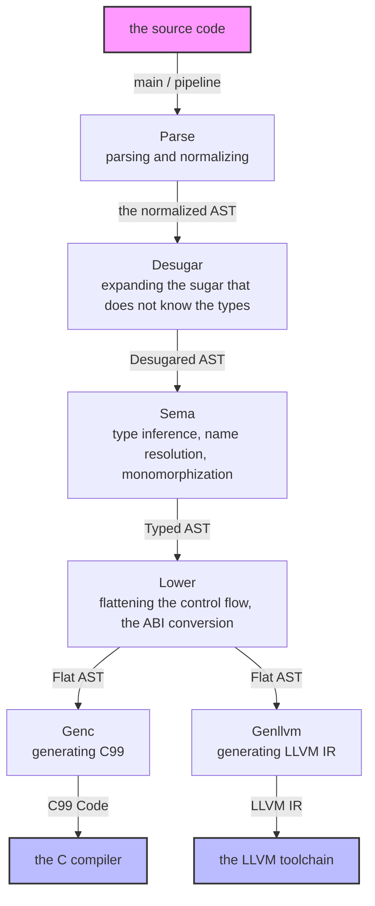
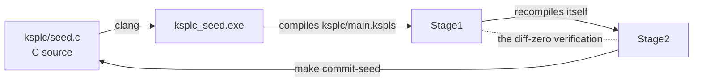
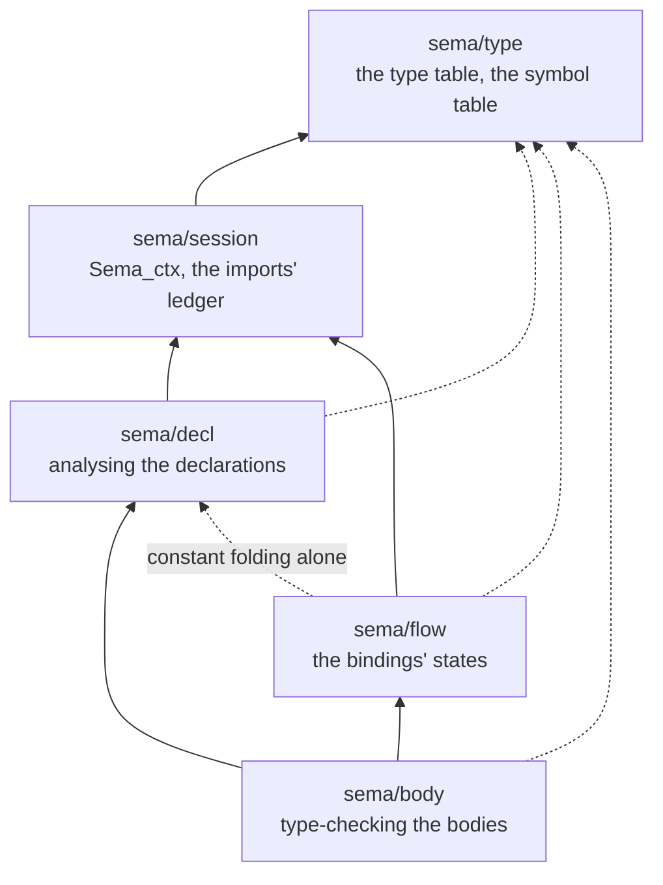
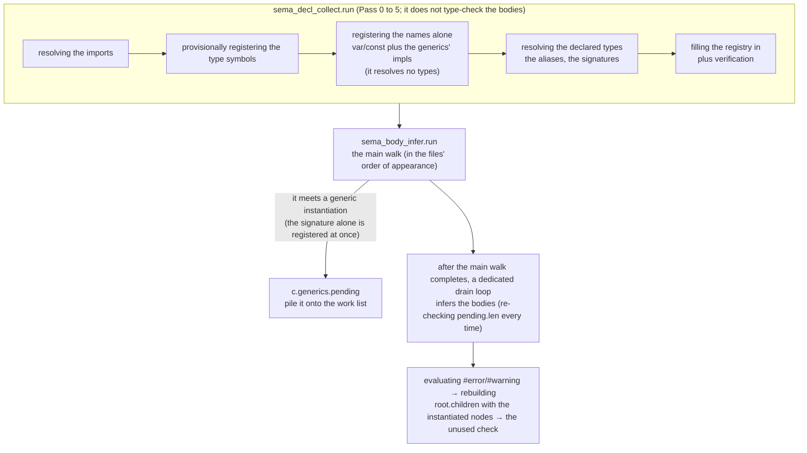
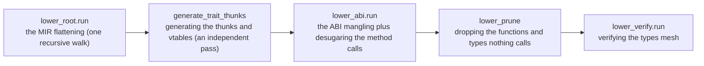
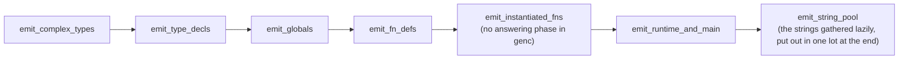

# The KSPL compiler's internal design (Design)

## Contents

* [0. About this document](#0-about-this-document)
* [1. The compiler as a whole](#1-the-compiler-as-a-whole)
  * [1.1 From source code to a binary](#11-from-source-code-to-a-binary)
  * [1.2 The bootstrap, and keeping the seed in step](#12-the-bootstrap-and-keeping-the-seed-in-step)
  * [1.3 Keeping the grammar and the AST node kinds in step](#13-keeping-the-grammar-and-the-ast-node-kinds-in-step)
  * [1.4 The parts that are not in the pipeline: `base` / `lsp` / `fmt` / `tools`](#14-the-parts-that-are-not-in-the-pipeline-base--lsp--fmt--tools)
  * [1.5 String interning](#15-string-interning)
  * [1.6 A tree node's size is fixed by rule and guarded](#16-a-tree-nodes-size-is-fixed-by-rule-and-guarded)
  * [1.7 Measuring the compiler: `--stats` and the performance guard](#17-measuring-the-compiler---stats-and-the-performance-guard)
* [2. The Development Principles](#2-the-development-principles)
  * [2.1 Failing fast through an exception or an ICE](#21-failing-fast-through-an-exception-or-an-ice)
  * [2.2 A backend writes straight out rather than assembling](#22-a-backend-writes-straight-out-rather-than-assembling)
* [3. The Parse layer: from text to an AST (Desugar included)](#3-the-parse-layer-from-text-to-an-ast-desugar-included)
  * [3.1 What it answers for](#31-what-it-answers-for)
  * [3.2 The internal flow: the raw KSPEG tree → the AST conversion → normalizing → verification](#32-the-internal-flow-the-raw-kspeg-tree--the-ast-conversion--normalizing--verification)
  * [3.3 The invariants of the normalized AST (so nothing crashes and no output differs)](#33-the-invariants-of-the-normalized-ast-so-nothing-crashes-and-no-output-differs)
  * [3.4 The list of the normalized AST's nodes (the shape the Parse layer hands downstream)](#34-the-list-of-the-normalized-asts-nodes-the-shape-the-parse-layer-hands-downstream)
  * [3.5 Desugar: expanding the syntactic sugar that does not know the types](#35-desugar-expanding-the-syntactic-sugar-that-does-not-know-the-types)
  * [3.6 Synthesizing an `enum`'s `variant_name`](#36-synthesizing-an-enums-variant_name)
  * [3.7 The normalized AST's disk cache (`ksplc/parse/ast_cache.kspls`)](#37-the-normalized-asts-disk-cache-ksplcparseast_cachekspls)
  * [3.8 What a syntax error names](#38-what-a-syntax-error-names)
  * [3.9 Every place a source enters reads it the same way](#39-every-place-a-source-enters-reads-it-the-same-way)
  * [3.10 A literal's escapes are decided in one place](#310-a-literals-escapes-are-decided-in-one-place)
* [4. The Sema layer: it knows the types](#4-the-sema-layer-it-knows-the-types)
  * [4.1 What it answers for](#41-what-it-answers-for)
  * [4.2 How sema is split into folders, and the direction of the dependencies](#42-how-sema-is-split-into-folders-and-the-direction-of-the-dependencies)
  * [4.3 The internal flow: registering every file up front → the main type-inference walk → draining the work list of generic instantiations](#43-the-internal-flow-registering-every-file-up-front--the-main-type-inference-walk--draining-the-work-list-of-generic-instantiations)
  * [4.4 The AST nodes the Sema layer creates (its contract with Lower and Genc)](#44-the-ast-nodes-the-sema-layer-creates-its-contract-with-lower-and-genc)
  * [4.5 The extra rules concerning the type system](#45-the-extra-rules-concerning-the-type-system)
  * [4.6 A worked example: how one expression is reshaped in each layer](#46-a-worked-example-how-one-expression-is-reshaped-in-each-layer)
  * [4.7 Profiling where Sema's time goes](#47-profiling-where-semas-time-goes)
* [5. The Lower layer: a flat tree that depends on no backend](#5-the-lower-layer-a-flat-tree-that-depends-on-no-backend)
  * [5.1 What it answers for](#51-what-it-answers-for)
  * [5.2 The internal flow: one MIR-flattening walk → generating thunks and vtables → the ABI mangling → dead-code elimination → verification](#52-the-internal-flow-one-mir-flattening-walk--generating-thunks-and-vtables--the-abi-mangling--dead-code-elimination--verification)
  * [5.3 The limits on building an AST, and `def_node`'s strict duty to link](#53-the-limits-on-building-an-ast-and-def_nodes-strict-duty-to-link)
* [6. The backends (Genc / Genllvm) and the runtime ABI](#6-the-backends-genc--genllvm-and-the-runtime-abi)
  * [6.1 What they answer for](#61-what-they-answer-for)
  * [6.2 What the two generators share: the decisions, not the spelling](#62-what-the-two-generators-share-the-decisions-not-the-spelling)
  * [6.3 The runtime memory layout and the ABI specification](#63-the-runtime-memory-layout-and-the-abi-specification)
  * [6.4 Embedding the runtime, and the two ways to keep it out](#64-embedding-the-runtime-and-the-two-ways-to-keep-it-out)
  * [6.5 Genc (C99): the topological output order](#65-genc-c99-the-topological-output-order)
  * [6.6 Genllvm (LLVM IR): why the structure itself differs, and managing SSA](#66-genllvm-llvm-ir-why-the-structure-itself-differs-and-managing-ssa)
  * [6.7 A function pointer breaks in a different place in each backend](#67-a-function-pointer-breaks-in-a-different-place-in-each-backend)
  * [6.8 An attribute is either interpreted in both backends, or refused outright in one](#68-an-attribute-is-either-interpreted-in-both-backends-or-refused-outright-in-one)
  * [6.9 Split compilation: emitting one program as several translation units (`--split`)](#69-split-compilation-emitting-one-program-as-several-translation-units---split)
  * [6.10 Self-hosting does not test a feature ksplc itself does not use](#610-self-hosting-does-not-test-a-feature-ksplc-itself-does-not-use)
* [7. The rules for handling an AST, shared by every layer](#7-the-rules-for-handling-an-ast-shared-by-every-layer)
* [8. Memory management: the arena model](#8-memory-management-the-arena-model)
  * [8.1 Why an arena](#81-why-an-arena)
  * [8.2 Arena's implementation: a linked list of chunks and bump allocation](#82-arenas-implementation-a-linked-list-of-chunks-and-bump-allocation)
  * [8.3 The three-tier allocation strategy](#83-the-three-tier-allocation-strategy)
  * [8.4 The naming conventions for the lifecycle functions and the global variables](#84-the-naming-conventions-for-the-lifecycle-functions-and-the-global-variables)
* [9. The development conventions (the rules for writing KSPL source)](#9-the-development-conventions-the-rules-for-writing-kspl-source)
  * [9.1 The order of imports, and how an alias is given](#91-the-order-of-imports-and-how-an-alias-is-given)
  * [9.2 A file using an extension method imports the file that defines it](#92-a-file-using-an-extension-method-imports-the-file-that-defines-it)
* [10. The tools' internal implementation: the language server, the formatter and `ksplc run`](#10-the-tools-internal-implementation-the-language-server-the-formatter-and-ksplc-run)
  * [10.1 The arena is rewound after each request (a worked example)](#101-the-arena-is-rewound-after-each-request-a-worked-example)
  * [10.2 The language server is split into two processes: the watcher and the analyser](#102-the-language-server-is-split-into-two-processes-the-watcher-and-the-analyser)
  * [10.3 The server finds the workspace's files without asking the client](#103-the-server-finds-the-workspaces-files-without-asking-the-client)
  * [10.4 References and renaming are the same question, so they are gathered in one place](#104-references-and-renaming-are-the-same-question-so-they-are-gathered-in-one-place)
  * [10.5 The call hierarchy identifies a definition by an FQN that includes the file](#105-the-call-hierarchy-identifies-a-definition-by-an-fqn-that-includes-the-file)
  * [10.6 The call hierarchy also counts passing a function as a pointer as an edge](#106-the-call-hierarchy-also-counts-passing-a-function-as-a-pointer-as-an-edge)
  * [10.7 Completion re-analyses the text as if one name were missing](#107-completion-re-analyses-the-text-as-if-one-name-were-missing)
  * [10.8 Only the editor's parse recovers from a syntax error](#108-only-the-editors-parse-recovers-from-a-syntax-error)
  * [10.9 A `didOpen` checks one document's bodies](#109-a-didopen-checks-one-documents-bodies)
  * [10.10 Typing names the document view does not analyse](#1010-typing-names-the-document-view-does-not-analyse)
  * [10.11 A declaration is shown as written, not as its last instantiation](#1011-a-declaration-is-shown-as-written-not-as-its-last-instantiation)
  * [10.12 A document URI is converted to the logical name on the way in, and back to the editor's spelling on the way out](#1012-a-document-uri-is-converted-to-the-logical-name-on-the-way-in-and-back-to-the-editors-spelling-on-the-way-out)
  * [10.13 The formatter reorders the `import`s as text, before the printer](#1013-the-formatter-reorders-the-imports-as-text-before-the-printer)
  * [10.14 The formatter folds nothing by default (`AllowShortBlocks` / `AllowShortFunctions`)](#1014-the-formatter-folds-nothing-by-default-allowshortblocks--allowshortfunctions)
  * [10.15 Blank lines and the line terminator](#1015-blank-lines-and-the-line-terminator)
  * [10.16 `ksplc run` builds a script one run at a time, and runs it outside the lock](#1016-ksplc-run-builds-a-script-one-run-at-a-time-and-runs-it-outside-the-lock)
* [11. The design rules for the checks and the diagnostics](#11-the-design-rules-for-the-checks-and-the-diagnostics)
  * [11.1 A check of the same nature is not copied into two places](#111-a-check-of-the-same-nature-is-not-copied-into-two-places)
  * [11.2 Measuring what suppression costs](#112-measuring-what-suppression-costs)
  * [11.3 A diagnostic points at 'the position the user wrote'](#113-a-diagnostic-points-at-the-position-the-user-wrote)
  * [11.4 While a generic is being instantiated, a diagnostic that depends on a type argument is not emitted](#114-while-a-generic-is-being-instantiated-a-diagnostic-that-depends-on-a-type-argument-is-not-emitted)
  * [11.5 Whether a call goes through a function pointer is decided by the declaration](#115-whether-a-call-goes-through-a-function-pointer-is-decided-by-the-declaration)
  * [11.6 A gate checks that a diagnostic fires separately from the pass/fail verdict](#116-a-gate-checks-that-a-diagnostic-fires-separately-from-the-passfail-verdict)
  * [11.7 A type check covers every declared type, not only the used ones](#117-a-type-check-covers-every-declared-type-not-only-the-used-ones)
  * [11.8 Generic checks tell a written type argument from an inferred one](#118-generic-checks-tell-a-written-type-argument-from-an-inferred-one)
  * [11.9 The static-initializer check is applied to both `var` and `const`](#119-the-static-initializer-check-is-applied-to-both-var-and-const)
  * [11.10 Each depth limit is set by what breaks first](#1110-each-depth-limit-is-set-by-what-breaks-first)
  * [11.11 Name resolution with no namespace goes through one function](#1111-name-resolution-with-no-namespace-goes-through-one-function)
  * [11.12 An alias prefix is checked only for whether the name after it exists](#1112-an-alias-prefix-is-checked-only-for-whether-the-name-after-it-exists)
  * [11.13 An explanation is printed from the specification, and only a code has one](#1113-an-explanation-is-printed-from-the-specification-and-only-a-code-has-one)
  * [11.14 Diagnostics for a program are one JSON object per line](#1114-diagnostics-for-a-program-are-one-json-object-per-line)
* [12. The rules for implementing ARC](#12-the-rules-for-implementing-arc)
  * [12.1 A retain goes wherever a copy happens](#121-a-retain-goes-wherever-a-copy-happens)
  * [12.2 The chaining is gathered into a per-type drop-glue function](#122-the-chaining-is-gathered-into-a-per-type-drop-glue-function)
* [13. The design of the tool settings](#13-the-design-of-the-tool-settings)
  * [13.1 lint is configured per diagnostic code, not by a group name](#131-lint-is-configured-per-diagnostic-code-not-by-a-group-name)
  * [13.2 The settings file is `ksplc.cfg` (the use does not go in the name)](#132-the-settings-file-is-ksplccfg-the-use-does-not-go-in-the-name)
  * [13.3 The standard library is found beside the compiler](#133-the-standard-library-is-found-beside-the-compiler)
  * [13.4 A package other than `std` is located once per package](#134-a-package-other-than-std-is-located-once-per-package)
* [14. The glossary](#14-the-glossary)

---

## 0. About this document

**Who it is for**: a developer changing `ksplc/`, the compiler itself. It explains how the compiler works, not how to use KSPL.

**Where the other documents are**: "What is here" in [`ksplc/README.md`](../README.md) says what each folder holds and where to start in it. [`SPEC-tools.md`](SPEC-tools.md) says what the tools promise. The language and the grounds of its design are in `docs/`, with [`../../docs/README.md`](../../docs/README.md) as the index. This document holds the design, the data flow and the implementation conventions inside the compiler.

**How to read it**: chapters 1 and 2 are the map and the values behind the design. Chapters 3 to 6 follow the data downstream: Parse with Desugar → Sema → Lower → Genc/Genllvm, with the backends' own rules. Chapters 7 to 10 are the conventions shared by every layer (handling an AST, memory management, coding) and the tools' internals. Chapters 11 to 13 are the rules for implementing checks and diagnostics, ARC and the tool settings. Each makes Principle 5 concrete, so read the one that applies before starting such work. The terms used throughout (ICE, FQN, MIR and the rest) are in [the glossary](#14-the-glossary), the last chapter.

---

## 1. The compiler as a whole

### 1.1 From source code to a binary

The compiler is a pipeline with **a strictly one-way data flow**. Parse makes one general-purpose node type, `Ast_node`, and passes it downstream. Each stage reshapes it in place, until Genc/Genllvm write it out as text. This is the most important picture of the compiler.



Each layer in one line, with the sections that hold how it reshapes the tree:

| layer | what it does | knows the types | knows where the output goes | see |
| :-- | :-- | :-- | :-- | :-- |
| **Parse** | turns text into a general-purpose AST and tidies its shape | no | no | §3.2, §3.3, §3.4, §3.6 |
| **Desugar** | expands the sugar that the AST's shape alone can rewrite | no | no | §3.5 |
| **Sema** | infers types, resolves names, instantiates generics | yes | no | §4.3, §4.4 |
| **Lower** | levels complex control flow and method calls into a simple shape | yes | not yet | §5.2 |
| **Genc / Genllvm** | writes the levelled AST out in the target language, reshaping nothing | yes | yes | §6.1 |

The two answers turn to "yes" one layer at a time (`no, no` → `yes, no` → `yes, yes`), so there are four layers, plus Desugar. A layer that reads what it does not know yet breaks the one-way flow, and a change then reaches across every layer. **Flowing backwards (an earlier layer importing a later layer's file) is strictly forbidden.**

`main.run_compiler` drives the whole order through three methods of `pipeline.Compiler`: `Compiler.parse_file` → `run_semantic_analysis` (Desugar, Scan, Infer) → `run_lower_and_codegen` (Lower, Genc/Genllvm).

### 1.2 The bootstrap, and keeping the seed in step

The compiler is written in KSPL (it is self-hosting), so building it needs a compiler. A two-stage bootstrap solves that chicken-and-egg problem.



1. **The seed (`ksplc/seed.c`)**: committed C source: the compiler at one moment, translated and frozen. `clang` builds it into `ksplc_seed.exe`.
2. **Stage1**: the current `ksplc/` tree (`ksplc/main.kspls` and everything it depends on) compiled by `ksplc_seed.exe`.
3. **Stage2**: the same tree compiled again by Stage1.
4. **The diff-zero verification** (`make self-host` / `make`): Stage1's and Stage2's outputs must agree completely. This proves that the compiler reproduces itself stably.
   * The steps belong to this folder ([`ksplc/Makefile`](../Makefile): translate, build, compare, verdict). The repository's `make` runs them from its root with the seed. A copy of this folder runs them with `make self-host` and any `ksplc`, and `make test-extract` has a copy do so on every change. A build takes its link flags from the compiler that made the code (`info exe-flags` / `info link-libs`), so the steps name no platform.
   * Whoever builds the seed names its libraries, because that link is made before any `ksplc` exists to name them.
5. **Updating the seed** (`make commit-seed`): Stage2's output, with its `#line`s dropped, overwrites `ksplc/seed.c`. The seed is then a snapshot of the latest source, but not Stage2's output itself. The `#line`s go because one added `.kspls` line shifts every later one, which would make git's history several times larger than the real change. The seed still generates the same C without them, since they serve only the seed's own debug information. A debugger follows Stage1 / Stage2.

The seed is a snapshot of the `ksplc/` source at some past moment, so:

* **A change under `ksplc/` reaches the seed only through `make commit-seed`.** Until a new `ksplc_seed.exe` is built, the seed does not have it.
  * The repository's suites run on the seed, so a fix to what ksplc emits reaches them only once the seed is re-taken. `make ci` can still pass: a difference that matters on one target only (a generated C identifier clobbered by a `#define` in a Windows header, say) shows nothing on Linux.
* **The grammar is embedded.** `ksplc/main.kspls` embeds it at compile time (`embed "ksplc/kspl.kspeg" as kspl_grammar;`, §1.3). After a grammar change the seed still reads only the old grammar, so tools that run the seed directly, such as `make fmt`, fail until `make commit-seed` has run.
* **So is the C runtime preamble** (§6.4). `ksplc/gen/runtime/{core,hosted,freestanding}.{h,c}` and `hosted_*.c` are embedded into ksplc (§6.2), so editing only them leaves the old preamble in `ksplc/seed.c`. Do not skip `make commit-seed` because no `ksplc/*.kspls` changed. The diff-zero verification of `make ci` / `make self-host` checks only that the current tree reproduces itself; it cannot see that the seed's copy is old.
* **Adding a function to the C runtime takes two seed updates.** The preamble of `out/gen/ksplc_stage1.c` is the runtime the seed carries. So once `std/` calls the new function, Stage1 fails to link (an undefined reference), and `make commit-seed` needs Stage1. The way round is that Stage1 embeds the source tree's runtime:
  1. Temporarily change `std/` so it does not call the new symbol. The declaration may stay: with no reference, nothing needs linking.
  2. `make stage1` → `make commit-seed`. This seed holds the new runtime, because Stage2's preamble is the source tree's, which Stage1 embedded.
  3. Restore `std/`, then `make stage1` → `make commit-seed` again.
     * **A changed signature cannot go this way.** One run always pairs a declaration and a body that disagree, and the C compiler rejects it with `conflicting types`. Add the function under a new name and delete the old one afterwards.

Caution: **Confirm diff-zero with `make self-host` (or `make ci`) before `make commit-seed`.** `make commit-seed` depends on Stage2's output, not on the diff-zero verdict. So it runs even when self-hosting is broken, and burns a broken compiler's output into the seed.

**A change to how ksplc generates code (how it makes temporary names, say) needs the seed updated first.** The seed makes Stage1 and Stage1 makes Stage2, so `make self-host` then always shows a difference. That cannot answer "may I go on": it compares the old seed's output with the new seed's. Run `make self-host` again after burning the seed. The burned seed's Stage1 is exactly the pre-burn Stage2's output, so green means the new compiler reproduces itself. On red, `git checkout ksplc/seed.c` puts the seed back. CI runs this check every time, so a forgotten push shows in the PR. No third stage (translating once more with the compiler Stage2 built) is needed. The self-host after burning already answers "does the burned seed reproduce itself", and a third stage would be a second means to one property (Principle 6).

`make install` runs `fmt` → `commit-seed` → `install-lsp`, to finish once `make ci` has confirmed diff-zero. `make lint` depends on Stage1 and builds it itself, so it is the fast first check before the heavy `make ci`.

### 1.3 Keeping the grammar and the AST node kinds in step

**Once a rule is added to the grammar (`ksplc/kspl.kspeg`), add its enum value and its `builtin_name` case to `ksplc/base/ast_kinds.kspls` by hand**; nothing generates them. At start-up `Global_pools.init()` interns `builtin_name(i)` for `1` to `Ast_kind.k_max`, in order. When the parser makes a node for a rule (`"Format_spec"`, say), it interns the rule's name into the same pool. A name not registered up front therefore grows the pool past `k_max`, and the run-time self-check in `ksplc/main.kspls` ("Grammar sync error") panics.

**There are three exceptions, and they are never added**: `Block_open` / `Block_close` / `Stmt_end`. Only the grammar has these names, for the symbols that become a level and a newline in the indentation notation (`.kspls`). `rule_kind` in `ksplc/parse/load.kspls` turns them into `Literal` where they enter the tree. So the names never reach the pool, and the tree has the shape it would have without them.

Caution: **Do not make them kinds of their own.** Every stage that walks the tree would need three more cases in the decision that reads past a name (the place that skips `kind_id == .k_literal`). A stage that misses one does not crash; it reads a different meaning. For example, the `;` of `##lint(I0307 = off);` is counted as an argument, and is wrongly rejected with "an expression cannot be written". The grammar states the role; the tree keeps the name.

`kspl.kspeg`'s header lists which rule plays which role, and `make test-kspls` recounts it from the grammar and checks the list.

### 1.4 The parts that are not in the pipeline: `base` / `lsp` / `fmt` / `tools`

Four folders of `ksplc/` sit outside §1.1's pipeline, and no data passes through them on its way to the output. `base/` lies below the pipeline. It holds the primitives every layer depends on, and has no place on §1.1's two axes. `lsp/` drives the pipeline from outside, running it afresh on each editor request; it is a client, not a stage (§10.1, §10.2). `fmt/` and `tools/` work beside it. "What is here" in [`ksplc/README.md`](../README.md) says what each folder holds.

**One lint asks the formatter a question**: which comment a round trip through the indentation notation moves (`[I0805]` in `ksplc/docs/SPEC-tools.md`). For that alone, `pipeline.kspls` imports `fmt/text.kspls`, the formatter's single entry point for a text. The answer is the formatter's decision, and a copy would drift (§10.13, §10.14).

### 1.5 String interning

To avoid comparing strings, the compiler interns them: each distinct string becomes an integer ID (`String_pool` in `ksplc/base/core.kspls`). `Global_pools` keeps three pools apart by use.

| pool | what it interns | the layer most involved |
| :-- | :-- | :-- |
| `pools.ast_kinds` (`intern_kind`) | the AST kind names (`decl_fn`, `expr_postfix` …), the built-in ones registered at start-up (§1.3); `Ast_node.new` / `set_kind` (`base/ast.kspls`) use it to turn each node's kind string into its `kind_id` | **Parse**: every path that makes a node, and §1.3's drift check |
| `pools.source_files` (`intern_file` / `get_file_str`) | the sources' logical names, the counterpart of `Loc` (`base/ast.kspls`): a node holds this number, not the name | **Parse**: building a node and restoring one from the disk cache |
| `pools.symbol_names` (`intern_name`) | the symbol names in a scope (`sema/type/scope.kspls`) and the instance names monomorphization makes (`Vec_I32`; `sema/decl/mono.kspls`), so lookup and duplicate detection compare integers | **Sema**: name resolution, and monomorphization making no instance twice |

**`source_files` exists to shrink the tree's nodes** (§1.6), not to replace string comparison. A name held per node costs 16 bytes (a pointer and a length), where one per file would do.

**The pools are shared across the layers.** There is one global, `pools` (`base/core.kspls`), made by `Global_pools.init()` when compilation begins and released at the end. With every layer on the same pools, the same string is always the same ID. Dispatching on `kind_id` (chapter 7's first rule) and fast identity checks on the symbol table depend on that.

### 1.6 A tree node's size is fixed by rule and guarded

**The sizes of `Ast_node` and of its run of children (`std/ds`'s `List`) are fixed by rule, and a guard holds them to the byte.** A self-host builds so many nodes that 8 bytes more or less per node changes the whole tree by tens of MB. `ksplc/pipeline.kspls` prints `AST Node bytes` and `AST Kids bytes` under `--stats`. `perf_guard` compares them with `want_node_bytes` / `want_kids_bytes` in `tests/tools/perf_guard.kspls`.

**A guard on the total cannot catch that growth.** `AST bytes` (§8.2) is a ratio to a baseline. So one more pointer per node stays under the ceiling, while the cold usage grows measurably.

Caution: **Do not compare the sizes as a ratio.** They are fixed by rule, not measured, so any difference means somebody touched a type. Where a node is to grow by decision, change `perf_guard`'s numbers and give the grounds; re-taking the baseline does not change them.

### 1.7 Measuring the compiler: `--stats` and the performance guard

**`--stats` reports what one translation cost, stage by stage**, and `make perf-log` keeps the same report for CI's performance guard. The option's contract is `--stats` in [`SPEC-tools.md` §2.3](SPEC-tools.md#23-the-other-compiler-options). This section holds how the report is laid out and what reads it.

The report runs `[KSPEG Rule]` → `[Sema Body / by self time]` → `[Sema Body / by instantiations]` → `[Layer]` → `[Overall]`, each followed by a blank line. **One place lays them out: `print_stats_report` in `pipeline.kspls`.** Printed per layer on the spot, the detail tables would break up the stages' numbers. So everything goes to a holding place (`base/stats.kspls`) and comes out once at the end. The summary (`[Overall]`) goes last, since a terminal shows the last screen, and `make perf-log` passes it through `cat` too.

**Each `[Layer]` row gives the time and the arena bytes side by side** (`Parse: N ms, M bytes`). The time alone is not enough: the stage that slowed and the stage that grew the memory can differ, and the log alone must say which stage grew it. The bytes are printed even on a target with no clock, since the amount taken does not depend on the environment. `[Layer]` prints the remainder as `Other`: the stages' total against `Compile time` for time, and against `AST Arena usage` for bytes (start-up and the CLI parse, plus what is taken after the stages). Dropped silently, an unmeasured stage could grow while nobody notices that the sum does not add up.

`[KSPEG Rule]` is §1.7.1 below, and the two `[Sema Body]` tables are §4.7. **`[AST Cache]` shows the disk cache's hits and misses** (§3.7). Without it, a cache that stops hitting goes unnoticed, since things only get slower.

**CI's performance guard judges memory, not time.** `make perf-log` makes the log, and `tests/tools/perf_guard.kspls` reads it; its opening comment holds the reasons. Its verdicts are the peak memory, the AST arena's usage against a baseline (§8.2), and the two node sizes (§1.6). Both memory figures are needed. The peak moves a whole chunk at a time while the usage moves continuously, so only the usage catches growth within a chunk. The compile time is recorded beside them and decides nothing, since it measures the machine and its load as much as the work.

Caution: **Keep the characters of every line another program reads.** The guard finds its lines by the patterns at its head (`time_pattern` in `tests/tools/perf_guard.kspls` and the ones beside it). `stats_head` in `ksplc/tests/suite/ast_cache_test.kspls` finds `[AST Cache]`. A line spelt differently is not found.

#### 1.7.1 What each rule takes (`--stats`'s `[KSPEG Rule]`)

`--stats` prints four numbers per rule: **calls / memo hits / read and succeeded / read and failed** (`Rule_prof` in `kspeg/engine.kspls`). They are counts, not times. The same input and grammar give the same values under any environment or load, so a grammar change can be compared before and after.

**"Read and failed" is derived, not counted.** Every reference ends in exactly one of a memo hit, a success or a failure, so it is `calls - memo hits - succeeded`. If it were counted, a dropped increment would give a lie that adds up in every column. `kspeg/tests/engine_test.kspls` matches all four as actual numbers on a small grammar with a known answer. The identity alone always holds, and a missed count only shows as more failures.

**There are two ways to read it.** A rule whose memo hits do not grow visited each position once, so packrat has nothing to save there. A rule with few successes and many failures is speculating and missing. Of those, only the ones where a miss is costly repay a grammar change.

**Many failures are not waste in themselves.** In `ksplc/kspl.kspeg` most alternatives fail on a one- or two-character comparison (`expr_fn_lit` is one `'fn'`, `label` is `Identifier ":"`, `type_args` is `"<|"`). Lookahead would only pay the same cost. A miss is costly only where the rule reads another rule whole before missing. `expr_cast` (`type_expr "::" expr_unary`) and `expr_compound` (`( type_expr &"::{" )? …`) both read `type_expr` before looking at `::` / `::{`. This is mainly where the memoization pays. The two ask for `type_expr` at the same position in turn, so the second hits the memo; without it the type parse runs twice per primary.

Caution: **Do not avoid it by moving `expr_cast` behind `expr_postfix`.** The reason is written above that rule in `ksplc/kspl.kspeg`.

**Two of kspeg's devices pay off on this grammar** (both in [`../../kspeg/docs/DESIGN.md`](../../kspeg/docs/DESIGN.md)). Folding a run of keywords into one lookup takes `Primitive_type`'s thirteen names, which were tried some 2.8 million times in a cold compile of `ksplc/main.kspls`. Skipping a rule that cannot begin with the next byte catches most of the failures above before they are entered: of the nodes the parse built, nine in ten were thrown away. Measured under callgrind on that compile, the parse runs 6.5G instructions before and 3.9G after, and the engine's share at `-O2` falls from about 1.2 s to 0.7 s.

---

## 2. The Development Principles

The eight principles that hold for all of Kanso are "Development Principles" in [`../../docs/DESIGN.md`](../../docs/DESIGN.md), and "Principle N" in this document points there. The two below hold only for the compiler, because both assume the pipeline (Parse → Sema → Lower → Gen*).

### 2.1 Failing fast through an exception or an ICE

**Do not cover an impossible state, a missing AST structure or an unexpected `null` with a stopgap such as `if (node == null) return;`.** Stop at once, so a bug is found near its source. Use a `throw` where recovery is possible, otherwise `ice_assert` / `ice_panic` (`base/diag.kspls`; where a position can be given, the methods of the same names in `base/ast.kspls`).

Caution: **If such a state is ignored, the diagnostic comes not from ksplc but from downstream.** A shape Sema let through breaks first inside the generated C. The user then gets a `clang` error, far from the KSPL source in both position and cause, instead of a KSPL diagnostic. On meeting a shape that cannot be dropped, stop there.

### 2.2 A backend writes straight out rather than assembling

An `emit` function writes straight to the context's output stream instead of returning a `Builder`. This removes needless allocation and leaks from code generation.

---

## 3. The Parse layer: from text to an AST (Desugar included)

### 3.1 What it answers for

It reads the source text, builds a general-purpose abstract syntax tree (AST), and normalizes it. **It ignores types and meaning.** Its one aim is an AST that is regular everywhere, so every later layer can read it through safe accessors alone (chapter 7's first rule).

### 3.2 The internal flow: the raw KSPEG tree → the AST conversion → normalizing → verification

`load_and_parse_file` in `parse/load.kspls` is the one orchestrator. For each file it runs, **in this order**:

1. **The raw KSPEG parse**: `parse_raw_ast` drives the grammar rule `"program"` and gets a `kspeg.Node` tree in the grammar's own shape.
2. **The AST conversion**: `to_ast_node` (`parse/load.kspls`) rebuilds it recursively as `Ast_node`s, dropping `null` children. The shape is still the grammar's.
3. **Normalizing**: `normalize_ast` (`impl Ast_node` in `parse/normalize.kspls`) makes one recursion from the children to the parent (post-order). At each node it applies `elide_node`, then `normalize_by_kind` (a dispatch table on `kind_id`). `elide_node` does the single-child pass-through, strips brackets, reassembles `expr_cast` and so on, all inside `normalize.kspls`. `normalize_by_kind` delegates many kinds to per-kind normalizing functions in `parse/normalize_decl.kspls` / `parse/normalize_stmt.kspls` (`normalize_if_stmt`, `normalize_loop`, `normalize_match_stmt`, `normalize_impl_decl`, `normalize_enum_variant`, say). Calls go only from `normalize.kspls` to `normalize_decl.kspls` / `normalize_stmt.kspls`: those are helpers called from one dispatch table, not passes of their own.
4. **Verification**: `validate_layout` (`base/ast.kspls`) checks the finished tree recursively, in one separate walk after the whole file is normalized.

**`load_and_parse_file` follows the imports by its own recursion.** After normalizing a file, it calls itself on the resolved path of each `.k_decl_import`, and attaches every file's top-level nodes straight to one shared `root_file`. Each call first checks `import_stack` (the current DFS path). If the same path is already on it from a different directory, the call throws `circular_import`. From the same directory, it counts as resolved and returns silently, because a cycle within one folder is allowed. A separate memo, `loaded_files`, keeps a file reached by two paths from being analysed twice.

### 3.3 The invariants of the normalized AST (so nothing crashes and no output differs)

The Parse layer must keep these rules whenever it builds an AST. Breaking one causes SEGVs or differences between Stage1's and Stage2's output.

* **The absolute rule of fixed length versus variable length** (the most important guard against out-of-bounds access):
  * **A context-dependent structure has a fixed length**: syntax with an optional modifier or `label` (`decl_var`, `stmt_loop`, `stmt_match`) always has the same element count (a Fixed Layout). An `empty` node fills a missing part, so access downstream is O(1).
  * **A homogeneous list has a variable length**: a run of one kind (`stmt_block`'s statements, `expr_args` and the like) stays variable.
* **An AST node's pointer is unique (No Node Sharing)**: Sema keys the type environment on a node's address. So never reuse an instance, not even a dummy `empty` node filling a slot; allocate each with `Ast_node.new`. A shared node makes the type information collide and causes a SEGV.
* **Normalizing the string (text)**: a leaf's `text` (`Identifier`, `Keyword`, `Primitive_type`) keeps no surrounding whitespace at all, and symbol nodes (`()`, `,`, `;`, `{}`) vanish entirely from the AST.
* **A string literal is zero-copy, with symmetric escapes**: the KSPEG engine keeps a slice of the source rather than unescaping. An ordinary string is written out as that slice, escapes and all. A raw string (`"""`) is escaped to C's rules on output (an actual newline → `\n` …).
* **Fixing the type expressions**: the raw pointer `@`, a slice/array `[]` and an exception union `?` each parse as a separate `type_postfix` node. The postfix mutability marker `$` (the language specification §3.2) stays at the head of the `text` of the `type_postfix` it was written on (`"$@"` / `"$[]"`).
  * Caution: **Normalizing must not strip the marker and move it up to the head.** Which postfix it belonged to would be lost. `U8[]$@` (a mutable pointer to a slice of immutable elements) and `U8$[]@` (an immutable pointer to a slice of mutable elements) would merge into one AST before the type is made. A marker stays on its level, and `apply_type_postfixes` in `sema/decl/resolve.kspls` applies `Env.make_const` per level (a level with no marker is made immutable).
* **Attributes and visibility go at the head**: always first among the target node's children (in a fixed-length node, as an `attribute_list` node at `[0]`). Anywhere else, Sema loses track of what `pub` and the like apply to.
* **The position information (Source_loc) propagates exactly**: when `elide_node` discards a needless parent and lifts its child up, the child's own `loc` must never be overwritten. That way a compile error reports the exact position.
* **A cfg drop empties the wrapper too**: `#cfg` can sit on a declaration's direct child (in `decl_var` / `decl_const`, on the child `decl_var_item`; see section 3.4.1). Emptying that child via `should_drop_by_cfg` does not drop the parent. So `elide_node` must also empty any `decl_var` / `decl_const` left with no children after `flatten_inline_nodes`. Otherwise the empty wrapper becomes a nameless declaration under `push_or_default`'s fallback name (`"unknown"`), and wrongly fires W0206. Check for the same gap when adding a node kind whose attributes are nested.

### 3.4 The list of the normalized AST's nodes (the shape the Parse layer hands downstream)

A normalized AST holds the strict layout below, read only through `base/ast_ext`'s O(1) accessors (chapter 7's first rule). **Spelling a type or a name from the tree is `base/ast_spell`'s job.** It builds a string, so it has its own limit on depth.

**`validate_layout` checks the count of the fixed slots and the kinds at a few key places, and nothing else.** Only some kinds below have a branch; the rest go to the default branch (`validate_layout_impl` in `base/ast.kspls`). Most kinds written in these tables are the accessors' promise, not checked. The count alone still matters, because a fixed-length node slipping out of position quietly breaks O(1) access downstream ("The absolute rule of fixed length versus variable length" in §3.3).

Caution: When adding an accessor, confirm that the kind really comes at that index.

**The notation**: `[0]` an index, `?` optional (`empty` where missing, or packed away), `...` variable length. The pure syntactic symbol nodes are gone by this point (§3.3).

**These tables and §4.4's do not overlap.** These hold the kinds that come from `kspl.kspeg`'s grammar rules and remain after normalizing (`decl_fn`, `stmt_if`, `expr_postfix`). §4.4 holds the kinds that no grammar rule makes and Sema's analysis creates (`method_access`, `enum_init`).

**Some kinds the grammar defines vanish.** Normalizing erases the nodes that the grammar needs but that mean nothing. The main cases:

* **The rules that exist only for precedence**: `expr_or`, `expr_and`, `expr_cmp`, `expr_add`, `expr_mul`. Each is one precedence step, shaped `(the operator, the higher rule)*`. With no operator and one child, `elide_node` (`parse/normalize.kspls`) replaces the node with its child. The raw tree's reader (`to_ast_node` in `parse/load.kspls`) checks the same list (`is_expr_wrapper_kind`) and does not make such a node. With operators, `treeify_expr` (`parse/normalize_stmt.kspls`) folds them into a left-associative binary tree of the general-purpose `expr` kind (§3.4.3). Either way, none of the five names remains in the final AST.
* **The visibility wrapper**: the `k_visibility` node passes the `Keyword` inside it (`pub` …) up to its parent and vanishes.
* **Pure syntactic symbols**: a node of symbols alone (`(`, `)`, `,`, `;`, `{`, `}` and the like) vanishes under §3.3's rule.

`expr`, `expr_ternary` and `expr_catch_chain` also vanish when they hold a single child. Where the syntax is used, they stay, so they are in §3.4.3's table. **Only a node that adds nothing vanishes; a syntax with meaning survives.**

#### 3.4.1 The top-level declarations

| `kind` | `children`, in order | notes |
| :--- | :--- | :--- |
| **`program`** | `[0...]`: the top-level elements (`decl_top` and the like) | the file's root |
| **`decl_import`** | `[0]: Keyword("import")`<br>`[1]: String`<br>`[2]?: Identifier` or `decl_import_selector_list` | `[2]` is either an alias for the whole file (`Identifier`) or a selective import list, never both. The alias form's `as` is removed. Accessors: `get_import_path()` / `get_decl_import_selector_list()` and the like |
| **`decl_import_selector_list`** | `[0...]: decl_import_selector` | the inside of the `{ }` in `import "path" { A, B as C };`; one or more |
| **`decl_import_selector`** | `[0]: Identifier` (the original name in the imported file)<br>`[1]?: Identifier` (the alias used with no namespace; omitted, the same name as `[0]`) | the `as` is removed. Accessors: `get_selector_name()` / `get_selector_alias()` |
| **`decl_embed`** | `[0]: Keyword("embed")`<br>`[1]: String`<br>`[2]: Identifier` (the bound name) |  |
| **`decl_extern_block`** | `[0]: Keyword("extern")`<br>`[1...]: decl_extern`, `decl_fn_proto`, `decl_var`, `decl_extern_struct` | kept in the AST as an external-linkage block, never flattened |
| **`decl_extern`** | `[0...]: decl_fn_proto` or `decl_var` or `decl_extern_struct` | a child of `decl_extern_block`; `pub` is removed, since Sema handles it |
| **`decl_extern_struct`** | `[0]: Keyword("struct")`<br>`[1]: Identifier` | an opaque struct, allowed only inside an `extern "C"` block |
| **`decl_const`**<br>**`decl_var`** | `[0]`: `attribute_list` or `empty` (the attributes and the visibility)<br>`[1]`: `Keyword` (`"var"` / `"let"` / `"const"`; `var` and `let` are not the language's keywords but marks `parse/normalize_decl.kspls` synthesizes from whether a `$` is there, in neither the grammar (`kspl.kspeg`) nor `ksplc info keywords`)<br>`[2]`: `Identifier` (the variable's name)<br>`[3]`: `type_expr` or `empty` (the type annotation)<br>`[4]`: `expr` or `empty` (the initializing expression) | a declaration synthesized later has the same five slots (`build_inferred_var_decl` in `base/ast.kspls`), so a reader of the tree never asks where it came from |
| **`decl_fn`** | `Keyword("fn")`, `Identifier`, `type_fn_sig`, `stmt_block` (read out in no particular order) | may include `type_gen_params`; the attributes and `pub` come first |
| **`decl_struct`** | `[0]: Keyword("struct")`<br>`[1]: Identifier`<br>`[2]?: type_gen_params`<br>`[3...]: struct_field` |  |
| **`struct_field`** | `[0]: Identifier`<br>`[1]: type_expr` | the attributes and the visibility (`pub`) come first |
| **`decl_enum`** | `[0]: Keyword("enum")`<br>`[1]: Identifier`<br>`[2]?: type_expr`<br>`[3...]: enum_variant` |  |
| **`enum_variant`** | `[0]: Identifier`<br>`[1]?: enum_payload`<br>`[last]?: expr` | `enum_field` is a tagged union's payload; `expr` is an explicit tag value |
| **`enum_payload`** | `[0...]: enum_field` | wraps the `enum_field`s |
| **`enum_field`** | `[0]: Identifier`<br>`[1]: type_expr` | a tagged union's payload field |
| **`decl_trait`** | `[0]: Keyword("trait")`<br>`[1]: Identifier`<br>`[2]?: type_gen_params`<br>`[3...]: decl_fn_proto` (each method signature) | where polymorphism starts: generating a vtable or thunk and the conformance check (the language specification §5.3) read it. `apply_modifiers_to_targets` moves the `visibility` before a method to the head of its `decl_fn_proto`, so none remains directly under `decl_trait` |
| **`decl_impl`** | `[0]: Keyword("impl")`<br>`[1]?: type_gen_params`<br>`[2]: type_expr` (the target)<br>`[3]?: type_path` (the trait named)<br>`[4...]: decl_fn` | with a trait named (`: TraitName`), its `type_path` comes right after the target `type_expr` |
| **`decl_alias`** | `[0]?: visibility`<br>`[1]: Keyword("alias")`<br>`[2]: Identifier` (the new type name)<br>`[3]: type_expr` (the type it names) | becomes a typedef in Genc. Where `[3]` holds a `type_fn_sig`, C's own syntax has to resolve it, so the structure must not be broken |

#### 3.4.2 The control flow and the statements

| `kind` | `children`, in order | notes |
| :--- | :--- | :--- |
| **`stmt_block`** | `[0...]: stmt` | the `{` and `}` are removed |
| **`stmt_labeled_block`** | `[0]`: `label`<br>`[1]`: `stmt_block` | Lower flattens it into an ordinary block plus a `stmt_label` |
| **`stmt_if`** | `[0]`: `label` or `empty`<br>`[1]`: `expr` (the condition)<br>`[2]`: `stmt_block` (the then block)<br>`[3]`: `stmt_block`, `stmt_if`, or `empty` (the else block) | |
| **`stmt_loop`** | `[0]`: `label` or `empty`<br>`[1]`: `loop_init` or `empty`<br>`[2]`: `expr` or `empty` (the condition)<br>`[3]`: `loop_step` or `empty`<br>`[4]`: `stmt_block` or `empty` (the loop's body) | always five elements, whether C-style, while or endless |
| **`stmt_match`** | `[0]`: `label` or `empty`<br>`[1]`: `expr` (the condition)<br>`[2...]`: `match_pattern` or `stmt_block` or `Keyword("case"/"default")` | |
| **`stmt_return`**<br>**`stmt_break`**<br>**`stmt_continue`** | `[0]`: `Keyword`<br>`[1]`: `expr` or `Identifier` (optional) | |
| **`stmt_fallback`** | `[0]`: `Keyword`<br>`[1]`: `expr` | |
| **`stmt_defer`** | `[0]`: `Keyword("defer")`<br>`[1]: stmt_block` | the body is always a `stmt_block`: `normalize_defer_stmt` in `parse/normalize_stmt.kspls` gives a one-statement `defer` (`defer buf.free()`) that shape. It holds no capture list (the language specification §8.4.1; the grounds are docs/DESIGN.md §4.2) |
| **`stmt_expr`** | `[0]`: `expr` (the left-hand side)<br>`[1]?: assign_op` (the assignment operator)<br>`[2]?: expr` (the right-hand side) | |

#### 3.4.3 The expressions and the types

| `kind` | `children`, in order | notes |
| :--- | :--- | :--- |
| **`expr`** | `[0]`: `expr` (the left-hand side)<br>`[1]`: `Literal` (the operator)<br>`[2]`: `expr` (the right-hand side) | the precedence rules, folded: the grammar's five precedence rules always end as this three-element general-purpose `expr` (§3.4) |
| **`expr_unary`** | `[0]`: `Literal` (`!`, `-`, `~` and so on)<br>`[1]`: `expr` (the target expression) | |
| **`expr_offsetof`** | `[0]`: `Keyword("offsetof")`<br>`[1]`: `type_expr`<br>`[2]`: `Identifier` (the field's name) | renamed from `expr_unary` by `set_kind` (`parse/normalize.kspls`). The `k_expr_unary` branch in `parse/normalize_stmt.kspls` drops the separating symbols, not `is_trivia_node` in `parse/normalize.kspls` (`expr_unary` is not in `is_flatten_target`, so that path is never taken). The same branch drops the round brackets, so `expr_sizeof` can read `[1]` as its target, and it drops the comma between `offsetof`'s two children |
| **`expr_ternary`** | `[0]`: `expr` (the condition)<br>`[1]`: `expr` (the value where true)<br>`[2]`: `expr` (the value where false) | the `value if condition else value` syntax. Without a condition it normalizes into the value itself |
| **`expr_catch_chain`** | `[0]`: `expr` (the left-hand side)<br>`[1]`: `expr_catch` | a run such as `a catch b catch c` is piled into left-associative two-element nodes by `treeify_expr` (`parse/normalize_stmt.kspls`); with no `catch` it vanishes |
| **`expr_postfix`** | `[0]`: `expr_primary` (the receiver)<br>`[1]`: `Literal` or `Keyword` (`.`, `[`, `(`, `@`, `::`, `?`)<br>`[2...]`: the elements accessed | |
| **`expr_implicit_dot`** | `[0]`: `Identifier` (a method or variant name)<br>`[1]?: expr_args` | a dot access with the receiver omitted (`.ok` or `.free()`), used by Desugar's method-chain expansion and by Sema's implicit resolution of an enum |
| **`expr_catch`** | `[0]`: `Keyword("catch")`<br>`[1]?: Identifier` (the error variable)<br>`[2]: stmt_block / expr` | one `catch`, as `expr_catch_chain`'s right-hand element |
| **`struct_literal`** | `[0]?: type_path / type_expr`<br>`[1...]: expr_field_init` | a compound literal, renamed from `expr_compound` by normalizing |
| **`expr_field_init`** | `[0]?: Identifier / . / [` (the prefix)<br>`[1]: Identifier / expr` (the key's name / the index)<br>`[2]?: Literal("=")`<br>`[3]: expr` (the initializing expression) | |
| **`type_expr`** | `0` (Terminal) | stringified: the last step of normalizing joins every child's text into a finished type string such as `const I32[]` in `self.text`, and discards the subtree to save memory |

### 3.5 Desugar: expanding the syntactic sugar that does not know the types

Desugar walks the normalized AST in one post-order recursion through `desugar_node`. It expands the syntactic sugar that the AST's shape alone can rewrite; [3.5.2](#352-which-sugar-belongs-to-which-layer-the-list)'s table lists what it rewrites, and where. The later layers type-check the result like ordinary syntax.

**It is a file of its own (`parse/desugar.kspls`) but one step of the Parse layer, not a layer.** On §1.1's axes it knows exactly what Parse knows; only when it runs differs, so §1.1's table gives it a row.

**Little work fits this layer.** Most candidate sugars (a new pattern-matching notation, another method-chain shorthand) need symbol resolution to tell a variable from a type name or an enum variant, so they belong to Sema. `parse/format_spec.kspls` holds only the grammar of a format specifier's SPEC `\{value:SPEC\}`, and no diagnostics. It reads the format and makes the argument nodes of `fmt_spec` / `fmt_prec` / `fmt_hex`; the desugaring code, holding the position and the ctx, reports.

**Why it is called at a separate timing rather than from `parse_file`**: it runs once over the whole of `root_file`, at the head of `Compiler.run_semantic_analysis` (`pipeline.kspls`). It is not there to run once per file. The `loaded_files` guard in `load_and_parse_file` already ensures that, and there is no cross-file dependency (a lifted closure is `priv`, made unique per file by `write_priv_prefix_to` in `lower/abi.kspls`). The reason is the diagnostics. Desugar reports a mis-written format specifier or a failed closure synthesis. Run per file, the report would sit inside the disk cache (`parse/ast_cache.kspls`), so a run that hits the cache would print nothing.

Caution: **To move it, first make sure that a file which emitted a diagnostic is not cached.** In the other order, a mistake shows red on the first run alone. [3.5.4](#354-measuring-where-the-desugaring-goes) measures what moving would gain.

**`for item in collection` is split between two layers** (its seam is in [3.5.4](#354-measuring-where-the-desugaring-goes)). Desugar moves the collection expression into a temporary, so an expression with a side effect is not evaluated on every iteration. Only this layer can insert that declaration into the enclosing block. Sema expands the `for` itself, since the subject's type decides its shape ([4.3.10](#4310-for-x-in-is-expanded-in-sema-because-its-shape-depends-on-the-types)).

#### 3.5.1 Synthesizing a closure makes a KSPL source string and puts it through the same parser

**The synthesized declarations (the environment struct, its constructor, the impls for `Callable`) are written as KSPL source and parsed.** They go through `parse_synth_decls` in `parse/load.kspls`, the one entry point for every synthesis (§3.5.4). A hand-built AST hides its mistakes until the generated C, and must follow every change to a declaration's shape. A string keeps the grammar (`ksplc/kspl.kspeg`) the one source. Only the body is transplanted from the original AST, since source text cannot restore it.

**The enclosing type arguments that the signature touches are copied across** to the synthesized declarations. Those sit at the top level, outside the enclosure's scope (`forwarded_gen_params` in `parse/desugar_closure.kspls`, which says why no more are copied). Match each as one whole identifier, since as a substring `T` matches `Total`. Put them on the constructor call as `type_args` children. Otherwise `replace_type_vars` in `sema/decl/subst.kspls` cannot reach them, and the result fails as "the type `_anon_env_1_T` does not conform to `Callable1<|I32, …|>`". Write them out rather than leave them to inference. Inference has no clue with zero captures, and through an immutable binding's `n@` it binds `T` to `I32 const`, an instantiation other than the synthesized impl's.

**A closure's signature cannot omit its types, because this layer has no types.** The parameter, return and capture types are copied into the synthesized source as written, so an omitted one leaves nothing to copy. Filling them from the expected type (the actual argument of `Callable1<|A, Ret|>`) would move the synthesis to Sema. Sema would then register and analyse a new struct and impl partway through body analysis, after all the declarations are gathered. It would also insert a temporary variable's declaration into the enclosing block.

Caution: **Do not move half of it.** Parse and Sema would each have an entry point that synthesizes, and one thing would have two sources.

**The captures' types alone could be omitted while staying in this layer.** Make them type arguments of the synthesized declarations, and take them as `C@` in the parameters of the function that makes the environment. `C` is then bound from `env_new(lo@)`'s actual argument; the type argument appears in a parameter, so inference from the existing positions is enough. This does not conflict with writing the type arguments out (above). That rule is for the enclosing type arguments carried over, and the captures' types do not come from there.

**The same shape does not work for the parameter and return types.** As type arguments they would appear only in the impl for `Callable`, never in the environment function's parameters, so no argument supplies them. Inference by position then breaks, with the leading type argument taking its neighbour's binding. Pass `env_new(lo@)` to `Env<|P, C|>` and it becomes `Env_I32_Const_C`: `P` binds `I32 Const` from `lo@`, and `C` stays unbound and does not conform to `Callable1<|I32, Bool|>`. Filling them needs a way back from the expected type at the use site to the value's type arguments. That is the reverse of monomorphization's direction (instantiating a template with a concrete type), the same trap for which this document rejects a blanket impl (§4.3.8).

**The body is not the obstacle.** A generic's body is checked per instantiation (§4.3.10). So a parameter type replaced by a type argument does not make the body fail at the template; an instantiation that does not meet the constraints is rejected, naming that type.

**The tools it would need are generic instantiation's** ([4.3.6](#436-where-the-instantiation-queue-is-drained)): queue the work with a copy of the bindings, and drain it at a stage's boundary. That boundary must be as fine as between statements, or a call inside a body is not served in time. Synthesis needs the same grain, since a closure can be called in the statement after it is made.

#### 3.5.2 Which sugar belongs to which layer (the list)

**When adding a sugar, first decide its row in this table.** Decide on three questions and no more: does it need types / can the instantiation multiplier be paid / do typing rules grow in Sema (the grounds are in [3.5.3](#353-moving-type-dependent-sugar-to-lower-the-costs-and-the-conclusion)). Then write it in that layer's section too: this table is a map, and each layer holds the detailed reasons.

Caution: **Name the entry point's symbol, not the file alone.** With a file name alone, nobody notices when a row points at another transformation's file. With the symbol, `make test-docref`'s "a named symbol is in that file" checks it every time.

**This is a map of the layers, not a count of the walks** ([3.5.4](#354-measuring-where-the-desugaring-goes)). Every Desugar row runs inside one walk with three ordering constraints. The slice of a run of elements is expanded before `T[]` is rewritten; a block walks its own children; the enclosing type arguments are pushed down. Read their reasons at `desugar_node` in `parse/desugar.kspls` before adding a Desugar row.

| layer | the sugar | the place (the entry point's symbol) |
| :-- | :-- | :-- |
| **Parse / normalizing** | removing wrappers, moving modifiers, folding the type postfixes (`@` `$@` `[]`), dropping by `#cfg` | `normalize_ast` in `parse/normalize.kspls` |
| | splitting `$a: T, b: T` into one node per name | `flatten_var_decl_lists` in `parse/normalize_decl.kspls` (called by `normalize_by_kind` in `parse/normalize.kspls`) |
| **Parse / loading** | synthesizing an `enum`'s `variant_name()` | `append_enum_variant_names` in `parse/load.kspls` ([3.6](#36-synthesizing-an-enums-variant_name)) |
| **Desugar** | string interpolation → a method chain | `desugar_string_call` in `parse/desugar.kspls` |
| | a format specifier's SPEC `\{v:SPEC\}` → the arguments of `fmt_spec` / `fmt_prec` / `fmt_hex` | `build_call` in `parse/format_spec.kspls` |
| | `for x in`'s **collection expression** moved aside into a temporary variable | `desugar_for_in_loop` in `parse/desugar.kspls` |
| | an anonymous function or closure → `_anon_fn_N` plus an environment struct plus impls for `Callable` | `desugar_fn_lit` in `parse/desugar_closure.kspls` ([3.5.1](#351-synthesizing-a-closure-makes-a-kspl-source-string-and-puts-it-through-the-same-parser)) |
| | `if v: = X { }` → a `switch` shape (**the rejection is Sema's**) | `desugar_if_bind` in `parse/desugar.kspls` |
| | a **written** `T[]` / `T$[]` → `Slice<\|T\|>` / `Slice<\|$T\|>` | `fold_slice_postfixes` in `parse/desugar_slice.kspls` |
| **Sema** | `for x in`'s shape (an index or `next()`, decided by the subject's type) | `expand_for_in` in `sema/body/for_in.kspls` ([4.3.10](#4310-for-x-in-is-expanded-in-sema-because-its-shape-depends-on-the-types)) |
| | the rejection that holds `if v: =` to an `Option` | `infer_match_stmt` in `sema/body/match.kspls` |
| | an implicit conversion, an upcast, a `Result` wrap → `expr_postfix ::` / `expr_upcast` / `result_wrap` | `apply_type_coercion` in `sema/body/coerce.kspls` |
| | interpolation's `\{e\}` to `e.variant_name()` where it is an enum | `try_rewrite_enum_fmt` in `sema/body/dot.kspls` |
| | filling in default arguments (an operator's desugaring has its own entry point) | `fill_default_args` / `fill_operator_defaults` in `sema/body/call_defaults.kspls` |
| | instantiating a generic | `instantiate_struct` / `instantiate_fn` in `sema/decl/mono.kspls` |
| | a general-purpose access → a dedicated node (`method_access` / `enum_init`) | `infer_dot_access` / `infer_namespace_access` in `sema/body/dot.kspls` |
| | a **synthesized** slice (a string literal's type, the reflection table) | `slice_type_of` in `sema/decl/mono.kspls` |
| **Lower** | hoisting short-circuit evaluation `&&` / `\|\|`, `?` (`result_unwrap`), and `catch` / `fallback` | `lower_logical_op` / `lower_try_op` / `lower_expr_catch_chain` in `lower/expr.kspls` |
| | operator overloading `a + b` / `a[i]` → a method-call node (**Sema decides which method, Lower builds the call**) | `lower_user_operator` in `lower/expr.kspls` |
| | moving an index aside (a slice's `at` needs the receiver's address) | `lower_postfix_index_operator` in `lower/expr.kspls` |
| | `defer`'s cleanup, a labelled `break` / `continue` | `inject_cleanups` / `lower_loop_jump` in `lower/defer.kspls` |
| | inserting ARC's retain / release | `lower_arc_var_decl` / `emit_managed_op` in `lower/arc.kspls` |
| | generating thunks and vtables | `generate_trait_thunks` in `lower/vtable.kspls` ([5.2](#52-the-internal-flow-one-mir-flattening-walk--generating-thunks-and-vtables--the-abi-mangling--dead-code-elimination--verification)) |
| | a method call → a function call (the receiver becomes the first argument), the mangling of `priv` | `run` in `lower/abi.kspls` |
| **Genc / Genllvm** | none (output alone) | — |

#### 3.5.3 Moving type-dependent sugar to Lower: the costs and the conclusion

[3.5.1](#351-synthesizing-a-closure-makes-a-kspl-source-string-and-puts-it-through-the-same-parser) weighs moving the synthesis to Sema. Moving sugar to **Lower** instead changes the conditions:

* **Lower has types, at the price of the instantiation multiplier.** Templates do not reach Lower ([5.2](#52-the-internal-flow-one-mir-flattening-walk--generating-thunks-and-vtables--the-abi-mangling--dead-code-elimination--verification)). Its tree holds several times as many function bodies as the source declares functions (thunks, ARC helpers and lifted closures included). So desugaring in Lower runs that many times more.
* Note: **Inserting a statement is no obstacle.** `lower/expr.kspls` already hoists for short-circuit evaluation and `catch`. So the insertion that 3.5.1 names as the Sema proposal's main obstacle already exists in Lower.
* **Sema pays the cost.** Desugaring runs before Sema, so Sema sees only the desugared shape. Move a sugar to Lower, and Sema has to type the sugar itself, gaining rules for each sugar moved. This is the greatest price: Lower does not shrink; Sema grows.
* **The conclusion: do not move them all at once.** Decide each sugar on 3.5.2's three questions.

#### 3.5.4 Measuring where the desugaring goes

**Speed does not decide where Desugar goes; only simplicity and maintainability do.** When the C backend translates the whole of `ksplc/main.kspls`, Desugar takes about 1% of the time, cold or warm (tens of milliseconds against seconds); `make perf-log` re-takes the measurement. Folding it into the normalizing walk or into the disk cache could recover no more than that.

**The parse layer's desugaring is not scattered.** It has one entry point, `parse_desugar.run`, and one post-order walk through `desugar_node`. `desugar_slice` / `format_spec` / `desugar_closure` are called from there and nowhere else. The four files split it by transformation; they are not four steps. A transformation of one short function stays in `desugar.kspls` itself (`desugar_if_bind`), because a file of its own would add an import and a name for nothing.

**What is counted instead is the seams.** Where one sugar spans two layers, both halves agree on one name.

| the sugar | the first half | the second half | the seam's name |
| :-- | :-- | :-- | :-- |
| `for x in` | parse: moving the collection expression aside | sema: choosing the shape | the bare `Identifier` left at the init position |
| `if v: =` | parse: assembling the `switch` | sema: the rejection that holds it to an `Option` | `if_bind_mark` (`base/ast_ext.kspls`) |
| operator overloading | sema: which method | lower: assembling the call | the node carrying the resolution |

Each exists because the second half needs types, so no seam can be erased.

Caution: **When adding a seam, put its name in `base/`, in exactly one place** (`base/ast_ext.kspls` for an AST mark, `base/core.kspls` for the name desugared to). Written in each of two layers, it passes silently the day only one is fixed (the same problem as the caution in `synthesized_option_spelling`).

**Three places are held to one means each (Principle 6 in `docs/DESIGN.md`).**

1. **The temporary names' serial numbers start again per body, in both halves of `for x in`**: `for_in_counter` in `parse/desugar.kspls` and `enter_fn_serial` in `sema/body/for_in.kspls`. With a running number, one added `for x in` shifts every later number. The generated C's diff then grows to several times the actual change, and `ksplc/seed.c` is in git.
   * On Sema's side the count restarts at each body's entry, and the replaced count comes back at the exit (`enter_fn_serial` / `leave_fn_serial`). Bodies are inferred one after another (§4.7), so no body restarts the count of another still in progress.

   **The closures' serial numbers run per file** (the reason is at `next_anon_serial` in `parse/desugar.kspls`). A change to how the names are made needs the seed updated first (§1.2).
2. **Every synthesis goes through one entry point, `parse_synth_decls` in `parse/load.kspls`.** Synthesizing a closure (desugar, §3.5.1) strips a sugar. Synthesizing `variant_name` (load, [3.6](#36-synthesizing-an-enums-variant_name)) adds a method the source does not show. Both turn an assembled source string into top-level declarations by one path: parse → normalize → `set_kind(.k_file)` → `validate_layout` → `unwrap_top_level`. A hand-built AST would hide its mistakes until the generated C, and would have to follow every change to a declaration's shape.
   * **They still run at different stages** (`variant_name` inside the cache, the closures outside). Lining them up waits on the caution under "Why it is called at a separate timing rather than from `parse_file`" above.
3. **Only `build_call` in `parse/format_spec.kspls` maps a format to a method name.** The desugaring code places the returned name and arguments as they are. The names are `fmt_method_char` and others in `base/core.kspls`, in the base layer like `slice_fqn`. That is because the parse code that assembles the call and the sema code that words "there is no such method" in the format specifier's terms match on one spelling.
   * Adding an argument to `fmt_spec` and folding them into one method does not work (the reason is in `parse/format_spec.kspls`).

**No seam can be removed by compromising on the specification:**

* Allowing `for x in` on `Iter` alone would erase Sema's expansion and the seam, but would put an `Option` per element into iterating an array or a slice. Conversely, rejecting `for x in` on an `Iter` would keep it inside the parse layer, but a trait it declares could not be used. **Both are already rejected** ("Make the index side the default" in `sema/body/for_in.kspls`, and Principle 5 in `docs/DESIGN.md`).
* Widening `if v: =` to two-variant enums in general would erase Sema's rejection. It would leave a branch that passes silently the day a variant is added (`desugar_if_bind` in `parse/desugar.kspls`).
* For all three, what is lost is large against the one seam erased.

**Where the other compilers put it.** rustc gathers desugaring into one AST→HIR stage, and javac into `Lower` after typing. rustc's shape works because its name resolution stands alone before lowering, while KSPL's Sema holds resolution. Gathering it costs in the diagnostics. Even with a dedicated `DesugaringKind` tracking each expansion's source, rustc shows synthesized names to the user (`async fn`'s `__arg`). KSPL closes that hole in advance with `is_anon_fn_name` and `append_anon_fn_capture_note` (`sema/session/ctx.kspls`) and "do not put a synthesized name out" in `sema/body/stmt_escape.kspls`. That is another reason to leave it split.

### 3.6 Synthesizing an `enum`'s `variant_name`

**Only the compiler knows a variant name as a string.** Without the synthesis, whoever needs the name printed writes a `switch` over every variant, every time. ksplc's own diagnostics (`report_and_exit` in `main.kspls`) are the main user. Once a file has been read to the end, `append_enum_variant_names` in `parse/load.kspls` adds this shape for each `enum` in it:

```kspls
impl E
  pub fn variant_name(r: E): U8[]
    switch r case .alpha
      return "alpha"
    case .beta
      return "beta"
```

**Like a closure's declarations, it is made as a KSPL source string.** It goes through the one entry point every synthesis uses (`parse_synth_decls`, §3.5.4); skip it and a layout fault reaches downstream.

**It is not synthesized** where the user has written `variant_name` (it would be defined twice), or for an `enum` carrying a const generic (the type arguments' names are not restored).

**It is placed at the `enum`'s name, and is marked as made by the compiler.** Parsed from a string, its positions are the string's. Read in the file, they land on whatever the file's first lines hold. Unplaced, the editor would colour the `Mode` of `impl Mode` over the path in an `import` line, and a hover or a jump there would answer the `enum`. `place_as_made` in `base/ast_ext.kspls` places every node at the name, so a diagnostic, and the jump from a written `e.variant_name()`, land on what it was made for. It also marks the `impl` and its method. The language server's walks by position skip what `made_by_compiler` answers (`lsp/semtok.kspls`, `lsp/nav.kspls`, `lsp/uses.kspls`). The mark lives in `ival`, which the AST cache keeps. Swift's synthesized conformances take the same two steps (an implicit declaration, placed at the type), as rustc marks what a derive expands (`Span::from_expansion`).

**The return value is held to `U8[]`, and no `Writer` is used.** Synthesizing `fmt` directly would give every `enum` a `Formattable` vtable. Its initializer names the thunk as data, so `--gc-sections` cannot drop it, even from a program that never writes an interpolation. That matters under freestanding. For string interpolation `\{e\}`, `try_rewrite_enum_fmt` in `sema/body/dot.kspls` rewrites `put(w, e)` into `w.s(e.variant_name())` instead. That keeps what touches the `Writer` in one place.

Caution: **`try_rewrite_enum_fmt` must not infer the value.** Inferring to decide would infer most `put(w, X)`s that are not an `enum` (`\{a string\}` and the like) twice, and break their method resolution. It reads only a name's declared type, so it covers only a value written as a name.

**Nor may it decide on the name `put` alone.** A user's own `put` passed an `enum` would have its body ignored, and be replaced by writing the name out. It matches only a `put` whose body is `std/lang`'s.

**The price**: the generated C grows slightly. `--gc-sections` drops an unused synthesized method, so a freestanding artifact's size does not change.

### 3.7 The normalized AST's disk cache (`ksplc/parse/ast_cache.kspls`)

**Every start of ksplc parses again, and parsing takes most of its time**, although a build parses each file only once. So the normalized AST is kept on disk, and the KSPEG parse is skipped next time (`make perf-log` measures the gain).

**The unit is one file.** The top-level declarations a file adds to `root_file`, including the `variant_name`s `append_enum_variant_names` synthesizes, depend only on that file's source and on ksplc. They do not depend on which program imported it, so an entry is shared across programs.

**An entry carries everything normalizing produced that a later stage reads**: the declarations, and the ranges a `#cfg()` dropped. Those ranges are the editor's only clue that nothing stands there because the flag is not raised (`base/cfg_inactive.record_cfg_inactive`). Leave something out, and whether a hit reports it depends on whether the file was compiled before; nothing in the source shows that difference. `make test-ast-cache` compares the cold and warm answers to catch it (the same trap Desugar's single whole-file run avoids; §3.5).

Caution: **Always mix ksplc's own identity into the key** (`base/cache.append_self_identity`). The grammar and the normalizing rules both live inside ksplc. Without it, a new compiler takes an old AST as its own result. Where the identity cannot be told (`argv[0]` cannot be stat'd), the cache is skipped.

**A broken or old-format file is silently discarded, and the file is parsed.** The cache is for speed alone, so an unreadable entry is no reason to fail. The checks (the magic, the format's version, the key, the length, the range of `kind_id`) run before reading. Restored nodes pass the same `validate_layout()` as parsed ones.

**A buffer being edited is not cached** (the reason is in [`SPEC-tools.md` §2.7](SPEC-tools.md#27-the-cache-of-the-parse-result)); a saved file's bytes are cached as usual.

**Split the directories per generation (ksplc's identity), and sweep old generations.** Otherwise every rebuild of ksplc strands a generation's entries, and the cache grows without bound. Keep enough alive: self-hosting runs different ksplcs in turn (seed / stage1 / stage2, and the LLVM version). With too few, they erase each other and reparse every time, unnoticed, since it only slows. A generation in use is not spared the sweep, unlike `ksplc run`'s slots (`run_slot_spare_secs` in `tools/run.kspls`). Every write into a generation is a rename that is allowed to fail. So a run whose generation is swept only misses, while a slot swept mid-build fails that build.

`--stats`'s `[AST Cache]` line shows whether the cache hits (§1.7).

### 3.8 What a syntax error names

This section covers the compiler's one diagnostic for a syntax error; §10.8 covers how the editor's parse continues past one.

The list of expectations (`expected …`) holds **only words the user can type, with the fix first**. Four rules hold. `track_fail` in `kspeg/engine.kspls` implements what is suppressed, and `track_token_fail` / `order_expected` in `kspeg/expected.kspls` build the list.

1. **Nothing inside a suppression is collected.** A failure inside a lookahead (`!_Keyword`) is not what the user fixes. One inside a lexical token or a transparent rule (`_Name`) is the grammar's internal wording, which would list `character class` or spellings not allowed there.
2. **A lexical token is named by its own name** (`Identifier` → `an identifier`), never expanded into spellings. `Primitive_type`'s `I8` `I16` … alone reach the limit, and cut the list off before the name or the brackets. A rule whose body is one spelling (`Stmt_end = ";"`) shows that spelling.
3. **The position is where the spelling ran out, not the token's head** (`Fail_track.deepest_try`). At the head, an unclosed string would read "an expression expected at the opening quotation mark". A token that has begun names itself instead of passing the failure outwards. Otherwise the `String` inside a `Literal` becomes "a literal" and cannot say what is unclosed.
4. **The expectations that stopped the parse come first** (`Expected.is_optional`). Expectations at one position pile up from the inside outwards. Unsorted, the ways to continue what was just written come first: after `a: I32 = 1`, every binary operator precedes `';'`. A miss at the head of an option (`?`) or a repetition (`*`) did not stop the parse. A miss after reading began (after the `=` of `( "=" expr )?`) points at the fix.
   * **Move them to the front without dropping the rest**, which can still be written there (after `f(`, both a parameter and `)`). With the rest dropped, the list reads as "this is all that can be written".
   * **Where another branch read the input, take the missed branch off the stopping side** (`demote_expected_since`). Otherwise `2 - 3;`'s list begins with `a float` (a number is `Float | Integer`).

**Keep no table of wordings in ksplc.** `append_expected` in `parse/syntax_msg.kspls` only turns `_` into a space and lowercases. Keeping the names readable is the grammar's duty (the caution under "the lexical tokens" in `ksplc/kspl.kspeg`).

**An unclosed bracket is named where it opened.** The lines after an open bracket read as its contents; the indentation notation joins them up to a line starting at column 0. So the failure lands where the closer was expected, a line or more below the mistake. The Note gives the bracket's line and column, counted as the diagnostic's heading counts (`append_unclosed_bracket_hint` in `parse/syntax_msg.kspls`). A closer of the wrong kind at the failure names the one that fits instead.

* **Whether it is never closed is decided over the rest of the text**, as Python 3.10 does. A bracket closed further on means the mistake is inside it (a missing `,`). Naming the bracket there would send the writer to the wrong place (`tests/negative/laid_comma_missing_in_closed_call.kspls`).
* **A `{` is left out.** In the brace notation it may open a block, and the one still open at the end is the outermost, not the one missing its `}` (clang's note names that outermost one). rustc guesses the missing one from the indentation. Where the indentation misleads, the guess names the wrong lines, so ksplc does not guess.

**A missing `,` between two items is named.** Two items side by side inside a list's brackets get "a ',' may be missing before 'X'" (`append_missing_comma_hint` in `parse/syntax_msg.kspls`). The brackets are a call's or a signature's `(` after a name or a closing bracket, and a value's `::{`. Grouping parentheses hold one value, so a `,` there would be as wrong as the gap, and nothing is said (`tests/negative/laid_group_holds_one_value.kspls`). The Note says "may", because two values side by side can need an operator instead. Naming only the `)` would send the writer to add a bracket that is already there.

### 3.9 Every place a source enters reads it the same way

**The reader of the indentation notation runs exactly once per place a source enters.** There are two: `parse/load.kspls`, which reads the disk, and `lsp/worker.kspls`, which receives from the editor. A second pass would count the `{` the first inserted as a bracket, and the notation would break.

**Both places pool what the reader found, and neither prints it.** They are peers. Pooling in one alone would make the feedback depend on how the file was looked at: `ksplc` would warn about a column slip while the editor says nothing about the same file. `make test-lsp` holds it (a column slip in the indentation notation reaches the editor).

**Do not print the reader's diagnostic before parsing.** Sema takes the count, and the lint gate reads that summary's text, so an earlier print would appear on screen yet pass the gate. The reader returns what it found as a value (`Note` in `parse/layout.kspls`). `pipeline.kspls` emits it through `Sema_ctx.report_diagnostic_at` once sema is set up. That shares one core with the path that emits from a node, so level resolution, duplication, counting and printing exist once.

**Every place a source enters goes through one step**: `settle` in `parse/source_fix.kspls`, which handles the BOM and the line terminator together. The places are the disk (`parse/load.kspls`), the formatter, and the language server (`lsp/worker.kspls`). The language server takes an editor's buffer, and also reads the disk for workspace-wide answers. Fixed at one place only, the others answer about a different program from the one a compile sees. Written once per place, one gets skipped. A language server reading the disk raw takes a Windows checkout's `\r\n` files for another program when it renames across them.

**A comment notation is removed from two places.** `kanso_space_skipper` in `parse/load.kspls` is a KSPL-side hook plugged into the engine. It skips whitespace and comments in place of the grammar's `_Space`. Remove a notation from only one, and a form the grammar does not accept passes silently. `make test-negative` holds the two removed notations: block comments, and the error type left out of `T?`.

### 3.10 A literal's escapes are decided in one place

**One place decides each escape**: `is_known_escape` in `base/literal.kspls` rejects an unknown one. Beside it, `literal_escape_byte` decides the byte, and `literal_fault` gives `\uXXXX`'s three rejections one answer (too few digits, a surrogate, too wide for a character literal).

**`\uXXXX` is not one byte.** So the place it is counted (`byte_len` in `literal_span` of `base/literal.kspls`) and the two places it is emitted (`gen/c/literal.kspls` and `gen/llvm/ctx.kspls`) must agree on its length. One pair holds the mapping to UTF-8: `codepoint_len` / `codepoint_byte` in `std/chars`, the counterpart of the reader's `next_codepoint`.

**A character literal's bytes are counted in one place**, `byte_len` in `literal_span`, so `char_literal_byte` never sees more than one.

---

## 4. The Sema layer: it knows the types

### 4.1 What it answers for

It walks the AST for type inference, symbol resolution and scope management, instantiates the generics (monomorphization), and runs the compiler's own lints and static analysis. **It knows nothing of where the output goes**; it works purely in KSPL's types.

### 4.2 How sema is split into folders, and the direction of the dependencies

**Each of the five folders answers one question**, named with its files in "sema/ — the Sema layer" in [`ksplc/README.md`](../README.md). This section holds why the folders are cut where they are, and which way each may import.

#### 4.2.1 The whole picture of the dependencies

The direction is one way, from the bottom: `type` → `session` → `{decl, flow}` → `body`, and `decl` / `flow` / `body` also query `type` directly.



**Nothing points the other way**: parse rejects it as "a circular import across directories" (`ksplc/parse/load.kspls`). The one way round is a single function pointer for `sizeof(<an expression>)` (below).

**The language guards only cycles**, so an edge between `decl` and `flow`, on one tier, passes parse. There is exactly one: `flow/stmt` borrows `try_eval_constexpr` from `decl/eval` to count the branches of a constant-folded condition (`if sizeof(T) == 4`). More would merge the two questions back into one mass, so `make test-conventions` allows this one and no other.

**`sizeof(<an expression>)` is the only call from decl into body.** It needs the operand's type, and only `sema/body` types an expression. The declarations' constant folding (an array's length, an enum tag, `#align`) runs before inference. The path is the function pointer `Sema_ctx.infer_expr_fn`, set once at start-up by `ksplc/pipeline.kspls`. `make test-conventions` watches the count, since each hook added leaves "above" and "below" a name and nothing more.

Inside the one package `ksplc/`, calling `body` from `decl` needs no `pub`. Only a symbol leaving `ksplc/` gets one, since it becomes a contract with the outside that the artifact exports.

**A mass** is a set of files that can all reach each other (a strongly connected component), the unit that cannot be split into folders any further. The masses in each folder (files with no path either way to one are left out):

| folder | the mass (the strongly connected component) | below / above the mass |
| :-- | :-- | :-- |
| `sema/type` | `def`, `env`, `query` | below: `scope` / above: `arc`, `display` |
| `sema/session` | `c_boundary`, `ctx`, `import_table` | below: `state` / above: `imports`, `pointer` |
| `sema/decl` | `access`, `eval`, `layout`, `mono`, `mono_name`, `mono_queue`, `mono_target`, `registry`, `resolve`, `trait_check`, `trait_default` | below: `declare`, `subst`, `variance` / above: `attrs`, `collect`, `reflect`, `type_check` |
| `sema/flow` | `report`, `stmt`, `track` | below: `release` |
| `sema/body` | `binary`, `call`, `call_args`, `dot`, `expr`, `for_in`, `match`, `postfix`, `stmt`, `stmt_escape`, `struct_literal`, `write_perm` | below: `analyze`, `call_defaults`, `coerce`, `generic_infer`, `lint_stmt`, `literal`, `resolve_path` / above: `infer` |

**To find the edge that breaks a mass, compute the strongly connected components.** Counting the edges against one chosen import direction fails, because the count changes with the order chosen. An import with `_` (importing an extension method) is an edge too: even with no function called, it widens the mass.

From outside sema, `lower` / `genc` / `genllvm` / `lsp` / `pipeline` use almost only `type/env`, `type/scope`, `type/query` and `session/ctx`. **Keep what they use from `decl` / `body` to the files already used** (their imports show which). Each one more makes a rearrangement inside sema felt outside.

**`sema/type` is the foundation all four stand on**: how a type and a name are expressed, and the queries on that, and nothing else. It does not know how a declaration is analysed.

Caution: Do not import the other four from `type`.

**`sema/session` holds the `Sema_ctx` that `decl`, `flow` and `body` carry.** It spans one whole analysis, not a node's or a function's context: where a diagnostic goes, and what is visible from a file (the imports' ledger). Do not import `decl` / `flow` / `body` from it. All three use it, so joining even one merges the three into one mass.

**Keep the ledger apart from the checks against it.** Every stage of the analysis only reads `import_table`, while the checks in `imports` (unused, existence) run once at the end. Mixed, the layer that is only read looks as though it depended on the checking layer.

**Whose method a function is decides whether it can leave a mass.** A `Sema_ctx` method on `resolve`'s side makes `session` import `resolve`, pulling the large foundation into the mass. So put `Sema_ctx`'s methods on `session`'s side.

Caution: **Do not put a helper that does not touch `Sema_ctx`'s state into `sema/session`**, even one taking `Sema_ctx` first: comparing visibilities for breadth, checking a name's spelling, assembling a diagnostic's sentence. Piled up here, a function for one file depends on that large foundation. Put it in the file that uses it (`narrower_vis` in `decl/access`, `declare_symbol_with_fqn` in `decl/declare`, and so on).

**Group the state by the code that touches it.** Otherwise state belonging to nobody piles up in `Sema_ctx`, which travels through all of sema. Each concern has its part in `sema/session/state.kspls`, and a body walk's flags at the current position are `Fn_ctx`. Left loose on `Sema_ctx` are what every part reads (the current file and its source, the symbol table, the environment), the analysis's switches, and the one path into body.

The parts are plain records. Every method keeps its one receiver `c`, and the concern's own file holds the methods that keep its part (`decl/layout` for `Layout_state`). clang gives `Sema` per-feature parts (`SemaOpenMP`, `SemaCUDA`) with their own methods and a reference back, so a call grows a step (`Actions.OpenMP().ActOn…`). rustc keeps a function's inference state (`FnCtxt`) apart from the shared `TyCtxt`. KSPL takes the grouping and the per-function part; with the methods on `Sema_ctx`, no reference back is needed.

**Only `decl/mono` and `decl/mono_queue` touch `Mono_state`**; other code asks through their methods (`put_off_constraint`, `build_entrusted_tables`). Inside one package, visibility cannot enforce this, so convention holds it.

**`decl` cannot be split further: the centre of declaration analysis is one strongly connected component** (the `sema/decl` mass). Resolving needs instantiating, instantiating needs the conformance check, and checking needs constant evaluation; there is no one-way order.

Caution: **Put `collect` outside the mass, above it.** `collect.run` drives the whole declaration analysis, and a call back from below makes the driving order unreadable. Boilerplate the mass needs goes below both, as `declare` does. A tree walk that resolves types, such as `resolve_all_types`, belongs in `resolve`, not `collect`. Its subject is resolving, even though it serves the driver.

**Instantiation (`mono`) belongs in `decl`, not with inference.** It happens partway through inference (`infer` piles each encounter onto `c.generics.pending`), but what it makes is the declaration itself (the type, the methods).

**`lint_stmt` stays in `body`, not in a `sema/lint`, because the lints are not gathered there.** It holds about a quarter of the diagnostic codes. The rest sit with the checks that hold the context to detect them (`expr` / `stmt` / `analyze` / `postfix` / `flow/track` and a dozen or so others). A folder would read as "the lints are here" while most stay outside. `lint_stmt` is a hook called from `infer` / `match` / `stmt`, not a pass, so it sits with its callers.

**Do not repeat the folder's name in the file's name.** `type/env` and `flow/track` are enough; `type/types` or `flow/dataflow` says the same word twice in the path.

### 4.3 The internal flow: registering every file up front → the main type-inference walk → draining the work list of generic instantiations



**`collect.kspls` type-checks no function body.** It walks the top-level declarations of the whole file in passes. Each pass is an independent loop over `r.children`, numbered as the `// --- Pass` comments in `sema/decl/collect.kspls` number them:

* **Pass 0**: resolving the imports, gathering the `##lint`s, and detecting the attributes
* **Pass 1**: provisionally registering the type symbols (empty `Struct_def` / `Enum_def` / `Trait_def` placeholders, and the aliases). 1b copies a trait declaration's default values to the implementing type, before an instantiation copies a template's tree
* **Pass 2**: registering the value symbols and resolving the aliases, in two runs. 2a registers without resolving a single type. 2b resolves the declared type nodes, which can cause an instantiation, so two things must be registered first.
  * The names of the top-level `var`s / `const`s (`declare_var_syms`), which folding an array's length (`U8[n]`) reads. The folding reads only the declaration's initializer, not `type_id`, so unresolved types do not stop it.
  * The `impl` blocks that monomorphization builds the method tables from (`impl_needs_early_collect`: the generics' impls, and impls covering one instantiation). `instantiate_generic_methods` / `register_generic_trait_impls` in `sema/decl/mono.kspls` need all of `generics.impls` for the method tables and the trait conformance ([4.3.5](#435-generics-are-instantiated-through-deferred-work)).
  * 2a can come first because it resolves no type: a method registers only its template name, and its signature is resolved at instantiation. In one run, neither could use a declaration behind itself, and both would depend on the order within the file (Principle 5).
  * Between the two runs, 2a' synthesizes the table and `fields()` for `impl X: reflect.Reflectable {}` (`synthesize_reflect_impls` in `sema/decl/reflect.kspls`). **It must run after the generics' impls are all in (after 2a) and before the values' names are handed out (before 2b).** Resolving the fields' types instantiates generics. Run before 2a, an instantiated `List<|T|>` gets no methods (`push` becomes "there is no such method"). 2a has already handed out the `const` names, so `collect` hands out the synthesized ones itself. What it makes is registered as hand-written declarations are. The kind comes from the resolved type, because the name would mistake a `typedef`. A `List<|T|>` is recognised by resolving the written generic base to an FQN; the rules below hold the rest.
* **Pass 3**: filling the registry itself in (the fields, the variants, the method signatures), and `validate_all_type_exprs`
* **Pass 4**: checking a `const` declaration's body (`check_const_decl_storage`; it needs the field list, so it follows 3)
* **Pass 5**: checking that no member's visibility is wider than its enclosing declaration's; it matches type ids, so it follows 2b and 3

**Pass 2a' emits a nested table into the file that wrote the `impl`**, because another file's table is `priv` and cannot be pointed at. The same type nested from two outer types still folds to one table per file (`ensure_nested_table` in `sema/decl/reflect.kspls`).

**It matches the trait by FQN**, as for the other compiler-known traits. Matching the tail would synthesize for a file's own `trait Reflectable`, with only a confusing diagnostic to show.

Caution: **Build an `offsetof` node for the offset; do not fold it to a number.** The generated C passes it to C's own `offsetof`, so the offset ksplc measured cannot differ from the one C laid out. A baked-in number loses that.

**Take both tags from the declaration**; never hard-code "the variant with a value is 0". Only an enum payload's position cannot be asked with `offsetof`, since in C it sits in an anonymous union KSPL cannot name. It comes from ksplc's single layout, trusted as `sizeof` is.

**Lowering only the shapes reflection needs is not done.** A container of containers needs a kind whose contents point at itself, and `--target=llvm` cannot lower one. A global's type is named, so its initializer must be that type, and no layer lowers a payload into the bits after the tag (`emit_llvm_const_init` in `gen/llvm/decl.kspls`). A special case for reflection's shapes would let only some types' payloads through.

Caution: **Take the element type from the instantiated `List`'s `ptr`, and strip exactly one level of pointer.** Stripping them all makes the element of `List<|I64$@|>` look like `I64`, and a container of pointers silently round-trips as an array of integers.

**Collect always runs to the end before `infer.kspls` starts.** `infer_fn` can refer across files to an `impl` method or a struct field behind it in file order, while `infer.kspls` goes once through the files in order. A forward reference resolves only because every file's signatures are already in the global type environment.

#### 4.3.1 A layout is computed when it is first asked for

`sizeof` can be written anywhere, but the field list is complete only at Pass 3 above. Yet some things **need a size before Pass 3**: the types resolved at 2b (a top-level `var`'s / `const`'s declared type, a function's return type, an alias), and a field in Pass 3 pointing at a declaration behind itself. So `Struct_def` / `Enum_def` keep their declaration node in `pending_decl`. `ensure_type_registry` in `sema/decl/layout.kspls` fills a registry in on the spot where it is still unfilled, and `eval_sizeof` always calls it before measuring.

Caution: **Do not add a path that bypasses it.** Such a path returns a size of 0. `U8[sizeof(S)]` then fails with "array size must be a positive constant expression", depending on where it is written and on the order of the declarations (Principle 5).

* **`pending_decl` is cleared when filling starts** (`sema/decl/registry.kspls`). The same declaration's size can be asked for while one of its field types is being resolved. Cleared later, it is filled in twice, and the fields line up in pairs.
* **"Being filled in" is told apart from "filled in"** (`Resolving_state.registries`). Otherwise `struct A { f: U8[sizeof(B)] }` and `struct B { g: U8[sizeof(A)] }` see each other as size 0, and pass as one-byte structs with no diagnostic.
* **A cycle's report is held and emitted once, at the end of `collect.run`** (`Resolving_state.registry_cycle_at` → `report_registry_cycle`). An array length is evaluated under `eval_constexpr_quiet`, which discards diagnostics and restores the count, so an `err` where the cycle is found would vanish.
* **It does not walk past a pointer or a slice.** The pointee does not affect the pointer's size, and walking it would never stop on a self-referring type (a linked list).

#### 4.3.2 The main walk's order, and where the helper files stand

**The main walk (`run` in `sema/body/infer.kspls`) takes the top-level declarations in the files' order.** A function goes to `infer_fn`, an `impl` to `infer_impl_decl` (`infer_fn` for each method), a top-level `const` / `var` to `infer_expr`. `infer_fn` resolves the signature, infers the body (`infer_stmts` in `sema/body/stmt.kspls`), and at once runs `analyze_function_body` (`sema/body/analyze.kspls`) on that function. That is a per-function step, not a global pass after every function is gathered.

`infer_stmts` and `infer_expr` (`sema/body/expr.kspls`) are both `kind_id` dispatches. **Whatever the kind, every `infer_expr` ends in `apply_type_coercion` (`sema/body/coerce.kspls`).** The other files are libraries called where they are needed, not passes of their own:

| file | where it is called from |
| :-- | :-- |
| `resolve.kspls` / `resolve_path.kspls` | wherever a type or a name is resolved: `expr.kspls`'s identifier and path branches, `collect`, `postfix`, `call` and more |
| `postfix.kspls` | `expr.kspls`'s postfix / `method_access` / `generic_method` branches alone; it passes the call operator `(` on to `call.kspls` |
| `match.kspls` | the `k_stmt_match` branch in `stmt.kspls` alone |
| `eval.kspls` | translation-time constants (an array's size, an enum tag, `#align`), from all over `collect` / `infer` / `expr` / `stmt` / `postfix` / `resolve` |
| `analyze.kspls` | right after each function's `infer_stmts`. The walk it calls (defined variables and use-after-free, following one body's paths as a CFG would) is an independent engine, run once per function. `check_unused_imports` / `check_unused_symbols` are the one global final check, at the end of `infer.run` |
| `lint_stmt.kspls` / `literal.kspls` | the statement-level lints (`if`, `for`, an accumulating overflow and so on), fired inline during the dispatch in `stmt.kspls` / `infer.kspls` / `match.kspls`, not gathered in `analyze.kspls` |

#### 4.3.3 How immutability marks are expressed in a type, and the API that asks about them

**A type is interned as a canonical string** (`sema/type/env.kspls`). An immutability mark is a structural node, `Info.const_of(base_id)`, written as `base_core.immut_mark()` (`" immut"`) right after what it marks.

| type | canonical string | `Info` |
| :-- | :-- | :-- |
| `const(U8)` | `U8 immut` | `const_of(U8)` |
| `U8[]` (a slice of immutable elements) | `U8 immut[]` | `slice(const_of(U8))` |
| what `U8$[]@` points at (an immutable slice descriptor) | `U8[] immut` | `const_of(slice(U8))` |
| `U8[]$@` | `U8 immut[]@` | `ptr(slice(const_of(U8)))` |
| `U8$[]@` | `U8[] immut@` | `ptr(const_of(slice(U8)))` |

**The marker is postfix because `@` and `[]` are.** A prefix marker would commute with them on the string (`"immut " + "U8[]"` and `"immut U8" + "[]"` are both `"immut U8[]"`), merging the table's second and third rows into one type id. As a postfix, it simply joins `get_or_add`'s chain of end tests (`?` → the marker → `@` → `[]` → `[N]`). A type name holds no space, so it conflicts with no other end test.

**The APIs that ask about a mark differ in the tier they look at**, and a wrong pick silently decides wrongly. This is the one correspondence table:

| API | the range it looks at | when it is used |
| :-- | :-- | :-- |
| `is_const(id)` | this type's own outermost node alone | "is this place itself read-only". For the element or the pointee, strip first (`is_const(strip_slice(id))`) |
| `strip_const(id)` | one tier: the outermost mark | the type one tier in, with the mark removed |
| `strip_const_deep(id)` / `has_const_deep(id)` | every nested tier | the type with every tier's mark dropped. It does not resolve an alias: a method attached to an alias (`impl Meters { ... }`) is found only by that name, so matching a method uses this |
| `same_shape_ignoring_const(a, b)` | every tier for the marks; only the outermost for an alias | "the same type, ignoring immutability" (unifying the ternary operator's types, an implicit conversion to immutable). **Use this for that comparison**: comparing `strip_const_deep` results makes `typedef P = I32@;` differ from `I32$@`, and the implicit conversion fails wherever the alias is written. Do not resolve the inner aliases; an alias is transparent only at the tier it names. Resolved, `B[]` (`typedef B = U8`) equals `U8[]` in sema while genc emits two C types, `Const_B_Slice` and `kspl_U8_Slice`, and fails (a type's mangled name keeps the alias's name) |
| `is_const_compatible(act, exp)` | tier by tier | whether a safe downgrade to immutable is allowed (only a conversion weakening no tier's immutability passes) |
| `receiver_base_id(id)` / `base_type_name(id)` | all the outermost pointers, marks and aliases, alternately | the base type a value is looked up on: `.`/`[]`'s receiver, a vtable's conforming type, and what is looked up by name (a struct definition, a method's FQN) |

1. **Only `Env.receiver_base_id` strips the pointer from `.` / `[]`'s receiver.** Everything after it (a built-in member, a struct field, matching a method name, probing an operator trait, a built-in index) takes the stripped `recv_id`.
   * Caution: Stripping per branch leaves some branches behind whenever a new shape of type is added. "No method on `U8[]@`", "no `.len`" and "`ps[1]` fails" become separate holes, and one operator disagrees with itself (`[]` works on a user type but not on a built-in slice). The backends' paired points, which `.` and `[]` share too, are genc's `emit_ptr_adjusted_receiver` and genllvm's `emit_recv_base_ptr`. A diagnostic shows the type from before the stripping, with `display_str` (the name the user wrote).
2. **The view types' tests and strippers (`is_slice` / `is_pointer` / `is_array` / `is_result` / `strip_*`) see through an outer immutability mark.** An immutable slice is still a slice, so `is_slice` must hold for `const_of(slice(U8))`. Otherwise an element write through `U8$[]@` is judged "not a slice", and rejected as `Index_mut` unimplemented. Whether the mark is there is `is_const`'s question, so the two axes stay independent. Every member of the family must see through it (`is_pointer` / `is_slice` / `is_array` / `is_result` / `is_fn_ptr` / the `is_numeric` family / `strip_ptr` / `strip_slice` / `strip_array` / `strip_result` / `get_result_err_id`). Otherwise one type gets contradictory answers ("`is_result` is true yet `strip_result` strips nothing").
   * **The flip side: `strip_X(t) != t` does not test "is `t` an X".** Seeing through drops the mark too, so `strip_ptr(t) != t` holds for an immutable non-pointer such as `U8 immut`. Ask `is_X`. With the other test, `a[i].m()` on a `const` array element is judged "it crossed a pointer" and skips the permission check.
3. **Resolving an alias and stripping a mark alternate** (`get_clean_real_type`). `get_real_type` resolves only the outermost alias, so doing one of each leaves `const_of(alias B)` as `B`. Every site that peels both goes through it, including sema's type comparison (`same_shape_ignoring_const`) and genllvm's type output (`t_impl` in `gen/llvm/types.kspls`). Where pointers are peeled too, the entry point is `receiver_base_id`.
   * Broken on genllvm's side, the IR loads a `%..._B` with no type definition and fails with `loading unsized types is not allowed`, with no KSPL diagnostic.
4. **The C mangling places the mark by position.** A mark on the element (`slice(const_of(U8))`) becomes `Const_U8_Slice`, because `mangle_type_id_to_impl` recurses and emits `Const_` first from the inside. This cannot change, because the C runtime preamble hard-codes `kspl_Const_U8_Slice`. Under the same rule, a mark on the view descriptor itself (`const_of(slice(U8))`) would collide with that name. So on a view type alone, the mark becomes the suffix `_Const`. `const_of` pushes nothing to `complex_types`, so it gets no typedef of its own. `genc` writes it inline as `const <the base>` (as `T * const` on a pointer, to match C's syntax).

**Judge a slice descriptor literal's shape on its type before one slice level is stripped.** A literal such as `U8$[]::{ .ptr = …, .len = … }` is checked field by field. The type with one slice level stripped (the one that looks up the struct name) gives the wrong answer:

| Literal | Its type | One level stripped | Judged after stripping |
| :-- | :-- | :-- | :-- |
| `::{ 'a','b','c','d' }` | `U8[4]` | `U8[4]` | Correct |
| `U8$[]::{ .ptr, .len }` | `U8[]` | `U8` | **Unchecked**: the scalar matches no branch |
| `U8[]$[]::{ .ptr, .len }` | `U8 immut[][]` | `U8 immut[]` | A wrong diagnostic, one level too shallow |

The regression is in `ksplc/tests/lang_types_test.kspls`.

**The immutable version and the mutable version are one struct in C.** The C name drops the immutability at the declared position (`variance_stripped_args` in `sema/type/env.kspls`). Otherwise the C compiler would reject the one tier of weakening that KSPL allows, as an incompatible separate struct.

#### 4.3.4 Where immutability's two axes are enforced

**`enforce_mutability` in `sema/body/write_perm.kspls` enforces the two axes** that the language specification (`docs/SPEC-language.md` §4.2) keeps orthogonal: may the binding be reassigned (`$p`), and may what it points at be written (`T$@` / `T$[]`). `infer_assign_stmt` calls it on the left-hand side. It picks the axis by whether the path to the target crossed a pointer: if not, the binding's `sym.flags.is_mut`; if so, the pointee's `is_const`.

Caution: Mixing the two axes breaks one of two ways. It rejects `p.f = v` through an immutable binding's mutable pointer (on the binding axis), or it lets a write through an immutable pointer pass while an element write on an immutable slice is rejected. Regression tests: `tests/negative/const_ptr_field_write.kspls`, `case_const_ptr_deref_write` in `tests/negative/readonly_write.kspls`, and `test_immutability_axes_are_independent` in `ksplc/tests/lang_test.kspls`.

The pointee test asks only whether the pointee's own outermost node is an immutability mark. `U8[]$@` (pointing at a slice) allows swapping the descriptor with `p$ = other`, and `U8$[]@` (pointing at a mark node) rejects it. If the two were merged in the type expression, the only safe course left would be a blanket exemption: "a write through a pointer at a view type is allowed". A mark per tier makes it unnecessary (the regression test: `tests/negative/const_slice_descriptor_write.kspls`).

**A pointer partway along the path is checked too (`write_target_type`).** Where the path crosses a pointer held in a field (`s.p$ = v`, `s.p.n = v`), that tier's immutability must be enforced as well. Two things stand in the way. The receiver `s.p` is not a plain variable reference, so its type cannot be queried. And the check must not stop at the first pointer crossing (`s`) on "it crossed a pointer, so the binding axis is not asked".

The type cannot be queried because `infer_expr` is destructive (it morphs nodes; 4.4's Sema-Lower contract), and this check runs before the inference proper. Run early on a receiver holding a method call (`node.get_child(0).def_node = v`), it leaves the later inference a broken node. So the check walks the types alone, never touching the AST. Along a chain of `.` field accesses it runs `infer_expr` on the root (the path or identifier) alone. It then takes each field's declared type from the struct definition with `Env.field_type_of`. On a shape the types alone cannot follow (a method call, an index), it returns `unknown` and gives up the check, so it can only add detections. Missed, such a write passes sema and fails only on the generated C's `const`. Regression tests: `tests/negative/const_ptr_in_struct_field_write.kspls` and `case_const_ptr_in_struct_field_member_write` in `tests/negative/readonly_write.kspls`.

**Two places walk the path to a write's root** (`place_denies_write`, and `enforce_mutability` in `sema/body/write_perm.kspls`), and both stop at a pointer type the same way. Stopping in only one lets an assignment pass while `xs[0]@` is rejected.

**Keep the choice of `at` or `get` / `set` for an index in one place** (`index_route` in `sema/decl/access.kspls`). If the reader (`sema/body/postfix.kspls`) and the assignment (`sema/body/stmt.kspls`) decided separately, they would diverge. `xs[0] = 5` would then produce broken C calling a two-argument `get` with three arguments, with zero diagnostics.

**The assignment's permission check is written by hand.** `sema/body/stmt.kspls` assembles the `set` call directly, bypassing the receiver-permission check of an ordinary method call (`infer_call_args` in `sema/body/call.kspls`). The regression is in `make test-negative`, which also confirms that reads pass.

#### 4.3.5 Generics are instantiated through deferred work

**Monomorphization (`mono.kspls`) fires the moment** `call.kspls` (a function call) or `resolve.kspls` (a generic struct or type) meets an instantiation during the main walk. The signature is cloned and registered at once. The body's inference only joins the work list `c.generics.pending`, which a dedicated loop drains right after `infer.kspls`'s top-level walk. The loop re-reads `pending.len` every round, so the same loop handles generics nested in during the drain (breadth-first, not depth-first recursion). `instantiated_nodes` caches each instantiated function or struct, so none is made twice. The method tables and the conformances have a queue of their own (§4.3.6), and so do the type-argument constraints (§4.3.7).

Caution: **Attach a copy of that moment's type-argument bindings to all work put off.** The list drains after the bindings are undone, so work without a copy runs not knowing what `T` was. Without the copy on a template body (`Pending_inst`), the visibility check's exemption loop does not fire. Instantiating the template on a type private to the user's file then makes the template fail with `cannot access symbol 'X'` (`Cell` in `List<|Cell|>` being file-private in `ksplc/tests/lang_types_test.kspls` makes `std/ds.kspls` fail). The code that queues takes the copy (`snapshot_generic_args` is the one place that takes one). The code that drains pushes it back and always restores the original length. For the same reason, `drain_pending_instances`' bindings must cover the same range as the instantiation proper (`prepare_inst_node`), as far as instantiating the methods.

**An instantiation's name is decided by the definition's position alone, not by how a reference spells it** (unqualified from within the same file, say). `build_mangled_inst_name(base_name, args_str)` assembles it from the string. So two spellings of one type make two bodies for the same type: `std.ds.Map_entry<|Sz, I32|>$@`, and `Map_entry<|Sz, I32|>$@` unqualified inside `std/ds.kspls`. The generated C then refers to an element type it never defines (`error: unknown type name 'Map_entry_Sz_I32'`). `generics.templates` keys a template under both its FQN and its bare name, so it can be found unqualified. Normalize to the FQN before passing it on:

1. `instantiate_fn` in `sema/decl/mono.kspls` normalizes the template name to an FQN with `resolve_fqn_for_type` before passing it to `instantiate_struct`.
2. `resolve_type_method_fqn` in `sema/decl/resolve.kspls` receives the type arguments as the source spells them. Rewrite them to the canonical form with `canonicalize_type_args` (`sema/decl/mono_name.kspls`) first.
   * Caution: **That function does not merely look a name up; it instantiates as a side effect.** So skipping the normalizing silently adds bodies.
3. `try_prepare_instance` keys its cache on the spelling `Base<|args|>`, which another spelling misses. So the normalizing alone only turns the fault into "two struct definitions of the same name" (`redefinition of ...`). **Key it on the mangled name too.** `register_inst_node` registers under both, and pushes to `instantiated_nodes_list` exactly once, since genc/genllvm emit the definitions from that list.

The `end_idx` of `find_generic_bounds`, which `canonicalize_type_args` uses, is the position of the `>` of the closing `|>`, not the one after it. Forget the `+ 1`, and a postfix mark pulls the `>` in (`">$@"`), making the nonexistent type name `..._Ptr>$$@`. `ksplc`'s own source has the shape (`Map.entries`), and `std/tests/iterate_test.kspls` watches it.

After the work list is consumed, `sema_body_infer.run` goes on. It evaluates the `##error` / `##warning` directives and rebuilds `root.children`, removing the generics' templates and swapping the instantiated nodes in. Then come the LSP-only extra resolution pass, and `check_unused_imports` / `check_unused_symbols`. **The rebuilding drops only the templates that have a body to swap in.** One never instantiated survives, such as `Arena.alloc_as<|T|>` / `Arena.create<|T|>` in `std/mem`, whose callers use the free function `mem.alloc_as<|T|>()`. Lower's `lower_prune` drops it as a function unreachable from the root. All of this happens inside `sema_body_infer.run`; the calls into `lower/*` come from a separate method (`Compiler.run_lower_and_codegen`).

#### 4.3.6 Where the instantiation queue is drained

An instantiation only queues; the method table and the trait conformance are built at a boundary (`queue_instance_methods` and `drain_pending_instances` in `sema/decl/mono_queue.kspls`). Each item runs these steps in order, **under one binding of the type arguments**:

1. set the bindings with `bind_generic_args`
2. build the method table with `instantiate_generic_methods`
3. register the conformance with `register_generic_trait_impls`, and verify it

Caution: **Do not change the bindings between 2 and 3.** They are passed through `Generic_state.args`, which is state of the moment. If it changes in between, the trait's type arguments break (`get` on a `List<|U8[]|>` demands a `U8` instead of a `U8[]`).

**The queue (`Mono_state.pending_methods`) is there for nesting, not for order.** New instantiations are born during the drain (A's method instantiates B), and the one outer loop picks them up. The list grows meanwhile, so loop by index on the raw `len` every round; `for x in list` copies `len` at the head and misses them. A drain started during a drain returns at once, with `draining_methods` as the sentinel, and leaves what was queued to the outer loop. A nested drain would overwrite the type-argument bindings the outer one holds. The regression test is `test_instantiation_before_generic_impl` in `ksplc/tests/lang_test.kspls` (a type instantiated before its impl block).

**There are two kinds of boundary.**

* **Where the bindings are empty** … before, after and at the end of collect's Pass 3, and between declarations and between statements in the body's analysis.
* **Just before a lookup** … `sema/body/dot.kspls` calls `ensure_instance_methods`. Breaks between statements are not enough, because a receiver's type can be instantiated within the same expression (`deepen(s).tag()`).
  * Caution: **Drain only while that receiver's item is still queued.** Draining on every lookup builds unrelated instances too, partway through the enclosing body's analysis.

**The boundaries are cheap**, so they may be placed finely. Moving them changes no instance count in the generated C and costs Sema a few percent at most, and an empty queue returns without even a copy.

**Empty `generics.args` before draining; restoring its length is not enough.** An item's bindings are set afresh from the copy taken when it was queued, so the outer bindings must not be visible. Queuing the `T` of a `List<|T|>` with the outer `T` still bound lists the same name twice, and breaks as above. `backup_mono_state` saves only the length, so the drain stores the bindings away itself.

**An instantiation's method table assumes every entry of `generics.impls` is registered** (Pass 2a, [4.3](#43-the-internal-flow-registering-every-file-up-front--the-main-type-inference-walk--draining-the-work-list-of-generic-instantiations)), and a miss appears at the use site. Take a std function that returns a concrete generic type (`str.split` returning a `List<|U8$[]|>`). An external program using that API alone fails with `type 'std_ds_List_U8_Slice' has no field or method named 'push'`, pointing inside `std/str.kspls`. The repository's own programs use std broadly and instantiate the same type in other ways, so CI never meets it. `tests/suite/thin_use_test.kspls` covers the blind spot with the smallest program using exactly one std API. Add one there for each new std function returning a concrete generic type.

**Only registering the names can come first.** The trait conformance check (`verify_trait_implementation`) must not. The methods it checks are defined inside `impl<|T|> List<|T|>: Index<...>`, so checked before they are instantiated, it gives `does not implement required method 'get'`. It runs in exactly two places, both after collect's Pass 2a: infer (`sema/body/infer.kspls`), and where a method table is built (`register_generic_trait_impls`, below).

**Do not add state meaning "the registering is done" and branch on it**; keep one place that makes the table, and no condition. Nor make the table on the spot and redo the failures afterwards. With two ways to make it, the result depends on the way taken (Principle 6), and a defect in one way never shows in what came through the other.

**Queue an instantiated body for inference exactly once** (`queue_fn_body`). The call (`instantiate_fn`) and the method-table builder (`instantiate_generic_methods`) both queue it, in no fixed order. Queued twice, a node the first inference reshaped (into a `result_wrap`, say) goes round again, and an `auto` with no return type reaches the generated C.

**Every instance's method table waits until a method is looked up.** A queued instantiation carries `Pending_methods.awaits_pull`. The drain parks it unbuilt in `Mono_state.deferred_methods`, and `ensure_instance_methods` in `sema/decl/mono_queue.kspls` builds it at the lookup. Deferring only the types born of a signature is not enough. Building at once the table of a type the body names makes a `Chain<|S|>` body build a `Chain<|Box2<|S|>|>`. That table's body builds itself one level deeper again (a polymorphic recursion). So it builds levels nothing calls, and never returns, with no diagnostic (the `Nest` in `ksplc/tests/generic_queue_test.kspls`). C++ too instantiates a class template's members when used, and Rust monomorphizes only the instances it reaches.

**Every entry point that looks up a table goes through `ensure_instance_methods`** (its callers are the list). A parked table is built nowhere else, so an entry point that bypasses it finds none, again with no diagnostic. Watch for entry points with nothing on the way to build it. One is a static member's resolution (`resolve_type_method_fqn` in `sema/decl/resolve.kspls`) reached through a name standing for an instance (`typedef Nums = List<|I32|>`).

**A method with its own type arguments stays out of the method table**, since the receiver's type arguments alone cannot instantiate it. `instantiate_generic_methods` in `sema/decl/mono.kspls` skips it. `instantiate_fn` instantiates it at the call site, keyed on the instantiated receiver's notation plus the method's own actual arguments.

Caution: **Look it up through `lookup_method_template` in `sema/decl/mono_name.kspls`.** The receiver arrives as a mangled name, while the template table is keyed by the base's FQN. Without the reverse lookup, the call finds "no such method". That lookup must return only methods carrying their own type arguments. Returning ordinary ones too (`Slice<|T|>.sub_from`) would infer `T` from the actual argument, not the receiver, turning `U8[]` into `Sz[]`.

**Do not look up on a field reference.** An instance's fields exist from the moment it is made. Looking up on a field would make a body that builds itself one level deeper and reads its field keep building that level's table and body.

**A lookup first drains what is still queued, then builds what is parked.** An instance born in the same expression (the `Box_of<|Bool|>` of `b.moved(true).get()`) is looked up while still queued. A drain that only parks it leaves no table: "there is no such method".

**Clear the mark when re-queuing a parked item.** Left on, the drain parks it again, and the table is never built even when looked up. ARC-managed types (those conforming to `Ref_counted`) are never parked. Lower synthesizes their retain / release calls (`synth_arc_stmt` in `lower/arc.kspls`), so no lookup for them appears in the source. One that reaches lower still parked silently loses the calls and leaks.

**Only the table is parked, not the conformance's registration** (`with_table` in `register_generic_trait_impls`). `add_implemented_trait` needs no table and runs at instantiation. The subscript (`index_route`), the upcast and the type-argument constraints consult the conformance table. Delayed, it sends `a[i]` down the bare array subscript to an ICE in `emit_postfix_array`. Only verification (`verify_trait_implementation`) and recording the thunk (`record_trait_inst`) need the table, and they run when it is built.

**Register after binding the type arguments.** Before it, the registration carries the trait's unbound `T`, and the generated C says `unknown type name 'T'`.

**This lets a method return itself one level deeper** (`Seq<|S|>.f(): Seq<|Wh<|S|>|>`), and a body build one and read its field. A level advances only when its method is looked up (two levels for `x.deeper().deeper()`). So a declaration alone builds nothing, and the same holds for a type that names a trait; an iterator chain (`xs.filter(p).map(f)`) has this shape. A body that calls the method of itself one level deeper is a real polymorphic recursion, which no monomorphizing compiler can stop. It reaches the level limit and is rejected (§11.10).

**Count the levels once, across the body and the table** (`Generic_state.inst_chain_depth`). Building the table sets it from `Pending_methods.depth`, and analysing the body from `Pending_inst.depth`. So a body the table queues stands at the table's level, and an instance the body makes at the next. Do not count them separately, or start a body the table queued at level 0. Where the table of an instance the body made queues another body, both keep cycling at level 1, the limit never applies, and compilation never returns. Call depth cannot replace the count, since a generic function's body is analysed from the queue. `fn f<|T|>(x: T) { y: T[1]; f(y); }` gets a new mangled name each time, so it never hits the instantiation cache either. The struct code (`instantiate_struct`) recurses by call, so call depth suffices there.

**No instance is made from a type argument that names an unknown type** (`names_unknown_type` in `sema/decl/resolve.kspls`). `resolve_type` registers a name it cannot find as a type of that name. So resolving `Chain<|Box2<|t|>|>` (a typo for `S`) as written makes an instance `Box2_t`, whose table, body and return-value match all become derived errors. An argument beginning with a name is therefore first checked with `is_type_name`. One that is no type becomes `Unknown`, and the instantiation is rejected. The name's own error is already reported at the declaration (`validate_all_type_exprs` in `sema/decl/type_check.kspls`).

Caution: **`instantiate_generic_methods` silently skips a method it cannot find** (the `continue` on `m_sym_res == null`), so a missing table causes no diagnostic. When changing this code, compare the generated C's counts of `typedef`s and functions before and after.

#### 4.3.7 Type-argument constraints are checked where the queue drains

**A constraint check that ran during a suppression is done again outside it.** `bind_generic_args` checks a type-argument constraint (`<|K: some.Trait|>`) only at the type's first instantiation. That can happen inside a speculative inference, one that raises `suppress_errors`, such as an attempt to constant-fold an `if`. `report_diagnostic` discards the diagnostic there, later inference hits the instantiation cache, and the check never runs again. So `m: Map<|Point, I32|> = …;` (a type annotation) catches the violation, while `m: = Map<|Point, I32|>.new();` (a static generic method call with an inferred declaration) passes silently. A check that holds on some paths alone leaves a hole for whoever trusts it (Principle 5).

**So `check_type_constraint` in `sema/decl/resolve.kspls` records and returns without deciding** (`Pending_constraint`, recorded by `put_off_constraint` in `sema/decl/mono_queue.kspls`). `drain_pending_constraints` decides them at the same boundary as the instantiation queue (§4.3.6). The check consults `env.implements_trait`, which step 3 of the drain fills. Deferring only one of the two judges against an empty conformance table, and rejects a correct type ("`Slice<|U8 const|>` does not implement `Hashable`"). For the same reason, ahead of an instantiation only its own share is decided (`drain_pending_constraints_for`). Deciding the share of an instantiation not yet made rejects a correct type while its table is still empty.

**The record is the constraint node plus a copy of that moment's bindings, not the trait's resolution**, and neither alone suffices. During the suppression, the constraint's own resolution (instantiating `Hashable<|K|>`) can fail too, so it cannot be relied on. The spelling alone, re-checked after `K`'s binding is gone, resolves to the unresolved `Hashable_K`, and rejects even a correct implementation. At the re-check, push the bindings back and restore the length, as for the work put off (§4.3.5). Instantiations nest, and bindings left extended on the way out corrupt the outer resolution.

Caution: **Do not re-check a type-argument constraint where the bindings are only set again** (`bind_generic_args`' third argument, `check_constraints`, switches it). The check goes through `resolve_type`, which caches its result in the node's `type_id`. The first instantiation sees an already-cloned constraint node (the type variables replaced with concrete types), and is right. Run later on the template's shared node, the check burns the first instantiation's type in, and matches every later instantiation against it. `Map<|I32, I32|>` then demands an implementation of `Hashable<|U8[]|>`. It is called from `pipeline.kspls` because `mono` cannot be imported from `collect.kspls` (`mono` already imports `collect`).

**While the queue is being decided, a check decides at once instead of queueing again** (`put_off_constraint` returns false under `draining_constraints`). Queued again, it would keep the queue from ever shrinking.

**Do not decide while suppressed.** There, `check_type_constraint` queues each constraint again undecided, so the queue never shrinks, and the loop runs until the memory is gone. The LSP's workspace analysis runs entirely under `suppress_errors`, so the worker dies of OOM. The supervisor sees only the worker's EOF, and the editor shows nothing but a Call Hierarchy that stays empty. Nothing is judged during a suppression, so discard what was queued and return (`drain_pending_constraints_for` in `sema/decl/mono_queue.kspls`; the regression test: `make test-lsp-tree`, whose workspace queries read the constraint violations in `tests/negative/`).

**An instantiation that violated a constraint gets no body check.** Checked after the violation is known, it emits dozens of derived errors inside the template, in the standard library (`std/ds.kspls: has no field or method named 'hash'`). They line up behind the diagnostic that matters ("this trait is not implemented", at the user's position), and the reader cannot tell which is the cause. `bind_generic_args` records the violation in `generics.constraint_failed` (keyed on the instantiation's mangled name), and three places skip on it:

1. `drain_pending_instances`' call to `instantiate_generic_methods` (no method bodies are made)
2. the same function's conformance registration (`register_generic_trait_impls`, which also checks the condition at its head). Conformance checked on methods never made gives another derived error, `does not implement required method 'set'`
3. `infer.kspls`'s template-body work list (the entries in `generics.pending` whose `impl_name` is a failed instantiation)

Caution: **For 3, call `drain_pending_constraints` before each body is checked** (at the head of `infer.kspls`'s body loop), not once outside the loop. The violation of an instantiation made inside a body is known only after that instantiation's method bodies are checked. So the derived errors would come before the one that matters (the regression test: `tests/negative/generic_constraint_in_template_body.kspls`). It returns at once on an empty queue, so it may be called every round. The drain in `pipeline.kspls` handles what the last body queued.

With this, `m: = Map<|Point, I32|>.new();` gets **one diagnostic, at the user's line**. `tests/negative/generic_constraint_via_static_call.kspls` also checks that no derived errors appear, with `EXPECT-NOT`.

#### 4.3.8 Impls of generic types

**An impl covering one instantiation of a generic type** (`impl Checked<|I32|> { ... }`) is accepted. It is recognized by having no generic arguments of its own while a `<|` appears in its target. It is handled exactly as a generic's impl is. Its methods are registered under the template name (`collect_impl_decl`'s `inst_target` branch) and queued onto `generics.impls`. `impl_target_rejects` in `sema/decl/mono_target.kspls` decides which body they attach to, matching the target's type arguments position by position on two things:

* **The name**: where the target's position is the impl's own type argument, it binds anything; where it is a concrete type, it must agree with the body's same position.
* **The mutability**: a position written with a `$` takes only a mutable body. A position with no mark attaches to the immutable version and, by one tier of weakening, reaches the mutable one too.

Caution: **Register it at Pass 2a** (`impl_needs_early_collect`). At 2b, resolving a type causes an instantiation first and closes the method table, and this impl's methods enter no body.

**`collect_impl_decl` rejects the impl shapes it would otherwise silently discard.** Discarded, they surface far away as "the method I implemented is not there" (Principle 5):

* **An impl covering a type argument itself** (`impl<|T: Trait|> T: Other { ... }`, a blanket impl), detected with `is_own_param`. Monomorphization makes a body per concrete type, so with a type argument as the target, where to make the body is undecided (the regression test: `tests/negative/impl_blanket_over_type_param.kspls`).
* **A type argument written on a non-generic type**: queued onto the templates' row, a misspelling would pass too, and the impl would attach nowhere (the regression test: `tests/negative/impl_inst_not_generic.kspls`).
* **Two impls defining the same method name**: the templates' table overwrites by name, so only the one collected later would survive (the regression test: `tests/negative/impl_inst_duplicate_method.kspls`).

**Blanket impls are not adopted.** Read this before reconsidering it:

* Gain: less duplication in std/, the same one-line impl per type (`checked_int`'s operator impls, `str`'s `fmt_spec`, `strnum`'s `Formattable`). But that is only a small fraction of std/: `io` / `str` split their bodies four ways and would need a marker trait per group as well.
* Cost: monomorphization's starting point reversed, from "instantiate a template with a concrete type" to "when a concrete type is generated, find and instantiate the constrained impls it satisfies". That is the design of the withdrawn slice version of a generic's impl, with its trap. Instantiated for every type ahead of time, a body is limited to the operations valid for every type, and the constraints only check instead of narrowing.
* Judgement: that complexity for cutting mechanical one-line impls goes against subtraction (Principle 1). **The duplication stays.** Whoever comes to fold it "because it is duplication" leaves it for the same reason.

**A generic's impl covering a slice type (`T[]`) is accepted.** Desugaring turns `impl<|T|> T$[] { ... }` into `impl<|T|> Slice<|$T|>`, which is handled as a generic's impl for `List<|T|>` is (the regression test: `ksplc/tests/slice_generic_impl_test.kspls`).

Caution: **Do not add a test rejecting it.** Monomorphization has one starting point, `instantiate_struct`, so there is nothing to reject (the reason is [`../../docs/DESIGN.md`](../../docs/DESIGN.md) §2.3).

#### 4.3.9 Instantiation's two axes, and which of them to change

**"The unit of checking" and "the range of instantiation" are independent.** Mixed up, "is KSPL the same as C++ or different" has no answer. Only KSPL's side is written here.

| axis | KSPL | its relation to the wasted work measured in §4.7 |
| :-- | :-- | :-- |
| **A. The unit of checking** | per instantiation | unrelated |
| **B. The range of instantiation** | per type, on demand (a method table is built when one of its methods is first looked up, §4.3.6); within a type, every method, each body checked | the whole cause |

**Axis A is not moved to "once, against the constraints":**

* **What is gained**: type-checking the bodies drops from the count of instantiations to the count of declarations. At most, nearly all of Infer's time is in scope.
* **The other stages get neither lighter nor heavier.** KSPL holds no type information at run time, so code generation needs a body per instantiation. Monomorphization remains even with the checking done once, so Lower and Genc are neutral. Axis B's wasted work would still need fixing separately: this is a trade within Sema alone.
* **The language bears the loss, not a layer.** Declaring the constraints in full becomes the writer's burden. On top of that come the same trap as rejecting a blanket impl (§4.3.8), and losing the features whose shape is decided per instantiation ([4.3.10](#4310-for-x-in-is-expanded-in-sema-because-its-shape-depends-on-the-types)).
* **Moving it does not remove the errors at instantiation time** (Rust's post-monomorphization errors), so there would be two checking regimes.

**This does not mean "C++'s scheme is better on the whole".** Only on axis B does C++ differ usefully: it instantiates a class template's member only when that member is used. On axis A, C++ pays the price of diagnostics reported inside the instantiated body, and C++20 added concepts to check against declared constraints. KSPL took C++'s side of axis A deliberately and inherits the same price, so a diagnostic must name the instantiated type.

**Axis B is the one that could move, to checking only the methods used. It is not moved, because the gain is small until Sema knows what is reachable from the root.** Moved, the gain would reach both Sema and Lower, and the checking model would stay as it is. The price is the one C++ pays: an unused method goes unchecked on that type. But dead-code elimination's drop rate does not measure wasted work. Judged by what drops, a good part of Infer (§4.7) looks wasted, while instantiating on demand puts off only a small fraction. The two kinds of "unused" differ:

* **Sema's `is_used`** … was it referred to from anywhere. A local mark.
* **Dead-code elimination's reachability** … can it be reached from the root. Where A calls B and both are referred to, both drop if A cannot be reached from the root.

Most of what drops is such transitively dead code, "referred to" as far as Sema can tell. **Catching the rest needs reachability from the root inside Sema, but the root is known only after all the analysis is done** (the order is reversed).

**What the gain would cost**: draining only the bodies whose `is_used` mark is raised type-checks measurably fewer bodies in measurably less time. The peak memory is unchanged, since the nodes are made and only the bodies are not inferred. For that small a gain, four pieces of machinery would grow: the holding place, the entry point that moves it, sorting the tree, and the exception for the compiler-known traits. That is not worth the simplicity lost.

**The traps on that path are kept here**, for whoever builds it:

1. An instantiation node enters the tree inferred or not, so the sorting belongs to the code that puts it into the tree.
2. The "used" mark is raised in eight scattered places, so hooking the entry points on the user's side misses some. Pick the raised marks up afterwards instead.
3. The copy of the type-argument bindings must be taken at the moment of recording; picked up afterwards, there is nothing left to copy.
4. `drain_pending_instances` is the method table's queue, not the bodies'. Confuse them, and bodies are left with the mark raised but never inferred. The one place that drains the bodies is the queue loop in `sema/body/infer.kspls`.
5. **The impls of the traits the compiler knows by name (`Ref_counted` / `Owned` / `Move_only`) cannot be put off.** Lower synthesizes the code calling `retain` / `release` / `free`, and the callee is decided after Sema is done, so no use mark is raised.

**The premise is in place: resolving an instantiation's signature is separate from inferring its body.** `resolve_fn_signature_types` in `sema/decl/resolve.kspls` is called where the instantiation happens. So the signature's completeness is not a side effect of inferring the body, a coupling independent of 1 to 5 above.

Caution: **Raise `Self`'s counterpart (`fn_ctx.impl_name`) before calling it**, or `Self` is copied into `type_id` as it stands, and the body's inference reads that copy.

#### 4.3.10 `for x in` is expanded in Sema, because its shape depends on the types

`for item in collection` expands into one of two shapes. The default turns on an index, for a collection holding `.len` and `[]`. The other turns on `next()`, for a collection declaring `std/lang`'s `Iter<|T|>`. The collection's type decides, so `expand_for_in` in `sema/body/for_in.kspls` (at the head of `infer_loop_stmt`) expands it, acting only where Desugar left its mark (§3.5).

Caution: **Look at `Iter` first.** Choosing the index on a type satisfying both quietly disables the `Iter` the writer declared explicitly (Principle 5). The index is the default only for a collection that declares nothing, and `.len` and `[]` stay usable by writing them directly.

**The shape is decided per instantiation, not by the template.** A `for v in c` in a generic's body takes one shape for a `List` and another for an `Iter`. The expansion runs inside the body's inference, so each body cloned per instantiation gets its own (the regression test: `test_loop_in_inside_generic` in `ksplc/tests/iter_test.kspls`).

The `next()` shape folds into the same `switch` as `if item: = coll.next()` (`build_option_match` in `base/ast_ext.kspls`). **Give the synthesized `switch` a mark per source**, so the diagnostic rejecting a value that is not an `Option` names what the user wrote. With one mark for both, it says `if <name>: = <expr>` on the `for x in` line (`synthesized_option_spelling` in `base/ast_ext.kspls`).

### 4.4 The AST nodes the Sema layer creates (its contract with Lower and Genc)

Sema's analysis (type inference, name resolution) reshapes in place (morphs) the general-purpose access nodes that Parse/Desugar emit (`expr_path`, `expr_postfix`). They become dedicated nodes with particular semantics, under **a strict contract with Lower and Genc**. An access to a static method or a namespace gets no dedicated node: `infer_namespace_access` in `sema/body/dot.kspls` folds it into an `expr_path` (or an `enum_init` for a variant).

Caution: **Do not list here a kind that nothing makes.** It only adds reading branches, which readers take as real. 4.4.1 says how to tell them apart.

| `kind` | `children`'s order and the elements expected | notes |
| :--- | :--- | :--- |
| **`method_access`** | `[0]: expr` (the receiver)<br>`[1]: Identifier` (the method's name) | the `.` operator resolved as a dynamic method call on an instance. Lower expands it into a flat function call with the receiver as the first argument (the ABI conversion). |
| **`enum_init`** | `[0]: type_expr / Identifier` (the resolved type name)<br>`[1]: Identifier` (the variant's name) | makes an enum value carrying no accompanying data. |
| **`enum_init_call`** | `[0]: type_expr / Identifier`<br>`[1]: Identifier` (the variant's name)<br>`[2]: expr_args` | initializes a tagged union carrying accompanying data. |
| **`generic_path`** | `[0...]: Identifier` | the resolved flat name of an instantiated generic function or struct. |
| **`generic_method`** | `[0...]: Identifier` | an instantiated generic method. |
| **`expr_upcast`** | `[0]: expr` (the original value) | raises a concrete type's value to a trait (a fat pointer). Sema makes it on an assignment or argument pass to a trait; Genc expands it into building a fat pointer with a vtable. |
| **`result_wrap`** | `[0]: expr` (the value inside) | wraps a plain success value into the success case of a Result type (`T?E`). Sema makes it where a non-Result value reaches a context returning a Result. |

**Sema resolves a field's index up front, so a backend reaches it in O(1).** Once it resolves a member access (`Identifier`), it stores the target field's index in the node's general-purpose integer field `ival` (for the special fields, `.len` is 1 and `.ptr` is 0, and so on). A backend such as LLVM then generates `getelementptr` from `ival` alone, searching no strings.

**A safety device for type inference**: the notation that omits the type (`.ok` and the like) may meet no clear expected type in the top-down inference, inside a comparison, say. Sema then abandons the inference and reports "type inference failed" rather than let the compiler crash.

#### 4.4.1 How to tell which kinds are unused

**A reading branch does not mean the kind is made.** An unreachable branch misleads whoever reads it, so a kind nothing makes is erased, branches and all. When you suspect one:

1. **Count the places that make it**, at the entry points chapter 7's rule 4 names. KSPEG's rule names come in through `peek_kind_id`, so check whether the grammar (`ksplc/kspl.kspeg`) holds a rule of that name.
   * Caution: **Look at the places that pass a kind in a variable too.** `map_keyword_to_decl_kind` in `parse/normalize.kspls` is the only one, and it returns declaration and statement kinds alone.
2. **Do not stop at a static count.** Place a temporary `ice_assert` at the generating choke points (`Ast_node.new` and `set_kind`) and run `make test-suites`. ksplc's own translation is the largest input, so a kind that never fires there is dead. Erase the check before committing.
3. **Erasing a kind renumbers the enum.** The number is the kind's position in `Ast_kind`, interned up front (§1.3). The disk cache stores kinds as numbers, but ksplc's identity in its key (§3.7) keeps an old entry from being read under a new number.
4. **Erase its `builtin_name` branch with it.** Left behind, the name alone lives on, and the next reader takes it as "it is there".

### 4.5 The extra rules concerning the type system

* **A generic's definition and its call are kept strictly apart**, since both are easily confused with an argument list and break the type environment. The definition (a struct or a function) uses `type_gen_params` (children: `type_gen_param`). The call (instantiating) uses `type_args` (children: `type_expr` or `expr`).
* **The semantic analysis of an alias (`decl_alias`), and cycle detection**: an alias can carry a forward reference, several tiers, generics and a cycle, so `sema/decl/resolve.kspls` resolves it strictly:
  1. **Recursive deferred resolution (a multi-tier alias)**: where the symbol referred to is another `decl_alias` still unresolved (`type_id == 0`), the current resolution waits while the target alias is inferred first, recursively.
  2. **Stopping an endless loop (a cycle)**: `Resolving_state.aliases` in `sema/session/state.kspls` is the stack of alias names being resolved. A resolution `push`es its name as it begins. A name already there raises a `Semantic Error` at once, and ends the recursion with the type ID `Unknown`.
  3. **Instantiating a generic at once**: where an alias's right-hand side names type arguments (`type_args`), Sema calls monomorphization synchronously and issues a concrete `type_id`.
* **`Self` cannot be written in a trait method's parameters, except the receiver.** The thunk behind a call through a trait passes the trait's fat pointer straight to the implementation's concrete-type parameter. Unless stopped, the C compiler fails on a type mismatch (`passing 'Hashable' to parameter of incompatible type 'Key'`) with no KSPL diagnostic. `add_trait_method` in `sema/decl/trait_check.kspls` stops it at the definition (the regression test: `tests/negative/trait_self_in_parameter.kspls`). A `Self` return is legitimate: `std/io`'s `Writer` chains with `fn s(r: Self, val: U8[]): Self;`, and the thunk rightly returns the value as a fat pointer. For a parameter, take a type argument instead, as `std/lang`'s `Add` / `Eq` do (`trait Eq<|Other|> { fn eq(r: Self, other: Other): Bool; }`).
* **Where a trait method returns `Self`, the implementation must return a pointer** (`check_trait_method_ret` in `sema/decl/trait_check.kspls` rejects a return by value). The thunk repacks the return value into the trait's fat pointer, which needs the target's address. From a return by value, genc emits `&` of a temporary, and a raw C compiler error reaches the user with no KSPL diagnostic. It is the exception to the rule that a return value may differ between value and pointer (the regression test: `case_trait_self_return_by_value` in `tests/negative/trait_shape.kspls`).
* **A return type putting `Self` in a type-argument position (`Keep<|Self, T|>`) cannot be a trait method, even with a default body.** The slot problem is solved. A method with a default body holds no vtable slot (`has_vtable_slot` in `base/ast_ext.kspls`), so `trait_check.kspls`'s two return-value checks could be limited to the methods with a slot. What remains is the `Self` inside the copied body.
  1. **The bindings table cannot solve it.** `generics.args` holds a name's string. A short name for `Self` (`Leaf`) reaches the generated C still short, and fails with `unknown type name`. With the FQN, the `.` is read as an import alias. Swapping the whole tree instead (cloning the impl's target type node into the `Self` inside `type_args`) makes the concrete types' implementations compile.
  2. **A generic's implementation still does not compile.** On a generic's impl holding a copied body, the constraint check at instantiation receives the trait's id under the short name. It then emits `type 'X' does not explicitly implement interface 'Chain'`. A generic's impl with no default body compiles, so only the copied-body path fails.
     * **`std/seq`'s `where` / `select` wait on 2**: solve it before folding them into a trait (why they stay per stage is "Why the chain's stages cannot be folded" in [`../../std/docs/DESIGN.md`](../../std/docs/DESIGN.md)).

### 4.6 A worked example: how one expression is reshaped in each layer

Following one small expression holding a method call through Parse → Sema → Lower → Genc makes the node tables of 3.4 and 4.4 concrete.

```kspls
d: F64 = p.distance() // p: Point; distance is impl Point { fn distance(r: Self@): F64 }
```

1. **The Parse layer (chapter 3)** emits a general-purpose node that cannot yet tell a value access from a method call: `k_expr_postfix` { the receiver: `p` (Identifier), the operator: `.`, the member: `distance`, the argument list: `()` }
2. **The Sema layer (chapter 4)**: name resolution (`postfix.kspls`) identifies `distance` as an instance method of `impl Point`. It morphs the node into 4.4's `method_access` { [0]: the receiver expression `p`, [1]: the method name `distance` }, whose own `type_id` holds the return type `F64`.
3. **The Lower layer (chapter 5)** does the ABI conversion: a flat call with the receiver as the first argument (conceptually `Point_distance(p@)`; 5.2 has the actual desugaring and mangling rules).
4. **The Genc/Genllvm backends (chapter 6)** receive a plain function call. They emit it as `kspl_Point_distance(&p)` in C99, or as the matching `call` instruction in LLVM IR, knowing nothing of its having been a method call.

### 4.7 Profiling where Sema's time goes

`sema/session/prof.kspls` breaks Sema's time down, and only under `--stats`.

Note: **It sets no pass/fail verdict**; what the performance guard judges is §1.7.

**The stages' totals alone are not enough**, since knowing which stage is heavy does not say which declaration to fix. Other compilers report these axes:

| product | the axis it reports |
| :-- | :-- |
| clang `-ftime-report` | the stages' totals: the stage is known, not what to fix |
| clang `-ftime-trace` | per function, header and template (a Chrome trace) |
| Swift `-debug-time-function-bodies` | one function body at a time, with a per-expression `-debug-time-expression-type-checking` beside it |
| rustc `-Zself-profile` | per query: **the kind of work** rather than the source's position |

**KSPL reports both the stages' totals and each single declaration** (as clang and Swift do), plus an axis of its own: the count of instantiations. A generic's body is checked per instantiation ([4.3.5](#435-generics-are-instantiated-through-deferred-work)). So what grows is "the same template instantiated dozens of times" rather than "one heavy body", and none of the three reports that axis directly.

Caution: **Group the rows by the position the declaration was written at, not by name.** Grouped by name, same-named methods on different types (`new` / `free` / `variant_name` and the like) merge into one row. The count column then means "the declarations of that name" rather than "the count of instantiations". By position, instantiations (copies of one body) fold into one row, and different declarations stay apart.

**A body's time includes no other body's.** Template bodies wait on `c.generics.pending`, and are inferred one after another in a loop after the main walk (`run` in `sema/body/infer.kspls`). The drain between statements builds method tables and queues bodies, and infers none ([4.3.5](#435-generics-are-instantiated-through-deferred-work)). `Sema_prof` still subtracts any nested share (`nested_us`). So a body started inside another would not count twice and put "a body that called a heavy body" at the top.

When the C backend translates `ksplc/main.kspls` (warm), Infer takes several times as long as Collect, over several times as many bodies as there are separate declarations. Deciding the deferred constraints and the layouts takes a few milliseconds.

**Infer's top is nearly all generic instantiation.** The same few generics recur at the top by name (`List<|U8[]|>`'s methods, `Option<|U8[]|>`, `Arena.create`), each with matching counts across its methods. That shows the instantiation happens all together, not for the used methods alone. There are two places that queue a body (`queue_fn_body` in `sema/decl/mono_queue.kspls`). The call site queues on demand, while the method-table builder queues them all at once.

Note: **Dead-code elimination (`lower/prune.kspls`) drops about half of the function declarations it sees**, each body already type-checked per instantiation. [4.3.9](#439-instantiations-two-axes-and-which-of-them-to-change) says why that is not the wasted work it looks like.

**What was cheapened without changing the model**, measured under callgrind on a cold compile of `ksplc/main.kspls` (2.66G instructions before, 1.86G after): `List.at` is inlined since std's `bounds_panic` stays out of line ("Indexing costs one comparison, and the stop is called out of line" in [`../../std/docs/DESIGN.md`](../../std/docs/DESIGN.md)), which is a fifth on its own. `is_file_imported` looks up an index (`build_import_reach` in `sema/session/import_table.kspls`) instead of walking every file's import lines. W0602, off by default, asks its level (`Sema_ctx.is_code_off`) before walking each local's type.

**Sema is not the only one paying.** Dead-code elimination runs after `lower_root.run` and `lower_abi.run` (the reason is in 5.2.2), so what drops has been through Lower's walk and the ABI conversion too.

---

## 5. The Lower layer: a flat tree that depends on no backend

### 5.1 What it answers for

Between Sema and the Genc/Genllvm layer, it flattens (hoists) complex control flow into a plain `if` or `goto`: `defer`, short-circuit `&&`, `try(?)`, the labelled outermost exit `break label;` and so on. To keep the backends as pure emitters as possible, it also completes the complex transformations as an AST: desugaring a method call, dynamic dispatch, the ABI mangling.

### 5.2 The internal flow: one MIR-flattening walk → generating thunks and vtables → the ABI mangling → dead-code elimination → verification

`Compiler.run_lower_and_codegen` in `pipeline.kspls` makes these calls **in this order**. Do not write their count here: it changes the day a stage is added, and the order's source is `pipeline.kspls`.



**A vtable and a thunk** build the dynamic dispatch C lacks, so a `trait` method can be called whatever the concrete type:

* **A vtable (a virtual function table)**: per type implementing a `trait`, a constant table of function pointers to its methods. A `trait` value (a fat pointer, §6.3) is a pair of pointers, to the object and to that vtable.
* **A thunk**: the small adapter a vtable holds in place of each method, matching the signatures. The caller does not know the concrete type, so it passes the receiver through the `trait` as a `Void@` (an untyped pointer). The thunk casts it back to the concrete type and calls the real method.

So `obj.trait_method()` takes the thunk from the vtable and calls it. With this indirection, Genc/Genllvm know nothing of dynamic dispatch, and emit the thunks and vtables as ordinary functions and constants.

* **`lower_root.run` (`lower/root.kspls`) is one recursive tree walk.** `lower/expr.kspls` (hoisting short-circuit evaluation, `?`, `catch` / `fallback`) and `lower/defer.kspls` (flattening `defer`, cleaning up after a labelled `break` / `continue`) are not passes of their own. They are methods extending the same `impl Ast_node` (`lower_expr_postfix`, `lower_cleanup_stmt`, `lower_loop_jump` and so on). The `Ast_node.lower` dispatch in `lower/root.kspls` calls them, and they recurse back through `r.lower(lctx)`. So the expression hoisting and the defer flattening mix in one walk, node by node; the tree is not walked twice.
* **`generate_trait_thunks` in `lower/vtable.kspls` is a truly independent second pass**, run after `lower_root.run`. One flat loop over `root.children` (no recursion into nested scopes) finds each `.k_decl_impl`. It gathers into a side list the thunk functions (`decl_fn`) that bridge the dynamic dispatch, and the vtables (`decl_const`, as constant structs). After the loop, it `add_child`s them as direct children of the root (`root_file`), where the backend emits them as plain functions and constants. It has two inputs ([5.2.1](#521-an-upcast-not-conformance-decides-what-gets-a-vtable)).
* **The ABI mangling (`lower/abi.kspls`) is the last independent pass.** It runs after the thunk generation, so its recursive walk (children to parent, `apply_abi_recursive`) covers the new thunk and vtable nodes too. Take a top-level function, variable or constant marked `priv` and registered in `File_env` as `file_private`. The pass rewrites the node's `text` into `kspl_priv_{the file's base name}_{the original identifier}`. This prevents name collisions in the single-file C output (a unity build); Sema itself does no string rewriting.
* **Desugaring a method call (`obj.method(arg)` → `Struct_method(&obj, arg)`) is done in `lower_abi.run`, the third pass, not in the main walk** (the pruning and the type check follow it). `transform_postfix_call` fires on each postfix call Sema resolved into `.k_method_access` / `.k_generic_method`. The neighbouring code in `lower/expr.kspls` differs. It only assembles the operator-overloading sugar (`a + b`, `a[i]` and so on) into a synthesized method-call node with `build_linked_method_call`. `lower_abi.run` applies the transformation itself (the receiver flattened to the first argument, the mangled name swapped in), to a `.method()` call the user wrote and to a synthesized node alike.
* **Verifying the types (`lower/verify.kspls`)** ends the order. One pass over the tree confirms that `x$`'s and `x@`'s types agree in pointer depth, and a mismatch stops with an ICE.
  * **It is needed because lower sets types by hand.** Over twenty places write a synthesized node's `type_id` themselves with `env`'s type operations (`make_ptr` / `strip_ptr` and so on). Otherwise a mistake surfaces only as a generated-C warning or in LLVM IR's signature check, both after the generation. The Linux/macOS run-time tests miss it, because it breaks only on Win64 ([6.6.1](#661-both-a-store-and-an-actual-argument-are-emitted-at-the-receivers-type)).
  * Caution: **Keep it at the end of the order.** Placed at the end of `lower_root.run`, it does not see the types the later stages (vtable / abi) write. The very thing most worth confirming then escapes the check. With one `make_ptr` line dropped from `lower/abi.kspls`, it stays silent there and fires at the end.
  * **Where a generic's template arrives, stop; do not skip it.** `lower_prune` drops every template that was not instantiated, so none arrives here. Skipping would silently stop the check from holding, so an arrival is announced with an ICE. The ICE also shows the check is misplaced: placed at the end of `lower_root.run`, it meets templates, and this ICE fires first.
  * Types are compared normalized (aliases resolved, const marks dropped) to a fixed point, since the marks nest (`const_of(alias Meters)`) and one pass of each is not enough.
  * Its cost is lost in the measurement's jitter: one pass over the tree is invisible beside the code generation.

#### 5.2.1 An upcast, not conformance, decides what gets a vtable

**Only the pairs for which the tree holds an upcast naming `kspl_vtable_impl_<the conforming type>_<the trait>` get a vtable constant and thunks** (`collect_upcast_keys` in `lower/vtable.kspls`). Only two places name one, `emit_upcast_expr` in `gen/c/expr_postfix.kspls` and `gen/llvm/expr_agg.kspls`. Both start from `k_expr_upcast`, so the demand is confined to that node.

Caution: **Do not make it "everything that conforms".** A conformance such as `impl<|T|> List<|T|>: operator.Index<|Sz, T|>` grows with each instantiation, while `m[k]` becomes a direct call and makes no upcast. With conformance as the bar, constants and thunks nobody refers to pile up (several hundred in ksplc itself).

**There are two inputs**: the tree's `decl_impl`s (the impls written), and the list of instantiated generics' impls (`Trait_inst` in `sema/session/ctx.kspls`). The second is needed because a generic's impl is instantiated as individual `decl_fn`s, and no `decl_impl` remains in the tree (`instantiate_generic_methods` in `sema/decl/mono.kspls`). Read only one, and the input not read becomes C referring to a symbol with no definition, with no diagnostic. The regression is `gentrait=` in `tests/prog/equiv.kspls`.

A thunk's body makes an `expr_upcast` too (`build_thunk_body`, for a trait method returning `Self`, as in `Writer`'s chaining), but that pair is the very pair being made, so no new pair appears after the gathering.

#### 5.2.2 A function or type nothing calls is not emitted

A generic's impl makes every method for each instantiation (`instantiate_generic_methods` in `sema/decl/mono.kspls`), as name resolution needs. Kept in the output, one use brings the whole set onto every `List` instantiation (all the collection operations `std/seq` adds to `List<|T|>`). In a program of a few lines, over half the generated C is then functions nobody calls.

**`prune_unreachable_fns` in `lower/prune.kspls` removes the `decl_fn`s unreachable from the root from the tree.** There are three kinds of starting point, and losing any one erases everything beyond it:

* `main`. The C runtime calls it, so no call to it is in the tree (it is found with `find_main_symbol`).
* The `#export` functions. Their callers are on C's side, invisible from the tree.
* References from the initializer of a non-function top-level declaration (`const` / `var`). A trait's vtable naming a thunk as data is one, and it does not look like a call.

Caution: **Walk the edges by `def_node`, never by name.** The backend decides a call target's name (`emit_generic_path` in `gen/c/expr.kspls` makes it from the `type_id`, not the identifier). Walking by name would copy that rule here, and the day one copy changes, the C calls a symbol with no definition. Walking by node identity needs no naming rule; this walk depends on 5.3's duty to link.

**Call it after all the synthesizing is done** (after `lower_abi.run` in `pipeline.kspls`). Lower makes the thunks and ARC's retain/release, and dropping before they are made erases them.

**Neither dropping too little nor too much gives a diagnostic.** Too much shows at C's link, as an undefined reference. Too little shows nothing: the generated C stays several times too large, and only clang's time grows. `tests/suite/thin_use_test.kspls` watches the latter (the generated C's line count for a small program).

The linker's removal of unreferenced sections also shrinks the executable (`CFLAGS` in the `Makefile`, and `ksplc/tools/run.kspls`). But it does not cut the generated C, so it does nothing for clang's time, while pruning cuts the lines clang reads. Their aims differ, so both are kept.

**Type declarations are dropped likewise** (`prune_unreachable_types`). A generic's signature makes its return and parameter types even where it is never called. Instantiate one `List<|X|>`, and `std/seq`'s `where` / `select` bring in `List_seq<|X|>` / `Keep<|…|>` / `Option<|X|>` / `Callable1<|X, Bool|>`.

Caution: **Call it after the functions have been dropped.** A type named only in a signature stops being named only once that function drops; called first, it drops nothing.

**Only the instantiated types are dropped** (`Env.instantiated_nodes` holds their identity). A `struct` the user wrote also goes into `--emit-decls`' declaration file, so reachability in the tree alone cannot decide it.

**Key it by the type ID passed through `Env.c_repr_type_id`.** Bodies differing only in the immutability at the declared position fold into one struct in C (4.3.3). Counting on the plain ID drops the other one when only one is reached, and C stops with `unknown type name` (the typedef for `Job.argv`, a `U8[][]`, vanishes).

**What is walked is `Env`'s declarations, not the tree.** The field types the generated C emits come from `Struct_def` / `Enum_def`, so a field's node in the tree may carry no type.

**Here a mistake is never silent.** Dropping too little leaves a typedef nobody uses, which is still correct C; dropping too much stops the C compiler with `unknown type name`.

### 5.3 The limits on building an AST, and `def_node`'s strict duty to link

**Lower builds a new node or an expanded control flow through the builder functions in `base/ast.kspls`** (`build_var_decl`, `build_if_stmt` and so on). Assembling a raw node by hand invites a structural inconsistency, and is forbidden.

The reference-linking convention for the LLVM backend: the C backend can resolve scopes on a variable's name (a string) alone. But `genllvm` keys each local's unique ID (`%v_r_1`, say) on the AST variable's pointer address (`def_node`), for its SSA (static single assignment) registers. So wherever Lower generates an `Identifier` (a variable reference) or an `expr_path` and inserts it into the AST, **it must link `def_node` to the declaring node (a `decl_var`, an `fn_param` and so on)**.

**No single gate or ICE assertion in `lower/*` enforces this.** The builders in `base/ast.kspls` do not set `def_node`, so each call site where Lower synthesizes an identifier must link it by hand. If one is missed, it is caught not in Lower but downstream. The local-variable ID map in `gen/llvm/ctx.kspls` treats `def_node == null` as "no stable ID", and panics (an ICE) with "an undefined register (opaque)" while emitting LLVM IR.

---

## 6. The backends (Genc / Genllvm) and the runtime ABI

**Why two are held**: C99 is the default output, and every shipped artifact is built through it. A C compiler exists on nearly every platform, bare-metal ARM included (`clang --target=thumbv7m`), so nothing beats generated C for portability. The LLVM IR backend (`--target=llvm` / `make LLVM=1`) has two roles:

1. **It proves that the layers above the backends (parse / sema / lower) are neutral.** When two outputs from the same AST behave alike (`make test-equiv` / `make test-llvm-abi`), no backend dependency has leaked upstream, which bears on the C output's quality.
2. **It keeps an option open**, so a target with no C compiler does not start from zero.

**The LLVM backend is a mirror, not an exit.** Shipping uses C99 alone, so no second exit is held (Principle 6).

**Only the C runtime holds the bodies of `kspl_*` symbols.** Files, directories, sockets, processes, threads, secure random numbers and the clock have one implementation, in `gen/runtime/`, and genllvm does not reimplement them. The IR only emits `declare`s from `std/`'s `extern "C"` declarations and links the C runtime `ksplc emit-runtime` writes (`STAGE1_RT` under `make LLVM=1`; `tests/support/harness_build.kspls` for the tests), and versions are matched on the same symbol as C's `--omit-runtime` (§6.4.3). So both artifacts can do the same things. The IR's own share is only the `main` entry point and what is `static inline` on the C side: the bounds, division and shift checks. `make test-conventions`'s "there is no `kspl_*` body on LLVM's side" holds this. Both backends spell the entry point's work from `gen/entry.kspls` (§6.2).

**An LLVM artifact is not shipped.** It carries no debug information (§6.6), so a fault in a shipped build could not be traced to a `.kspls` line. `ksplc run` / `--split` / `commit-seed` refuse `--target=llvm` as well. Shipping one needs debug information first.

### 6.1 What they answer for

The backends are the first stage that knows the target. They receive a normalized, plain AST (semantic analysis, desugaring, mangling and thunk generation all done). They are **pure emitters** writing the target language (§2.2), with no logic for type inference, control flow or method resolution. Both start from the same `switch target` in `pipeline.kspls` on the same flattened `root_file`. Only their internal stages differ (§6.5, §6.6).

### 6.2 What the two generators share: the decisions, not the spelling

**What the two outputs must agree on is written once, in a file directly under `gen/`, and each backend spells it in its own language.** Neither backend imports the other.

| What is shared | The file | What it holds |
| :-- | :-- | :-- |
| the C runtime that completes either output | `gen/runtime.kspls` | the embedded `gen/runtime/` files in order, and the version symbol that stops a runtime of another version from linking (§6.4.3) |
| what the generated `main` does around `kspl_main` | `gen/entry.kspls` | the startup calls and their order, how the return value becomes an exit code, and the words printed on failure |
| reading the file an `embed` names | `gen/embed.kspls` | finding it the way an import is found, and refusing one that cannot be read |

**A decision written twice drifts with no warning until someone runs the other backend.** A `main` written per backend can lack a call in one of them. Without the call that puts standard output into binary mode, a program built with `--target=llvm` writes `\r\n` on Windows where the C one writes `\n` ("7.4 Standard output carries the bytes a program writes" in [`../../docs/DESIGN.md`](../../docs/DESIGN.md)). And a symbol that one backend owns, such as the runtime's version symbol, would make the other import it.

**An `embed` with no path in the tree stops with an ICE.** The parser always gives an `embed` its path as a string literal, so a missing one is a broken invariant. Returning silently would be the stopgap §2.1 forbids.

**Where the spelling differs, the table belongs to the backend.** The functions the LLVM preamble declares or defines itself form one table, `preamble_fns` in `gen/llvm/ctx.kspls`. It drives both the `declare`s and the skipping of `std`'s own declarations, so the two cannot disagree. `make test-conventions` holds its hand-defined entries against the `define`s in `gen/llvm/module.kspls`.

**The emission itself is not shared**: the bodies of genc and genllvm overlap in only a few short windows, a small fraction of the whole.

| The overlap | How it is handled |
| :-- | :-- |
| the composite types' de-duplication (10 lines × 3 places) | **gathered** in `Env.Mangle_seen` (the rule is a property of the type table, so it sits with env) |
| `clear_scratch` / `take_scratch` (6 lines × 2 places) | not gathered: each is one statement, and a shared function would need as many lines at each caller |

**There is no trait for the output destination.** The shared files touch the source map, the type table and plain values, never the output buffer, so plain functions are enough. Do not add a trait that binds `Genc_ctx` and `Genllvm_ctx` together.

### 6.3 The runtime memory layout and the ABI specification

Both backends follow the memory layout below. Sema fixes it, and it keeps C and LLVM output binary-compatible.

* **Pointers**: the LLVM backend emits every pointer as an untyped `ptr` (opaque pointers, LLVM 15+). Sema alone answers for pointer type safety, so the backend needs no casts.
* **Slices (`T[]`)**: `{ ptr, i64 }`, the elements and their count.
* **Traits**: a fat pointer `{ ptr obj, ptr vtable }`, the object and its vtable.
* **Results (`Result<T, E>`)**: `{ i8 is_err, E error_code, T val }`; `val` is left out when it is `Void`.
* **Enums**: an enum with a payload is a tagged union: a tag plus a buffer sized from the type layout. On an 8-byte boundary it is `{ i32 tag, [N x i64] payload }` with `N = (size - 8) / 8`. On a smaller one it is `{ i32 tag, [N x i32] payload }` with `N = (size - 4) / 4`; `{ i32 }` when `N <= 0`. An enum without a payload is a plain `int32_t`.

### 6.4 Embedding the runtime, and the two ways to keep it out

**The C runtime preamble (`gen/runtime/`)** completes the generated `.c`. Both targets share `gen/runtime/core.*`: primitive type aliases, the slice struct, the trace machinery. An environment with an OS adds `hosted.*`: files, sockets, threads and the rest of what needs libc and the OS API. Under `--freestanding`, bare metal adds `freestanding.*` instead, with nothing OS-dependent (`KSPL_PANIC` becomes an endless loop, and the like). Here the arena model (§8) and the ABI (§6.3) become C.

The runtime sources `ksplc/gen/runtime/{core,hosted,freestanding}.{h,c}` are built into ksplc with `embed` (as in §1.3). genc writes the hosted or the freestanding set, by the target it starts with, into every generated `.c`, unconditionally. **So their reachability differs from an ordinary KSPL file's.** A `pub fn` in an ordinary file (`std/mem.kspls`, say) reaches the output only if the entry file imports its file, directly or not, and an imported file whose symbols are never called can be dropped whole. `runtime/*.c` is emitted every time, whatever the import graph. That matters for the calls clang inserts where the KSPL source shows none: passing a struct by value, zero initialization, a bounds check (`__aeabi_memclr4`, `kspl_bounds_check` and the other AAPCS and runtime helpers). Written as a KSPL `pub fn`, such a helper vanishes whenever its file is unreachable from the compilation unit, and `#export` cannot save a file that is not emitted. So the helpers that do not, and must not, appear in KSPL's call graph live in `runtime/*.c` (`kspl_atomic_add` / `kspl_atomic_cas`, the AAPCS memclr/memcpy family, `kspl_get_sp` and so on).

**Each target is split into a declaration half (`.h`) and a body half (`.c`).** The declaration half (macros, typedefs, `extern` declarations, `static inline` functions) goes into every generated translation unit. The body half (functions with external linkage, globals with initializers) goes into exactly one, or `--split` (§6.9) meets duplicate definitions at link time. The head of each file says which goes where. The declaration half copies only what the generated body calls directly. genc emits the prototypes of functions KSPL declares with `extern fn kspl_...`, so a copy would be a second place to maintain. hosted's body half is split by subject into files attached in a fixed order (`write_impl` in `ksplc/gen/runtime.kspls`). Its declaration half stays one file, `hosted.h`. The split files are not translation units of their own.

**The declaration half comes first and the body half last**: the generated C runs declaration half → generated body → body half (`run` in `ksplc/gen/c/root.kspls`). The body reaches the body half through the declaration half's `extern` declarations, so the body half can come last.

Caution: **Do not put the body half before the generated body.** It includes everything from `<fcntl.h>` to `<netinet/in.h>`, and the names those headers `#define` clobber names in the generated body. The user sees not a KSPL diagnostic but the C compiler's `expected member name` (Principle 5).

**Do not grow the escaping list (`is_preamble_macro` in `ksplc/base/c_name.kspls`) to cover them.** With the body half in front, hundreds of names clash on Linux alone (`st_mtime` / `O_RDONLY` / `AF_INET` / `SEEK_SET` …), and the set differs per platform. A hand-kept list cannot keep up; the order removes most of them. Two gates hold this: `tests/suite/emit_runtime_test.kspls` checks the order, and `ksplc/tests/c_keyword_names.kspls` checks the names themselves (`st_mtime` and so on).

**A small remainder comes from the declaration half's own includes, and trimming them cannot remove it.** `<stdint.h>` (needed by the `I8` to `U64` typedefs in `gen/runtime/core.h`), `<signal.h>`, `<time.h>`, `<math.h>` and `<stdio.h>` cannot move to the body half. §6.4.1 gives the reason and how each name they define is covered.

#### 6.4.1 The names a declaration-only header `#define`s

The generated C's declaration half includes `<stdio.h>` / `<math.h>` / `<signal.h>` and the like, which cannot move to the body half. `std/` calls libc directly from the generated body, and genc emits no `extern "C"` prototypes for it (`write_decls` in `gen/runtime.kspls`; a build with `-Werror=implicit-function-declaration` confirms it). **Their object-form macros collide with the same names written in KSPL** where those come out as plain C names: a local, a parameter, a struct field, an enum's payload, a trait's method, a closure's capture. The user gets a C compiler error far from the cause (`member reference base type 'int' is not a structure`) instead of a KSPL diagnostic.

**Each such name gets exactly one of three covers.**

| the cover | what it covers | where |
| :-- | :-- | :-- |
| erased with `#undef` | names neither the runtime nor the generated C reads (POSIX's `si_*` / `sa_*` / `sigev_*` / `L_tmpnam` / `math_errhandling`; the Windows CRT's `environ` / `popen` / `strcasecmp` / `sys_errlist`) | `write_decls` in `gen/runtime.kspls` |
| given a suffix by the escaping list | names that cannot be erased (`typedef bool Bool;` uses `bool`; the runtime uses `NULL` / `EOF` / `errno` / `stdin` / `stdout` / `stderr`) | `is_preamble_macro` in `base/c_name.kspls` |
| turned away by the naming check | names that are not snake_case (`SIGINT` / `L_ctermid`): written at a plain-name position, [I0502] always reports them | `sema`'s naming check |

**Try `#undef` first**: a suffix hides the original name from whoever reads the generated C. An `#undef` of an undefined macro is valid C, so the names of POSIX and Windows share one run and pass on either target.

**The same name expands differently per target.** glibc's `#define stdin stdin` expands to itself, so the plain name survives; the Windows CRT expands to a function call: `#define stderr (__acrt_iob_func(2))`. Checking only on the target where it passes misses the names that need escaping.

Caution: **Do not keep the list by hand**: which names collide changes with the libc version. `tests/suite/decl_macros_test.kspls` collects them from the target's headers and checks that every remaining name is under one of the three covers. An `#undef`'d name vanishes from `-dM -E`'s output, so what it collects is exactly the names left unerased. The check at every position is `ksplc/tests/c_keyword_names.kspls`.

#### 6.4.2 The price: by default two artifacts cannot be linked together

The runtime's body half goes into every artifact, once (§6.4), and `kspl_*` is not `static`: the design takes one artifact as one complete program.

**It is embedded for two reasons.** The bootstrap: `ksplc/seed.c` must build in one C compiler run (§1.2). The targets: whatever builds the generated C builds the runtime with it, so ksplc carries no prebuilt runtime per target (`thumbv6m`, `wasm32` and the like).

**The price is that by default two KSPL artifacts cannot be linked statically.** With the runtime embedded (the ways out are in §6.4.3):

| Shape | Result |
| :-- | :-- |
| a C program ← a KSPL library (`#export`, `.a` / `.so`) | links, as long as the KSPL side is one translation unit |
| a KSPL program ← a KSPL library (`.a`) | **`kspl_*` is defined twice and the link fails** |
| two KSPL libraries linked statically | fails the same way |
| a KSPL program ← a KSPL library (`.so`) | **links: the dynamic linker binds the same-named symbols to one of the copies** |

**The last row is the most dangerous**: the copy it binds to need not be the same runtime. Build the library and its user with different `ksplc`s, and one runtime silently runs the other's code.

**Size is not part of the price**: `-ffunction-sections` and `--gc-sections` drop the unused runtime, so bare-metal Flash does not grow.

#### 6.4.3 The two ways to keep it out, and how a version disagreement is stopped

**Two opt-in ways take the runtime out; embedding stays the default.** [`SPEC-tools.md` §2.10](SPEC-tools.md#210-binaries-crossing-the-boundary-building-the-artifacts-separately) says what `ksplc emit-runtime` and `--omit-runtime` do, and on which object formats `--omit-runtime` is allowed. This section holds why. `emit-runtime` gives out source, not a prebuilt `.a`: a prebuilt one would make ksplc carry every combination of targets, while the user's own tools build source.

**A version mismatch fails at link time**, on an undefined version symbol, instead of misbehaving at run time (the `.so` row in §6.4.2). SPEC-tools.md §2.10 says how the symbol and the mark keeping its reference work, and what the mark does per object format. Each format has its own trap for whoever tests the mark:

| Object format | The trap |
| :-- | :-- |
| ELF | **Not `used` alone**: `--gc-sections` drops the whole section, so a surviving symbol means nothing |
| Mach-O | The mark is on the symbol, not the section: reading the section's attributes alone finds none |
| PE | **There is no mark to find by name**: the order of resolution is the guard, so check that the link stops on an undefined symbol (it does under both `/OPT:REF` and `--gc-sections`) |

Caution: **Check the case that must not stop as well.** The fragment without the mark must build under the same procedure; if it does not, the tool stopped the link, not the mark.

**`__has_attribute` does not tell whether a toolchain honours the mark.** It answers "does the compiler know the attribute", not "does the tool guard it". So `--omit-runtime` cannot be combined with `--freestanding`: `arm-none-eabi-gcc` returns 1 for `__has_attribute(retain)`, then warns `'retain' attribute ignored`: the format is ELF, but the tool does not guard it.

**Only the host's object format can be tested through to the link.** For the others, `tests/suite/emit_runtime_test.kspls` cuts the reference's fragment out of the generated C, runs it through each target's assembler and counts the marks. One refusing format is included, or the test would stay green once the refusal is gone. It reads assembler output because some hosts lack symbol-table tools, while none lacks a C compiler.

#### 6.4.4 Folding the definitions that come from std into one (`--omit-runtime`'s std side)

**The runtime is not the only duplicate.** `std/`'s definitions also go into every artifact, even one that uses nothing from std, since every file imports `std/lang` implicitly. `--omit-runtime` makes them weak, and the linker keeps one (as C++ does for templates).

**Dropping the runtime's bodies and making std weak are one option.** Either alone leaves the other duplicated. Selectable separately, the forgotten one would show only when the link fails on a duplicate definition (Principle 6).

**Monomorphized bodies fold too**: a body's origin is the template's file (§6.9), so an instantiation over a user's type is weak, as if it came from `std/`.

Caution: **Weak linkage swallows a mismatch with no message, so different versions get different names.** `--omit-runtime` inserts a version, derived from the names and contents of the `.kspls` files under `std/`, into every symbol name from std. So different versions become different symbols that never fold, as Rust puts a crate's hash, and C++ an `abi_tag`, into a symbol name. A linker cannot detect two different things under one name, so the versions are kept apart rather than stopped: each artifact uses its own std, and both go into the executable.

**The version covers the whole of `std/`.** Derived from the files used, the same std would get different versions in artifacts that use different parts of it, and stop folding. Conversely, the path `--std-dir` points at is not part of it, or the same std placed elsewhere would stop folding.

**The renaming uses an assembler name** (`emit_abi_label` in `ksplc/gen/c/decl.kspls`), so the C spelling is untouched, and with it the agreement between the definition and the references. `abi_label_tag` in the same file picks the version, for symbols from std and for instances of generics that publish their body (`#publish_body`). The label goes on the symbol's first declaration only. A C compiler gives every reference the first declaration's spelling, so a second copy on the definition would hide a mismatch. Symbols C calls by name (`ext` / `export`) are not renamed.

**A std symbol that misses the version folds with no message.** `tests/suite/emit_runtime_test.kspls` builds two `.o` files against different std versions and checks that no weak symbol is defined by both; every foldable symbol is weak, so a gap shows without listing names.

**C cannot use a weak symbol's value in a `const` initializer.** A file-scope initializer must be a constant expression, and a weak definition can be replaced at link time. So making `const A = 8;` weak breaks `const B = f(A);` with "initializer element is not a compile-time constant". Only the referenced constant need be weak, and both ways of making constants weak have the hole: `--omit-runtime` (every top-level `const` in `std/`) and `--emit-decls` (every `pub const`).

**So in top-level `const` initializers alone, a reference to a constant is emitted as its value, not its name.** This is `emit_const_ref_inline` in `ksplc/gen/c/expr.kspls`; `const_init_expr` in `sema/decl/eval.kspls` resolves the constant, as for folding, and that path's record cuts a cycle.

**The value is folded, not expanded as an expression.** An expansion carries the whole initializer of the constant it names, so a chain `const A1 = A0 + 1;` n deep would nest n deep and hit C's limit on parenthesis depth (256 in clang). The language guarantees chains to the depth in `tests/suite/limits_test.kspls`. Only what cannot be folded (a string, `::{}`) is emitted as an expression.

**A referenced constant that carries a `sizeof` is folded with ksplc's layout model.** It is the folding `--emit-decls` writes `pub const` values with. A `sizeof` written in the initializer itself stays C's `sizeof`: only references to constants are replaced.

**The replacement is made whatever the options.** A path taken only under some combination of options would not be exercised by every self-host.

**Functions the generated `main` calls directly as raw C belong in the declaration half** (the head of `hosted.h`). While they share a translation unit with the body half, the definition doubles as a declaration, so a missing declaration shows only under `--omit-runtime`.

### 6.5 Genc (C99): the topological output order

The C compiler's forward-reference errors (undeclared identifier, incomplete type) are ruled out by construction: `emit_file_node` emits in a strict topological order.

1. **Forward declarations** (`emit_forward_declarations`) of structs, enums, compound types, aliases and externs.
2. **Bodies in dependency order** (`collect_pending_nodes` → `resolve_pending_queues`): struct, enum and trait bodies, and the compound-type structs (slice, array, Result), pass through a dependency queue (`dep_queue`) and come out topologically sorted. A true cycle falls back to forced output.
   * **A function type's typedef goes on the same queue** (`emit_single_complex_type`). C cannot name a function-pointer type without one, and a generic's field, a return type or an inferred local writes the type by name. A typedef has no forward form, so whatever names one, even through a pointer, waits for it (`fn_typedef_named_by` in `ksplc/gen/c/root.kspls`). The typedef itself waits only for other function types, since a declarator may name an incomplete struct.
3. **All function prototypes** (`emit_function_prototypes`), always before the variables and constants, so a generated vtable constant can name a thunk in its initializer.
4. **Global variables and vtable constants** (`emit_top_level_vars`), also in dependency order, not source order. A C static initializer may only name what is defined above it, so `const m: Sz = n * 3;` with `n` declared later fails with "initializer element is not a compile-time constant". Step 2's work-list scheme emits a variable once its initializer names nothing unemitted, and emits a cycle as it stands (sema's `check_static_initializer` reports it). Type annotations are not examined: sema has folded array lengths to numbers.
5. **Function and method bodies**, and the stmt_blocks (`emit_functions_and_impls`).
6. **`main`** (`emit_main_function`).

**The call chain** dispatches on `kind_id` in three tiers (`file` / `stmt` / `expr`) and returns to `Ast_node.emit` (`ksplc/gen/c/root.kspls`) between them: `emit_functions_and_impls` → `emit_fn_def` (`gen/c/decl.kspls`) → `emit_stmt` (`gen/c/stmt.kspls`, reached through `Ast_node.emit`'s default branch) → `emit_expr` (`gen/c/expr.kspls`). The emitters of declaration bodies (`emit_struct_decl` / `emit_enum_decl` / `emit_trait_decl` / `emit_impl_decl`) live in `gen/c/types.kspls`, not `gen/c/decl.kspls`. Type strings are formatted in `gen/c/ctx.kspls` (`t()` / `map_c_type_to`).

**The generated C is kept free of warnings.** Nobody reads it, so warnings left alone pile up until a new one goes unnoticed. `make test-c-warnings` (`tests/suite/c_warnings_test.kspls`) compiles the generated C of ksplc, of `make debug`'s executable and of `--freestanding` with `-Wall -Wextra -O2 -fsyntax-only` on every C compiler found, and fails on a single warning.

Caution: **Do not drop `--freestanding`, `-Wextra` or `-O2`.** Each catches cases that produce a wrong answer at run time:

* **`--freestanding`**: under hosted the system headers' declarations apply, so the `extern` declarations genc writes itself are seen only under freestanding. A mismatch between such a declaration and a call shows only there.
* **`-Wextra`**: `-Wsign-compare` is not in `-Wall`. C's usual arithmetic conversions go to unsigned, so a comparison involving a negative `Sz` inverts KSPL's meaning.
* **`-O2`**: `-Wstrict-aliasing` works only with optimization raised. Reinterpreting a type through a pointer garbles the value only in an optimized build.

Only `-Wmissing-field-initializers` is left out: the `{0}` / `{{0}}` genc writes is correct C (the standard zero-initializes the remaining members), and the complaint is one of style.

**Correct meaning is not enough**; Genc avoids two sources of warnings:

* **Parentheses** (`needs_warning_silencing_parens` in `ksplc/gen/c/expr.kspls`): C's precedence makes some optional, but compilers warn on pairs that "look confusing".
  * Caution: **Do not test on clang alone.** gcc also warns where clang stays quiet: an addition, subtraction or comparison as an operand of a bitwise operator.
* **Braces in a zero initializer** (`emit_zero_init` in `ksplc/gen/c/ctx.kspls`): C's `{0}` means "0 into the first element". When that element is an aggregate, the braces must nest once per level (too few gives `-Wmissing-braces`, too many `-Wbraced-scalar-init`). An array is not a plain C array but a `{ T data[N]; }` struct, so one array makes two levels.

**Aliases become C `typedef`s.** Their forward declarations (`emit_fwd_aliases`) come before the array and compound-type definitions (`Infer_fn[512]` and the like), or C reports an unknown type. Among themselves they go in dependency order, not source order. `typedef A = B;` with `B` declared later gives `unknown type name`, so the work-list scheme of `emit_top_level_vars` emits the referenced aliases first. Dependencies are compared by type id, since `emit_resolved_type` builds the name from the `type_id`, not the node's `text` (`type_mentions_waiting` sees through pointers, slices, arrays, Results, immutability marks and aliases). A function-pointer right-hand side (`fn(I32): I32`) puts the alias's name in the middle of the C declaration (`typedef void (*Name)(int32_t);`). So `emit_c_decl` detects a `type_fn_sig` and uses its own walk and format.

#### 6.5.1 The output order of genc's type definitions is decided after the immutability marks are stripped

genc orders type definitions by whether an element type is still in the pending set. **It judges that after stripping the immutability marks.** The element type of a `Row[2]` is `const_of(Row)`, not `Row`. Unstripped, it matches nothing pending and is taken to have no dependency, so the wrapper struct comes before the element's definition and C fails with `array has incomplete element type`. There is no KSPL diagnostic, and the failure is asymmetric: a `Row[2]` that is not `const` (no `const_of` in between) is unaffected.

**An immutable slice's `ptr` is not `const` in the generated C.** genc writes `U8@` as `const U8 *`. But an immutable slice's C type is the alias `Const_U8_Slice = U8_Slice`, whose `ptr` is non-const. An `impl`'s target is always declared on the mutable side, and without one struct and ABI in C a method call through an immutable value would fail on a type mismatch. The asymmetry needs two rules:

* **Do not emit an implicit `::` cast to restore the immutability.** The representations are identical in C and in LLVM, so restoring the type is enough. A cast would give `.ptr = (const U8 *)buf`, a discarded-qualifier warning against the non-const target.
* **Where the value really is a `const T *` (from KSPL's `T@`), cast explicitly to non-const.** This is emitted only for the `.ptr` of an immutable slice's descriptor literal (`gen/c/expr.kspls`; the same convention as `emit_slice_cast_prefix` for array-to-slice).

#### 6.5.2 A switch reaches the backends with a plain name for its subject

genc's `switch` and a case's payload binding write the subject more than once, so the subject must be a plain name: an identifier or a one-segment path (`is_plain_name` in `base/ast_ext.kspls`). **Lower makes it one, and only Lower**: `lower_stmt_match` binds any other subject to a `let` temporary. A subject that reaches genc as anything else is an ICE. Spelled as a name, it would silently emit broken C, such as `switch (.tag)`.

Caution: **A `switch` built after Lower's walk binds its subject itself**, since nothing lowers it. The chained release ARC synthesizes for an enum (`emit_managed_enum_op` in `lower/arc.kspls`) binds its `p$` with `build_let_decl` before switching on it.

#### 6.5.3 How the generated code makes overflow wrap around

The specification defines overflow as `mod 2^N`, signed or unsigned ("6.8 Integer arithmetic: folding, overflow, division, shifts" in [`../../docs/SPEC-language.md`](../../docs/SPEC-language.md)). C gives neither directly, so **the generated code names the wrapping type explicitly**, for a different reason per signedness.

**C computes the narrow unsigned types (`U8` / `U16`) after promotion to `int`.** The excess stays, so a following `/`, `%`, `>>` or magnitude comparison sees the value before the wrap. The result is converted back to the type.

Caution: **For the signed types, C makes overflow undefined.** The optimizer relies on that, so emitted plainly, the answer changes with the optimization level. Once it assumes `i *= 2` never overflows, `i > 0` becomes always true and the loop never ends. So the operands are converted to the unsigned type of the same width and computed there.

* The conversion back (unsigned → outside the signed range) is implementation-defined in C99, not undefined. clang, gcc and MSVC all define it as a two's-complement wrap, out of the optimizer's reach.
* **Use the unsigned type of the same width.** All in `U64` would be 64-bit arithmetic on a 32-bit target, and `Sz`, whose width varies with the target, maps to C's `size_t`. Division and remainder cannot be moved, since an unsigned division gives a different answer. Their only overflow is the type's minimum divided by `-1`, answered by the dividend itself (remainder `0`). Branching on it reads the divisor twice, so they go to a run-time entry point taking both operands (`kspl_sdiv` / `kspl_smod`). That entry point checks for 0 as well, so the divisor-only entry point (`kspl_div_check`) serves only the unsigned types.

* Note: **The fast path remains.** A divisor that is a translation-time constant other than `0` and `-1` cannot overflow, so a plain `/` or `%` is emitted (the verdict is `divisor_cannot_overflow` in `sema/body/binary.kspls`). So `/ 2` does not become a call.
* **The check's width is `int64_t` / `i64`**, the same in both backends. As `ptrdiff_t`, a `U64` or `I64` divisor is truncated on a 32-bit target, and a non-zero value can look like `0` (or the reverse).

**A plain assignment does not show it**: `d: U8 = u8x + u8y;` adds, then narrows. Reading after the wrap shows it: `(u8x + u8y) / 2U8` gives 150 instead of 22, `(a + b) == U8::0` is false where it should be true, and `I32::(a + b)` gives 256 instead of 0.

The verdict is three functions in `gen/c/expr.kspls`, used by both `emit_binary_expr` and `emit_unary_expr`: `can_exceed_width` (only `+` `-` `*` `<<`), `narrow_unsigned` (the type the result returns to) and `signed_wrap_twin` (the type the operands move to).

* **The unary operators count too.** For the unsigned types both `~` and unary minus exceed the width; for the signed types only unary minus does (negating the type's minimum). `!` yields a `Bool` and is out. Wrapping only the binary ones leaves `(~u8x) / 2U8` wrong.
* **Parenthesize a converted operand.** C's cast binds only to the next unary expression, so `(U32)x * y` is `((U32)x) * y`. Where the operand is a binary expression, the type it computes in changes.
* With `&` `|` `^` `/` `%` `>>`, operands that fit the width give a result that fits. C computes the unsigned types of `U32` and wider at their own width, so they need no conversion back.
* **genllvm is right from the start**: `add i8` and `add i32` both wrap at their width. Left unfixed, genc would make the answer depend on the backend. The folding (`fit_result`) produces `mod 2^N` too.
* Caution: **Self-hosting cannot notice it.** ksplc itself hardly ever reads after a wrap, and for the narrow unsigned types its output barely changes; on the signed side the answer changes only at higher optimization.
* Two regression assets cover it. `ksplc/tests/const_fold_width_test.kspls` checks fixed shapes: a global `const` through the folding, and a local through the generated code. `tests/suite/property_test.kspls` checks random expressions over the eight integer types. **Do not rely on the shape that only assigns back into the same width**: it passes even when the conversion back is forgotten.
* **A check at `-O0` does not catch a signed wrap.** Plain C wraps too at `-O0`, so both value-checking assets pass. Property 3 in `tests/suite/property_test.kspls` checks that `-O0` and `-O2` give the same answer, because the failure is not a wrong value but a loop that never ends.

### 6.6 Genllvm (LLVM IR): why the structure itself differs, and managing SSA

**genllvm emits no debug information** (no `DIFile` / `DISubprogram` / `DILocation`, no `!dbg`). So debugging by `.kspls` line is the C backend's alone, since Genc always writes `#line`s into the generated C (§6.5). An LLVM build's DWARF names no `.kspls`, and stepping through a `--target=llvm` build (`make LLVM=1 debug`'s binary among them) shows no source line: an unimplemented feature, not a fault. GNU ld says nothing about it, and only macOS's `ld64` warns (`warning: no debug symbols in executable`). For the same reason `tests/suite/debug_line_test.kspls` checks the C side only.

`gen_llvm_module.run` differs from Genc in structure, not only in its number of stages. LLVM IR allows forward references to `%struct` types and `@function` symbols, so **there is no forward-declaration phase and no dependency-order work list**.



The call chain mirrors Genc's: `emit_llvm_fn_def` (`ksplc/gen/llvm/decl.kspls`) → `block.emit_llvm_stmt` (`ksplc/gen/llvm/stmt.kspls`) → `node.emit_llvm_expr` / `emit_llvm_lvalue` (`ksplc/gen/llvm/expr.kspls`). SSA registers and alloca hoisting sit on top:

* `next_reg()` / `next_label()` in `ksplc/gen/llvm/ctx.kspls` are plain increasing counters, reset per function (`reset_fn_state()`).
* There is no `op_alloca`: `emit_alloca` writes the whole `<slot> = alloca <type>` line. `op_load` / `op_store` / `op_gep` and the like are thin builder wrappers (extension methods on the context) that keep the direct translation from the AST safe and clean.
* **Allocas are hoisted with two buffers**, `Emit_state{alloca_out, body_out, target}`. `emit_alloca` switches `target` to `alloca_out` and straight back; once the body is done, `emit_llvm_fn_def` joins `alloca_out` before `body_out`. That gives the textbook frontend's shape, with every alloca at the head of the entry block, by ordering string buffers rather than basic blocks.

**How the expression files split the work**: `emit_llvm_expr` in `gen/llvm/expr.kspls` dispatches, passing the aggregate values (`enum_init`, `enum_init_call`, `expr_upcast`, `struct_literal`, `result_wrap`) to `gen/llvm/expr_agg.kspls`. A call goes one level deeper. `emit_llvm_postfix`, reached from `.k_expr_postfix`, sees the `(` and passes the call to `emit_llvm_call` in `gen/llvm/expr_call.kspls`. It also covers the built-in functions and dynamic dispatch through a trait or vtable, and calls back into `gen/llvm/expr.kspls` for its own arguments and receiver. So the three files are mutually recursive, not layered.

#### 6.6.1 Both a store and an actual argument are emitted at 'the receiver's type'

**Stores**: a compound literal's field initialization stores at the field's type. KSPL's integer literals default to `I32`. Stored at the value's type, `store i32 2` would go into an `i64` field: it writes 4 of the 8 bytes, and the rest relies on the `store zeroinitializer` just before it. The C backend has no such hole, since C converts on assignment.

**Arguments**: the same rule applies. Emitted at the argument expression's type, an `i32` is passed to an `Sz` parameter. Worse than the store, the destination is not zero-filled.

```llvm
define void @..._load_raw(ptr %sret, ptr %src, i64 %in_dim, i64 %out_dim, i64 %rank, ptr %arena)
call   void @..._load_raw(ptr %tmp,  ptr %flash,  i32 4,      i32 6,       i32 2,     ptr %sa)
```

**Why the verifier accepts it**: with opaque pointers, `@f` is a plain `ptr`, and a call takes its signature from the call instruction's own text, not from the definition.

**Why it differs between platforms**: an argument in a register comes out right by luck, through a 32-bit operation's zero extension. An argument on the stack breaks: `movl` writes 4 bytes, and the upper 4 keep their old value. Win64 has four integer argument registers, so the fifth argument of a function with six (the `sret` included) goes on the stack. SysV (Linux/macOS) has six, and the same call has no stack argument. The IR is identical on all three platforms, yet only Windows breaks: identical IR says nothing about correct IR, since the ABI alone decides whether a self-contradiction shows.

**Why the literal stays `I32`**: on a generic call, sema leaves the arguments' expected types unknown (§11.5.1). So the literal takes the default `I32`, and the mismatch gathers at calls of monomorphized generic functions.

**The countermeasure**: look up the callee's parameter type, and convert a numeric scalar to it before passing. Aggregates are passed by pointer, so width matters only for numbers. Taking the parameter's type for an aggregate instead gives a "same structure under another name" mismatch, which LLVM rejects.

**The gate checks the IR**: Linux and macOS run-time tests cannot see this mismatch (no argument goes on the stack), and LLVM's verifier ignores it. `tests/tools/llvm_ir_abi_check.kspls` compares every direct call's argument types with its `define`'s parameter types (and the `ret`'s type too), over both `ksplc/main.kspls` and `tests/debug/main.kspls` (for the reason in §6.10).

**A diagnostic prints a value that identifies the caller**, such as `arena_used`, not only the broken value.

#### 6.6.2 Correctness is not entrusted to zero filling

A `store zeroinitializer` at the head of a compound literal tells the backend "the upper bytes are already 0", which makes it legal to narrow a following store. Even with every value emitted correctly, correctness then rests on the zero fill surviving.

**So where a compound literal fills every byte of its memory, the leading zero fill is left out.** That holds only for a fixed-length array whose element type has no internal padding, filled element by element with no index given. Do not include structs: even with every field written, the padding between fields stays uninitialized, and a `memcmp` or a raw-byte persistence reads an indeterminate value.

#### 6.6.3 Passing an aggregate is an explicit internal ABI

LLVM IR can put a multi-field first-class aggregate straight into a `ret` or an argument. **But no ABI lays down which registers or memory it is assigned to.** clang does not use this shape for a C function: it classifies per target by the C ABI and lowers explicitly before emitting IR. Written this way on Win64, a 24-byte `Arena` rides in three registers, though the Win64 ABI passes any aggregate over 16 bytes through a hidden pointer and has no three-register return.

So genllvm passes every aggregate (a slice, an array, a Result, an enum with a payload, a struct, a trait value) as a bare `ptr`, as a return value and as an argument. One place decides it: `ret_needs_sret` / `is_llvm_aggregate`.

**The `sret(%T)` / `byval(%T)` attributes are not used.** An attribute returns to the backend the choice of how the aggregate is passed (and `byval` is realized differently per target), which is what this avoids. So it is lowered to a plain pointer on every target. What `byval` guarantees, that the callee sees its own copy, a dedicated temporary slot per call provides.

* The caller allocates the destination among the allocas at the function's head. Placed in a loop's body, it would grow the stack on every iteration.
* Every `ret` goes through `Genllvm_ctx.emit_ret_value`. A path that writes a `ret` directly mixes a value-returning `ret` into an sret function and breaks the IR.
* `is_llvm_aggregate`'s branches must match the type-string output one to one. Kept as two tables, the ABI would drift silently ("the type is i64, yet it is treated as an aggregate").

**It stops at the C boundary.** An internal ABI can be set alone only where both ends are one's own. With `#export` the C compiler at the other end classifies, and genllvm cannot match it. So the LLVM backend cannot pass a struct across the C boundary by value, not even a plain POD one (docs/DESIGN.md §7.1).

**Do not give one option two meanings**: the thunks, vtable constants and ARC drop glue that `lower` synthesizes already carry their final names.

Caution: Do not borrow `is_export` to prevent a double prefix. `is_export` also means "pass by the C ABI", so under the internal ABI the thunks alone would use the C ABI and caller and callee would disagree. The symptom is far from the cause: "`io.out().s(...)` prints nothing". The meanings are split into `is_premangled` (emit the name as it is) and `is_export` / `is_ext` (pass by the C ABI). **An option set as a redundant safeguard breaks silently the day its meanings multiply.**

#### 6.6.4 A huge aggregate is not handled as a first-class value

LLVM IR can treat a struct or an array of any size as a first-class value. **But at `-O0`, SelectionDAG expands it into as many instructions as there are elements.**

Suppose a compound literal is always built in a temporary and then loaded as a value. A single `Sz$[4096] = ::{}` then takes about three times the stack frame of carrying it by pointer, and the generated assembly grows in proportion. With more elements, clang itself crashes with SIGSEGV (`Sz$[65536] = ::{}`), with no KSPL diagnostic.

There are two countermeasures: (1) build directly into the declared memory, with no temporary and no load; (2) zero-fill a large aggregate with `llvm.memset` from 256B up. Freestanding cannot resolve memset, so there it is still expanded.

**Being legal IR and being handled by the backend at a practical scale are different things.** Past the limit, the failure takes the least legible form there is: a compiler crash.

#### 6.6.5 genllvm rebuilds a global initializer as an LLVM constant

genc can pass `T x = <expression>;` to C as it is, since C's static initializer takes a constant expression. **genllvm must rebuild it as an LLVM constant expression itself.**

**A failure to lower it becomes 0 with no warning.** A mutable global loses its initializer, and even under `const` a string literal becomes an empty slice. The C backend runs it correctly, so switching backends changes what the same source does.

Caution: If the FQN constants in `sema/type/arc.kspls` are hit, every ARC-related verdict silently compares unequal.

There are three requirements: (1) handle an initializer the same way for `const` and `$var`; (2) put a string literal in the string pool, emitted as `{ ptr, len }` for a slice type and as an address for a pointer type; (3) reorder a compound literal into declaration order (LLVM requires every element, in order).

**A shape that cannot be lowered is an ICE.**

Caution: Do not let an initializer that cannot be evaluated silently fall back to `zeroinitializer`. **A backend that generates nothing is safer than one that changes the meaning of what it generates.**

**A test holds the backends equivalent**: `tests/prog/equiv.kspls` builds one program with both C and LLVM and compares the standard output. Only this catches a bug where one backend alone breaks.

### 6.7 A function pointer breaks in a different place in each backend

A function pointer is a kind of its own, outside the composite classification (`.pointer` / `.slice` / `.array` / `.result`) (`is_fn_ptr` in `sema/type/query.kspls`). **Every branch on "is it a pointer" lets a function pointer slip past**, and it chokes in a different place in each backend, so each handles it separately.

**genc: the `const` cannot go before the type name.** `const I32 (*p)(I32)` is a pointer to a function returning a const I32, not an immutable binding, and assigning a function's address to it fails in C with a type mismatch. The `const` belongs inside the declarator (`I32 (* const p)(I32)`).

Caution: **Decide the position on the same grounds as the code that emits the declarator decides its shape.** Whether `emit_c_decl` emits a function-pointer declarator (`is_type_fn_ptr`) depends on the type node written in the declaration, which can disagree with the resolved type ID. A declaration written with `typedef Op = fn(a: I32): I32` is a function pointer by type ID, but C gets the typedef name, so the `const` goes before it. Judged by type ID, the `const` is routed into a declarator that does not exist and silently vanishes: C compiles, the program behaves the same, and nobody notices it has left `.rodata`. The verdict is `const_goes_before_type` / `const_goes_in_declarator` in `gen/c/decl.kspls`. Both places emitting a declaration share it: the forward declaration (`gen/c/decl.kspls`) and the body (`gen/c/stmt.kspls`).

A raw pointer leaves out the leading `const` for another reason: its type name already emits `const T*`, so another would qualify it twice (`emits_c_const` / `type_name_carries_const` in `gen/c/ctx.kspls`).

**genllvm: a function's address does not go through integer constant folding.** Rebuilding a global initializer as a static constant (`emit_llvm_const_init`) defaults to that folding, which rejects a function name as "not a constant expression". Build the name by the path a run-time reference takes (`emit_llvm_lvalue`). Adding the `@` yourself lets a doubled `kspl_` or an `#export` name slip through, and it breaks by pointing at a different symbol, not as a link error (the verdict is `is_kspl_prefixed_or_ext` in `gen/llvm/ctx.kspls`).

The regression test is `tests/prog/equiv.kspls`. It stores a `const`, a mutable and a `null` in globals and reassigns the mutable one before the call, so folding to its initial value would show. **For the `const` it covers both a signature through an alias and one written directly.** C's position for the `const` differs between them, so with only one the mismatch above passes.

### 6.8 An attribute is either interpreted in both backends, or refused outright in one

**Never let only one backend read `has_attribute`.** If genc alone reads them, `#inline` / `#noreturn` / `#naked` / `#section(...)` and `#align(N)` on a function are silently dropped under `--target=llvm`. `#inline` sits on `List.push/get/set/at` in `std/ds.kspls` and on `Str_builder.s/c` in `std/str.kspls`, so losing it costs performance. Whoever wrote the attribute believes it takes effect, so this is Principle 5 itself, and there are only two ways:

1. **Implement it in both backends.** A function attribute nearly always maps to one LLVM IR word: `#inline`→`inlinehint`, `#noreturn`→`noreturn`, `#naked`→`naked`, `#section("s")`→`section "s"`. `emit_llvm_fn_attributes` in `gen/llvm/decl.kspls` emits them in the attribute position of `define ... ) <attributes> {`; a global variable's `section` adds `, section "s"` after the initializer.
   * Follow LangRef's order (fn attrs → section → align). Reversed, `llvm-as` reports a syntax error.
   * Do not map `#inline` to `alwaysinline`: that forces inlining even at `-O0`, so debugging behaves differently from genc's output even though the meaning is the same.
2. **Declare it single-backend and make it a compile error**, only where there is no portable counterpart. `#interrupt` is a per-machine calling convention with no LLVM IR form. An `#align(N)` placed directly on a function or a variable reaches C as an expression genc copies, so no constant exists to pass to LLVM, which demands a number. On a struct, sema folds it into `Struct_def.align_attr`, and it works on both backends. `attr_rule` in `sema/decl/attrs.kspls` marks these two C-only, which makes them an error under `--target=llvm`.

**"Silently ignored on LLVM" is not a choice**: every new attribute takes one of the two ways. `#cfg` and `#link` are read before either backend, so the backends cannot differ on them. Normalization drops the declaration, and the libraries a kept `extern` block names are written from the tree (`write_libs_file` in `tools/run.kspls`). The canonical source for the decision is the "Backends supported" column of the attribute table in `docs/SPEC-language.md`. The regression tests are `tests/negative/attr_interrupt_llvm_backend.kspls` / `attr_fn_align_llvm_backend.kspls` (both with `// ARGS: --target=llvm`).

**The LLVM backend's missing debug information (§6.6) is a gap of the same kind.** It stays open because `-g` is a build flag, not an attribute: there is nothing to refuse.

**`#section("name")` passes the string through unchanged** to `KSPL_SECTION("name")` (`__attribute__((section("name")))`). No leading dot is added, only the segment. Mach-O accepts only `segment,section` and does not even compile an ELF-style name, so `KSPL_SECTION` in `gen/runtime/core.h` prefixes `__DATA,` under `__APPLE__` alone. Matching the name against a linker script stays an ELF matter. A custom section the linker script names `.name` (the GNU/ELF convention for one answering to `.bss` / `.data`) must be written `#section(".name")`, dot included. Otherwise the linker places it by its default heuristics as an orphan (an input section no output rule matches). `(NOLOAD)` and the like then stop applying (keeping it out of the start-up zeroing, say). The build and the link still succeed, so nothing shows until real harm does.

### 6.9 Split compilation: emitting one program as several translation units (`--split`)

With `--split=N` (N > 1), Genc walks the same `root_file` N+1 times and writes one shared header plus N unit `.c` files (`pipeline.Compiler.emit_c_units`). **Only code generation and C compilation are split**; Parse, Sema and Lower are untouched.

| Walk | `gen_c_ctx.Emit_part` | Output |
| :-- | :-- | :-- |
| 1st | `shared_decls` | system headers, the runtime's declaration half, forward declarations, type bodies, non-`static` prototypes, `extern` declarations of globals |
| 2nd onward | `unit` (by `unit_index`) | `#include` of the shared header, then its own share's `static` prototypes, global bodies and function bodies |

`--split=1` (the default) is `whole`: declarations and bodies in one file.

**A definition's unit is decided by its file path's hash alone** (`gen_c_ctx.unit_for`). Balancing by size, or dealing out in order of appearance, would let an unrelated edit move definitions between units and invalidate every cached object. A monomorphized body carries the template's file in `loc.file` (`propagate_loc_file` in `sema/decl/mono.kspls`). So it goes to the unit of the file that defines the generic, not of the one that instantiates it.

**`priv` does not decide what becomes `static`.** A `priv` is not always referenced from its own file alone: ARC's `retain` / `release` are `priv fn`s in `std/refcount`, but Lower synthesizes their calls (`synth_arc_stmt` in `lower/arc.kspls`) in the user's file. Only a name unique within its own file may be made `static` (`Sema_symbol.has_program_unique_c_name` in `sema/type/scope.kspls`, `Ast_node.has_file_local_c_symbol` in `gen/c/decl.kspls`). A method (unique program-wide by its type's FQN) and a generic instance (unique by its type arguments) never are.

Caution: **Keep this answer the same as whether the mangling adds a file prefix (`is_private_symbol` in `lower/abi.kspls`).** If one changes alone, a name without the prefix becomes `static`, and the link breaks only when the split count changes (the grounds are "Visibility and linkage are separate axes" in [`../../docs/DESIGN.md`](../../docs/DESIGN.md)).

**Emit the prototype and the body to the same unit** (`proto_belongs_here` in `gen/c/decl.kspls`). An impl's methods are placed by the impl's `loc`, not their own, and a mismatch leaves a unit holding a `static` declaration with no definition.

**Unit 0 alone** takes the runtime's body half (§6.4) and the `main` wrapper (`Genc_ctx.owns_singleton`).

**Splitting pays only when the units compile in parallel.** Every unit rereads the shared header (the type definitions and every prototype), so splitting increases the total C clang reads. The gain is running the N units at once, so set the split count near the core count: units beyond it carry the fixed cost with nothing gained.

Caution: **Do not write a figure here.** It depends on the core count, `CFLAGS` and the size of the generated C, so any number rots. To measure, time C compilation plus link, serially and in parallel, with and without `--split`, and keep the result with its conditions.

**For small generated C, splitting by the core count is a loss, and that is accepted (a decision).** A script whose `import` closure is a dozen files puts nearly everything into unit 0 (which also takes the definitions of unknown origin and the runtime's body half). It pays the fixed cost N times with nothing to run in parallel; the only symptom is slowness, so no gate fails. `ksplc run` chooses `--split=N` before generation (`pick_unit_count` in `ksplc/tools/run.kspls`), so it does not know the size. The loss on a small program is small and the gain on a large one orders of magnitude larger, so one rule serves both (Principle 6).

**The self-host build does not split.** `$(STAGE1_OUT)` / `$(STAGE2_OUT)` in the `Makefile` are single files, because the self-host check compares the generated C file by file with `diff -w`, and N+1 files would change the comparison.

**Only the C backend splits.** genllvm has no forward-declaration phase (§6.6) and writes the string pool in one piece at the end, so its output cannot be split into translation units.

### 6.10 Self-hosting does not test a feature ksplc itself does not use

Self-hosting (the compiler compiling itself to a byte-identical result) is a strong check. **But it does not guard a language feature that ksplc itself does not use.**

Caution: A defect in such a feature stays hidden while self-hosting stays green, and `make LLVM=1 debug` (the run-time tests through LLVM) fails on it at once. **After adding a backend, do not stop at "it can compile itself": run the whole run-time suite on that backend too.**

LLVM IR has no const. The immutability qualifier does not affect layout, so genllvm's type mapping applies `strip_const` before judging. A path that bypasses it produces IR naming a type that is never declared, and clang fails with no KSPL diagnostic. genc handles type names as strings and does not fall into the same hole. **Each backend breaks differently, so one passing proves nothing.**

---

## 7. The rules for handling an AST, shared by every layer

Besides the per-layer rules of chapters 3 to 6, these hold **in every layer**:

1. **Safe accessors only.** The AST is one general-purpose node, `Ast_node`, but no layer reaches a child by a magic index such as `node.get_child(1)`. When the KSPEG grammar changes a node's element count or order, such code crashes the compiler in a chain (SEGV) or silently generates wrong code. Normalization (§3.2) fixes every node's layout. Knowledge of the indices lives only in `base/ast_ext` (the safe accessors: `get_var_decl_id()`, `get_loop_cond()`, …), `base/ast_place` (whether a node can be used as a place) and `base/ast_spell` (assembling a name's string).
2. **One node, one place**: no node is reused in two places (§3.3).
3. **Positions (`loc`) propagate intact** (§3.3).
4. **A kind is passed as an `Ast_kind`, not a string**: `Ast_node.new` / `set_kind` / `morph` take the enum in `base/ast_kinds`.
   * Caution: **Do not add a way to pass a kind as a string.** `Str_pool.intern` issues a new number for a string it does not know (`base/core.kspls`). So a typo such as `"stmt_bock"` makes a node whose kind_id exceeds `k_max`. It matches no comparison and flows to the end without a single diagnostic. An enum stops the typo where it is written.
   * The one conversion from a string to a kind is `Ast_node.peek_kind_id`. `parse/load.kspls` uses it for KSPEG's rule names, which come from the grammar file as strings. Everything else reads `kind_id == .k_xxx`.

---

## 8. Memory management: the arena model

### 8.1 Why an arena

The compiler has no GC, but AST nodes and type-environment entries live until the compilation ends and are referenced from many places. Tracking an owner for each, as with C's `malloc`/`free`, means knowing everywhere who holds the last reference, which breeds dangling pointers and leaks. So **data that can all be discarded together at the end** goes into one region (an arena) and is never freed individually.

### 8.2 Arena's implementation: a linked list of chunks and bump allocation

The implementation is `Arena` in `std/mem.kspls`. The compiler shares one instance, `base_core.arena`, the global `arena` in `base/core.kspls`.

* **Bump allocation**: `Arena` holds a linked list of `Arena_chunk` (`{ next, cap, used }`). `alloc(size)` looks at the head chunk's remaining room (`cap - used`); if the request fits, it advances `used` (rounded up to 8 bytes): one pointer bump, the cheapest allocation there is.
* **Geometric growth**: only when the request does not fit is a new chunk taken from the raw heap (`alloc`) and put at the head. It holds 256KB the first time and twice the previous chunk after that: little for a small compilation or a short-lived LSP worker, soon large for a self-compilation. A single allocation too big for the chunk gets a chunk of its own size.
* **Freeing all at once**: `free()` walks the chunks from the head and `dealloc`s each once (each is one allocation); `base_setup.fin()` calls it when the compilation ends.
* **A static buffer (`from_buffer`)**: a fixed buffer the caller prepares (a global array, a stack region) serves as the only chunk. No `malloc` is called, so the same code runs on a microcontroller without one (`ksai` on bare metal, for one). The arena cannot grow: when the buffer runs out, `alloc()` panics deterministically.
* **Save and restore (`save` / `restore`)**: `save` cheaply snapshots the head chunk and its `used` position. `restore` frees any chunks added since and winds back to that position. It does not free a part: it makes everything allocated after the snapshot as if it never existed (the LSP's use is §10.1).
* **Usage**: `get_total_used()` / `get_total_allocated()` sum every chunk's `used` / `cap`. `--stats` prints them as `AST Arena usage : X / Y bytes`. The performance guard holds the usage against a baseline (`AST bytes`), beside the peak memory (§1.7).

### 8.3 The three-tier allocation strategy

Allocation inside the compiler is split into three tiers by purpose, each freed at a different moment. **Do not mix the tiers up.** Above all, passing a pointer from the arena to `dealloc` is a fatal violation.

* **A. The shared arena (`base_core.arena`), freed all at once when the compilation completes** (`base_setup.fin`): AST nodes (`Ast_node.new`), type-environment entries (`Entry` and the like in `sema/type/env.kspls`), symbol-table scopes (`sema/type/scope.kspls`), monomorphized names, the type-ID map's string keys, diagnostic message strings (after `dup_str`). The test: can references to the data spread through the AST or the symbol table, or does it naturally live until the compilation ends? If so, it goes on the arena, with no individual freeing.
  * **Collections keep references**: `Map` and the other internal collections do not deep-copy a key, so a slice passed to them must point at arena memory.
  * **The standard idiom is scratch → `dup_str`.** Build a string in a `Str_builder`, whose buffer grows and shrinks on tier C's raw heap. Then copy only the finished string to the arena with `base_core.arena.dup_str(...)`, keeping scratch space and permanent data apart.
* **B. Reference counting (`Rc<|T|>` / `Arc<|T|>` in `std/mem`), freed when the last owner leaves scope**, for dynamic memory shared by several owners. The types conform to `Ref_counted`, and the compiler inserts `retain` on a copy and `release` at scope exit (`lower/arc.kspls`), so nothing is freed by hand. `Rc<|T|>` is for one thread, `Arc<|T|>` (atomic) for sharing between threads; `Weak_rc<|T|>` / `Weak_arc<|T|>` cut reference cycles. An aggregate that owns an ARC-managed value is managed along with it, through one helper function per type. Chapter 12 says what counts as an owning position, and how to keep it in step with where the operations are emitted.
* **C. Raw memory (`alloc` / `dealloc`), freed explicitly by the code that allocated it.** Bytes, for data whose whole life is completed in one place: `String_pool`'s internal buffer (interning identifiers and AST kind names), or `Str_builder`'s scratch buffer.

Caution: **The shared arena is wound back, so nothing that lives as long as the process may go on it.** The LSP discards each request's allocations with `base_core.arena.save()` / `restore()` (§10.1). A global table made once and used ever after, if taken from it, is left pointing at freed memory: `ksplc.cfg`'s per-directory cache (`base/config_file.kspls`), the level settings from the CLI (`base/lint_codes.kspls`). That runs harmlessly until a later large allocation overwrites it. The symptom, every query returning null after the server has run a while, is far from the cause. Take what lives across requests from `base_core.perm_arena`, which is never wound back.

### 8.4 The naming conventions for the lifecycle functions and the global variables

Allocation and freeing, initialization and finalization, take one name **per role**, with no dialects such as `create` / `deinit` / `finalize` / `delete`:

| Role | Make / initialize | Discard / free | Shape |
| :-- | :-- | :-- | :-- |
| **An object (a value, owned)** | `new` | `free` | `Type.new()` returns a value or an `@`, paired with `defer x.free()`. The arena to allocate in is the last parameter (`List.new(arena)`; omitted, the default applies) |
| **Global and file state** | `init()` | `fin()` | the global lifecycle, with no receiver |
| **Raw memory (`std/mem` only)** | `alloc` | `dealloc` | tier C's byte allocation and freeing |

**`free` and `dealloc` are the only names that carry an effect.** Sema's use-after-free and double-free tracking recognizes a freeing by these names alone (§11.2; the rule is "8.4 The memory management model: `defer` / ARC / arenas" in [`../../docs/SPEC-language.md`](../../docs/SPEC-language.md)), so under any other name the check silently stops.

* **`Arena.create<|T|>` copies an existing value onto an arena** and returns a permanent `T@` (`base_core.arena.create(Foo::{...})`). It is a typed `alloc`, apart from `new`, which constructs, and lets an ad-hoc struct with no arena-taking `new` go on the arena too.
* **One `init()` / `fin()` pair per layer**, in the layer's entry file, gathers its globals, and `main` calls only those pairs. `base_setup`'s covers the shared arena, the pools, the AST's shared state and the diagnostics; `parse_load`'s covers the Profiler and the kspeg arena. Do not init or fin a single global directly from `main`.
* **`g_` marks only a non-public global.** A public global is recognizable by its namespace qualification (`base_core.config`, `base_core.arena`), so it takes no `g_`. A `priv` global, referenced bare within its file, keeps `g_` as its only mark.

---

## 9. The development conventions (the rules for writing KSPL source)

### 9.1 The order of imports, and how an alias is given

`ksplc/`'s own imports follow three rules, to keep the dependencies visible and names from colliding:

1. **Order**: by name. `ksplc fmt` sorts them (§10.13), so nobody orders them by hand.
2. **Full paths**: the standard library from `std/`, the compiler's own files from `ksplc/`.
3. **A file under `ksplc/` always takes an explicit `as` alias**: its path without `ksplc/`, with `/` replaced by `_`, as in `import "ksplc/base/ast" as base_ast;`.

**§11.1 of [`../../docs/DESIGN.md`](../../docs/DESIGN.md) decides which names come in without a namespace (a selective import).** What is specific to `ksplc/` is how its condition 3 applies: whether the origin is information that belongs to the design.

* **A reference across the pipeline's stages (`parse` / `sema` / `lower` / `gen`) keeps its prefix.** `sema_types.Env` written inside `gen/c/` shows which layer it depends on. Without the namespace, the crossing disappears from the source.
* **`ksplc/base/` and `std/` are exempt.** Every layer rests on them, so the reader knows the origin. Where conditions 1 and 2 hold (it is known by the name; it is unique), no namespace is fine.

### 9.2 A file using an extension method imports the file that defines it

The rule is in ["9. Files and import" in `../../docs/SPEC-language.md`](../../docs/SPEC-language.md#9-files-and-import), including that a built-in type counts as `std/lang`'s. This section holds only where it is enforced.

The compiler analyses every file in one space, so **without the import ledger the files' independence disappears**. It is enforced at the one point of method resolution, in `sema/body/dot.kspls`, which asks `is_file_imported` whether the file that wrote the name imports the method's file.

Caution: **Ask the ledger (`sema/session/import_table.kspls`) and nothing else.** Asking instead whether the symbol resolves lets through a file that happens to be in the same compilation unit.

**A built-in type's owner is `std/lang`** (`lang_file` in `sema/session/import_table.kspls`), used where no declaration names the receiver's type (`is_declared_type` in `sema/body/dot.kspls`). The method's file is then checked like any type's: the ledger is asked, and a hit marks the import used. If the call were accepted because its file is somewhere in the program, it would hold or not by what the rest of the program imports. [I0401] would then call the import that makes it hold unused.

**A format spec's method is reported at the item written** (`reject_unimported_spec`), and its import is checked before the type is judged. A file that does not import `fmt_method_file` (`base/core.kspls`) may not have loaded the methods, and every type would then seem to accept nothing.

**During a generic's instantiation the error is withheld, but the ledger is still asked** (§11.4).

---

## 10. The tools' internal implementation: the language server, the formatter and `ksplc run`

The language server (`ksplc/lsp/`) and the formatter (`ksplc/fmt/`) stand outside the pipeline (§1.4). `SPEC-tools.md` holds what the editor may rely on and what `ksplc fmt` accepts; this chapter holds the internal decisions. **§10.1 to §10.12 cover the language server, §10.13 to §10.15 the formatter, and §10.16 `ksplc run`.**

### 10.1 The arena is rewound after each request (a worked example)

A language server analyses on every keystroke, and without a GC a naive one leaks. `ksplc/lsp/state.kspls` uses **the arena's save and restore** (§8.2): it saves the baseline once at start-up (`arena.save()`). For each request (a `didChange`, a hover) it reruns the pipeline up to Sema on the new source, allocating fresh at the arena's tail. Once the response is sent, it winds back with `restore(base_state)`. What must outlive a request is taken elsewhere (the caution in §8.3).

### 10.2 The language server is split into two processes: the watcher and the analyser

Editor support analyses half-written source without pause. So crashes (SEGV) and hangs on input that the parser or type inference did not expect cannot be ruled out. In one process, such a failure stops the whole server, completion and diagnostics with it. So the server **separates a supervisor (`ksplc/lsp/server.kspls`) from an analysing worker (`ksplc/lsp/worker.kspls`)**:

1. **Roles**: the supervisor owns the stdio with the editor, relays requests and manages the worker's life. Parsing, semantic analysis and responses all happen in the worker (a child process). So the supervisor runs no analysis code and cannot fail on it.
2. **Detecting a failure**: the supervisor reads each response with a timeout (`worker_timeout_ms` = 10 s). It tells completion, timeout (a hang) and EOF (a crash) apart. The timeout is per read, so legitimate work that is silent for over 10 s would get a healthy worker killed. The worker therefore also emits a liveness marker (`__KSPL_WORKER_ALIVE__`, NUL-separated like the completion marker), which the supervisor strips before relaying. A real hang stops the marker too.
   * Caution: **Keep every silence down to one file or one declaration.** `didOpen` reads and analyses hundreds of files from one entry point, and as one lump it can exceed the timeout. It shows only on a slow machine or under heavy load, as a quarantined, dead document. The hook is `progress_hook` (`report_progress`) in `base/core.kspls`, called while reading (`parse/load.kspls`), moving between files (`sema/session/ctx.kspls`), inferring (`sema/body/infer.kspls`) and walking the workspace (`lsp/worker.kspls`). `send_worker_alive` plugs into it when the worker starts. It throttles by elapsed time, not by count. One iteration can weigh a thousand times another, so counting would let exactly the slow iterations overrun the window.
3. **Restart and replay**: on a failure the supervisor kills the worker, starts a new one, and replays into it the text of the open documents it holds (`Lsp_docs`).
4. **Quarantine**: a document that crashes the worker again during the replay is marked poison and excluded. So one document cannot cause an endless crash loop.
5. **Degraded mode**: where processes cannot be created, or creating one fails, the supervisor falls back to in-process analysis (`run_lsp_worker`).

**The supervisor is the last resort, not the plan.** Recovery loses the request in flight, and its `null` reads as "nothing found", which the reader acts on. So a failure the analysis can report must be reported, not turned into a dead process. `validate_layout` in `base/ast.kspls` returns its verdict on a tree nested past 2000 and fails that file alone. Ending the run instead would show as a call hierarchy answering nothing, with no way to tell why. Depth guards that end the run stay as they are. `clone_with` and `find_deep_child_impl` in the same file still end it, since a file that deep is refused while loading and never reaches them.

Caution: **The editor must not keep a deadline of its own.** Liveness is judged here, counting *silence*, while the marker keeps a slow but healthy answer alive. A client timer counts elapsed time and cannot tell slow from hung. Set below what a legitimate workspace call hierarchy takes, it throws away every correct but slow answer as "no results". `.vscode/extensions/kspl/extension.js` holds none. A request ends with an answer, the process going away (both death paths empty the table), or the reader cancelling.

Process creation, IO and kill come from `Piped_child` in `std/sys`, over the OS primitives `kspl_proc_start` / `kspl_proc_read` / `kspl_proc_write` / `kspl_proc_kill`, which hide both POSIX `fork` and Windows `CreateProcess`. `tests/suite/lsp_test.kspls` checks the recovery on every CI run through the test hooks `$/ksplTestCrash` / `$/ksplTestHang`, and the `windows-msvc` job runs the same suite on Windows' process-separation path.

**The JSON-RPC frame's strings (`Content-Length`) are not held here.** Writing uses `frame_into` / `encode` in `std/jsonrpc`. A sender writing its own frame fails as "nothing comes back at all" (the reason is "The frame is kept apart from the transport, and a broken frame is returned as a value too" in [`../../std/docs/DESIGN.md`](../../std/docs/DESIGN.md)). Only taking the header off stdin is the server's own (`read_content_length` in `ksplc/lsp/msg.kspls`), which must advance stdin one character at a time. It passes each header line to `content_length` in `std/jsonrpc` with the server's own ceiling. A header with no readable length within that ceiling is `Lsp_error.format_error`.

### 10.3 The server finds the workspace's files without asking the client

**The language server walks the root itself** (`ksplc/lsp/workspace.kspls`). Renaming and the call hierarchy must see the callers, which are files not reachable through the open document's imports. So the server must know every source in the workspace, in either notation.

**Do not have the client send the list.** A page in a browser cannot walk folders, so a local server would need a tree-walking endpoint just for that. Besides, every editor would write its own exclusions, and hundreds of names would cross the stdio per request. Other language servers find the files themselves too, but from a manifest (rust-analyzer from `Cargo.toml`). KSPL has no manifest (an import resolves by a path from the root), so it walks.

**What the walk reads, the walk mends.** `parse_file` takes a source as already in the brace notation. The entry point in `ksplc/parse/load.kspls` mends only what it opened itself. So both paths where the server reads the disk itself, this walk and a request for a file no editor has open, use `mended_from_disk` in `ksplc/lsp/worker.kspls`. Skipped, references, renaming and the call hierarchy answer empty for the whole workspace with no diagnostic. `tests/suite/lsp_test.kspls` lays out its workspace in the default notation to keep this path checked.

**The folders excluded are those `.gitignore` names.** The project already says it there: a folder marked untracked is, by definition, not source.

Caution: **Do not list names to exclude in the source.** Each project names the place for built things differently, so a list only ever matches this repository.

**Only lines naming a folder are read**: a line ending in `/`, with none of `!`, `*`, `?` or `[`, and no `/` before the end. Resolving the whole syntax would add one more resolver that differs from git's in small ways. Lines naming files (`*.exe`) are dropped anyway by the narrowing to `.kspls`. A folder beginning with a dot is never entered. `.git`'s contents are not source, and it is not written in `.gitignore` either (git holds it itself).

**The walk runs per request and holds no index**, so a common complaint about servers that index is not brought in: no completion until the first indexing finishes. The narrowing decides how many files are read, and the walk's cost hides behind it.

#### 10.3.1 One bad file does not poison the workspace

The walk reaches whatever is there, including files that cannot be built: fixtures written to be refused, and `tests/negative` alone holds hundreds. **The analysis is one pass over all files joined together**, so if one desugaring failure ended it, every workspace query would answer nothing.

**A desugaring failure ends the run only where diagnostics are shown.** Stopping exists because a half-desugared tree turns the fault into a distant complaint about a synthesized name. With diagnostics suppressed, as the workspace pass asks, that reason is absent and stopping buys nothing.

**This does not mean a broken file is analysed.** What is refused stays refused, and its diagnostics still appear on the entry point that shows them. Only the other files stop paying for it.

#### 10.3.2 The workspace walk reads through the AST cache

**The AST cache's exemption (§3.7) covers storing only, not reading.** The key holds the source's whole content, so a hit is the AST of exactly those bytes, whoever passed them in. Refusing to read as well would reparse every workspace file on every query.

**Files are narrowed by the whole identifier, not a substring** (`at` sits inside `that`). `mentions_ident` in `base/ast_spell.kspls` is the rule the rest of the compiler uses, so it is asked rather than written again.

Caution: **Measure with the cache an ordinary session would have.** ksplc's own identity is in the key, so building the compiler empties the cache. Measuring right after a full gate run flatters the query, since the run has compiled almost every file in the tree.

**The walk must keep passing on the bytes it read.** An open document's buffer is in `source_map` (`populate_source_map_from_store`), and for a file the walk only passes, it can be older than the disk (the editor may have written the file without a notification). Without the fresher bytes, positions come back on the wrong lines. The rename in `test-kspage-served` catches it.

**The caller says whether a source is the disk's bytes** (`src_is_disk`, passed down to `load_and_parse_file`). A source read out of `source_map` cannot tell; the walk claims the flag because it has just read the disk; the open document does not. So the cache does not swell: unchanged files reuse their entries, and the document being typed into stores none.

**What remains of the cost is body inference.** A call hierarchy needs it (the receiver's type decides which function a call lands on), so asking for less cannot remove it.

**Do not memoize the analysis across requests either.** The arena is wound back per request (§10.1), and state kept across one outlives the wind-back (§8.3). That is a change to the memory discipline, not an optimisation, and must be decided as one.

### 10.4 References and renaming are the same question, so they are gathered in one place

"Where is this name used" (`textDocument/references`) and "where must it be rewritten" (`textDocument/rename`) are one question answered two ways. **Gathered in two places, the day only one is fixed, a use appears in the references that the renaming leaves unchanged.**

**One walk of the tree makes one list of uses, rebuilt into `Location`s for the references and into `changes` for the renaming** (`ksplc/lsp/uses.kspls`).

Caution: **Match on the definition, not the spelling**: the same spelling appears in comments, strings and other names.

**The list is ordered by file name, then line, then column.** It is gathered in a `Map`, whose order follows the hash, and the LSP leaves the order open. A person reads the references, so an order that changes between requests makes the same answer shuffle on screen.

**`context.includeDeclaration` is honoured exactly; where it is absent, the declaration is counted.** The default is to return the declaration, and false comes only to leave it out. An implementation that ignores the option cannot answer "leave the declaration out and show only the uses", a common complaint.

**The server takes the clue for the narrowing from the position and the source.**

Caution: **Do not ask the client for it.** The server holds both, so receiving them from the client counts the same thing in two places (as with the workspace's file list, §10.3).

Only the call hierarchy's requests carry no position; there the clue is the `item.data` the server returned earlier.

### 10.5 The call hierarchy identifies a definition by an FQN that includes the file

The `CallHierarchyItem.data` that `callHierarchy/prepareCallHierarchy` returns is an **opaque identifier**. The client sends it back unchanged to `incomingCalls` / `outgoingCalls`, so the string in `data` is the definition's identity, and keeping it unique is wholly the server's job.

Caution: **`Sema_symbol.name` is the bare name**; the FQN exists only as a key of `symtab.by_fqn`. As `data`, a common name such as `init` folds every same-named function in other files into one definition, and lists callers from unrelated files. So `compute_def_fqn` in `lsp/call_hier.kspls` prefixes the defining file (`ksos.drivers.ht16k33.init`). The name is assembled as `make_fqn` in `sema/session/ctx.kspls` assembles it, so `symtab.resolve_fqn`'s O(1) lookup hits it as it is.

A method's `sym.name` already holds its owner's path, and the owner need not stand in the method's file (`impl pipeline.Compile_error` in `main.kspls`). So an already-qualified name gets no prefix (`write_full_name` in `lsp/nav.kspls`), which is also its key in `symtab.by_fqn`.

### 10.6 The call hierarchy also counts passing a function as a pointer as an edge

`callHierarchy/incomingCalls` is a hierarchy of calls, and passing a function pointer is not a call. Neither clangd nor rust-analyzer makes an edge of it. **It is made an edge here all the same.** This repository has a lot of code reachable only through function pointers, such as ksos's task entry functions, passed to `run_single_task`. Without the edge they show "no callers", look unused, and are mistaken for removable.

**It must not look like a call, though**: a pointer may be registered and never called. The LSP has no field for an edge's kind, so `CallHierarchyItem.detail` carries `(as fn pointer)`, meaning the edge is a hand-over only. A function may both call and register one target, so `has_call` / `has_ref` are held separately.

Two exclusions are indispensable. (1) A call's callee name also points at a function. So the callee positions of every call site are excluded first, or every call is listed twice. (2) A declaration's own name (the `f` of `fn f()`) has a `def_node` pointing at its own declaration, so unless excluded every function becomes its own caller. **`make test-lsp-tree` holds both down**, on ksos's task entry functions.

Note: Everything needed is in `def_node`. The renaming walk (§10.4) picks up every identifier whose `def_node` matches, so a name in an argument position is followed and the call hierarchy needs nothing more.

### 10.7 Completion re-analyses the text as if one name were missing

**Analyse the text with the half-typed word replaced by one synthesized name.**

**Completion is needed while the text is half written**, when the syntax does not pass and the analysis stops at `parse/syntax_error` (§10.8). So `latest_state` then holds neither a tree nor a symbol table.

This is not a trick but **a restatement of the question**. A completion request asks "which name goes here", so the analysis runs on the text with one name put in. That also sets its reach: only text whose missing piece is one name can be saved. Text missing a closing bracket or the end of a statement cannot, and the answer is empty.

Caution: **Do not reuse `latest_state`**, which is built from the half-typed text. Completion builds a state of its own and always discards it by winding back; kept, it would grow the arena on every keystroke (the same rule as §10.1).

**One entry point handles all three kinds of head**; what stands before the half-typed word decides the path.

| Head | Example | Where it looks |
| :-- | :-- | :-- |
| a receiver expression | `cup.` | the postfix node → the receiver's type → its fields and methods |
| a namespace alias or a type name | `io.` / `Cup.` | the path node → for an import's alias, the names in that namespace; otherwise, the type |
| none (a bare name) | `twi` | earlier declarations in the enclosing scope, the file's top level, the imports' aliases |

Caution: **A namespace alias or a type name is not a postfix node** (normalization folds `io.out` into one path node). Handling only one of the two silently empties the other.

**For a bare name, do not list everything in a namespace.** KSPL calls an imported name through its namespace, so only the three sources in the table may be listed unqualified. Listing everything mixes in thousands of names that cannot be called. After a namespace too, list only what can be called from outside: C declarations or internals would make the chosen item an error.

**A candidate carries what its declaration says of itself.** Each item's `documentation` is the declaration's description, read by the hover's own reader (`lsp/nav.declared_doc` → `base/ast_doc.kspls`) and sent as Markdown, the form descriptions are written in. The list is where a caller looks first; a description shown only on hover arrives after the choice, the opposite of its purpose. Every path in the table carries the declaration it came from, or the last one wired would be the one left without it.

**`detail` carries the shape: a function's signature, a field's type.** rust-analyzer, gopls and clangd put it there, and a caller needs it before choosing. What a signature holds (its parameters, a variadic's `...`, each default, the return) is decided once, in `write_sig` in `base/ast_spell.kspls`. The list, the hover and `--emit-decls` all write through it, so no two spell one declaration differently. Only how a type is spelt is each one's own. A default shows as written (`step: I32 = 1`). Dropped, a reader takes the parameter for one every call must pass.

**A struct, an enum, an interface or a level gets no `detail`.** `kind` already says what it is, shown as an icon beside the name, and repeating it fills the column with a word already read.

**A method's receiver is shown as the declaration writes it** (`fn s(r: Self$@, …)`), as the hover and the published record show it. A reader counting arguments from the column must know the first is the receiver, which the call site does not write.

**Each path passes on what it knows and nothing it does not**: a field's type comes from the field, not its node; a function's shape from its declaration.

Caution: **Do not take a function's type from its symbol.** The symbol's `type_id` is the return type (§11.5), so `fn f(): Sz` would read as an `Sz`.

**The server alone decides the order.** The LSP has no score field, and clients re-sorting by fuzzy match over the order the server sent in `sortText` are a recurring complaint about other implementations. Make `sortText` a number with padded digits: the bare name lets the client's re-sort collapse the order.

**`triggerCharacters` is not declared.** Only the client watching the person type can decide when to offer completion. If the server names `.`, the client pops it up where nobody asked.

### 10.8 Only the editor's parse recovers from a syntax error

The grammar is a PEG (`kspl.kspeg`) and stops at `parse/syntax_error` on the first error. **Only where the editor is the reader is the file read a second time, with the recovering branches alive, and a tree returned.** So half-written code (`p.`, say) still answers hover, jump to definition, references, renaming and the call hierarchy with one diagnostic, instead of five `null`s. Completion is a different case, solved by one synthesized name (§10.7).

#### 10.8.1 Why signature help is not offered

**`textDocument/signatureHelp` is not offered.** While a call is being written the file does not parse. The recovered tree holds the half-written call only as swallowed text (§10.8.3), so the name before the bracket is not resolved and the panel would answer `null`. A fallback by name cannot tell one `new` from another, and would describe the wrong function with confidence. The parameter descriptions are on the hover instead, each on its own parameter's line (`format_fn_sig` in `lsp/spell.kspls`).

#### 10.8.2 Two runs: the strict one for everybody, the lenient one for the editor alone

Caution: **A grammar branch that takes "a broken statement", added plainly, makes the compiler pass broken code silently.** With one, an input containing `y: = p.` stops producing a syntax error and gets another diagnostic, "the return value is not returned". The branch swallows the broken statement and the `return` behind it (the gate is §10.8.5).

So the branch may exist only where the compiler's run can never reach it. **The run is split in two, and the recovering branch lives in the editor's run alone.**

| Run | Used by | Recovering branch | Diagnostics |
| :-- | :-- | :-- | :-- |
| 1st (strict) | the compiler and the editor | **dead** | this run alone reports them |
| 2nd (lenient) | the editor alone, only where the 1st run failed | alive | **reports none** |

CPython's PEG parser takes the same shape: its `invalid_` rules are unused in the 1st run and used in the 2nd, only after a failure. **Here the branches are told apart by the rule's kind, not by the name's spelling.** Under a spelling convention, a mistyped rule would pass as an ordinary one.

**The 2nd run reports nothing. Do not put a diagnostic out from a recovered result**: doing so sets off chains, and one closing bracket lining up dozens of unrelated errors is a long-standing complaint about compilers. The 1st run's one diagnostic, where it already points, is enough.

#### 10.8.3 What a broken node holds

**A broken node holds the swallowed text and nothing else.**

Caution: **Do not make up a declaration that is not there.** A synthesized name or declaration in the tree goes into the symbol table, and completion offers a name that does not exist, and hover explains it.

Swift represents an error as a missing node or an extra node. **Only the extra node is taken here.** Making a missing node means the server inventing a name or a symbol, the danger above.

**`is_valid` stays false.** Recovered or not, the tree is not correct, so it does not go on to the later stages (generation). Sema passes a broken node straight through; analysed, the swallowed text would be read as an expression.

Caution: **Do not give a recovered tree `has_load_error`.** That flag means "the file did not load at all", so the code reading it returns before the analysis, and every answer is lost with the tree. A recovered tree needs only the suppression (`suppress_errors`), so the analysis still runs and only its findings are held back.

#### 10.8.4 One operator in kspeg: skip up to the stopping character (`~"…"`)

**The notation has no negated character class**, and `( !";" !"}" . )+` makes a node per byte, so swallowing needs an operator in the engine.

**Kspeg has one operator for "swallow up to a stopping byte", and it doubles as the mark of the lenient run.** It is spelt `~"…"`, and the bytes between the quotes are those that end the swallow (`kspeg/docs/SPEC-notation.md`).

Caution: **Do not split it into two.** A swallowing operator held apart from the mark that enables it allows a run where the mark alone is raised. As one, the operator is always off in the compiler's run, which is not lenient, so the compiler's grammar is unchanged.

Where the pieces live: the `Rule` kind, its engine arm, the lenient option and the notation (`kspeg/rule.kspls`, `kspeg/engine.kspls`, `kspeg/notation.kspls`). Two branches, the last of `stmt` and of `top_level_item`, in `ksplc/kspl.kspeg`. Two node kinds in `ksplc/base/ast_kinds.kspls`. The 2nd run's entry point in `ksplc/parse/load.kspls` (**not the compiler's**), and its one user, `ksplc/lsp/worker.kspls`.

**The swallow stops at a line end as well** (`~";}\n"`). Stopping only at `;` and `}` eats the `return` on the line below and reproduces, another way, the very failure the two runs exist to avoid. Where a statement really does run over several lines, the next broken node swallows the rest.

#### 10.8.5 The gates that keep the lenient parse in check

* **`make test-negative` is the linchpin**: if the lenient branch leaks into the compiler, an input that ought to be refused passes and that gate fails.
* The 1st run's diagnostics keep their positions and wording.
* In a file with one broken line, hover, jump to definition and references **answer** (`tests/support/lsp_recover.kspls`).
* A broken node puts no name into the symbol table.
* The lenient run is started from the editor's entry point and nowhere else (`tests/support/conventions_lsp.kspls`; starting it from a second place makes that gate fail).

#### 10.8.6 A bracket left open

**A bracket never closed must not take the rest of the file with it.** The two notations lose it on different brackets, and neither fix needs a change to the language.

**In the brace notation, the top-level swallow stops at `;` and the line end, not at `}`.** No top-level item begins with a `}`. So the `}` left over when a declaration's block is not closed is swallowed like any other unreadable run, instead of stopping the swallow dead.

**In the indentation notation, a line that begins something of its own caps the run.** Otherwise one `(` never closed joins every later line into one logical line, and the rest of the file is read as that call's arguments. A line that closes what is open does not cap it. A value written over several lines puts its `}` at column 0, so capping on the column alone breaks sound source (the round trip over the whole tree catches that). `begins_anew` in `parse/layout.kspls` tells the two apart.

**What is inside an unclosed block stays inside it.** Where `fn f(): I32 {` is never closed, everything below it is that function's body as far as anyone can tell. The editor does not invent the `}` the writer has not typed. That shape needs the file *above* to still answer and the parse not to run away, and both hold.

**`semanticTokens` colours from the recovered tree too**: what parsed is coloured and the swallowed run is not, so "nothing is guessed" still holds.

### 10.9 A `didOpen` checks one document's bodies

**A `didOpen` that checks the bodies of every file reachable from the document stands between the reader and every answer after it.** For a file in the middle of the tree that is a great many files, thrown away and redone on every keystroke.

**The document view checks `main_file`'s bodies and no others** (`bodies_everywhere` on `Sema_ctx`, set from `run_semantic_analysis`'s parameter of the same name). Every file's declarations are still collected and every `const` initializer still inferred: those are facts about declarations that other files read. Only other files' function and impl bodies go unchecked.

**Nothing shown depends on other files' bodies.** This view serves the hover, jump to definition, colouring, the panel while a call is typed, and this document's own diagnostics, and none looks inside another file's body. Diagnostics are filtered to the open file when sent (`is_same_file` in `lsp/msg.kspls`), so other files' findings would be computed only to be dropped.

Caution: **The workspace view must keep every body.** References, renaming and the call hierarchy ask about call sites, and a call site lives inside a body; narrowed, they answer empty. `build_workspace_state` passes true and `build_document_state` false, and `tests/support/conventions_lsp.kspls` keeps them apart.

The narrowing also keeps one bad file from poisoning a good one. A failing body in another file would set `is_valid` false and give this document a bare `Semantic Error` at 0:0 with nothing to read: the shape "One bad file does not poison" (§10.3.1) warns against.

### 10.10 Typing names the document view does not analyse

**The document view leaves other files' bodies unanalysed (§10.9), so a name the editor asks about there is typed another way.** Each rule below is one such name and how the view reads it, held to what the declarations say.

**A method instantiated on its own must be registered on its owner's table.** Instantiating a whole generic struct registers each method on the type entry (`instantiate_generic_methods`), but a call can reach one method through `instantiate_fn`, which must register it too. Checking every file's bodies hides a gap there (another file has instantiated the whole struct already). The narrowed view shows it as a hover reading `std.ds.new` for `std.ds.List<|U8[]|>.new`.

**A declaration in another file has no types on its parameters, so its spelling is not taken from the node's text.** In the narrowed view, `type_id` stays 0 on the parameters and return of every declaration outside the open document. The type node's own text is the post-desugaring text: the hover on `std.io.read_file` would read `path: Slice<|U8|>`, not the source's spelling, bypassing the one function that shows a type to a person (`display_str`, §11.3). Ask the node's own type id first, and the name only where there is none (`write_type_of` in `lsp/spell.kspls`); the name-only path stays for what holds no id (`check_hover_away` in `tests/support/lsp_spell.kspls`).

**A member access is not by itself a call.** What the definition is decides the label, not the shape of the path that reached it. Labelling every member access `(Function) ` (`walk_path_for_type`) sends a field down the path that shows a definition by slicing its source over `get_span_length()`. That span stops short on a desugared type (`j.argv` of `U8[][]` shows as `pub argv: U8`).

**A call in a generic's body that nothing instantiates is resolved from the receiver's declaration.** Sema analyses a template's body once per instantiation, and this view instantiates only what the open document reaches. There the receiver has no type and stays a one-part path (`xs` of `xs.get`) until sema analyses the body. The view's last pass, though, resolves its declaration's type node. Otherwise the hover on `q_lora.backward(...)` in `backward_lora` reads the bare word and a jump finds nothing; `backward_lora` is a method of `impl<|T|> nn.Self_attention<|T|>` in `ksai/attention_train.kspls`. Find the receiver's declaration the way a local is found (`resolve_fallback_parent_def` in `lsp/nav.kspls`). Take its type by the instance's registration key (`std.ds.List<|T|>`), not its internal name, with a `@` view unwrapped (`dot_receiver_of`).

**A receiver that is a chain of fields is typed one field at a time, from the declarations.** Without it, `backward`'s `r.wo.weights.sgd_step(dwo, lr)` in the same file reads the bare word. Its receiver `r.wo.weights` is no local, and typing an expression is sema's work, which that body never gets. Yet each step of the chain is a field, and a field's type is written in its struct's declaration. Take the head's declared type: for `Self`, and for an `r` written with no type, the enclosing impl's. Then take each field's type from its struct's own declaration, a generic's as it declares it (`type_name_of` and `field_of` in `lsp/nav.kspls`). A field reached so answers its own hover and jump the same way. It is exact, not a guess. clangd walks such a chain too, but looks each name up in the primary template, to which a specialization may give other members. A KSPL struct is declared once, and an `impl` for one instance adds methods, never fields. Nor can the walk go round: each step takes one more name written in the chain, while clangd's walk can recurse through a type defined by itself and needs a guard against that.

**A call is followed to the declaration it names, and no further.** A local set from a call reads the bare word even with the chain walked: `$dq: = g.dq` after `g: = attn_backward_core(...)` in `backward`. Following one makes the view decide what a call returns, a second copy of sema's decision (Principle 6 in `docs/DESIGN.md`). Take the copy, held to three steps that read declarations and choose nothing:

* a local with no type written takes its initializer's;
* a call takes the declared return type of what it names (`call_type_name` in `lsp/nav.kspls`): `Self` as the receiver's type, and otherwise only a type sema resolved;
* `catch` passes on what succeeded.

The name decides which function. With no overloading and no inheritance, a method's name on a known type (`member_of`, the lookup the hover names a member by) and a function's bare name each stand for one declaration. clangd instead has an overload set's return types to reconcile. The rest stays bare: an operator's result (`dxq + dxk`), a call named through a path (`lora.make`), and a name inside its own initializer (an outer one). So does a return type sema left unresolved, whose spelling is its own file's and is read in no scope here.

Caution: **Where sema changes what a call returns, these steps change with it**: nothing but this caution holds the copy to sema.

**Completion in such a body asks the same walk.** A lone name before the dot is kept there as one path with the mark (`cc.<mark>`), never the postfix the receiver is found by. Without this, the list would read `cc` as a type's name and give nothing, and since a generic has no struct entry, after a chain it would hold the methods alone. Where the path's head names a value (a parameter or a local), the names before the mark are typed as above (`folded_receiver_type` in `lsp/nav.kspls`). A generic's fields are counted from its declaration (`struct_decl_of`), the one the hover reads a field from. A level's alias and a type's name (`io.`, `P.`) keep their own path. A non-generic struct not found by name is left alone: it has its entry, so the name is what failed.

**A function's own name is not a reference.** Looked up by its bare name, as the view's last pass (`resolve_all_types` in `sema/decl/resolve.kspls`) resolves identifiers, a method `put` would take the prelude's `std.lang.put`. The hover would name that, and `std.lang.put`'s references would count the method. So a function's own name is not looked up, and on a declaration's own name the definition is that declaration (`get_definition_node` in `lsp/nav.kspls`); the call hierarchy keeps no copy of that fallback of its own.

### 10.11 A declaration is shown as written, not as its last instantiation

**A template's nodes carry an instantiation's marks.** A monomorphized copy borrows the template's position, so a diagnostic points at the code the user wrote (§11.3), and type ids are stamped along the way. Both are right for the compiler and mislead the editor, which is asked about the text on screen. Three rules follow, each shown on `std/lang.kspls`'s own declarations:

1. **`Self` is not shown as a concrete type.** The type node of `fn next(r: Self)` in `trait Iter<|T|>` carries the id of `Slice<|U8|>`, an instantiation that happens to exist, and would read `fn next(r: U8[])`. `Self` beats every type id (`write_type_of` in `lsp/spell.kspls`): it is a fixed spelling, not a type to resolve ("5.1 Traits (`trait`)" in `../../docs/SPEC-language.md`), as `--emit-decls` treats it too (`append_type` in `tools/decls.kspls`). The test "is this `Self`" and its spelling (`self_type_spelling`) live with the rest of the spelling in `base/ast_spell.kspls`, written with its `$`. The type's name drops the `$` (`extract_type_name`, so `impl U8$[]` is found as `impl U8[]`), and `r: Self$@` would read `r: Self@`, a receiver that cannot be written through.
2. **A trait's requirement keeps its owner** (not `std.lang.free` for `trait Owned`'s `free`). An impl's method carries its owner inside `sym.name` (`out.probe.Point.area`); a trait's does not, and a generic trait's requirement has no symbol. A method whose name is still bare takes its owner from the declaration it stands in (`find_owner_in_tree` in `lsp/hover.kspls`), read off the tree, not the type tables, where a generic trait nothing instantiated has no entry.
3. **The internal name does not reach the screen** (§11.3 forbids it). The copy and the source node of `pub fn at_ref` in the `Slice` impl cover the same offset, and when the copy answers, the hover reads `std.lang.Slice.std_lang_Slice_U8_Const_at_ref`. At an equal score the walk prefers the node whose text is the source's text at that position (`is_source_text` in `lsp/nav.kspls`): a preference, not a filter, so a synthesized node still answers where it is the only one.

**The type arguments are the answer at a call, not on the declaration.** `List<|U8[]|>.new(arena)` calls that one instantiation, so its hover names it. The declaration stands for every instantiation, so it shows the generic's own name (`keep_args` in `find_owner_of_fn`). Run the two together and one of them lies.

**Rule 1 is the other face of §10.10's**: the type node's own id comes first for a declaration in another file but not for a template. A gate asking the editor's question of the prelude tells them apart (`check_hover_prelude` in `tests/support/lsp_spell.kspls`). The suite's own probe documents carry no instantiations, so none could catch it.

**A member is named by its owner's path, never by its file.** An `impl` may stand in any file, and sema names each method by the owner it resolved (`collect_impl_decl` in `sema/decl/collect.kspls`). Prefixing the method's file instead gives:

* `ksplc.main.ksplc.pipeline.Compile_error.report_and_exit` for a method of `main.kspls`'s `impl pipeline.Compile_error`;
* `std.str.U8[].equals` for a method on `U8[]`, a fictional path that `resolve_fqn_for_type` in `sema/decl/resolve.kspls` declines to make;
* the header's spelling through the import's alias for a generic impl nothing instantiated (`ksai.nn_grad.nn.Linear<|T|>`).

Only a bare name takes the module of the file that declares it (`write_full_name` in `lsp/nav.kspls`, which the call hierarchy's identity in §10.5 also uses). An owner read off the tree is the declaration its header names (`owner_name_of` in `lsp/hover.kspls`). A type with no path of its own is shown as its type reads. `check_hover_owner` in `tests/support/lsp_spell.kspls` holds one owner of each kind.

**A label is shown as a label, and a jump to it lands on it.** Classified like a value, `with_setup:` in `main.kspls` reads `with_setup: with_setup` (a variable typed by its own name), and a jump from `break outer` finds nothing. The hover says `label <name>` wherever a name stands in a label's place: where it is written, or where a `break` / `continue` names it (`is_label_name` in `lsp/hover.kspls`). The label a jump leaves is recorded by the one search that decides it, sema's, on the jump's own name (`name_node` on `Jump_label` in `sema/session/ctx.kspls`). So the editor matches no name a second way.

### 10.12 A document URI is converted to the logical name on the way in, and back to the editor's spelling on the way out

**Inside the compiler a file has one identity: its logical name, relative to the project root** (`to_project_relative` in `base/locate.kspls`; why relative is §13.3). The editor names the same file by a URI, so the LSP's boundary converts both ways.

**Without the inbound half**, `mod_name_perm` reads `/home/me/proj/std/lang` while the document's AST records `std/lang`. `traverse_and_find_best` (in `lsp/nav.kspls`) rejects any node whose file does not `equals` the target, so every node of the open document is rejected. Hover, go-to-definition, references, renaming and completion then answer `null` for any client sending an absolute URI. Without the outbound half, a logical name goes back with no scheme, and a fixed `file://` in front gives `file://std/lang.kspls`, whose *host* reads `std`.

**The URI becomes the logical name once, on the way in, and an answer goes back in the spelling the request used.** `Uri_style` in `base/locate.kspls` holds the two bits a client shows: whether `file://` was written, and whether the path was written from the root.

**Rendering one fixed way is the same bug pointed elsewhere.** Both spellings are in use: an editor sends `file:///home/me/proj/std/lang.kspls`, while the VS Code extension and kspage's page send the workspace-relative `std/lang.kspls`. So always making the path absolute trades a broken editor for a broken extension and page. The boundary keeps what the client showed instead, as clangd's `URIForFile` does; others also convert once at the boundary.

**A document in std's folder is std's file both ways.** Inbound, a path under the folder std is read from becomes `std/…`, whatever the workspace (`name_entry` in `base/package.kspls`). An installed std stands outside every project. Named by its path, it would be taken in a second time beside the `std/lang` its imports read, judged as a project's file, and every owner a hover shows would carry the path (`.home.me.std.lang.Slice`). Outbound, a logical name is spelt as the file it is read from (`append_file_path` in `base/locate.kspls`). So a jump to `std/io` lands where std stands, not in a `std/` beside the workspace, and a package found under `--pkg-src-dir` lands where it was found. With the inbound half alone, every answer inside such a document would point at a file that is not there.

Caution: **`base_locate.is_same_file` is not the pattern to copy.** It matches a URI against a logical name by tail-with-boundary. That tolerance keeps diagnostics working while all else is dark, so the failure reads as "hover is broken" rather than "the boundary is broken". A tolerant comparison downstream hides a boundary that is not converting; it does not replace one.

**The gates ask in both spellings.** A fixture using only the workspace-relative one agrees with itself in a dialect that half the clients speak. The heavy walk (references and renaming) uses the absolute URI an editor sends. `check_walk` the relative one kspage's page sends. `check_uri_spelling` (in `tests/support/lsp_spell.kspls`) asks one question both ways and holds each answer to the spelling asked. Undoing either half, or rendering one fixed way, turns them red. The suite's std stands outside its workspace, so `check_hover_prelude` holds a std document opened by its path to the name `std.lang`, and `check_hover_away` holds a jump into std to std's place.

### 10.13 The formatter reorders the `import`s as text, before the printer

**The `import`s are reordered in a stage before the printer, on the original text rather than the tree** (`ksplc/fmt/import.kspls`).

Caution: **Do not reorder nodes inside the printer.** `fmt_printer` advances monotonically through the original text's offsets, and `catch_up_trivia` does nothing when `target_offset <= last_offset`, so going backwards drops the comments. Rearrange the text first and analyse it again only where it changed; imports already in order are left alone, so normally there is none.

**Find the region by walking the tree.** Some files hold an `import` line inside a test fixture (`"""…"""`), which a reorder by lines would rewrite.

**The order of the declarations in the generated C follows the imports' order**, so it changes with them. Apart from the `#line`s, the output is a permutation of the same lines and the program is the same, but a change to the sorting rule rewrites much of `ksplc/seed.c`.

**The sort has no `--style` switch.** rustfmt (`reorder_imports`, on by default) and goimports also sort imports by name.

### 10.14 The formatter folds nothing by default (`AllowShortBlocks` / `AllowShortFunctions`)

**By default even a block of one statement takes three lines** (`AllowShortBlocks` is `false`). Folding exists but is off, for two reasons.

* **A folded block cannot take a breakpoint inside.** The `if`'s condition and its body share the line, so the debugger cannot stop at the body alone: a tool losing effect in exchange for lines, not a matter of formatting taste.
* **rustfmt, black and every built-in clang-format style expand a one-statement block**, and none folds one by default. google-java-format keeps what was written, so two shapes stand in one tree.

**The line-count motive is thin.** Over the whole tree the drop is small, and it barely narrows the gap to a Python version of the same function.

**Folding is kept for users' code.** Removing it would only drop one row from `--style`'s table, and leave anyone who wants to fold no way to. A block with a comment inside its braces is not folded. Folded, only the comment's first line would ride onto the `{` line, and the rest would split across the brace (`has_comment_in` in `fmt/source.kspls`).

**`AllowShortFunctions` (folding an `fn` whose body is one statement onto one line) is `false` too, for another reason.** There is no debugger price, since the entry and the one statement share a position. It is not folded because the share of lines saved does not pay:

* **Over the whole tree the drop is a small fraction of the blocks'.** A file that has reached 1000 lines drops not one line: the harder the line cap bites, the fewer foldable functions there are, since one-statement functions are many in the small files.
* **rustfmt, swift-format and black expand a one-statement function**, and clang-format keeps one on a line only in its LLVM and Google styles. google-java-format and gofmt keep what was written, so two shapes remain in one tree.

**The `fn` is what reads the setting** (`pass_allow_single` in `fmt/printer.kspls`). The `k_stmt_block` inside does not know whose body it is, so read there, an `if`'s body would get the same treatment (that is `AllowShortBlocks`'s share).

### 10.15 Blank lines and the line terminator

**What the formatter does with blank lines is "3.2 The formatting settings (`--style`)" in [`SPEC-tools.md`](SPEC-tools.md); this section holds why.**

* **A blank line after a `}` stays because it is a paragraph break the writer placed.** With the indentation, the wrapping and the braces the formatter's, it is the last means of grouping left. rustfmt and clang-format keep it too.
* **The blank lines at a block's two ends are dropped**, as other formatters drop them. rustfmt drops both ends of a block unconditionally; clang-format drops the tail in every style, and the head in the Google style (`KeepEmptyLinesAtTheStartOfBlocks`).
* **A file ends with exactly one newline because line-oriented tools assume one.** `wc -l` counts the newlines, so a file without a last one counts a line short, and `diff` prints `\ No newline at end of file`.

**A file keeps its line terminator** for the reason in "The line terminator is the file's spelling, not the program's" in [`../../docs/DESIGN.md`](../../docs/DESIGN.md). clang-format's `LineEnding: DeriveLF` and rustfmt's `newline_style = Auto` read a file the same way: where terminators are mixed, the first line decides.

### 10.16 `ksplc run` builds a script one run at a time, and runs it outside the lock

**Runs of one script share its slot, and the build in it is one at a time.** The build writes working names that belong to the slot (`prog.new.c`, `prog.new.exe`, `deps.new`) and sweeps the objects it does not use. So two builds at once would take each other's files away: a run would fail with "cannot update the cache", or find its program gone when it starts. `hold_slot` in `tools/run.kspls` takes the slot's lock before the freshness check, so a run that waited finds the build done and starts the program.

* **The lock is the OS's** (`fs.File_lock`: `flock`, `LockFileEx`), which goes when its holder dies, however it dies. A lock file made and removed by hand (git's `index.lock`) is left behind by a crash and stops every later run until someone removes it.
* **A waiting run says so** (`waiting for another run of this script to finish building it`), as Cargo does before waiting on its build folder's lock. A silent wait looks like a hang.
* **The program runs outside the lock.** Held for the run, the lock would let a long-running script, such as a language server under test, stop every other run of it.
* **Not Go's way**, where each entry is written under a fresh name and renamed in, so builds need no lock. Here the working names are fixed and the objects swept, so a lock around the build is the smaller change.
* **The executable is renamed over, never removed first**, so a run that starts it in between meets no gap. Windows refuses to replace a running program, so that one is renamed aside, which a running program allows, and the next build removes it.

---

## 11. The design rules for the checks and the diagnostics

The language's reasons are in [`docs/DESIGN.md`](../../docs/DESIGN.md). This chapter holds **the implementation's rules**, and each stops a check that is written but does not work (Principle 5).

### 11.1 A check of the same nature is not copied into two places

**Put the verdict in one function, and have every caller look only at its return value.** A check implemented in two places gets fixed in one and missed in the other. The cases easily missed:

* **When a `defer` body is analysed.** It runs when the scope is left (docs/DESIGN.md §4.2). If `sema/flow/track.kspls` analysed it in the state at registration, `b.free();` after `defer b.free()`, a double free, would pass with zero diagnostics. `df_stmt_block_scope` applies the registered bodies at the block's end, to the state on leaving, in reverse order of registration (LIFO, the order they run in).
* **Building the generics' registry.** A generic instance's `Struct_def` / `Enum_def` is assembled on its own path in `sema/decl/mono.kspls`. So the visibility check on struct fields and enum payloads goes there as well as in `sema/decl/collect.kspls`. In the latter alone, generics pass, and `pub struct W<|T|> { pub h: Hidden; }` leaks a `priv` type into another file.
* **The walk over the structural markers.** Deriving `Move_only` follows an `enum`'s payloads and an array's elements as well as a `struct`'s fields, in the one walk `has_structural_marker`. Without them, a struct that holds an array of owning handles (`H[2]`) can be copied silently.
* **Resolving an operator trait.** Unary and binary operators, `[]` reads and `[]=` writes all use the one `resolve_operator_call` in `sema/decl/trait_check.kspls`. Each caller handles all three `Op_method` cases (`user` / `builtin` / `failed`). A trait implemented with no method found by name is the compiler's own inconsistency, and silently taking the built-in path would ignore the user's implementation.
* **The subscript's type.** `Index` / `Index_mut` / `Index_place` take it from the implementation's declaration, for reads and writes alike (`operator_index_param_id` in `sema/decl/trait_check.kspls`). Fixed at `Sz`, `m["k"]` on a `Map<|U8[], I32|>` would always fail with "expected 'Sz'". An instantiated method's parameter node can lack its `type_id` even after the names are substituted, so the type is resolved again in the declaring file's context.
* **`?` and `catch`.** Both accept a Result and nothing else (`sema/body/postfix.kspls`, and `infer_catch_chain` in `sema/body/expr.kspls`). Miss the check in one, and the C reads `.is_err` on a non-Result, so the C compiler fails with zero diagnostics from ksplc (Principle 2).

**`a[i]` on a type that implements `Index_place` (the index that returns a place) is resolved before `Index` / `Index_mut`.** `infer_postfix_array` in `sema/body/postfix.kspls` does it, probing with `has_implemented_operator_trait`; `check_operator_trait` reports a missing implementation, so it cannot probe. `at` returns a mutable pointer to the element, but the node's `type_id` is the pointee (the element type). `lower_postfix_index_operator` in `lower/expr.kspls` rebuilds the node as `a.at(i)$`, a dereference in place with no temporary. So reading, assigning, compound assigning and `a[i]@` all take genc's one path for postfix `$` (`(*(...))`). The `get` side returns a value via a temporary, so `a[i]@` there would point at a temporary, and is refused.

* **Do not tell the two apart by the method's name.** Monomorphizing a generic's impl rewrites `def_node`'s identifier to a name such as `std_ds_List_I32_at`, which does not match `at`. `Env.is_place_index_node` decides on the types' relation: the resolved target's return type is a pointer whose pointee is the node's `type_id`. With `get`, the return value itself is the node's type, so the two are not confused.
* A function declaration's name is a direct child of `k_decl_fn` after normalizing, but a `k_decl_fn_proto` can stand between (`get_attribute` takes the same detour).

**Decide "pointer or slice" before matching an explicit impl.** `has_implemented_trait_fqn` strips the pointer (`strip_ptr`) before consulting the impl table, so methods are found on a pointer receiver too. If it matched first, an `H$@` (a pointer to an owning handle) would match as `H`, and copying a borrowed view would be treated as a move.

### 11.2 Measuring what suppression costs

At receiver positions in `sema/flow/track.kspls` (a field access, a method call), one flag carries both the move verdict (rightly, since a receiver does not duplicate the value) and the use-after-free verdict.

Caution: **Do not use this flag to suppress the use-after-free check as well.** The wish is genuine. Many types' `.free()` frees only the internal buffer and resets, so their other fields are legitimately read afterwards. But suppressing both leaves only the most harmless shape detected:

| The shape | Suppressed along with the receiver position |
| --- | --- |
| `p.free(); _x: = p.v;` (reading freed heap) | no diagnostic |
| `p.free(); p.v = 2;` (writing freed heap) | no diagnostic |
| `p.free(); p.get();` (a method call) | no diagnostic |
| `p.free(); _c: = p;` (a whole copy) | detected |

**Before adding a suppression, measure what it hides.** Without this one, the check reports two places in the whole code base, both a fragile order.

**A freeing is recognized in one place**: the method form (`x.free()` / `x.dealloc()`) and the function form (`dealloc(x)`), by `get_free_call_receiver` / `is_free_fn_path` in `sema/flow/release.kspls`. Copied out to each user, the verdict loses a form (`dealloc(x)`) that nothing then tracks. To add a name for freeing, change `get_free_call_receiver` and nothing else.

**Strip the wrapping.** `dealloc` takes a `Void$@`, so a real call nearly always carries a cast (`dealloc(Void$@::p)`). The `@` and the `::` are stripped recursively back to the original local. Unstripped, the check catches almost nothing.

### 11.3 A diagnostic points at 'the position the user wrote'

**When a generic's bound is violated, the diagnostic points at the instantiation the user wrote**, not at the constraint line in the template. To a beginner, a position inside the standard library reads as "the error is in the standard library, not in my code", even when the type name is right.

1. **A diagnostic takes its source from the node** (`file_for_node` / `source_for_node`).
   * Caution: During monomorphization the current file is the template's. A diagnostic that takes "the current file" prints the template's file name, line and caret, even when it is reported on the user's node. This holds for every diagnostic whose node belongs to a file other than the current one, not only for generics.
2. **The position that caused the instantiation is recorded in `Generic_state.inst_site`.** The constraint check runs partway through the monomorphization, so its error node is the template's constraint node, which carries nothing about where the instantiation started. Only the three entry points set it: a generic function's call, a generic type in a type expression, and a generic path inside an expression.

**It is not passed as an argument.** An instantiation passes through four stages with several callers each, so adding it to every signature ripples widely. `Generic_state` already holds the current binding, and where it was requested fits beside it. Instantiations nest, so every entry point saves and restores it. Where it is `null`, the report falls back to the template's position: worse, but never lost.

**The spelling is the user's too.** `display_str` in `sema/type/display.kspls` is the only way a type is shown to a person. Build no second one showing the internal name. Shown `std_lang_Option_I32`, someone who wrote `Option<|I32|>` cannot match it to their code. Synthesized names are not shown either: `_anon_fn_1` is rendered as the source calls it, and `_anon_env_1` is reworded in a note. An alias is shown by its own name, unresolved. `Names` in `typedef Names = List<|U8[]|>;` is what the user wrote, and resolving it would name a type the line does not spell.

### 11.4 While a generic is being instantiated, a diagnostic that depends on a type argument is not emitted

**Advice whose verdict changes with the type argument is not reported while a template's body is analysed.** The worked examples are [I0301]'s unnecessary `::` cast and [I0307]'s empty block.

```kspls
fn blas_gemm<|T|>(...)
  if sizeof(T) == 4
    cblas_sgemm(..., F32$@::(a), ...)
  else
    cblas_dgemm(..., F64$@::(a), ...)
```

In the `T=F32` instance, `F32$@::(a)` is an identity cast, so [I0301] fires. But in the `T=F64` instance it is a real pointer conversion and cannot be removed. Likewise, `if sizeof(T) == 4` looks like [I0307] in the instance where the condition folds and the branch's contents drop away. In both, the source is right and the finding is wrong: **it is advice that stops the code compiling if followed**.

**The line is soundness.** A diagnostic is sound only where the analysis does not depend on the type argument. So these two are not reported while `Sema_ctx.is_instantiating()` is true. That covers both paths: resolving the type arguments (`inst_site`), and analysing the body later from the pending queue (`in_generic_instance`). Only the latter catches a diagnostic inside the body.

**A missed finding is the cost accepted.** Reporting only what is redundant in every instance would be more precise, but needs machinery to pool diagnostics across instances. No advice is safer than wrong advice.

**The import an extension method requires (§9.2) is a third case, and an error rather than advice.** Inside the body the receiver can be the type argument's. A generic cannot import every file that serves its bound: `put<|W, T: Formattable|>` in `std/lang` reaches each type's `fmt` wherever its `impl` stands. So the verdict changes with the argument. The ledger is still asked. A hit marks the template file's import used, and an import left unmarked is one [I0401] would tell its reader to delete.

### 11.5 Whether a call goes through a function pointer is decided by the declaration

**Whether `f()` is an indirect call through a function-pointer value is decided by the declaration the callee resolves to**, not by the callee's type.

**The reason**: a named function's symbol holds its return type in `type_id`, not the function's own type. Given `pub typedef Cb = fn(): I32;`, a `fn cb(): Cb` thus looks by type exactly like a callee of function-pointer type. Judged by type, `f: Cb = cb();` fails with `expected 'Cb', but got 'I32'`, and `f: = cb();` becomes invalid C with zero diagnostics from KSPL. The argument check rests on the same premise. A call taken for an indirect one skips resolution by name, so not even the argument count of `cb(1, 2)` is checked.

**For the same reason, a function passed as a value does not simply take the expected type.** With nothing in the symbol to compare, adopting the type lets a `fn(x: I32): Void` go into a `fn(x: I32): Bool` field with zero diagnostics. A C function pointer is a plain address, so the generated code builds too, and only clang's `-Wincompatible-function-pointer-types` catches it (against §2.1).

**With no expected type (`f: = big;`), the binding is rejected**, since letting it through would make `f` a `Bool`, the return type. The rejection sits in one place on the declaration's side (`check_fn_value_binding` in `sema/body/stmt.kspls`) and makes the type `Unknown`. Carried on as the return type, one error would become a different diagnostic at every use.

Caution: **Reject only the shape that writes a bare name.** A call's result, `x: = f(1);`, resolves to the same declaration, so unless the expression's kind tells them apart, every inferred binding fails. The regression is `tests/negative/fn_value_needs_annotation.kspls`.

**How it is checked**: the canonical string `fn(T1,T2):Ret` is rebuilt from the declaration and compared (`sema/decl/resolve.fn_signature_type_id`). Build the annotation's string and the declaration's with that one function. Built separately, the strings drift, the comparison becomes always-equal (or always-unequal), and the check dies. The relaxation to `Void$@`, the opaque marker of a generic call, and variadic arguments still pass; being strict here makes FFI hand-overs unwritable.

**A call through a function value reads its signature off the value's type.** A function type is a structural node in `Info` (`fn_type`, whose `Fn_sig` holds the parameter and result types). Its canonical string is read at registration (`get_or_add` in `sema/type/env.kspls`). So `fn_sig_of` reaches the signature wherever the value came from: a local, a `typedef` chain, a generic's field, a list's element, another call's result (`infer_value_call_args` in `sema/body/call_args.kspls`). A named function's call is still matched against its declaration, which holds the defaults.

Caution: **Do not take the signature from the declaration the callee's node carries.** Read that way, `pick()(21)` is a call of `pick`. And a value with no declaration of its own (a generic's field) has none, so the result defaults to `Void` and the arguments go unchecked. Whether a name calls a function is judged in one place, `resolves_to_named_fn` in `sema/body/call.kspls`, which the LLVM backend asks too.

**A composite of a function type brackets it**, in the canonical string and in diagnostics alike (`(fn():I32)@`), as the surface syntax does. Unbracketed, a pointer to `fn():I32` would spell `fn():I32@`, a function returning `I32@`, and the two would share one id.

#### 11.5.1 A generic call's arguments are checked against the parameter types after instantiation

**A generic call's arguments are inferred with their expected types still `unknown`**, since `T`/`U` are not bound at that point (the `if is_generic_call` in `infer_call_args` in `sema/body/call.kspls`). The instantiation runs after that inference, so the only chance to compare the arguments with the substituted parameter types is directly after it (`check_args_against_instance`).

**Check every argument, not only the trait upcasts.** Narrowed to the upcasts, a generic call's argument types go unchecked. `take<|I32|>(1, "wrong")` passes with zero diagnostics from ksplc, and the generated C fails with `passing 'kspl_U8_Slice' to parameter of incompatible type 'I32'` (against §2.1). `apply_type_coercion` judges which differences may pass (a numeric widening, an upcast to a trait, a wrap in a Result) and reports the rest, as on the non-generic path. Nothing converts twice, since on the generic path no conversion has been applied before this.

Caution: **A difference in write permission does not show in the generated C.** genc puts no `const` on an immutable local binding, so passing a `T@` where a `T$@` is expected escapes the C compiler too; only the KSPL side can catch it.

**Skip an argument that passes a function as a value.** The expected type cannot reach it, so a bare function name has defaulted to `generic_fn_value_type_id` (the mark of holding no signature). Comparing that mark with a real function-pointer type means nothing.

**Walk the parameters by one rule.** The check runs twice, at the call and directly after the instantiation, and both walk the parameters with `Param_cursor`. Written separately, the two drift: only one of them might offset for the receiver, for instance. The regression is `tests/negative/generic_call_arg_types.kspls`.

#### 11.5.2 An instantiated generic's trait puts its methods on the name table too

Method resolution (`infer_dot_access` in `sema/body/dot.kspls`) looks `<type name>.<method name>` up in the name table. **It gives the call node the found symbol's `type_id`.** A trait's methods are not in the type table's `methods` (that holds the `impl` side), so the name table is the only source of this type.

`build_trait_registry` in `sema/decl/registry.kspls` registers a non-generic trait's methods. **An instantiated generic's trait registers them the same way** (`declare_inst_trait_method` in `sema/decl/mono.kspls`). Unregistered, resolution takes the "not found" path, which checks only visibility and lets the call through without filling its type, so the node stays `Unknown`.

**No diagnostic comes out.** The generated C calls a slot name that is not in the vtable. LLVM prints `icmp sgt ptr 0, 0` without making a register for the return value. Worse, a position with an expected type, such as `return f.call(a);`, fills the type from context and hides the fault, so it shows only in a position such as a comparison's operand. The regression is `traitret=` in `tests/prog/equiv.kspls`.

Caution: **Set the back link from the declaration node to the symbol (`sym_ptr`) as well**, as `define_symbol` in `sema/type/scope.kspls` does. `sema/body/call.kspls` takes a resolved declaration without `sym_ptr` as the mark of a generic method's template. Without it, the prototype goes on to monomorphization, and the output calls a slot `call_<type argument>` that is not in the vtable.

A `priv` method is registered too. The caller checks visibility (`check_visibility_and_mark_used`), so hiding it here would drop only its return type, with no diagnostic.

#### 11.5.3 A default argument is filled by attaching a copy to the call's actual arguments

Sema fills in default arguments (the language's ruling is [9.3 of `../../docs/DESIGN.md`](../../docs/DESIGN.md)). **A call may be short of arguments by no more than the run of defaulted parameters at the tail.** There, `fill_default_args` in `sema/body/call_defaults.kspls` appends the declaration's default values to the `k_expr_args`.

**Append a copy.** One node attached to several calls leaks the `type_id` one analysis writes into the others.

Caution: **Do not add the `,`**: Genc emits the separators between arguments itself (`emit_comma_separated_args` in `gen/c/expr.kspls`).

Once filled, the counts agree, so a body copied by instantiation is not refilled.

**Genc and Genllvm know nothing of it**: the call's tree has the shape of one written out in full.

Caution: **Do not drop the `=` inside a parameter.** A default value is read as the child after the `=` (`get_param_default` in `base/ast_ext.kspls`). Some parameters write no type, so position cannot decide it. `is_trivia_node` in `parse/normalize.kspls` treats `fn_param` like `expr_field_init` and keeps the `=`.

**The rejections sit in four places, which cannot be gathered into one**:

| What is rejected | Where |
| :-- | :-- |
| not at the tail, not a literal, a type containing a type argument | `report_bad_param_defaults` in `sema/decl/type_check.kspls` (at the declaration, so it does not repeat per instance) |
| a trait's methods (declaration and implementation) | `sema/decl/trait_check.kspls` |
| an `extern` function | `sema/decl/collect.kspls` |
| a closure's parameters and captures | `reject_param_defaults` in `parse/desugar_closure.kspls`. **Sema is too late**: once lifted they look like an ordinary function's parameters and pass the check at the declaration |

### 11.6 A gate checks that a diagnostic fires separately from the pass/fail verdict

Even with every diagnostic confirmed to fire, CI passes if the part that turns them into a pass/fail verdict (the Makefile's `lint` target) is broken. **A tool's checks need a separate check that the tool itself has not broken.**

**`LINT_TARGETS` lists entry points, and code unreachable from them is not analysed.** A generic is analysed only once instantiated. So code instantiated only from `tests/debug/main.kspls` escapes unless that file is listed, and its information diagnostics pile up, dozens under `std/` alone. So it is listed, and `lint-cfg`'s verdict matches. `make test-lint-gate`, among the repository's own suites beside the target it judges, checks that a file holding one information diagnostic makes `make lint` exit non-zero.

**A severity and a CI policy are different things**: Hint means "does not stop the user's build", not "may be left standing in our repository". Outside the gate, findings pile up and bury each new one, so the gate requires zero at Hint and above. A diagnostic that may be allowed to pile up is not worth emitting.

**A skip is reported**, never passed silently (the caution under "The shape of a per-item pass/fail line" in [`docs/SPEC-gates.md`](../../docs/SPEC-gates.md)).

**A reproduction test is added only after it is seen to fail on the broken code.** One never seen failing before the fix is a gate that checks nothing.

### 11.7 A type check covers every declared type, not only the used ones

**The finite-size check (`check_infinite_size_types` in `sema/decl/layout.kspls`) measures every declared `struct` / `enum`.** Narrowed to the types whose size was needed, a type referred to only by a local, a parameter or another type's field slips through. An infinite-size struct then reaches the generated C, where the user gets the C compiler's incomplete-type error, far from the KSPL source in both position and cause (§2.1).

Caution: **Call this check inside Sema.** After Lower and code generation, the diagnostic would come only once a broken `.c` is written, never from `ksplc lint`. And a cyclic type would first hit one of Lower's own depth ceilings (retain/release insertion, name mangling). Its position-less cut-off would take the proper diagnostic's place.

**This sweep does not report a too-deep but non-cyclic chain.** The layer that refuses it is decided where that layer needs the size or the code. Reported here first, the later stages' ceilings (`max_arc_emit_depth` in `lower/arc.kspls` and the like) would never be hit by anything.

**Three walks follow a value's parts** (chapter 12's four owning positions): the size in `sema/decl/layout.kspls`, and the ARC contents and the structural markers in `sema/type/arc.kspls`. Each cuts cycles itself, since the walks run in no guaranteed order. One that does not reaches the depth ceiling before the infinite-size report, and ends in a cut-off with no position.

### 11.8 Generic checks tell a written type argument from an inferred one

**The type-argument count is checked against the declaration only where the user wrote `<|...|>`.** `check_written_generic_arity` in `sema/decl/mono.kspls` holds the verdict and its wording for both callers: `sema/decl/resolve.kspls` for type expressions and `sema/body/call.kspls` for calls. A wrong count is refused. Surplus type arguments would bind to nothing (Principle 5). Missing ones would leave unsubstituted type variables in the generated C (`unknown type name 'U'`, against §2.1). A generic's type written with no type argument (`x: W;`) is refused for the same reason.

Caution: **Do not hold a list inferred from the arguments to the same count.** The inference (`extract_inferred_generic_arg`) takes the arguments' type arguments as they are. So the list can be longer than the declaration's, as for an `f<|K|>` that takes a `Map<|K, Sema_symbol$@|>`. Rejecting it would fail a correct call where the user wrote no type argument.

### 11.9 The static-initializer check is applied to both `var` and `const`

**A top-level `var` and a top-level `const` both become file-scope initializers in the generated C**, where C requires a constant expression. So both refuse a run-time computation: a call, a dereference, a read of a run-time value (`check_static_initializer` in `sema/decl/eval.kspls`).

Caution: **Folding does not guarantee it for a `const`.** Folding (`eval_constexpr`) runs only where a constant is used as a constant expression. A `pub const X: I32 = f();` that nothing uses that way is never folded, and the backend writes `f()` into C's initializer as it is.

**Follow a constant's references**, or the cycle `const A = B; const B = A;` slips through. Folding cuts cycles too, but only this check reports them. Folding runs only where a constant is used, so reporting there would miss cycles among unused constants, or among constants that cannot fold (a string, a `::{}`).

**The value check sits here for the same reason** (`report_init_overflow`). An initializer whose shape passed is folded on the spot, and an overflow or a division by zero is reported. Otherwise an unused `pub const X: I32 = 2147483647 + 1;` reaches the generated C with zero diagnostics, and the C compiler's `-Winteger-overflow` reaches the user (Principle 2).

**Suppress first, then fold.** Folded without suppression, a legitimate initializer that is not a value (a string, a `::{}`, an `x@`, a function name, an enum variant) reports "it is not a constant expression". The value check must not decide whether the shape is admissible.

**Width and signedness come from the operands' type**, so the declaration's type need not be passed. `I8::127 + I8::1` overflows as `I8` even where it would fit an `I64` (`fit_or_report`).

Note: **An unsigned wrap is not an overflow**: `U8::255 + U8::1` is 0, `mod 2^8`, as docs/SPEC-language.md §6.8 says. In the generated C an integer promotion intervenes, so the C compiler still warns "256 becomes 0" (`-Wconstant-conversion`). The value is right, and the warning remains.

### 11.10 Each depth limit is set by what breaks first

ksplc has several depth limits. **Each guards against a different breakdown**, so do not borrow one limit's value or owner for another.

| The ceiling | What it guards | How it breaks down |
| :-- | :-- | :-- |
| KSPEG's parse depth (`kspeg/rule.kspls`) | the parser's own native stack | a crash on a deep expression |
| the AST's copying / validation / walking (`base/ast.kspls`) | each walk's recursion | the same |
| the type chain, the alias chain, the layout, the monomorphization | each layer's mutual recursion | the same |
| the method table's chain (`max_method_chain_depth` in `sema/decl/mono_queue.kspls`) | **the instantiation queue** | it never returns, with no diagnostic |
| the constant folding (`max_constexpr_depth` in `sema/decl/eval.kspls`) | the folding's recursion and the translation time | a crash, or no return, at the declaration count × the depth |
| block nesting (`max_block_nesting` in `sema/body/stmt.kspls`) | **the C backend's output** | the generated C exceeds the C compiler's bracket-depth limit |
| the zero initializer's braces (`max_zero_init_braces` in `gen/c/ctx.kspls`) | **the C backend's output** | the same |

**The method table's limit cannot be replaced by call depth.** The instantiation queue (`Mono_state.pending_methods`) turns recursion into iteration, so the call depth (`mono_depth`) returns to 0 with each item. But chaining "a generic method returning a self one level deeper" advances as many levels as are chained. §4.3.6 says how a level advances, and why the body and the table share one count.

**Do not set it to `max_mono_depth`.** That limit is 500 because legitimate nesting can go deep. At 500, the method-table chain takes so long to cut off a runaway that it looks like a hang.

**The folding's limit cannot be replaced by the AST's depth.** A constant's references dive across declarations (`eval_ident_or_path`), so they can go deeper than the one expression the parser accepted.

**Return the cut-off apart from `not_constant`** (`Sema_error.nesting_too_deep`). As the same value, the quiet folding entry point (`eval_constexpr_quiet`) swallows it as "not a constant", and the user sees a different diagnostic, such as an error in an array size. Kept apart, the re-folding in `report_init_overflow` picks it up and reports the depth.

**Raising the folding's limit lengthens translation on a pathological input.** Every top-level constant is folded to look for an overflow (`report_init_overflow`), so the chain's cost is the declaration count × the limit.

**The bottom two exist for the C compiler, not for ksplc.** Past them the generated C exceeds the C compiler's limit (clang's `-fbracket-depth` defaults to 256) and stops with `bracket nesting level exceeded`. The user then gets the C compiler's error, not a KSPL diagnostic (§2.1). The values sit below 256 because C's depth also counts an expression's parentheses, and well below because MSVC and others have other limits. Block depth needs no counter of its own: the scope stack (`symtab.scope_stack.len`) grows by one per block, and that is what is checked.

**A zero initializer's brace pairs are not one per type level**, nor can one `{0}` stand for them (§6.5). Each array level takes two (`zero_init_depth`). Set the limit above twice the guaranteed postfix depth. The diagnostic names the guaranteed depth, since the doubled value would suggest more levels than can be written.

### 11.11 Name resolution with no namespace goes through one function

**Only `Sema_ctx.imported_symbol_fqn` turns a name brought in by a selective import (`import "p" { A as B };`) into an FQN.** Three places resolve names: type resolution (`sema/decl/resolve.kspls`), value resolution (`sema/body/resolve_path.kspls`) and the caller's origin check (`check_alias_prefix` in `sema/body/call.kspls`). If each read the import table itself, whichever kind one of them forgot would pass the `import` line and fail at the use with `undefined path or identifier` (Principle 5). Typically, types resolve while functions, constants and aliases do not.

Caution: **Consult it before any same name outside the file.** Inside one file, an ordinary declaration and a selective import never share a name: `add_import_symbol` and `declare_symbol` make each a redefinition of the other. So consulting it first confuses nothing. Consulted later, a same-named declaration in another file wins instead, or a name the alias resolution left in the type table.

**But consult it after locals and generic type arguments**, which are scopes inside the file.

**A selector's existence is checked at the `import` line** (`check_import_symbols_exist`). Checked at the use, a typo causes no diagnostic until the name is used, and the `import` line looks as if it works.

### 11.12 An alias prefix is checked only for whether the name after it exists

**Only `Sema_ctx.file_has_type` decides whether a `mod.Name` exists**, for type positions (`check_type_existence` in `sema/decl/type_check.kspls`) and value positions (`sema/body/resolve_path.kspls`) alike.

Caution: **Do not consult it with the qualification stripped.** Generic templates and the symbol table are registered under the short name too (`register_template_names` in `sema/decl/declare.kspls`). A short-name lookup thus finds names that are not in that file. At a type position a phantom type such as `io.List<|I32|>` appears. Nothing is reported at the declaration, and it fails far away at the use with "that type has no such method". At a value position the qualification is silently ignored, so any alias prefix passes.

**Do not exempt every path that carries type arguments either.** The `method` of `mod.Type<|T|>.method` is not in the table until monomorphization, so judging the whole path rejects a legitimate spelling. Only the leading segment (the type's name) is checked. If that is absent, later stages will not resolve it either.

### 11.13 An explanation is printed from the specification, and only a code has one

**`ksplc explain <code>` prints that code's section of [`SPEC-tools.md`](SPEC-tools.md), compiled into ksplc** (`ksplc/tools/explain.kspls`). So an edit to the specification reaches the command on the next build, with no second copy to drift (Principle 6). `ksplc/base/lint_codes.kspls` says which codes exist: an unregistered code is rejected before the text is searched.

**Only a warning, an information or a hint has an explanation, because only they carry a code** ("An error has no number" in [`SPEC-tools.md`](SPEC-tools.md)). So an error's message must say what went wrong and what to write instead, in the line the reader already has. Elm does this for every message.

**The closing summary names the command and each code that came out, once** (`Diagnostic_counts.codes`, kept by `report_core` as diagnostics print). A text nobody is told about goes unread, which is why rustc puts the same line under its summary. A clean run names no code, and the lint gate reads only the count line above it.

**The text is printed as the Markdown it is, followed by the document and chapter it came from.** Its links count from `ksplc/docs/`, and a bare section number in it is that document's. A section runs to the next heading outside a code block; nothing else marks its end.

**It is written for a model as much as for a person.** An agent that meets `[W0702]` asks for that one section instead of reading the whole specification into its context. It cannot use a pager, so none is used.

**Two gates hold it.** `make test-conventions` checks that every registered code has a section and every section a code (`tests/support/conventions_match.kspls`). `make test-cli` checks that each section prints alone, without running into the next (`case_explain` in `tests/suite/cli_test.kspls`).

**What is given up**: the executable carries the whole specification to print a few lines of it, and an edit to that document rebuilds ksplc (it is in `KSPL_SRCS`).

### 11.14 Diagnostics for a program are one JSON object per line

**`--diagnostic-format=json` writes each diagnostic as one line of JSON as it is found** ([§2.11 of `SPEC-tools.md`](SPEC-tools.md#211-diagnostics-a-program-reads---diagnostic-format)). So an agent reads the code, the place and the message as fields, instead of cutting them out of prose that a reworded message breaks.

* **A line per diagnostic, not one document at the end.** A reader acts on the first before the compile ends, and a compile that dies midway leaves every line before it readable. A document written at exit gives nothing until then, and nothing valid if the process dies.
* **One writer for both forms**: `print_diagnostic` in `base/diag.kspls` counts the place once and passes it to the text or the JSON. `print_unplaced` does the same for an error with no place in a source. A second writer would let the two forms name different text.
* **The place is the file as written.** A `.kspls` is analysed with its braces put in, so a byte offset would count bytes the file does not hold. The line and the columns come from the line as written, as the text form's carets do.
* **The code leaves the message**: `[CODE]` is how the text form carries it, and a reader of JSON would otherwise cut it out of the message again.

**What is given up**: SARIF, which GitHub's code scanning reads, is not written. A converter reading these lines can make it where something needs it. Nor is there a `rendered` field holding the text form, as rustc gives. The text is one flag away, and the fields hold what it shows.

---

## 12. The rules for implementing ARC

Automatic reference counting (ARC) asks two questions that can go wrong independently:

1. **Is the type managed?** (`type_has_arc_content` / `type_is_managed` in `sema/type/arc.kspls`)
2. **Where do retain and release go?** (`emit_managed_op` in `lower/arc.kspls`)

Both recurse over the set of positions that own an ARC value by value. **If the two sets drift apart, one of two failures always follows:**

| The drift | What happens |
| :-- | :-- |
| the verdict wider than the operations | judged managed, yet no operation is emitted → **a leak** |
| the verdict narrower than the operations | the insertion path is never entered → **a silent leak** |

Caution: **The second is the easy one to fall into.** If both look only at a struct's fields, no retain or release is inserted at all for an enum's payloads or an array's elements, and they leak entirely.

**There are four owning positions**: a struct's fields, the active enum variant's payload, an array's elements, and a Result's success payload. A pointer or a slice is a borrow and is not followed; following it would release someone else's memory. The error side does not own. Only an error enum's variant can be thrown, and an ARC-managed type cannot be put on one.

**Move_only's structural derivation reads the same four positions** (`owned_parts` in `sema/type/arc.kspls`). A position only one of the two knows would be released without its copy being refused, or refused without being released.

### 12.1 A retain goes wherever a copy happens

A `retain` goes into **every position where a value is copied and the copy can outlive the place it was read from**.

Caution: A variable declaration, an argument and a `return` are not enough. Struct-literal fields, array-literal elements, enum payloads and assignment into an existing binding slip through. At each, the count is one short, so a value that should still be alive is freed.

**The verdict lives in one place, `arc_retain_copied_value`.** Copying its conditions out per position makes the same omission recur at the next.

**An assignment also releases**: `dst = x;` needs, besides `retain(x)`, a release of the value being overwritten. The retain comes first, in case `x` and `dst` point at the same object.

**It targets reads from a place expression**, one that points at existing memory: an identifier or a path, a chain of `.` and `[` rooted in one, or a dereference `<expression>$`. An expression with a call inside (`f().x`) must not be a place expression. It reads part of a temporary that is already +1'd, so another retain doubles it.

**A Result built around a place, or unwrapped from one, reads that place.** `return e.value` in a `V?E` function wraps `e.value`, and `v: = r catch …` and `r?` take `r`'s payload while `r` still owns it. The verdict looks through the wrap and the unwrap to the place and retains it at its own type: missed, the place and the copy are both released, and the value is freed under the copy.

**A dereference does not demand a place expression of its receiver**, because a pointer leads to existing memory however it was computed. Demanding it lets `(p + i)$` (pointer arithmetic, then a dereference) slip through. A container's element reads and writes then get no retain/release. A `List`'s `get` steals the stored count (a use after free), and its `set` leaks the value it overwrites. The verdict asks only whether cloning is safe, so for the receiver it looks only for a call (`arc_has_call`).

Caution: **Do not make a `return`'s retain depend on there being a cleanup.** In a function returning a local binding, it balances the cleanup's release and looks right. But in a function with no cleanup, such as `return p.field;`, it comes one short, and the caller's release frees memory still in use. Returning a place expression needs the +1 either way.

**An assignment whose left side is not a place expression is an error.** For `rc.get().f = x;`, building a receiver for the release runs the call twice, and not building one leaks the overwritten value. Neither is visible to the writer, so the error asks for `p: = rc.get(); p.f = x;` instead (`tests/negative/arc_assign_through_call.kspls`).

**Liveness is checked with `Weak_rc.upgrade()`, not by reading the value.** Freed memory can still hold the old value, so a check that reads it passes. Linux's allocator hides the fault; only one that does not leave a freed region behind, such as macOS's, exposes it.

### 12.2 The chaining is gathered into a per-type drop-glue function

Expanding the chain at each call site repeats the walk per copy position and per cleanup injection point. A cleanup is injected per exit path (a normal exit, a `return`, a `break`, a `continue`), so one binding multiplies several times over. **So an aggregate gets one statement, which calls a helper generated once per type**: the drop glue of Rust and Swift.

* **Always make the parameter a pointer.** Passed by value, lowering the cleanup's subtree again would treat it as a managed value parameter and insert a `retain` on the argument, counting twice. A pointer type has `type_is_managed` false, so it stays off that path (it is treated as a borrow).
* **An array takes a pointer to its element.** In KSPL, `@` on an array gives a pointer to the first element. A `T[N]$@` parameter would disagree with the call, since no expression has that type.
* **Register the helper before building its body.** The body's walk recurses into the owning positions' types, so registering afterwards turns a type that comes back round to itself into an infinite recursion.

**An enum must read its tag at run time.** Each variant has its own payload layout and only one is active, so a `switch` is synthesized that operates on the active payload only. A variant without a payload gets no `case`, and a `default {}` is always added; without it, a tag that matches no `case` has nowhere to go. A Result's tag reads as a virtual field, so `if !p.is_err` serves instead of a `switch`.

Caution: **A synthesized node must fill in for itself what Sema would have filled in.** A node synthesized in Lower never passes through Sema, and with its `type_id` left at 0 genllvm emits invalid IR. Keep the virtual fields' indices in step with the convention in `sema/body/dot.kspls` too. A drift is no compile error, and silently touches another field.

---

## 13. The design of the tool settings

### 13.1 lint is configured per diagnostic code, not by a group name

`ksplc lint`'s findings are switched by **a level per diagnostic code** (`off` / `on` / `error`). No name stands for a set of codes, a profile included ("There are no named combinations" in [`SPEC-tools.md` §5.3.3](SPEC-tools.md#533-the-codes-off-by-default)).

**A profile does not pay for itself.** What a profile (strict/relaxed and the like) can control is a tiny part of all the diagnostics. Per-code control covers the same choice, and the checking code shrinks.

**It rests on a canonical registry.** Without a list, `#lint_allow(I9999, TYPO_HERE);` passes with zero diagnostics, and a suppression with `I0301` mistyped as `I004` fails to take effect unnoticed. `ksplc/base/lint_codes.kspls` is that registry, consulted by all three routes: `##lint`, `--lint` and `ksplc.cfg` (SPEC-tools.md §5.3.2).

**The naming convention secures the safety boundary.** Only diagnostics that carry a code can be configured, and no error-severity diagnostic has one. So by structure, a project setting cannot silence a real defect (a use after free, say). The settings need no prohibition, and the price is a standing condition: never assign a code to an error.

**A level, not a pair of words**, because the operation has more than two values. Besides "suppress" and "enable" there is "promote to an error". A pair of words breaks again at the third, while `off` / `on` / `error` are values of one level and hold as states multiply. A name such as `#lint_allow` is avoided: `allow` reads both as "allow the finding to appear" and as "allow it not to appear".

**Promoting to `error` also runs the check.** Many advisory checks return early with `if !is_lint { return; }`, so on an ordinary build they do not run, and promotion alone would change nothing. So `run_lint_checks` (whether the checks run) is separate from `is_lint` (whether advice is shown), and is set wherever even one `error` setting exists.

Caution: **Set it from all three routes.** If the settings file's route does not set it, an `error` written there refuses nothing on a plain build. The pass that checks each source's settings file sets it (`validate_config_for_file` in `base/lint_codes.kspls`).

### 13.2 The settings file is `ksplc.cfg` (the use does not go in the name)

**Naming the file after its use multiplies files at the second setting.** With a name such as `ksplc.lint`, the formatter's column count would need a second file. Users would memorize which setting lives where, and the search rules would be implemented twice. Separating uses by section (`[lint]`) multiplies only sections; the file and its search rules stay single.

**The name is the reader's**: it names the tool that reads the file, not the use, so `ksplc.cfg` holds exactly "all the settings ksplc reads".

**The format is INI**, not a new language for settings alone, nor KSPL syntax, which would need semantic analysis just to read the settings.

**The search walks upward, and the nearest file applies whole** (SPEC-tools.md §6.2). So a folder where deliberately empty blocks are scattered, as under `ksos/`, needs one `ksplc.cfg` rather than `##lint(I0307 = off);` copied into every file.

**Files do not merge**, so one file tells which settings govern a source. A merge would make that a walk over every folder up to the package's top. mypy reads one file and never merges; Ruff takes the nearest file, and another only through `extend`; ESLint replaced its cascade of merged files with one file. The cost is repetition: a nested folder changing one level repeats its parent's lines. If that becomes common, the answer is an explicit `extends`, not the merge.

**The settings live in a file the compiler reads, not in the build's arguments.** The editor's worker takes no arguments (§13.3). A run started by `ksplc run` or by hand never sees a Makefile. And one run reads many folders, where an argument covers all of it. A C compiler takes its warning flags on the command line, so clangd must be given them a second time, in `compile_commands.json` or `.clangd`.

**The more local, the stronger, with the CLI as the exception** (SPEC-tools.md §5.3.2 gives the order, and why the CLI beats the settings file). The instruction in the source is strongest because it states the most local intent: "this place is an exception".

**An invalid setting is never silently ignored, and it is validated on every source read, not when a diagnostic fires** (SPEC-tools.md §6.3). Level resolution runs only when a diagnostic is reported, so a lazy validation would let an error such as `I0307 = maybe` pass in any file where that diagnostic never fires.

### 13.3 The standard library is found beside the compiler

**By default the standard library is the one that came with the compiler**: the `std/` beside the executable, or `../lib/kspl/std` from its folder. `KSPLC_STD_DIR` and `--std-dir=` name another place and win over it (the order is SPEC-tools.md §2.9.1).

**`std` is a reserved prefix.** Trying search paths in order would let a project's own `std/` folder silently hide the real one, or be hidden by it, and the writer cannot see which won. Rust, Go and Zig also treat `std` as a special name, not as the result of a directory search.

**It is found from the executable, so an unpacked zip and an installation need nothing set.** clang (its resource dir), rustc (its sysroot) and Go (`GOROOT`) find their libraries the same way. Were only a variable or the current folder to name it, a program outside the unpacked folder would fail on `std/lang.kspls` until the variable is set, and a variable left from another release would pair one compiler with another's library. The two places are the two layouts that ship: the release zip puts `std/` beside `ksplc`, and `make install` puts `<prefix>/bin/ksplc` and `<prefix>/lib/kspl/std`, the layout clang and rustc install.

**The path is the executable's real file, not `argv[0]`.** Started through PATH, `argv[0]` holds the bare name, and through a link it names the link's folder. The OS gives the path with links resolved (`kspl_exe_path` in `gen/runtime/hosted_spawn.c`), so a `ksplc` linked onto the PATH from an unpacked folder takes that folder's `std/`. The function lives in the C runtime, which a compiler built by either backend links, so one body serves both (§6). **It stays a runtime function the compiler declares itself**, not a function of `std/sys`: published, it would be a promise to every program on every hosted target, and nothing but the compiler leans on it.

**A folder counts only where it holds the standard library** (`lang.kspls`, which every program reads). A folder merely called `std`, a project's own beside a copied executable, would otherwise be taken for the library. **Two fixed places, not a climb up the parents** as Zig makes: a climb can reach a `lib/` far above that belongs to something else, and two places can be named in one line. `ksplc info std-dir` names the one taken.

**The variable and the option win, because whoever sets them chose that std on purpose**; the one beside the executable is only what came with it. Working on the standard library itself, a person points the compiler at the copy being edited.

**The environment variable is the way that crosses process boundaries.** The LSP analyses in a separate process (`lsp-worker`) that no CLI argument reaches, and the editor extension cannot pass `--std-dir=` either. So `--std-dir=` is an error in LSP mode, rather than accepted and then ignored by the worker. `KSPLC_INTERNAL_TRACE` (SPEC-tools.md §2.4) is an environment variable for the same reason. The LSP binary, copied into the extension's directory, has no `std/` beside it, so for a project without its own `std/` the variable is what reaches it.

**It is not in `ksplc.cfg`**, because the standard library's place belongs to the machine or the installation, not to the project. Committed in a settings file, it breaks for a developer whose OS or installation path differs.

**Do not mix the logical name with the file's path.** A file's logical name (`std/io`) feeds name mangling. For `std` it is also what a diagnostic and the generated C's `#line` print; a declared package's files print where they open instead (§13.4.2). An absolute path there would make mangled names differ by machine and break `seed.c`'s byte match. Resolution only builds a path for reading. The price is that a diagnostic inside the standard library shows the logical name (a file not found is the exception, SPEC-tools.md §2.9.2).

**The bootstrap is cut off from the environment.** The Makefile passes `--std-dir=std` explicitly. On a machine with `KSPLC_STD_DIR` already set, or with a `std/` beside a compiler the build runs, the build would otherwise pick up another `std/`, and the byte match could break.

Caution: **Pass it as a relative path.** `--std-dir=$(CURDIR)/std` breaks the Windows build. Make expands the variable unquoted inside a recipe, so the shell word-splits a repository path containing a space. MSYS2's `$(CURDIR)` is the POSIX form `/c/…`, which a native Windows binary cannot open. A relative path avoids both.

**Both an unknown argument beginning with `-` and a wrong number of input files are errors**, which makes such a mix-up show at once. Silently using the first N would leave the surplus arguments writable but ineffective.

### 13.4 A package other than `std` is located once per package

**By default an import other than `std` is looked for only relative to the current folder** (SPEC-tools.md §2.9.2). So it resolves only when run from the repository's root, and a package outside `std` is unusable from outside the repository. `--pkg-src-dir=` and `KSPLC_PKG_SRC_DIR` tell its place, for §13.3's reason.

**It tells a place and nothing more.** Nothing is fetched, no version is resolved, and nothing runs when a package is taken in (the decision is "Outside parts are not fetched; only their location is stated" in [`../../docs/DESIGN.md`](../../docs/DESIGN.md)).

**Fixing the place once per package keeps one package from coming half from one place and half from another** (the rules are SPEC-tools.md §2.9.2). Tried per file, `ksai/tensor` from a copy in the current folder and `ksai/nn` from the named place would build, and the writer cannot see where anything came from. Fixed once, the lookup costs one `stat` per package rather than per file, and none when no place is named.

**A copy in the current folder wins because the writer named the package.** That is the reverse of `std`, where the named place is canonical and a `std/` in the current folder counts only by default. Every program consults `std` silently, so a same-named folder hiding it breaks everything. A copy of a package the writer named is put there on purpose.

**One place, not a list.** With several places tried in order, nobody can read which won when a name exists in more than one. Nor is a name found in two places rejected: a copy in the current folder is a correct use, so that would reject it every time.

**The cache cannot match on contents alone.** A copy put in the current folder leaves the named place's files unchanged, so whether one now hides the package is checked separately, and the cache is rebuilt if so (`shadowed_now` in `tools/run.kspls`). The contents match catches a removed copy, because a named file disappears.

#### 13.4.1 The option that tells it where a package is

**The option is `--pkg-src-dir`.** It points at the folder of a package's source, so the name holds both the noun (`pkg`) and the form (`src`).

**`lib` is ruled out.** Where a compiler's option or variable says `lib` / `library`, it names the built product: rustc's and Swift's `-L` and C's `LIBRARY_PATH` search for libraries to link. So `lib` for the source would mean the opposite of what its reader expects.

**The noun alone is not enough either.** A noun-only `pkg-dir` says only what will be found, so once a thing can exist both as source and built, the name cannot say which it points at. Java's module options pair one noun and write "source" on one side only (`module-source-path` beside `module-path`). So `pkg-dir` stays free for telling where built packages are. That day needs only an addition, with no existing setting's meaning changed and no strained name such as `built-pkg-dir`.

**`--std-dir` does not follow this pattern.** It too points at source, but it names one thing, `std`, not a kind. `std` has no built form, so `std-src-dir` would tell it apart from nothing.

Note: **Inside, what is located is a package, so the name there stays `package_root`** (the vocabulary's canonical source is "Names for units" in [`../../docs/SPEC-documents.md`](../../docs/SPEC-documents.md)). "Unit" stays out of the name. On `--split`'s side, `ksplc` calls a translation unit a "unit" (`unit_for` in `gen/c/ctx.kspls`), and the option would make one word name two things.

#### 13.4.2 A package that names itself is read from its own folder

**A package that names itself is read from its own folder, whatever the folder is called** (the rule is "A package that names itself (`[package]`)" in [`SPEC-tools.md`](SPEC-tools.md)). Unlike the rule above, this asks nothing about the folder: the name comes from the package.

**The entry file is named by the package it stands in, once.** `name_entry` in `base/package.kspls` walks up past the current folder. A file under a declared top becomes `<name>/<the path from the top>`. The name and the top go into core's table (`declare_package`), and `append_file_path` reads every `<name>/…` from that top. The logical name is the one a run from the repository's root gives. So mangling and default visibility do not move with the folder one stands in, and that is why the name is fixed at the entry, not at each read.

**A diagnostic prints where the file opens** (`disk_name` in `base/locate.kspls`), and the settings are looked up by that path too. Looked up by the logical name, a package worked on from its own folder finds no `ksplc.cfg`, and its settings silently stop taking effect.

**So does the generated C's `#line`** (`emit_line_directive` in `gen/c/ctx.kspls`). The C compiler records the folder it ran in beside each name (DWARF's compilation directory), and a debugger joins the two. A logical name there (`mypkg/lib.kspls`) leads to a file that does not exist, and gdb and lldb stop with no source to show. The path is relative to the current folder, keeping the C the same on every machine run from the same place, the property the logical name was kept for. Only a package whose top lies outside that folder gets its absolute path, as a C compiler names a file outside its own. `std` keeps its logical name (§13.3).

**A package's settings come from inside it** (SPEC-tools.md §6.2), but its top is found by a walk of its own (`package_top` in `base/config_file.kspls`). The nearest settings file may belong to a folder inside the package and name none.

**The `uses` check sits in the loader**, beside the resolving. So a refusal points at the `import` that caused it, before the named file is read. The imported package's declaration is read on the way too. So a folder reached under one name that names itself another is refused, even where the importer names nothing.

**A settings file is an input like a source**, since `[package]` decides where sources are read from. The `ksplc.cfg` files read go into `ksplc run`'s list of inputs (`write_deps_file` in `tools/run.kspls`), and into `KSPL_SRCS` for the compiler's own build. A settings file's absence is an input too. One added later becomes the nearest and replaces the one further up. So the files looked for and not found join the list, marked absent.

**An embedded file is reached as an imported one is.** Both backends turn an `embed`'s path into a logical name with `resolve_embed_path` in `base/ast.kspls` (an import's joining, nothing added). They open it where `embed_disk_path` in `base/locate.kspls` says, so a package's data opens from its own folder like its sources. Its `uses` check sits in the loader beside the imports' check; the file itself is read only when emitted. Each embedded file joins the list of inputs (`note_embedded`). Its bytes are in the output, so editing it must make `ksplc run`'s result stale.

The language server names a document as the entry file is named. An open document, a file the workspace walk reads, a layout note and a range `#cfg` left out all take `name_entry`'s name (`doc_name` in `lsp/worker.kspls`). §10.12 says how the server converts a name at its boundary, both ways. **The pipeline is given the path, never the name.** `Compiler.parse_file` and `run_semantic_analysis` name what they are given, as when the command line passes a path (`doc_path` in `lsp/worker.kspls`). Given a logical name, they read it as a path from the package's top and double the package's name (`mypkg/mypkg/lib`). The open document's nodes then match nothing, and the editor goes dark on it.

Caution: **The seed must know the section before any file in the tree holds it.** Every source read is checked against the `ksplc.cfg` beside it, and an unknown section is refused. So a `[package]` placed before the seed is rebaked stops every suite the seed runs.

---

## 14. The glossary

The terms this document assumes, in pipeline order. Each one's section has the full account.

* **CST / AST**: the CST (concrete syntax tree) is the parser's raw output, `kspeg.Node`. The AST (abstract syntax tree) is that tree stripped of brackets, symbols and intermediate rules, and levelled by the Parse layer into the fixed shape `Ast_node` (§3.2).
* **Elision**: replacing a node that holds only one child and qualifies nothing with that child (`elide_node`, §3.2).
* **ICE** (internal compiler error): a stop on a state ksplc itself got wrong. `ice_assert` / `ice_panic` raise it instead of a diagnostic about the user's code (§2.1).
* **Desugaring**: rewriting syntactic sugar into a more basic shape from the AST's shape alone, without the types (§3.5).
* **A seam**: the one name that both halves of a sugar split across two layers agree on, such as the mark Desugar leaves for Sema (§3.5.4).
* **Lowering**: rearranging nested control structure (`defer`, the short-circuiting `&&`/`||`, `?`, a labelled `break`) into a shallow combination of `if` and `goto`: the Lower layer's job (§5).
* **MIR** (mid-level intermediate representation): the flat, backend-neutral tree that Lower's first walk leaves. ksplc keeps it in the same `Ast_node`s, not in a type of its own (§5.2).
* **Drop glue**: the helper generated once per aggregate type that retains or releases every ARC value it owns (§12.2).
* **FQN** (fully qualified name): a declaration's name with its module path in front (`std.ds.List`, `ksos.drivers.ht16k33.init`), unique across the program (§10.5).
* **A mass**: a set of files that can all reach one another through imports (a strongly connected component) that cannot be split into folders any further (§4.2.1).
* **A place expression**: an expression that names existing memory: an identifier, a field or element chain rooted in one, or a dereference. A read from one is a copy (§12.1).
* **Interning**: storing each distinct string once, and comparing by an integer ID after that (`String_pool`, §1.5; used for the AST kind names and the symbol names).
* **Monomorphization**: instantiating a generic as a separate implementation per concrete type argument used (`sema/decl/mono.kspls`, §4.3). `Vec<|T|>` with `T=I32` becomes `Vec_I32`.
* **ABI**: the binary agreement on how a type is laid out in memory, and how a call passes its arguments and return value: the slice `{ptr, len}`, the trait fat pointer, the `Result` struct and the tagged-union enum (§6.3). Genc and Genllvm keep it identical, so their code can call each other's.
* **Name mangling**: transforming a symbol name by a regular rule to avoid collisions. A `priv` symbol becomes `kspl_priv_{file name}_{original name}` (§5.2).
* **A thunk** / **a vtable**: the go-between function and the table of function pointers that make a trait's dynamic dispatch, defined where Lower makes them (§5.2).
* **SSA** (static single assignment): the IR form in which each register is assigned once. genllvm numbers its registers per function and keys a local on its declaring node (§5.3, §6.6).
* **sret**: LLVM's mark for a hidden pointer through which a function returns an aggregate. genllvm passes such a pointer without the mark (§6.6.3).

---
