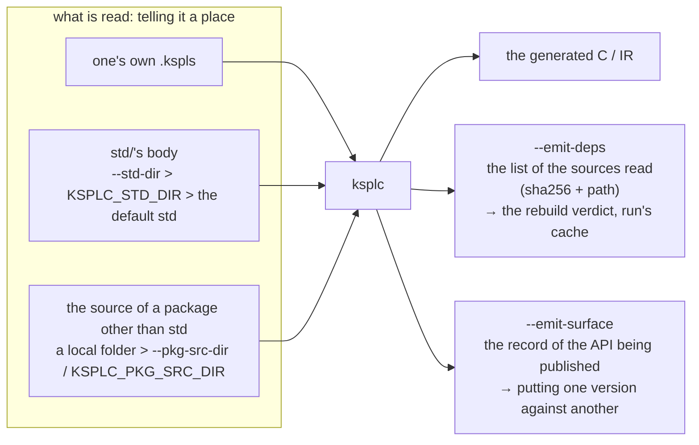
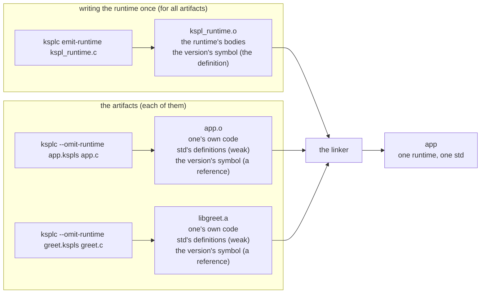

# The KSPL development tools specification

This document specifies how to use KSPL's compiler and the development tools built into it: the formatter, the editor support and the static analysis. **No other tool is needed** — the compiler itself analyses and formats, so no two tools can disagree over how to read the grammar.

## Contents

* [1. Introduction: ksplc is one binary holding ten subcommands](#1-introduction-ksplc-is-one-binary-holding-ten-subcommands)
* [2. The compiler (ksplc)](#2-the-compiler-ksplc)
  * [2.1 Basic use](#21-basic-use)
  * [2.2 Choosing the backend (`--target`)](#22-choosing-the-backend---target)
  * [2.3 The other compiler options](#23-the-other-compiler-options)
  * [2.4 Compilation stops at 50 errors](#24-compilation-stops-at-50-errors)
  * [2.5 Running as a script (ksplc run)](#25-running-as-a-script-ksplc-run)
  * [2.6 Splitting the generated C into several translation units (`--split`)](#26-splitting-the-generated-c-into-several-translation-units---split)
  * [2.7 The cache of the parse result](#27-the-cache-of-the-parse-result)
  * [2.8 What crosses an artifact's boundary (a map)](#28-what-crosses-an-artifacts-boundary-a-map)
  * [2.9 Source crossing the boundary: where it is read from, and what is recorded](#29-source-crossing-the-boundary-where-it-is-read-from-and-what-is-recorded)
  * [2.10 Binaries crossing the boundary: building the artifacts separately](#210-binaries-crossing-the-boundary-building-the-artifacts-separately)
  * [2.11 Diagnostics a program reads (`--diagnostic-format`)](#211-diagnostics-a-program-reads---diagnostic-format)
* [3. The formatter (ksplc fmt)](#3-the-formatter-ksplc-fmt)
  * [3.1 Basic use](#31-basic-use)
  * [3.2 The formatting settings (`--style`)](#32-the-formatting-settings---style)
* [4. The language server (ksplc lsp)](#4-the-language-server-ksplc-lsp)
  * [4.1 The features supported](#41-the-features-supported)
  * [4.2 The settings in the VS Code extension](#42-the-settings-in-the-vs-code-extension)
  * [4.3 How code covered by `#cfg()` is handled](#43-how-code-covered-by-cfg-is-handled)
  * [4.4 Colouring by meaning (semanticTokens)](#44-colouring-by-meaning-semantictokens)
* [5. Static analysis and the linter (ksplc lint)](#5-static-analysis-and-the-linter-ksplc-lint)
  * [5.1 Basic use](#51-basic-use)
  * [5.2 The diagnostics' four weights](#52-the-diagnostics-four-weights)
  * [5.3 Enabling, disabling or promoting a diagnostic to an error (`##lint` / `--lint` / `ksplc.cfg`)](#53-enabling-disabling-or-promoting-a-diagnostic-to-an-error-lint----lint--ksplccfg)
  * [5.4 The list of diagnostic codes](#54-the-list-of-diagnostic-codes)
  * [5.5 The list of warnings (W)](#55-the-list-of-warnings-w)
  * [5.6 The list of information diagnostics (I)](#56-the-list-of-information-diagnostics-i)
  * [5.7 The list of hints (H)](#57-the-list-of-hints-h)
* [6. The project settings file (ksplc.cfg)](#6-the-project-settings-file-ksplccfg)
  * [6.1 How to write it](#61-how-to-write-it)
  * [6.2 The search and the range it applies to](#62-the-search-and-the-range-it-applies-to)
  * [6.3 An invalid setting is refused](#63-an-invalid-setting-is-refused)
  * [6.4 A package that names itself (`[package]`)](#64-a-package-that-names-itself-package)
* [7. Querying and tidying up (ksplc info / ksplc clean)](#7-querying-and-tidying-up-ksplc-info--ksplc-clean)
  * [7.1 ksplc info: reporting what ksplc resolved](#71-ksplc-info-reporting-what-ksplc-resolved)
  * [7.2 ksplc clean: removing what was built](#72-ksplc-clean-removing-what-was-built)
  * [7.3 ksplc info keywords: the list of reserved words](#73-ksplc-info-keywords-the-list-of-reserved-words)
  * [7.4 How reserved words are gathered automatically and grouped](#74-how-reserved-words-are-gathered-automatically-and-grouped)
  * [7.5 ksplc doc: what a file publishes, as a reference to read](#75-ksplc-doc-what-a-file-publishes-as-a-reference-to-read)

---

## 1. Introduction: ksplc is one binary holding ten subcommands

Every KSPL development tool is a subcommand of the one executable `ksplc`, which needs no other installation and no external toolchain.

| How it is called | What it does | See |
| :-- | :-- | :-- |
| `ksplc <input.kspls> <output.c>` | compiles (the default, with no subcommand) | [2. The compiler](#2-the-compiler-ksplc) |
| `ksplc run <script.kspls> [args...]` | builds and runs, caching the result | [2.5 Running as a script](#25-running-as-a-script-ksplc-run) |
| `ksplc fmt <files...>` | formats the code | [3. The formatter](#3-the-formatter-ksplc-fmt) |
| `ksplc lsp` | the language server, normally started by the editor | [4. The language server](#4-the-language-server-ksplc-lsp) |
| `ksplc lint <input.kspls>` | static analysis: it stops after semantic analysis, before Lower, and prints only the diagnostics | [5. Static analysis and the linter](#5-static-analysis-and-the-linter-ksplc-lint) |
| `ksplc info <subject>` | prints one answer ksplc holds (where the standard library is, the link conditions, where the cache is, the reserved words) | [7. Querying and tidying up](#7-querying-and-tidying-up-ksplc-info--ksplc-clean) |
| `ksplc clean <subject>` | removes what ksplc made (the disk cache) | [7. Querying and tidying up](#7-querying-and-tidying-up-ksplc-info--ksplc-clean) |
| `ksplc emit-runtime <output.c>` | writes only the C runtime's source, as one translation unit | [2.10.1 Putting the runtime out once](#2101-emitting-the-runtime-once-ksplc-emit-runtime) |
| `ksplc explain <code>` | prints what a diagnostic code means and what to do about it: that code's section of this specification | [5.4 The list of diagnostic codes](#54-the-list-of-diagnostic-codes) |
| `ksplc doc <file>[.<name>]` | prints what a file, one entry or a folder publishes, rendered from the source | [7.5 ksplc doc](#75-ksplc-doc-what-a-file-publishes-as-a-reference-to-read) |

**The input may be a `.kspls` or a `.kspl`.** In a `.kspls`, indentation, outdentation and newlines stand for `{`, `}` and `;`. The compiler turns it into the brace notation right after reading it, and only then analyses it ("The indentation notation (`.kspls`)" in [`../../docs/DESIGN.md`](../../docs/DESIGN.md)).

**`.kspls` is the default.** A name with no extension, as an `import` writes it, is opened as `.kspls` first, and a diagnostic or a `#line` names it with `.kspls`. A `.kspl` is tried only where no `.kspls` exists, so code in the brace notation keeps working ("Only the default extension is dropped from a logical name" in the same document).

The line numbers do not move, so diagnostics, jumps to a definition and hover point at the same line in either notation; `ksplc fmt` writes either ([§3.1](#31-basic-use)).

`lsp-worker` is the analysis process `ksplc lsp` starts for itself, not a subcommand for a person to call ([§4](#4-the-language-server-ksplc-lsp)).

**Each subcommand has its own options.** An option handed to a subcommand it does not act on is an error, and the message names the subcommands it does act on.

```
$ ksplc fmt --stats a.kspls
ksplc fmt: '--stats' does not take effect on this subcommand (it takes effect on: compile)
```

**It is not silently ignored** ([`../../docs/DESIGN.md`](../../docs/DESIGN.md), Principle 5): the caller could not tell an ignored option from one that took effect. `ksplc --help` lists which options act on which subcommand, generated from the declarations. No copy of that table stands here to drift.

---

## 2. The compiler (ksplc)

### 2.1 Basic use

With no subcommand, `ksplc` compiles the input file to C99 (the default) or to LLVM IR.

```sh
# transpile to C99
ksplc main.kspls main.c
clang main.c -o main

# transpile to LLVM IR
ksplc --target=llvm main.kspls main.ll
```

### 2.2 Choosing the backend (`--target`)

* **`--target=c` (the default)**: portable C99 (`.c`), suited to embedding in an existing C/C++ project or to deploying on a legacy OS or an embedded target.
* **`--target=llvm`**: LLVM IR (`.ll`), which an LLVM toolchain such as Clang or LLC turns into a native binary. **The IR holds only the language's core.** The `kspl_*` functions that touch the OS are only declared; their bodies come from linking the C runtime that `ksplc emit-runtime` writes ([§2.10](#210-binaries-crossing-the-boundary-building-the-artifacts-separately)).

```sh
ksplc --target=llvm main.kspls main.ll
ksplc emit-runtime kspl_runtime.c
clang main.ll kspl_runtime.c -o main
```

### 2.3 The other compiler options

| The option | Description |
| :-- | :-- |
| `--stats` | prints each phase's running time, an estimate of the AST nodes' memory, KSPEG's profile and more. How the report is laid out, and what reads it, is [`DESIGN.md` §1.7](DESIGN.md#17-measuring-the-compiler---stats-and-the-performance-guard). |
| `--freestanding` | generates code for bare metal, depending on neither an OS nor a standard library, and sets the `#cfg()` flag `freestanding`. |
| `--define=<flag>` | defines a flag for `#cfg()` conditional compilation (`ksplc --define=debug main.kspls main.c`); it can be repeated. |
| `--std-dir=<DIR>` | where to look for the standard library (`import "std/..."`) ([§2.9.1](#291-locating-the-standard-library---std-dir)). |
| `--pkg-src-dir=<DIR>` | where to look for the **source** of a package other than `std` ([§2.9.2](#292-the-source-of-a-package-other-than-std---pkg-src-dir)). |
| `--split=<N>` | splits the generated C into N translation units to compile in parallel (the default 1 is no split) ([§2.6](#26-splitting-the-generated-c-into-several-translation-units---split)). |
| `--omit-runtime` | builds an artifact to link beside others and one `ksplc emit-runtime` output ([§2.10](#210-binaries-crossing-the-boundary-building-the-artifacts-separately)). |
| `--emit-deps=<FILE>` | on success, writes the list of the sources read to `<FILE>` ([§2.9.3](#293-writing-out-the-list-of-sources-read---emit-deps)). |
| `--emit-libs=<FILE>` | on success, writes the libraries the program names with `#link` to `<FILE>` as one line of `-l<name>` words, a response file for the C compiler (`@<FILE>`) ([§2.10.4](#2104-writing-out-the-libraries-the-program-names---emit-libs)). |
| `--emit-decls=<FILE>` | writes the declarations to hand out, without their bodies, to `<FILE>` ([§2.10.3](#2103-writing-out-only-the-declarations-to-ship---emit-decls)). |
| `--surface-scope=<pub\|all>` | what `--emit-surface` writes: `pub` (the default), what the package publishes, or `all`, everything a file beside it may reach ([§2.9.4](#294-writing-out-the-published-api---emit-surface)). |
| `--emit-surface=<FILE>` | writes the record of the API the file publishes to `<FILE>`: not the declarations a receiver uses (`--emit-decls`), but **the record that two versions are compared by** ([§2.9.4](#294-writing-out-the-published-api---emit-surface)). |
| `--diagnostic-format=<text\|json>` | how the diagnostics are written to standard error: `text` (the default), for a person, or `json`, one object per line, for a program ([§2.11](#211-diagnostics-a-program-reads---diagnostic-format)). |
| `--help` | prints the usage and exits with 0. |

**An option's value is joined with `=`** (`--std-dir=std`), and `--std-dir std` is refused. An option has no short spelling, `--help` included: each option has one spelling (Principle 6 in [`../../docs/DESIGN.md`](../../docs/DESIGN.md)). [`std/argp`](../../std/README.md) parses them, and also refuses two subcommands at once (`ksplc fmt lint`).

**Which subcommands each option acts on is what `ksplc --help` lists** ([§1](#1-introduction-ksplc-is-one-binary-holding-ten-subcommands)).

**A wrong argument is an error**: an unknown option (an argument beginning with `-`), or the wrong number of input files (a compile takes `<input.kspls> <output.c>`, and `ksplc lint` one).

Caution: **Quote a path that a script or a Makefile passes from a variable.** Unquoted, a path holding a space (a folder such as `OneDrive - Kanso System`) is split by the shell, and the pieces arrive as file names. If the first two were used with no message, an unrelated file would compile for no visible reason.

`ksplc fmt`'s own options (`--in-place`, `--to`, `--style`) are in [§3.1](#31-basic-use) and [§3.2](#32-the-formatting-settings---style), and `ksplc lint`'s `--lint` in [§5.3](#53-enabling-disabling-or-promoting-a-diagnostic-to-an-error-lint----lint--ksplccfg).

### 2.4 Compilation stops at 50 errors

When the errors reach 50, the compiler prints "Too many errors (>= 50). Further errors are suppressed." as an error (itself one of the 50) and reports no more. Errors that cascade from one mistake then cannot scroll the first cause out of sight. A compile and `ksplc lint` both do this.

**A failed compile shows none of ksplc's insides**: only the diagnostic and one line of `<category>/<variant>`. The path through ksplc (the functions a `?` passed the error out of) is nothing the writer can fix, so it would only distract from the cause (as with Error in [§5.2](#52-the-diagnostics-four-weights)).

To chase an unexpected failure while developing ksplc, set the environment variable `KSPLC_INTERNAL_TRACE` to any non-empty value, and the failing path is added as `stack backtrace:`. It reaches the language server's analysis process (`lsp-worker`) too. **An unexpected breakdown of ksplc itself is always reported**, with the tree as the analysis left it, whatever this setting.

### 2.5 Running as a script (ksplc run)

```sh
ksplc run [ksplc's options] <script.kspls> [the script's arguments...]
```

It translates to C, links and runs in one step. **The build is cached, and skipped entirely when the input has not changed.**

| The situation | What runs |
| :-- | :--- |
| the input (the script and every file it imports) is unchanged | nothing is rebuilt; the cached executable starts |
| the input changed but the generated C did not (a comment edited, say) | `ksplc` alone; compiling the C and linking are skipped |
| part of the generated C changed | `ksplc`, and **the C compiler on the changed translation units alone** |

**Reuse is decided by the contents of the files read**, the list `--emit-deps` writes ([§2.9.3](#293-writing-out-the-list-of-sources-read---emit-deps)). It also compares `ksplc`'s own identity, the `--define` flags, what `--std-dir` and `--pkg-src-dir` resolve to, the C compiler's name, and whether a copy in the current folder now hides a package ([§2.9.2](#292-the-source-of-a-package-other-than-std---pkg-src-dir)).

**The generated C is split into translation units and compiled in parallel** ([§2.6](#26-splitting-the-generated-c-into-several-translation-units---split)). Each object is kept in the script's slot under a name derived from its contents, so an unchanged one is not rebuilt, and the next build removes the objects it does not use.

**Arguments**: `ksplc`'s own options go **before** the script name. Everything after it goes to the script uninterpreted, even an option such as `--stats` (as with `python x.py --foo`); no `--` is needed.

**The shebang line**: a `#!` first line is for the OS, not KSPL, and is skipped. With the execute permission set, the script starts as `./script.kspls`.

```kspls
#!/usr/bin/env -S ksplc run
import "std/io"

fn main()
  io.out().s("hello\n")
```

`#` also opens an attribute, so **only a `#!` on the first line** is special. It is read as a line comment rather than removed, so line numbers do not shift, and `ksplc fmt` keeps it. This holds for both a file read from disk and an editor's unsaved buffer. If only one were read this way, the language server alone would report an error at the first character.

Starting it this way needs two things:

* **`ksplc` on the PATH.** `env -S` splits one string into several arguments, handing over `ksplc` and `run` separately (GNU coreutils 8.30 and later, and BSD's and macOS's `env`, support it).
* **`KSPLC_STD_DIR` set.** By default the standard library is looked for only in the `std/` under the current directory.

Windows's native shell does not read a shebang; call `ksplc run <script.kspls>` there.

**Where the cache lives**, strongest first: `KSPLC_CACHE_DIR` > `XDG_CACHE_HOME/ksplc` > `%LOCALAPPDATA%/ksplc/cache` (Windows) > `$HOME/.cache/ksplc`. `ksplc info cache-dir` prints it and `ksplc clean cache` removes it; deleting it is always safe, as it is rebuilt next time.

**The size**: each script has one slot (the executable, the shared header, the objects). A slot's key holds the script's path from the root, so one name typed in two folders is two scripts. The key also holds `ksplc`'s identity, so rebuilding `ksplc` wastes every slot at once. Making a new slot keeps the 64 most recently used and every slot used within the last hour (another run may still be building it), and removes the rest. A burst of new scripts (a test run) leaves more than 64 until it is an hour old.

**A failed build leaves the cache as it was.** The generated C, the executable and the list of inputs are replaced only together, so when the C compiler fails, the previous executable never runs as if the build had succeeded. The C it refused is left as `prog.new.c` for inspection. Fix the cause and the next run rebuilds; the cache need not be removed by hand.

**Runs of one script at once are safe.** One run builds while the others wait, printing `ksplc run: waiting for another run of this script to finish building it` on standard error. Then they start what it built, and the programs run side by side. A run that dies releases the lock, so none is left waiting on it. A program still running when a newer build replaces it keeps running.

**The script's own path**: `sys.script_path()` returns the started script's path (Python's `__file__`). Index 0 of `sys.args()` is the cached executable's path, so use `script_path()` to look beside the script. In an executable not started by `ksplc run`, it returns `.none`.

It is passed in the environment variable `KSPL_SCRIPT` (`script_env_name` in `std/sys`) as `<the started executable's path>\n<the script's path>`. **A grandchild process inherits the variable too, so `script_path()` checks it against its own `argv[0]` before answering.**

**The exit code** is the script's own. A script sets it by `main`'s return value, a failure path or `sys.exit()`; how each takes effect is the table in [`docs/SPEC-language.md`](../../docs/SPEC-language.md) §8.2.

**`ksplc run` takes no option that changes how it builds**: it generates C and links it itself, so an option such as `--target` is refused there, as any option is on a subcommand it does not act on ([§1](#1-introduction-ksplc-is-one-binary-holding-ten-subcommands)).

**The libraries linked** follow from the OS and the target triple; `ksplc info link-libs` gives the same answer. The libraries the program names (`#link` on an `extern` block) go before them, after the objects ([§2.10.4](#2104-writing-out-the-libraries-the-program-names---emit-libs)); changing only those relinks without rebuilding any object.

**The executable's build options**: removing the unreferenced sections, and asking for a stack size on Windows; `ksplc info exe-flags` gives the same answer. Without the stack size, Windows alone behaves differently: its linker's default of 1MB runs out before the depth that "12. Implementation limits" in [`../../docs/SPEC-language.md`](../../docs/SPEC-language.md) guarantees.

### 2.6 Splitting the generated C into several translation units (`--split`)

With `--split=<N>` (N > 1), it writes **one shared header plus N unit `.c` files** instead of a single `.c`, so the C compiler can run on them in parallel.

```sh
ksplc --split=4 main.kspls out/prog.c
# => out/prog.h  out/prog.0.c  out/prog.1.c  out/prog.2.c  out/prog.3.c
clang -c out/prog.0.c -o out/prog.0.o &   # the four can be compiled in parallel
...
clang out/prog.*.o -lm -o out/prog
```

The output path serves **only as the base for the names**, which are built from its `<stem>` (the path without its last extension).

| The file | The contents |
| :-- | :-- |
| `<stem>.h` | the declarations every unit `#include`s (the types, the prototypes, the `extern` declarations). **Not compiled on its own.** |
| `<stem>.0.c` … `<stem>.<N-1>.c` | the bodies. **All** N are linked. |

**The output path itself (`out/prog.c` above) is not written**: the caller links every unit, and a file there would look like a first one.

Caution: **Keep the shared header in the same directory as the unit `.c` files**; they `#include` it by file name, not by path.

**The guide for N is the core count** ([`DESIGN.md` §6.9](DESIGN.md#69-split-compilation-emitting-one-program-as-several-translation-units---split)). The cap of 256 stops a mistyped order of magnitude and is not a recommendation.

**It cannot be combined with `--target=llvm`** (an error): the LLVM backend cannot split translation units.

### 2.7 The cache of the parse result

ksplc **stores each file's parse result on disk and skips parsing it next time**. There is nothing to configure, and no option.

```sh
ksplc hello.kspls hello.c     # the 1st time: it parses std
ksplc hello.kspls hello.c     # the 2nd time onward: it skips the parse (the smaller the input, the more it tells)
```

**It lives** where `ksplc run`'s cache does ([§2.5](#25-running-as-a-script-ksplc-run)).

**The unit is one file**, so `std/io`'s entry, once made, serves other programs too. The key holds the file's contents and `ksplc`'s identity, so rebuilding `ksplc` remakes it automatically.

**The size** is the files read, per generation of `ksplc`. `--define` is in the key, so each new combination of flags adds to the generation. Rebuilding `ksplc` makes the old generations useless, so making a new generation keeps the 8 newest by modification time and removes the rest.

**An editor's unsaved buffer is not cached**, since the language server analyses it on every keystroke; files read from disk (`std/` and the like) are, so the language server answers faster too. `--stats`'s `[AST Cache] N hit / M miss / K stored` line shows whether the cache is working.

### 2.8 What crosses an artifact's boundary (a map)

Sections 2.1 to 2.7 build one artifact, with no option or one at a time. The rest of this chapter covers **what crosses an artifact's boundary**, and which option serves each side:

| | Source (a `.kspls`) | Binary (a `.a` / `.o` plus the declarations) |
| :-- | :-- | :-- |
| **Receiver** | `--std-dir` / `--pkg-src-dir` (telling it a place, mainly through `KSPLC_STD_DIR` / `KSPLC_PKG_SRC_DIR`) | `--omit-runtime` (takes the runtime out of one's own generated C and makes std's definitions foldable) |
| **Provider** | none (a folder is simply placed) | `ksplc emit-runtime` (the runtime, once), `--emit-decls` (the declarations alone) |
| **Record** (neither side) | `--emit-deps` (the sources read → the rebuild verdict, `run`'s cache), `--emit-surface` (the published API → comparing versions) | `--emit-libs` (the libraries the program names → the link line) |

Note: Between KSPL's own artifacts the binary side has no receiver or provider: `app.o` and `libgreet.a` are equal parts built with the same options, and only `emit-runtime` stands apart ([§2.10](#210-binaries-crossing-the-boundary-building-the-artifacts-separately)).

### 2.9 Source crossing the boundary: where it is read from, and what is recorded

Source is either read or written out. Options tell ksplc where to read it from, and records say what was read and what is published.



#### 2.9.1 Locating the standard library (`--std-dir=`)

**An import beginning with `std/` is special**: it is read from the one folder that holds the standard library. A list of places tried in order would let a project's own `std/` folder hide the real one with no message, or the reverse ([`DESIGN.md` §13.3](DESIGN.md)). That folder is the first of these, strongest first:

| # | Where it comes from | The use assumed |
| :-- | :-- | :-- |
| 1 | `--std-dir=<DIR>` | a temporary override from CI or a build system, for that process alone. |
| 2 | the environment variable `KSPLC_STD_DIR` | a standard library kept apart from the compiler: one being worked on, or the language server's for a project elsewhere. It is inherited by child processes. |
| 3 | the `std/` beside the `ksplc` executable | **the usual way**: an unpacked release zip, which holds `ksplc` and `std/` side by side. |
| 4 | `../lib/kspl/std` from the executable's folder | an installation: `make install` puts `<prefix>/bin/ksplc` and `<prefix>/lib/kspl/std`. |
| 5 | the default value `std` | with none of the above, the `std/` directly under the current directory. |

**The executable is its real file**, links followed (on Linux and macOS), so a `ksplc` linked onto the PATH from an unpacked folder takes that folder's `std/`. **A folder counts in 3 and 4 only where it holds `lang.kspls`**, which every standard library has; a folder that is merely called `std` is passed over.

```sh
# installed as /usr/local/bin/ksplc, with /usr/local/lib/kspl/std beside it
ksplc src/main.kspls out/main.c        # there is no need to place a std/ in the project
ksplc info std-dir                     # => /usr/local/lib/kspl/std

export KSPLC_STD_DIR=/home/me/kspl/std
ksplc info std-dir                     # => /home/me/kspl/std
```

**This setting does not go in `ksplc.cfg`, and `--std-dir=` is an error with the language server.** Set `KSPLC_STD_DIR` instead (the reasons for both are in [`DESIGN.md` §13.3](DESIGN.md)). The language server the VS Code extension carries has no `std/` beside it, so for a project with no `std/` of its own it reads the variable.

#### 2.9.2 The source of a package other than `std` (`--pkg-src-dir=`)

Any other import (`import "mylib/thing"`) is looked for **relative to the current folder**. `--pkg-src-dir=<DIR>` or the environment variable `KSPLC_PKG_SRC_DIR` adds **one more place** to look. The precedence is `--pkg-src-dir=` > `KSPLC_PKG_SRC_DIR` > empty (the current folder alone), the same shape as for `std`.

**The name says `src` because it points at a package's source**, not at anything built (the reasons for the name are "The option that tells it where a package is" in [`DESIGN.md`](DESIGN.md)).

```sh
export KSPLC_STD_DIR=/home/me/kspl/std
export KSPLC_PKG_SRC_DIR=/home/me/kspl        # the parent of ksdb/ ksai/ …
ksplc run main.kspls                        # one's own project may be placed anywhere

ksplc info pkg-src-dir                        # => /home/me/kspl (an empty line where nothing was told)
```

**The place is decided once per package, and a local copy wins.** If the current folder holds a folder with the package's name (a vendored copy), every file of the package is read from there. Otherwise every file is read from the named place. Decided file by file, one package could come half from one place and half from another.

**Putting a copy in place also remakes `ksplc run`'s cache entry**: the file at the named place is unchanged, so besides matching contents, ksplc checks whether a copy in the current folder now hides it ([§2.5](#25-running-as-a-script-ksplc-run)).

**This setting does not go in `ksplc.cfg` either**, since a place belongs to the environment and the way of installing. A package's name does go there: a package that names itself ([§6.4](#64-a-package-that-names-itself-package)) finds its own files in its own folder, not in either place above, and names the packages it uses from them.

**Paths in diagnostics**: inside the standard library, a diagnostic names the file by its logical name (`std/io.kspls`), not its actual place ([`DESIGN.md` §13.3](DESIGN.md)). A file that was not found, in `std` or in a package, is named by the path ksplc actually tried to open, as it cannot be fixed without knowing where ksplc looked.

#### 2.9.3 Writing out the list of sources read (`--emit-deps`)

On success, `--emit-deps=<FILE>` writes the sources read to `<FILE>`, one per line as `<64 hex digits of sha256> <path>`. The list includes the files read from `std/` or the named place, and every file an `embed` read (its bytes are in the output). It includes every `ksplc.cfg` read, since a `[package]` decides where the sources are read from ([§6.4](#64-a-package-that-names-itself-package)). **It also lists each `ksplc.cfg` looked for and not found**, with 64 `-` in place of the digest. One placed there later is read instead of the one further up ([§6.2](#62-the-search-and-the-range-it-applies-to)), so its appearing has to count as a change.

**It decides rebuilds**: `ksplc run` uses it to judge whether its cache still holds ([§2.5](#25-running-as-a-script-ksplc-run)), and the repository's `make test-deps` compares it with the dependencies the Makefile lists.

**Matching contents alone misses one change**, a copy put in the current folder that now hides a package ([§2.9.2](#292-the-source-of-a-package-other-than-std---pkg-src-dir)).

#### 2.9.4 Writing out the published API (`--emit-surface`)

`--emit-surface=<FILE>` writes the declarations the compiled entry point publishes to `<FILE>`, **one per line**. Comparing two versions' files lines up **what was added, changed and deleted**, by name.

```sh
ksplc --emit-surface=tensor.surface ksai/tensor.kspls out.c
```

```
ksai/tensor	Tensor<|T|>.matmul	pub fn matmul(r: Self$@, rhs: Tensor<|T|>): Tensor<|T|>?Tensor_error	the product of two matrices
```

The columns are tab-separated: **the file's logical name / the key / the spelling / the documentation**. The lines are sorted by key.

* **The key is a declaration's identity**: `<the enclosing type>.<the name>`, or the name alone where nothing encloses it. An `impl`'s enclosing type is its target type as spelled (a `Box<|T|>` and a `Box<|I32|>` are different APIs), and a conformance to a trait is `<the target>:<the trait>`.
* **The attributes are part of the key**: `#cfg` is the only way to write one name twice, and without it two entries would share a key.
* **The spelling is the source with its whitespace folded**: each run of whitespace becomes one, and line comments are dropped. **The inside of a string is not folded** (a default argument's literal is part of the spelling).
* **The documentation, the fourth column, is left off where there is none.** It holds the declaration's `//<` run, its summary and the detail behind the parting mark, joined by spaces ("The documentation a declaration carries" in [`../../docs/DESIGN.md`](../../docs/DESIGN.md)). A parameter's `//<`, and the one on the return's line, each get a row of their own. The record holds one entry per line, and a list packed into one column would need a separator that no description may contain.
  * Note: **The column is here so that drift shows.** Change what a `pub` does and leave its description standing, and `make test-surface` shows the row as changed in the same round as the signature.

**A file's own description is a row too**, keyed by the mark alone (`~`). It is the `//<` run before the file's first line of code, with nothing but blank lines above it. It stands above the imports, since an `import` is code. A file that says nothing gets no row.

**A parameter and the return are keyed as parts of their declaration**: `<the key>~<its place>.<its name>` and `<the key>~~`. No name contains `~`, so a key holding one is always a part, and the place is padded so that parameters sort in the order the signature writes them, not alphabetically. A part that says nothing gets no row, as it would only repeat the signature.

**A part does not always sort right after its declaration, and a reader must not assume it does**: `~` sorts after letters and after `_`, so where one name begins another (`sub` and `sub_from`), the shorter name's parts land after the longer name.

Note: **The parts' rows and the file's own row are for a reference to read, not for matching versions.** No caller relies on what a parameter means or what a file is for, so a prose edit to either is no break. `make surface` leaves these rows out of `SURFACE.txt`, and `ksplc doc` shows them ([§7.5](#75-ksplc-doc-what-a-file-publishes-as-a-reference-to-read)).

**The scope decides which declarations are written** (`--surface-scope`, [§2.3](#23-the-other-compiler-options)). The record that two versions are matched by is always made at `pub`, since nobody outside relies on a declaration that is not `pub`. `all` serves a package that publishes nothing: an application's files reach one another with visibility unset, so at `pub` its record is empty. Any other name is refused. A mistyped scope that defaulted to `pub` would write only the published declarations and look as if it had worked.

**It is kept apart from `--emit-decls`**, which drops what cannot be handed over and writes the numbers the ABI fixes for passing by value (`#size`) ("The published API is recorded in the repository" in [`../../docs/DESIGN.md`](../../docs/DESIGN.md)).

**Only `pub` declarations come out**: unset visibility (inside the package alone) and `priv` are not API. A `trait`'s required methods come out even when `priv`: nobody can call them, but a conforming type has to provide them. Of a `struct`'s fields only the `pub` ones come out; of an `enum`, every variant with its tag value, since a `switch` can take them apart, which makes the variants API.

**The record holds every `#cfg` branch, not only the one this build keeps**: it reads the raw syntax tree, so `Db.open` in `std/db.kspls` is two lines, `#cfg(db)` and `#cfg(!db)`. A record made without the flag would otherwise lose the API that a user who sets it sees.

Note: How a package's records are joined into its `SURFACE.txt`, and the gate that holds it, are "The record of a published API" in [`docs/SPEC-gates.md`](../../docs/SPEC-gates.md).

### 2.10 Binaries crossing the boundary: building the artifacts separately

The generated C holds three things: one's own code, `std/`'s definitions (the monomorphized bodies included) and the runtime's bodies (`kspl_*`). By default all three go in, so a single artifact needs no setting. Only when two or more artifacts are linked do the last two become duplicate definitions. To avoid that, **`ksplc emit-runtime` writes the runtime once for all, and each artifact leaves it out with `--omit-runtime`**; there is no other option to remember.

| What goes into the generated C | By default | With `--omit-runtime` |
| :-- | :-- | :-- |
| one's own code | in | unchanged |
| `std/`'s definitions (the monomorphized bodies included) | in, as strong definitions | weak, with std's version in the symbol names; the linker picks one |
| the runtime's bodies (`kspl_*`) | in | out; only the declarations and a reference to the version symbol remain |



**The one option does both**: it omits the runtime's bodies, and it makes `std/`'s definitions weak with a version in their names (the reason is in [`DESIGN.md` §6.4](DESIGN.md#64-embedding-the-runtime-and-the-two-ways-to-keep-it-out)). To hand out declarations beside such an artifact, use `--emit-decls` ([§2.10.3](#2103-writing-out-only-the-declarations-to-ship---emit-decls)).

**Mismatched versions stop the link with `undefined symbol`**: `emit-runtime` defines a symbol derived from the runtime's whole source, and `--omit-runtime`'s generated C refers to it. Build both with the same `ksplc` and the same `std/`.

The reference carries a keep-even-if-unreferenced mark (`__attribute__((used, retain))`); without it the reference would be dropped as unused, and a mismatched runtime would link too.

**`--omit-runtime` works only on the object formats that honour this mark.**

| The object format or combination | `--omit-runtime` | The reason |
| :-- | :-- | :-- |
| ELF (Linux) | accepted | `SHF_GNU_RETAIN` on the section (`used, retain`) |
| Mach-O (macOS) | accepted | `N_NO_DEAD_STRIP` on the symbol (`used`) |
| PE (Windows) | accepted | `used` suffices: symbols are resolved before sections are dropped, so the reference resolves while its section remains |
| any other (wasm and the like) | does not build | the mark cannot be asked for, so the generated C itself stops with `#error` |
| `--freestanding` | refused | the toolchains do not keep to the mark (`arm-none-eabi-gcc` ignores `retain`) |
| `--target=llvm` | makes no difference | the IR always links against `emit-runtime`'s output and never makes std weak, so nothing can mismatch |
| `ksplc run` | not accepted | it links by itself, so no runtime can be handed to it |

#### 2.10.1 Emitting the runtime once (ksplc emit-runtime)

```sh
ksplc emit-runtime [--freestanding] <output.c>
```

It writes the C runtime's source to `<output.c>` as one translation unit and exits. **It analyses no source**, so it takes no `.kspls`. Generated C built with `--omit-runtime` holds no runtime bodies, so this output is linked beside it (the design is in [`DESIGN.md` §6.4](DESIGN.md#64-embedding-the-runtime-and-the-two-ways-to-keep-it-out)). Its only option is `--freestanding`: `--omit-runtime` goes on the artifact's compile, not here.

**`--freestanding` changes the contents**, so emit it with the same setting as the generated C it is linked with.

#### 2.10.2 Linking the artifacts together (shipping without the source)

This section hands out KSPL code without its source, building the three artifacts in the figure above by hand. The boundary is C's ABI: the provider exports with `#export`, and the receiver declares with `extern "C"`.

```kspls
// greet.kspls (the side not handed out)
import "std/str" { Str_builder }
#export
pub fn greet_len(n: I32): I32
  $b: = Str_builder.new()
  defer b.free()
  b.i(I64::n)
  return I32::b.slice().len
```

```kspls
// app.kspls (the library's user. greet.kspls is not wanted)
import "std/io"
extern "C"
  fn greet_len(n: I32): I32
fn main()
  io.out().s("len=").i(I64::greet_len(1234)).s("\n")
```

```sh
# 1. emit just one runtime (once in all)
./ksplc emit-runtime kspl_runtime.c

# 2. generate each of them with no runtime (std's definitions become weak)
./ksplc --omit-runtime greet.kspls greet.c
./ksplc --omit-runtime app.kspls app.c

# 3. the library is handed out as a .a, and its user links it alongside the runtime
clang -std=c99 -c greet.c -o greet.o && ar rcs libgreet.a greet.o
clang -std=c99 -c app.c -o app.o
clang -std=c99 -c kspl_runtime.c -o kspl_runtime.o
clang app.o kspl_runtime.o -L. -lgreet -lm -lpthread -o app
```

Only `libgreet.a` and the `extern "C"` declarations are handed out; `greet.kspls` is not. The `-l…` on the last line are what `ksplc info link-libs` answers.

**A type with a layout of Kanso's own cannot cross** (a slice, a Result, a trait value and so on): C's ABI carries a scalar, a raw pointer or a plain `struct`. The list of the types that cannot cross is in [`../../docs/SPEC-language.md`](../../docs/SPEC-language.md).

#### 2.10.3 Writing out only the declarations to ship (`--emit-decls`)

For a library handed out without its source, `--emit-decls=<FILE>` writes **the signatures alone**: the compiled entry point's `pub` declarations without their bodies ("8.1 Definitions" in [`../../docs/SPEC-language.md`](../../docs/SPEC-language.md)). The bodies are in the C the same compilation writes, built into a `.a`. It also makes `pub` a root of dead-code elimination, so no declared symbol's body is missing from the artifact.

**Each declaration keeps its summary**: a `//<` on a declaration's own line is written on the same line of the declaration file, so the receiver still sees it in its editor's hover ("The documentation a declaration carries" in [`../../docs/DESIGN.md`](../../docs/DESIGN.md)).

**The detail behind the parting mark is left out**, as the file holds headings without contents; a body distributed with `#publish_body` is copied verbatim, its detail with it.

```sh
# the library's author: the bodies and the declarations come out of the same compilation
ksplc --omit-runtime --emit-decls=greet.decls.kspls acme/greet/lib.kspls lib.c

# the library's user: the declarations are placed as acme/greet/lib.kspls and imported as they are
```

**Linking is as in [§2.10.2](#2102-linking-the-artifacts-together-shipping-without-the-source)**: this section hands out KSPL declarations, where that one makes C's ABI the boundary.

**Place the declaration file at the logical name it was built under.** Symbol names derive from a file's logical name, so placed elsewhere they miss the `.a`'s symbols (moved into `vendor/`, it looks for `kspl_vendor_…`).

Caution: **Make the declarations and the `.a` afresh from the same compilation.** A changed signature keeps its symbol name, so an old `.a` with new declarations links, with only the calling convention silently wrong.

**A `struct` is opaque by default**: it is written with its size and alignment in place of its fields (`#size(N) #align(M) pub struct S;`; "3.3 Structs (`struct`)" in [`../../docs/SPEC-language.md`](../../docs/SPEC-language.md)), so the receiver can hold it as a value but cannot touch its contents.

**A `struct` with a floating-point field comes out transparent**, its fields as they are: as an opaque byte run it would be classified differently when passed by value.

**An `impl` comes out with its `pub` methods as declarations without bodies** (`impl T { pub fn m(...); }`), and `impl T: Trait` with its conformance. So `Owned` (the tracking of `free`), `Move_only` (a copy treated as a move) and the operators work for the receiver too.

**A method that is not `pub` is left out** — a `priv` cannot be used outside its file, nor an unset one outside its package — and stays in the `impl` as a comment.

**A type under ARC (`Ref_counted`) is not written at all**; only the reason is, as a comment. `retain` / `release` have to be `priv` ("8.4 The memory management model: `defer` / ARC / arenas" in [`../../docs/SPEC-language.md`](../../docs/SPEC-language.md)), so nothing outside the artifact can call them. Dropping just the conformance would link but break at run time. To hand out such a value, pass an opaque handle across the boundary and keep the counting in the artifact that holds the bodies.

**An `enum` comes out whole**: its variants in order, their tag values and their payloads' types, since the receiver needs the variants to take one apart with a `switch`. The tag values are always written: without them, a skipped number (`err = 3`) would swap the branches with no message while the link still passes. A tag value is written folded, as an initializer's expression cannot be written back. An `enum` under ARC is not written, as for a `struct`.

**A `trait` comes out with its required methods' signatures, in order.** The order matters: a call through a trait value uses the slot the order sets, so a missing method sends the call to a different one. A `priv` requirement comes out too, as in `--emit-surface`'s record ([§2.9.4](#294-writing-out-the-published-api---emit-surface)). The receiver is written `Self` ("5.1 Traits (`trait`)" in [`../../docs/SPEC-language.md`](../../docs/SPEC-language.md)); the resolved name would make it a trait value's type and change the requirement's meaning.

**A `const` comes out with its value**, not a symbol (`pub const max_items: Sz = 4096;`), since a `const` is folded at translation time. Only one literal (a string, a character, a number, a boolean) or an expression foldable to an integer can be written; an array's or a struct's initializer cannot.

**With `--emit-decls`, and only then, `pub const` becomes weak** (`KSPL_WEAK`): the declaration file holds the value too, and a `const` has a body in the generated C, so two strong definitions would fail the link as duplicates.

**A generic marked `#publish_body` is copied with its body**, since a generic has no body until it is instantiated and cannot be handed over by its signature ("10. Compiler directives and attributes" in [`../../docs/SPEC-language.md`](../../docs/SPEC-language.md)). The source is copied as written: the receiver reads the very same body text, which keeps the instantiated bodies' versions in step. The body's `import`s are needed too. An import of `std/` is copied with it; an import of another of one's own files, which the receiver lacks, stays as a comment.

A handed-out body may use only names that resolve inside the declaration file, so it cannot touch the fields of an opaque type.

**A signature using a `std` type can be handed out**: the declaration file gets the `import`s it needs, so `pub fn f(b: str.Str_builder$@): Sz;` arrives as written. The alias is the one the declaration file's `import` gives: the source's own where its `import` was copied (with a `#publish_body`), and otherwise the path's tail. A selective import (`import "std/ds" { List };`) gives the file no alias, so a type from it in a signature adds a plain `import "std/ds";`.

**Only `std` can be referred to**: the receiver has `std` and the declaration file, and none of the provider's other files.

**A declaration that cannot be written leaves its reason as a comment**: a generic without `#publish_body`, and one whose signature uses a type that cannot be written, such as one from another of one's own files.

Caution: **Never drop one silently**: the receiver would read it as "there is no such API".

#### 2.10.4 Writing out the libraries the program names (`--emit-libs`)

A program whose `extern` block names its library (`#link`, "11.5 Naming the library an `extern` block needs" in [`../../docs/SPEC-language.md`](../../docs/SPEC-language.md)) needs that library on the link line. On success, `--emit-libs=<FILE>` writes the libraries of the blocks kept to `<FILE>` as **one line of `-l<name>` words**, the shape `ksplc info link-libs` answers in, or an empty line where the program names none.

```sh
ksplc --define=blas --emit-libs=prog.libs main.kspls prog.c
clang prog.c @prog.libs $(ksplc info link-libs) -o prog
```

* **Hand the file to the C compiler as a response file (`@prog.libs`).** clang and gcc read its words as they stand, with no shell between, so the same line works in a Makefile, PowerShell and a VS Code task; a shell reads it as words too (`$(cat prog.libs)`).
* **The program's libraries go before `info link-libs`'s**: a library the program names may itself need `-lm`, and GNU ld resolves only from the left.
* **The libraries every program needs are not in the file**: they follow the C compiler's target, which the compile never asks about; `ksplc info link-libs` answers them.
* **The order**: a file's libraries before those of the files it imports, and within a file as written. A library named twice is written once, at its first place; a block `#cfg` dropped names nothing.
* **A failed compile writes no file, and a file that cannot be written fails the compile**: a build reading a stale or missing one would link the wrong libraries and fail on undefined names far from the cause.

`ksplc run` does the same internally ([§2.5](#25-running-as-a-script-ksplc-run)).

### 2.11 Diagnostics a program reads (`--diagnostic-format`)

With `--diagnostic-format=json`, a compile and `ksplc lint` write **each diagnostic as one JSON object on one line of standard error**, in the order they are found. Nothing else changes: the exit code, and the summary on standard output.

```sh
$ ksplc lint --diagnostic-format=json main.kspls
{"severity":"warning","code":"W0207","message":"Nothing reads local variable or parameter 'v'. Prefix with '_' to ignore.","file":"main.kspls","line":5,"column":3,"end_column":4}
```

| Key | What it holds |
| :-- | :-- |
| `severity` | `error`, `warning`, `information` or `hint` ([§5.2](#52-the-diagnostics-four-weights)) |
| `code` | the diagnostic's code (`W0207`), which `ksplc explain` expands; `null` for an error, which has none |
| `message` | the text the text form prints after the severity, **without the `[CODE]` in front**; it may run over several lines |
| `file` | the file as the text form names it; `null` for an error placed in no file |
| `line` | the line, counted from 1; `null` where no place is known |
| `column`, `end_column` | where the underline starts and where it stops (not included), counted in characters from 1 on that line: **the place the text form's carets mark**, at least one character wide. `null` where only a line is known (a mistake in `ksplc.cfg`) or none |

* **Each line is read on its own**, so a reader can act on the first diagnostic before the compile ends.
* **No byte offset is given.** A `.kspls` file is analysed after its indentation is turned into braces, so an offset would count bytes the file does not hold; the line and the columns are those of the file as written.
* **A line that is not an object is not a diagnostic of the program**: a breakdown of `ksplc` itself, or of the machine it runs on, is still written as text.

---

## 3. The formatter (ksplc fmt)

**The formatter parses the source fully and writes the tree back, rather than editing characters**, so formatting cannot change the meaning.

### 3.1 Basic use

```sh
# put the formatting result out to standard output
ksplc fmt src/main.kspls

# format by overwriting the file directly (in place)
ksplc fmt --in-place src/main.kspls src/utils.kspls

# put it out in a changed notation (--to)
ksplc fmt --to=kspl  src/main.kspls     # the brace notation to standard output
ksplc fmt --to=kspls src/main.kspl      # the indentation notation to standard output
```

`--to` names the notation to write (`kspl` / `kspls`). Without it, the output keeps the input's notation, so `ksplc fmt --in-place` formats in place in either notation. **It cannot change the notation and write back**: `--in-place` writes to the same file, whose name would then contradict its contents. Without `--in-place` the output goes to standard output.

**A formatted source comes back byte for byte from the other notation, with one exception for the writer to fix.** A comment after a `}` that the indentation notation leaves out has no line to stand on there. `--to=kspls` moves it to the line above, or onto a line of its own where the line above already has a comment, and it does not come back; `ksplc lint` names each one ([I0805]). A comment after a `}` that the notation keeps (a value's, or a block's inside a call's brackets) stays where it is in both directions.

**`fmt` never meets a bare block**: a `{ … }` standing as a statement does not parse in either notation ("A bare block carries a label" in [`../../docs/DESIGN.md`](../../docs/DESIGN.md)). A labelled block (`while_locked: { … }`) keeps its label, and an empty `{}` is written as it stands.

### 3.2 The formatting settings (`--style`)

`--style="..."` takes comma-separated settings (`ksplc fmt --in-place --style="IndentWidth: 4, ColumnLimit: 120" main.kspls`).

| The option's name | The default | Description |
| :-- | :-- | :-- |
| **`IndentWidth`** | `2` | the number of spaces per indentation level. |
| **`ColumnLimit`** | `100` | the maximum number of characters on a line. An argument list, a method chain and the like that exceed it are broken at a safe position. |
| **`AllowShortBlocks`** | `false` | `true` lets a short block go on one line (`if cond { break; }`; in `.kspls`, `if cond { break }` with no `;`), except one with a comment inside its braces, which is never folded (below). |
| **`AllowShortFunctions`** | `false` | `true` lets an `fn` whose body is a single statement go on one line (a method in an `impl` too; in `.kspls` without the statement's `;`). As with `AllowShortBlocks`, one with a comment inside, one too wide for the column limit, and one of two or more statements stay on three lines. |

**A key not in the table is an error**, so a typo such as `IndentWith` cannot succeed while the default stays in effect unnoticed. No setting switches the trailing comma: the formatter follows the source.

**A comment inside braces stays inside the block, at its level.** A block holding a comment is never folded onto one line, even with an empty body. A comment right before the `}` belongs to the block's contents, so it lines up with them, not with the brace.

**A `//<` continuing a run is indented one step in from the line that opened the run** ("The documentation a declaration carries" in [`../../docs/DESIGN.md`](../../docs/DESIGN.md)). Where that line ends in a `{`, that step is the contents' own level, so the shape is the same whether or not the thing described has contents.

**A file keeps its line terminator.** The formatter works on lines ending `\n`; `to_lf` in `../../ksplc/parse/source_fix.kspls` does that on the way in, for the compiler and the formatter alike. It writes `\r\n` back where the file used it, as it does the BOM ("The line terminator is the file's spelling, not the program's" in [`../../docs/DESIGN.md`](../../docs/DESIGN.md)). A file with mixed terminators comes back with the one its first line used.

**A blank line separating nothing is dropped**: at a block's head (right after the `{`), at a block's tail (right before the `}`) and at the file's tail. A run of blank lines is folded into one.

* **A blank line *after* a `}` stays.**
* **A file ends with exactly one newline**, added where missing and folded where doubled.

Why each of these holds is [`DESIGN.md` §10.15](DESIGN.md#1015-blank-lines-and-the-line-terminator).

**A description too long for its line moves below its mark, one step in.** `name //< a long description` becomes `name //<` with the description on the next line. That is the shape a description longer than one line already takes ("The documentation a declaration carries" in [`../../docs/DESIGN.md`](../../docs/DESIGN.md)). The record's fourth column and the hover read the same words either way, as a run is joined into one line. Three shapes stay as they are:

* **One that fits stays on its line**; the width alone decides.
* **One already below its mark is left alone**, so one pass of formatting reaches the final shape.
* **A mark after a return type, on the line where a wrapped head closes, is not touched**: it speaks for the return, and left bare it would read as the declaration's own run.

Note: **Width is measured in the brace notation, in both notations**, so one program has one shape and a round trip returns the same text (`make test-kspls-trip` refuses one that does not). A line of 99 columns in the indentation notation counts as the 101 it takes with braces ("The documentation a declaration carries" in [`../../docs/DESIGN.md`](../../docs/DESIGN.md)).

**A string literal too long for its line is continued on the next** with a `\` at the line's end, which stands for no byte, so the text is the same however it is broken ("Escape sequences" in [`../../docs/SPEC-language.md`](../../docs/SPEC-language.md)). The literal is joined before it is broken, so formatting twice moves nothing. The continuation stands one step in from the line that opened it, as a `//<` run does; the mark swallows the indent, so it costs the text nothing. Four rules place the seam:

* **After a space**, the one the writer typed, so nothing is added or removed.
* **Never inside a run of spaces**, where the mark would swallow the rest of the run and the literal would come back a space short; it goes after the run's last space.
* **Never inside a `\{ … \}`**, whose spaces belong to an expression the compiler reads as code, where a mark is no continuation.
* **A word longer than the line goes out whole**, and that line stands over the width.

**A line is never broken after a `catch`**: after `catch` or `catch <name>`, only the next line's column tells a handler from a continued line, so the handler would be read as the block's first statement ("What disappears, and what does not" in [`../../docs/DESIGN.md`](../../docs/DESIGN.md)). The line runs past the width instead, the one place the width gives way, in the brace notation too, since one rule covers both.

**The `import`s are sorted by name**, with no `--style` switch:

* **Only the `import`s at the file's head** are sorted, up to the first other declaration.
* **A blank line separates groups**, and nothing moves across one; a comment at a group's head stays, as its heading.
* Each `import` moves **with the comments and attributes (`#cfg` and so on) directly above it and the comment ending its line**.
* Two lines importing the same path (an `as` and a `{ }` written together) stay adjacent in their written order (the sort is stable).
* **A file's heading does not move**: sorting starts at the first `import`, so nothing before it (the shebang, the heading's comments) is touched.

---

## 4. The language server (ksplc lsp)

`ksplc lsp` serves types and errors to an editor over the Language Server Protocol (LSP). **A person does not start it**; the editor's extension does.

It runs as two processes: **the analysis runs in a separate process** (`lsp-worker`), watched by the front one, which restarts it after a crash and restores the documents that were open ([`DESIGN.md` §10.2](DESIGN.md#102-the-language-server-is-split-into-two-processes-the-watcher-and-the-analyser)).

### 4.1 The features supported

* **Hover**: on a variable or a function, it shows the inferred type, the function's signature and a struct's fields, with the declaration's own description below: the `//<` on its line and the run below it ("The documentation a declaration carries" in [`../../docs/DESIGN.md`](../../docs/DESIGN.md)).
  * **A name the description points at links to its declaration** (`` `Map.set` `` opens `std/ds.kspls` at that line). It is resolved as [W0211] resolves it, through the description's scope (a function's parameters and locals before its file's names), so a linked name is never one the compiler calls stale. The completion list's descriptions carry the same links. A link is an absolute `file://` URI with the line after `#L`, whatever spelling the client asked in. The editor's Markdown renderer opens it, not the client's own mapping of document names.
* **Jump to definition**: from a use to its declaration, including a typedef or an enum variant in another file.
  * **Where the server finds nothing, the VS Code extension searches the text itself.** That search is the editor's, not this server's. It skips two things: a word the language spells itself (`else`, `fn`, `true` and the rest), and a lookup the reader has moved on from.
  * On a name where it is declared, it jumps to the definition of the variable's type.
* **Finding references**: every place in the project that uses the name. It matches on the declaration a name points at, not on its spelling, so the same characters in a comment or a string do not match. The results are ordered by file name, line, then column. `context.includeDeclaration` is followed exactly as asked, and the declaration counts where the option is absent (the reason for both is §10.4 of [`DESIGN.md`](DESIGN.md)).
* **Renaming**: renames a function or a variable across the project, without confusing it with a same-named declaration hidden further in. It changes the same places finding references returns (the reason is §10.4 of [`DESIGN.md`](DESIGN.md)).
* **The call hierarchy**: a function's callers and callees across files, as a tree, following the operators and the methods to what they desugar into. Passing a function as a function pointer is an edge too, marked `(as fn pointer)` in `detail` to tell it from a call (the reason is §10.6 of [`DESIGN.md`](DESIGN.md)).
* **Diagnostics**: the analysis runs as you type, and errors and warnings show as wavy underlines ([5. Static analysis and the linter](#5-static-analysis-and-the-linter-ksplc-lint)).
* **Colouring by meaning**: it answers `textDocument/semanticTokens/full`, laid over the editor's own syntax colouring, not replacing it (in VS Code, the TextMate grammar in `.vscode/extensions/kspl`). It adds only what the syntax colouring can never tell ([§4.4](#44-colouring-by-meaning-semantictokens)).

**Hover lays a signature out as the source does.** It stays on one line where it fits the formatter's width and no parameter has a description; otherwise each parameter takes a line of its own, followed by its own `//<`, and the return type closes the last line:

```text
fn Row.put(
  r: Row@,
  at: Sz, //< which column it starts in
  times: Sz,
): Sz
```

A parameter whose name already says it has nothing after it. The width hover breaks at is the formatter's own (`column_limit` in [`fmt/style.kspls`](../fmt/style.kspls)), and `make test-conventions` holds the two together, so a declaration the source keeps on one line stays on one line here too.

**Past 16 parameters the middle ones are given as a count, and the last line still comes out**: it holds the return type, the one line a reader cannot do without.

**The signature is a plain-ASCII block, not a Markdown list**: a list is drawn with the renderer's own bullet, which the server neither chooses nor can change. A dash or bullet outside ASCII falls back to a box, or to a wide glyph that breaks the columns.

### 4.2 The settings in the VS Code extension

The `.vscode/extensions/kspl` extension provides these settings.

* **`kspl.serverPath`**: the executable to start as the LSP server; empty means the one bundled with the extension. It has `machine` scope: only a person's own settings can set it, not a workspace's `.vscode/settings.json`. VS Code starts this executable when a folder is opened, so a workspace setting would let merely opening a repository run any program.
* **`kspl.trace.server`**: how much of the traffic with the server to log (`off`, `messages`, `verbose`), for troubleshooting.
* **`kspl.defines`**: the `#cfg()` flags to raise during the analysis, as the compiler's `--define` does (for example `["tls", "db"]`).

### 4.3 How code covered by `#cfg()` is handled

**A declaration under a flag that is not raised is dropped before the analysis**, as in the compiler (`--define`, [§2.3](#23-the-other-compiler-options)), so no type or symbol exists there. To edit code under `#cfg(tls)`, add that flag to `kspl.defines`.

**Hover inside a dropped range gives the reason** (`#cfg(tls) is not satisfied, so this declaration is not analyzed`), naming the flag to raise.

Caution: A dropped declaration leaves nothing in the AST, so a query at its position looks exactly like one where nothing stands. **An empty answer would make the editor's features look dead in that one file.** Jump to definition and the call hierarchy do stay empty; hover is where the reason is given.

The extension passes the list to the server in the environment variable `KSPLC_DEFINES` (separated by commas or whitespace), an environment variable for the same reason as `KSPLC_STD_DIR` ([§2.9.1](#291-locating-the-standard-library---std-dir)). Set it when running `ksplc lsp` without an editor.

**Raising every flag is no answer**: code that pairs `#cfg(x)` with `#cfg(!x)` (`std/math`'s freestanding version and the like) then drops the `!` side instead, the same problem turned inside out.

### 4.4 Colouring by meaning (semanticTokens)

**Only what the syntactic position decides for certain is coloured**: a declared name, a position where a type is written, and an `import`'s alias. An identifier inside an expression is not: only resolving it decides what it points at. Colouring on a guess shows a wrong colour with confidence, which is worse than none.

The `initialize` response names the `legend`, **the only thing that gives a token's number its meaning**, so it is always sent.

Caution: `range` and `delta` are not advertised; advertising one without answering it leaves the editor waiting.

**`character` and `length` are in UTF-16 units**; byte counts would shift the colours from the first line holding non-ASCII onwards. No token spans lines (the LSP forbids it). Tokens are sent in ascending order, since they are packed as differences and another order breaks the positions.

**Source that does not parse gets an empty answer**: with no tree, colouring would be a guess, and while typing, the editor's syntax colouring carries the colours.

**A check holds the copies of the reserved-word list together.** VS Code's grammar (`tmLanguage.json`) and kspage cannot import ksplc, so each holds a copy of the words, which could drift unnoticed. The canonical source is `ksplc info keywords`'s output, and `make test-keywords` holds the copies to it.

---

## 5. Static analysis and the linter (ksplc lint)

While it checks the types, the compiler also reports spellings that easily cause errors and places that depart from the agreed style. `ksplc lint` stops before code generation and prints only those diagnostics.

### 5.1 Basic use

```sh
# analyse a single file (its dependencies are type-checked too, so every reachable file is in scope)
ksplc lint src/main.kspls

# enable a code that is off by default / raise a severity (§5.3)
ksplc lint --lint=W0602=on src/main.kspls
ksplc lint --lint=I0307=off --lint=W0106=error src/main.kspls
```

### 5.2 The diagnostics' four weights

The diagnostics come in four weights, from "it does not run" down to "it runs without fixing":

* **Error (E)**: compilation stops (the types disagree, a name is missing).
* **Warning (W)**: it runs, but an error is likely (unreachable code, an expression that does nothing).
* **Information (I)**: no direct bearing on running or safety, but it ought to be fixed (naming, a declaration shadowing an outer one of the same name, an unneeded `::` cast or `return;`). The name is LSP's `DiagnosticSeverity.Information`, and the language server passes that level on unchanged.
* **Hint (H)**: a better way of writing is proposed (unneeded brackets, an early exit). VS Code and similar editors show it by dimming the text. The editor offers no one-press fix for it; it is fixed by hand, which keeps the language server stable.

Only warnings, information and hints carry a code: a fixed number such as `W0201`, used to point at one or to narrow the output to it. **An error has no number**: with one, the mechanism of §5.3 could silence it.

**The four digits are a class and an item**: the top two give the class, the bottom two the item within it, so `W0107` is class 01's seventh.

| | The class | What the reader is being told |
| :-- | :-- | :-- |
| **01** | The answer changes | it compiles and runs, but does something other than what is written |
| **02** | It has no effect | code or a value that never does anything |
| **03** | The spelling says nothing | it works; deleting the notation changes nothing |
| **04** | What is reached from outside | imports, and what a `pub` exposes |
| **05** | Names | shadowing, conventions, a name colliding with a meaning |
| **06** | Ownership and mutability | who frees it, and what may be written |
| **07** | The contract at a boundary | what a caller must handle, and what a signature promises |
| **08** | The shape of the writing | layout and length, where the meaning is not at issue |

**The class and the weight are independent axes**: class 07 holds a warning, an information and a hint, so neither can be read off the other.

Caution: **A code is never renumbered or re-lettered once others use it.** Moving it turns an existing `##lint(...)` into a compile error or into a setting aimed at the wrong finding.

**The CI verdict counts all four weights**: the lint gate and the entry points it analyses are "What each platform runs" in [`docs/SPEC-gates.md`](../../docs/SPEC-gates.md). Why it counts hints is "A severity and a CI policy are different things" in [`DESIGN.md`](DESIGN.md), and why one entry point that alone instantiates some code must be listed is [`DESIGN.md` §11.6](DESIGN.md#116-a-gate-checks-that-a-diagnostic-fires-separately-from-the-passfail-verdict).

**Some advice is not reported inside a generic**: where the answer changes with the type argument ([I0301]'s unneeded cast, [I0307]'s empty block), it is not reported while an instantiation is analysed (why, with a worked example: [`DESIGN.md` §11.4](DESIGN.md)). Outside a generic it is reported as usual.

### 5.3 Enabling, disabling or promoting a diagnostic to an error (`##lint` / `--lint` / `ksplc.cfg`)

**Which diagnostics are needed depends on what is being built, sometimes in opposite directions** (the reasons are "8.4 The memory management model: `defer` / ARC / arenas" in [`../../docs/SPEC-language.md`](../../docs/SPEC-language.md) and [`DESIGN.md` §8.3, "The three-tier allocation strategy"](DESIGN.md#83-the-three-tier-allocation-strategy)).

#### 5.3.1 The levels

| The level | The meaning |
| :-- | :-- |
| `off` | not reported |
| `on` | reported at its default severity (**this enables a code that is off by default**) |
| `error` | promoted to an error, and checked and refused even on an ordinary build outside lint mode |

**`error` works only toward more refusals**: an error has no code ("An error has no number" in [§5.2](#52-the-diagnostics-four-weights)), so this mechanism cannot turn a genuine defect `off` ([`DESIGN.md` §13.1](DESIGN.md)).

#### 5.3.2 The three ways to set it

Strongest first: inside the file > the command line > the settings file > the default. The narrower the setting, the stronger, except that the command line beats the settings file so that CI can override it for one run.

1. **Per file**: `##lint(W0602 = on, I0305 = off);`, written near the file's head. It covers the whole file from any position (it takes effect before any diagnostic), and settings are comma-separated.
2. **The CLI**: `ksplc lint --lint=I0307=off --lint=W0602=on src/main.kspls`. It may be repeated; the later one wins.
3. **The project settings file**: the `[lint]` section of the nearest `ksplc.cfg` above the source ([§6.2](#62-the-search-and-the-range-it-applies-to)), for settings covering part of the directory tree ([§6.1](#61-how-to-write-it) shows one).

**Both the code and the level are checked against the canonical source, `ksplc/base/lint_codes.kspls`, and an unknown one is a compile error**, so a typo such as `##lint(I004 = off)` never silently does nothing. `ksplc.cfg` is checked the same way ([§6.3](#63-an-invalid-setting-is-refused)).

#### 5.3.3 The codes off by default

A code off by default is advice that matters only for one kind of system, and is reported only once turned `on`.

| The code | The meaning | Enable it for |
| :-- | :-- | :-- |
| [W0602] | points out where ARC's hidden `retain`/`release` makes timing invisible | a system putting determinism first — an OS, embedded, real-time control |
| [I0603] | recommends a reference-counted type over hand-made ownership (a raw pointer plus one's own `free`) | a system putting memory robustness first, such as a web server |
| [I0402] | points out a `pub` used only inside its package | an artifact closed at that unit, such as an executable |

**There are no named combinations (presets)**: a name enabling one code would only be a second way to write the per-code setting. To cover a directory tree, list the codes in `ksplc.cfg` (for example `kssrv/ksplc.cfg`).

**A code on by default is useful whatever is being built**: [H0704]'s `Option<|T|>` is an enum resolved at compile time, so it serves either kind of system without touching run-time timing.

### 5.4 The list of diagnostic codes

This is the quick-reference table of every diagnostic code. The letter gives the weight ([§5.2](#52-the-diagnostics-four-weights)), and each code is explained in [5.5](#55-the-list-of-warnings-w) / [5.6](#56-the-list-of-information-diagnostics-i) / [5.7](#57-the-list-of-hints-h).

**`ksplc explain <code>` prints that code's section** (the code in either case), so the explanation is available where the diagnostic appeared. A compile or lint that printed a coded diagnostic names the command under its summary. An error, having no code, has no section: its message explains itself.

**Five shapes are errors with no code**, so no setting can silence them (only a coded diagnostic has a level, [§5.2](#52-the-diagnostics-four-weights)). The first four silently change what runs; the fifth is written but does nothing:

* a division or remainder by `0`;
* a bit shift by the left side's type width or more, or by a negative amount;
* an integer literal outside its range (`U8 = 300` and the like);
* a line in the indentation notation whose column matches no block, where the reader and the compiler would disagree (the mechanism, and why any indent width works, is "The indentation notation (`.kspls`)" in [`../../docs/DESIGN.md`](../../docs/DESIGN.md)). `ksplc fmt` rebuilds the columns from the tree, so no formatted source meets it;
* an `#export` on a `priv`: `priv` makes the generated C `static`, so the exported name still links to nothing outside (the attribute-combination check refuses it).

The language rules are "2.3 Literals" and "6.8 Integer arithmetic: folding, overflow, division, shifts" in [`../../docs/SPEC-language.md`](../../docs/SPEC-language.md), and for `#export`, "11.3 Exposing a KSPL function to C (`#export`)" in the same document.

**The table is generated from the code sections below it**, one row per section heading: `make code-table` rewrites it, and `make test-conventions` refuses a table that differs. Rename a code's section, not its row.

| The code | The name |
| :-- | :-- |
| W0101 | an out-of-bounds array access |
| W0102 | a side effect discarded by the compile-time evaluation of an array length |
| W0103 | a digit-accumulating loop with no ceiling check |
| W0104 | a pointer the arena handed out is being handed to a free |
| W0106 | a borrow used outside the lock |
| W0107 | a lock taken and not released |
| W0108 | a method that frees outside `Owned`'s contract |
| W0109 | a bit operation's operand is compared without brackets |
| W0110 | an early exit before the `defer` that frees an `Owned` value |
| W0201 | unreachable code |
| W0202 | an unused expression with no side effect |
| W0203 | a meaningless self-assignment |
| W0204 | a meaningless comparison |
| W0205 | a constant condition |
| W0206 | an unused private symbol |
| W0207 | a local variable or parameter nobody reads |
| W0208 | a variable assigned but never read |
| W0209 | a `//<` continuation that continues nothing |
| W0210 | a `//<` anchor with nothing continuing it |
| W0211 | a name a comment points at leads nowhere |
| W0212 | a comment opening with `///` or `//!`, which is not read |
| W0213 | a `//<` summary longer than one line, or opening with a label |
| W0504 | conformance to a declaration named the same as a trait the compiler knows |
| W0505 | a local or a parameter that hides an imported module |
| W0602 | the use of an ARC-managed type (off by default) |
| W0701 | an unhandled Result type |
| W0702 | the use of a deprecated symbol |
| I0301 | an unnecessary `::` cast |
| I0302 | a redundant boolean comparison |
| I0303 | a redundant logical operation |
| I0304 | a redundant default case |
| I0305 | a redundant `return;` |
| I0306 | a redundant continue |
| I0307 | a meaningless empty block |
| I0308 | a redundant if-return |
| I0309 | an unnecessary explicit `$` |
| I0310 | an `as` that changes no name is put on an import |
| I0401 | an unused import |
| I0402 | a `pub` used only from inside its package (off by default) |
| I0501 | shadowing |
| I0502 | a naming-convention violation |
| I0601 | an unnecessary mutability marker |
| I0603 | detecting a hand-made ownership struct (off by default) |
| I0703 | error propagation using '?' is recommended |
| I0805 | a comment a round trip through the indentation notation moves |
| H0311 | unnecessary brackets |
| H0312 | a type written twice |
| H0704 | a proposal to adopt `Option<\|T\|>` for a raw-pointer return value that can return null |
| H0801 | a guard clause is recommended |
| H0802 | a wrap at a call inside an argument |
| H0803 | a function exceeds 300 lines |
| H0804 | a direct wrap of a multi-line call |

### 5.5 The list of warnings (W)

#### [W0101] An out-of-bounds array access
A constant index on a fixed-length array exceeds its size.
* **Fix**: correct the index, or it panics at run time.

#### [W0102] A side effect discarded by the compile-time evaluation of an array length
An array's `.len` is evaluated at compile time, discarding a side effect (a function call, say) in its subject expression.
* **Fix**: move the side effect into its own statement, keep its result in a variable, and take `.len` from that.

#### [W0103] A digit-accumulating loop with no ceiling check
A `for` accumulates in one of these two patterns, and no `if` in that loop tests the accumulated variable (a ceiling check):
1. `x = x * <an integer literal> + <an expression>` (on signed integers)
2. `x *= <an expression>` (a compound multiplication; on unsigned integers and `Sz` as well)
* **Fix**: compare the variable against the permitted ceiling around the accumulation, and treat exceeding it as an error (see `parse_number` in `std/json.kspls` and `content_length` in `std/jsonrpc.kspls`).

#### [W0104] A pointer the arena handed out is being handed to a free
A pointer from `arena.alloc()` / `arena.alloc_as<|T|>()` / `arena.create<|T|>()` / `mem.alloc_in(arena, n)` is passed to `mem.dealloc()` (the free function that releases a byte run).
* **Only the free function counts**: the method form (`x.free()`), which releases `x`'s contents rather than `x`'s address, is not reported.
* **Only a binding that is never reassigned is tracked** (a `$p` reassigned to another allocation is not).
* The verdict goes by the receiver's type (`std.mem.Arena` itself), so another type with a method of the same name is not caught.
* **Fix**: do not free arena memory piece by piece. Free the whole arena with `arena.free()`, or roll back with `arena.save()` / `arena.restore()` to discard part of it early.

#### [W0106] A borrow used outside the lock
`thread.Mutex<|T|>.lock()` returns a mutable pointer (a borrow) to the protected value. The borrow is (A) used after the matching `unlock()` (access without the lock, a data race), or (B) `return`ed to the caller. It walks one function's straight-line code. A user-defined guard type of the same shape is caught too, and a simple alias (`q: = p;`) inherits the tracking. The tracking stops at a branch, a loop or a nested block, so it catches the typical mistake rather than guaranteeing soundness.
* **Fix**: for (A), use the borrow before the `unlock()`, or `lock()` again just before the use. For (B), copy out the value needed while holding the lock, and return the copy.

#### [W0107] A lock taken and not released
After `thread.Mutex<|T|>.lock()`, neither an `unlock()` nor a `defer` releasing it is found before the scope is left. It uses [W0106]'s straight-line walk, with the same limits; a registered `defer g.unlock()` releases on every exit, so it is not reported.
* **Fix**: call `g.unlock()` when done, or, more safely, `defer g.unlock()` right after locking, which releases on every exit, `return`, `throw` and `break` included.

#### [W0108] A method that frees outside `Owned`'s contract
The use-after-free check reads "freed" only when the receiver's type conforms to `Owned` and the method called is `free`. So a `pub` method that frees its receiver outside that contract lets `x.close(); x.read();` compile with zero diagnostics. It is reported where the name differs (one of `close` / `destroy` / `deinit` / `dispose` / `shutdown` / `delete` / `teardown`), or where it does not conform (the name is `free`, but the type has no `impl X: Owned {}`).
* **Fix**: where it frees, name it `free` and add `impl X: Owned {}`. `Owned`'s `free` returns no failure, so move a clean-up whose result must be checked (a flush, say) into a separate method. An operation that does not free the receiver, or that takes an argument (`delete(key)`), is out of scope.

#### [W0109] A bit operation's operand is compared without brackets
The result of `&` / `|` / `^` is compared without brackets, as in `a & b == c`. KSPL places these three at the level of multiplication, so it reads `(a & b) == c`. **C reads it the other way** (`a & (b == c)`), and neither the types nor a run-time check catch it.
* **Fix**: bracket the intended grouping (`(a & b) == c`). [H0311]'s "unneeded brackets" does not look at binary operations, so both can be followed.

#### [W0110] An early exit before the `defer` that frees an `Owned` value
A `?`, `return`, `throw`, or a `break` / `continue` out of the block stands between binding a value whose type conforms to `Owned` and the `defer name.free()` later in the same block. That path leaves before the `defer` is registered, so the value is never freed. The finding sits on the exit and names both lines.
* **Only a later `defer` in the same block starts the question**: a value freed by hand, passed on or kept has another shape, and is not read as a leak.
* **Not reported**: a `return` that returns the value itself (the caller owns it then), a statement freeing it by hand on the exiting path (`if bad { x.free(); return }`), and an exit inside a closure, which leaves only the closure.
* **Fix**: put the `defer` on the line right after the binding, so it runs on every exit. A type that allocates only on its first write (`Str_builder.new()`) leaks nothing on that path, but moving the `defer` up costs nothing there either.

#### [W0201] Unreachable code
Code that never runs, because it follows a `return`, a `throw`, a `for` that never ends (no condition, and no `break` leaves it) or the like.
* **Fix**: delete it. A function returning a value needs no `return` after a `for` that never ends ("Loops" in [`../../docs/SPEC-language.md`](../../docs/SPEC-language.md#72-loops)).

#### [W0202] An unused expression with no side effect
An expression is evaluated, but its result is not stored and it holds no side effect (a function call, an assignment), so it does nothing (a plain `1 + 1;`, or a bare variable reference).

#### [W0203] A meaningless self-assignment
A variable is assigned its own value, as in `a = a;`.

#### [W0204] A meaningless comparison
A variable is compared with itself, as in `a == a` or `b <= b`, so the result is fixed.

#### [W0205] A constant condition
An `if` or `for` condition is a boolean literal, as in `if (true)`/`if (false)` or `for true`/`for false`.
* **Fix**: consider making `for true` an unconditional `for { ... }`, and deleting `for false` (it never runs).

#### [W0206] An unused private symbol
A `priv` function, struct or the like is never referred to within its file.
* **Fix**: delete it, or, where it is kept on purpose for later, start its name with `_`.
* **The scope is per file compiled or linted**: a `priv` in an imported file is not reported, and an uninstantiated generic's helper can look unused in the library though a caller elsewhere uses it. To check every file, lint each one as the entry point.

#### [W0207] A local variable or parameter nobody reads
A local variable or a parameter is **never read**. Reading counts, not the name appearing. A fixed-length array's `.len` folds to a constant at translation time, so an `a: Sz[3] = ::{ 1, 2, 3 };` used only through `a.len` fires it: nobody reads the elements, only the folded value remains, and the array is dead.
* **Fix**: delete the variable, or, where a trait's constraint requires the parameter, start its name with `_` (`_x`) to ignore it explicitly. Where only the length is needed, declare a `const` rather than an array.

#### [W0208] A variable assigned but never read
A value is assigned to a variable and never read afterwards.
* **Fix**: where it is deliberate, start the name with `_`.

#### [W0209] A `//<` continuation that continues nothing
A line holding only a `//<` and its text continues the `//<` above it, as part of that declaration's summary. A run must be contiguous: a blank line or a plain `//` comment ends it. Where the line above has no `//<` (one of those stands between, or nothing is above), there is no run to join. The text then reaches neither the editor's hover nor the record. The mark is written and the sentence is not read, the "writable, and with no effect" shape that is refused ("The documentation a declaration carries" in [`../../docs/DESIGN.md`](../../docs/DESIGN.md)).
* **Fix**: put the `//<` the run continues on the line above (behind the declaration or the member itself), or, where the text is not that declaration's documentation, make it a plain `//` comment.

#### [W0210] A `//<` anchor with nothing continuing it
A `//<` behind a declaration may carry no text, leaving the whole description to the `//<` lines below it (the anchor shape, in "The documentation a declaration carries" in [`../../docs/DESIGN.md`](../../docs/DESIGN.md)). Where no such line follows, the run is empty and the entry is published with no description. It mirrors [W0209]: there the sentence has no mark, here the mark has no sentence.
* **Fix**: write the description on `//<` lines under the mark, or behind the mark where it fits the line. Where there is really nothing to say, remove the `//<`.
* **It is reached by deleting**: remove the continuations and the anchor is left with nothing under it.

#### [W0211] A name a comment points at leads nowhere
A dotted name in backticks in a comment (`` `Map.entry_list` ``, `` `io.out()` ``) is read as the code beside the comment would read it. The head is resolved through the file's own declarations, its imports and the prelude, a parameter or local of the enclosing function first. Each later part is read as a member of the one before. Where the owner is found but lacks the member (a method renamed, a field moved, a function made a method), the pointer leads nowhere. A reader finds nothing, and a model believes the name exists ("A comment that points is checked as a document is" in [`../../docs/DESIGN.md`](../../docs/DESIGN.md)).
* **Fix**: point at what exists. A method another file adds to the type, where that file is not in the compilation, is tied to its file (`` `List.order_by` in `std/seq` ``), which the document check reads instead (`make test-docref`); a name another product owns is introduced as its own ("Python's `` `json.dumps` ``").
* **Not reported**: a name whose head is a parameter or local of the enclosing function, or unknown to the file (a plain word); a name introduced as another product's or tied to its file; a name `#cfg` left out of this compilation but declared for another configuration; and one holding anything but dotted parts and call brackets (`` `io.out().s("x")` `` is a code fragment). A name whose last part is a file extension and names nothing (`` `edit.kspls` ``) is read as a file.
* **The scope is the compilation's**: members are looked up across every file compiled together, so the lint gate, which compiles each entry point whole, sees what the editor's single document may not.

#### [W0212] A comment opening with `///` or `//!`, which is not read
A line comment opening with `///` (before a declaration or a field, or behind code) is the documentation marker of Rust, Swift, C#, Zig and Doxygen. In every one of them it describes the thing *after* it; `//!` is Rust's and Zig's marker for the thing it stands *inside* (at a file's head, the file). KSPL's marker is `//<`, behind the thing it describes. So neither reaches the editor's hover or the reference pages, while whoever wrote it believes the description took effect ("The documentation a declaration carries" in [`../../docs/DESIGN.md`](../../docs/DESIGN.md)).
* **Fix**: move the sentence behind the thing it describes, on that thing's own line, as `//<` (`fn add(a: I32, b: I32): I32 //< adds two numbers`); a longer description runs on below in `//<` lines one step in. A `//!` saying what a file is for becomes the `//<` run before the file's first line of code, above the imports. A remark for whoever edits the code, rather than a description for its callers, is a plain `//`.
* **Not reported**: four or more slashes (a banner, as in Rust), a mark inside a string, and a shebang, whose `#!` the analysis reads rewritten to `//`, so that followed by its path it would read `///`.

#### [W0213] A `//<` summary longer than one line, or opening with a label
The summary is the first paragraph of a `//<` run: everything before the first `//<` carrying no text. It is what the editor's hover, the completion list and `ksplc doc` show, so it is **one line that says what the thing is**. A summary running over several lines crowds those places, and one opening with `Caution:` or `Note:` tells the reader what to beware of before it says what the thing is ("The documentation a declaration carries" in [`../../docs/DESIGN.md`](../../docs/DESIGN.md)).
* **Fix**: keep the first line and end the summary there with an empty `//<`; the rest runs on below it as the detail, which the six-line cap counts. Where the first line is a label, write a line above it saying what the thing is, then the empty `//<`.
* **Not reported**: a run whose summary is one line, however long the detail below the parting mark.

#### [W0504] Conformance to a declaration named the same as a trait the compiler knows
The `X` of `impl <type>: X` names a different declaration with the same name as a trait the compiler knows (`Ref_counted` / `Move_only` / `Owned`). The known traits are matched by FQN (`std.lang.Ref_counted` and so on), so conforming to the look-alike turns on none of ARC's `retain`/`release`, the move check or the free tracking. **Nothing else reports this for these three.**
* **Fix**: to conform to the real trait, qualify it with `lang.`, as in `impl <type>: lang.Ref_counted` (the `std/lang` item in ["9. Files and import" in `../../docs/SPEC-language.md`](../../docs/SPEC-language.md#9-files-and-import)). Where the name serves an unrelated purpose, rename it, or silence this for that one file with `##lint(W0504 = off)`.

#### [W0505] A local or a parameter that hides an imported module
A local variable or parameter has the name an import line binds to a module (`import "std/io"` binds `io`, and `import "std/json" + { Val }` binds `json` beside `Val`). A module's members and a value's are both reached with `.`, so from the declaration to the end of its scope `io.out()` reads the local. It fails as a missing member far from the cause, or, where the local has a member of that name, silently reads the wrong thing ("Why `::` stays the cast, and what the cast costs to parse" in [`../../docs/DESIGN.md`](../../docs/DESIGN.md)). It is a warning, not an error, because shadowing stays legal ("4.5 Scope and shadowing" in [`../../docs/SPEC-language.md`](../../docs/SPEC-language.md)).
* **Fix**: rename the local. Where the file uses the module only for names a selective import could bring (a type in signatures, `json.Val`), import those names instead (`import "std/json" { Val }`), so no module name is bound for a local to hide.
* **Not reported**: a name no import line binds (a selective import without `+` binds only the names it lists), the prelude's `lang`, which no line imports, and a name starting with `_`.

#### [W0602] The use of an ARC-managed type
Off by default ([§5.3](#53-enabling-disabling-or-promoting-a-diagnostic-to-an-error-lint----lint--ksplccfg)). Reported where a local variable's or parameter's type is ARC-managed (conforms to `Ref_counted`), or is a struct holding one as a value field at any depth. ARC inserts `retain()`/`release()` invisibly, a risk where execution timing must stay visible.
* **Fix**: consider explicit ownership through an arena or `defer`. It is not there to forbid ARC: a deliberate exception may stay. To exclude one file while it is enabled, write `##lint(W0602 = off);`.

#### [W0701] An unhandled Result type
A function returning `T?E` is called, its return value is not received, and neither a `catch` nor a `?` is written.
* **Fix**: a discarded result hides the failure. Handle it with `catch`, or pass it to the caller with `?`.

#### [W0702] The use of a deprecated symbol
A function or type marked `#deprecated` is used.

### 5.6 The list of information diagnostics (I)

#### [I0301] An unnecessary `::` cast
An explicit `::` cast to the same type (`I32` to `I32`), a lossless numeric widening (`I8` to `I32`), or a cast that only drops the write permission `$` (`U8$[]` to `U8[]`, `U8$@` to `U8@`).
* **Fix**: drop the `::`; the conversion happens without it (the implicit casts in "6.4 Type conversion (`::`) and implicit casts" in [`../../docs/SPEC-language.md`](../../docs/SPEC-language.md)).
* **The verdict is made against the expected type.** It is reported only where the surroundings fix the type (an argument, a return value, an annotated binding), not where the cast is what fixes the binding's type, as in `x: = U8[]::f();`.

#### [I0302] A redundant boolean comparison
A comparison with a boolean literal, as in `is_open == true` or `is_valid != false`.
* **Fix**: evaluate it directly, as simply `is_open` or `!is_valid`.

#### [I0303] A redundant logical operation
A logical operation with a boolean literal on one side, as in `a && true` or `b || false`.
* **Fix**: the result is always that of `a` or `b` itself, so drop the operation.

#### [I0304] A redundant default case
A `switch` over an enum has a `default` clause although `case`s cover every variant.
* **Fix**: delete the `default`. Left in, it would hide a variant added later, which would go to it silently.

#### [I0305] A redundant `return;`
A `return;` at the end of a `Void` function.
* **Fix**: KSPL supplies it implicitly; delete it.

#### [I0306] A redundant continue
A `continue;` as the last statement of a loop body.
* **Fix**: the loop moves to the next iteration at its end anyway; delete it.

#### [I0307] A meaningless empty block
An empty `stmt_block`: a `defer {}`, an `if {}` with no `else`, an empty `else {}`, an empty `for { }` and so on. One check gives the fix that fits the context (`defer`/`if`/`else`/`for`).
* **Fix**: deleting it usually suffices. Where only the `if`'s `then` side is empty and the `else` does the work, invert the condition with `!` and fold the `else` body into the `then` side. An empty `for` can hang forever: add a body, or consider a break condition.

#### [I0308] A redundant if-return
A branch that could return a boolean directly, as in `if cond { return true; } else { return false; }`.
* **Fix**: return the condition itself: `return cond;`.

#### [I0309] An unnecessary explicit `$`
`.` (a field access or method call) dereferences a pointer receiver automatically, so an explicit `$` just before it is redundant (`(p$).field`, `p$.method()`). The `.` strips every level of a multiple pointer (`T@@` and the like).
* **Fix**: delete the `$` and let `.` dereference (`p.field`).

#### [I0310] An `as` that changes no name is put on an import
The `as io` of `import "std/io" as io;` adds nothing: the bare `import "std/io";` derives the same alias from the path's last part, so the two are entirely synonymous: two ways to write one thing ("One notation per purpose" in [`../../docs/DESIGN.md`](../../docs/DESIGN.md)).
* **Fix**: drop the `as`: `import "std/io";`. The `as` itself is kept; confining it to imports that change the name (`import "ksplc/base/ast" as base_ast;`, or `import "std/strfmt" as _strfmt;`, whose leading `_` lets it go unused) leaves one spelling per import.

#### [I0401] An unused import
Something an `import` brought in is never used in that file, in either of two shapes with one fix: a whole file's alias (`import "path" as name;`) or one symbol of a selective import (`import "path" { A, B };`, the selective import of `docs/SPEC-language.md` §9). The verdict **covers that one file alone** and rests only on whether the file writes the name, so a use inside a generic template never instantiated counts. An alias counts only at the head of a qualified name (`io.out()`, `ds.List`), not as a field (`p.io`) or a function (`io()`) spelled the same. An import an extension method's call needs ("An extension method requires the import" in [§9](../../docs/SPEC-language.md)) counts as used, for a method on a built-in type too (`import "std/str";` for `s.equals(...)`) and for a format specifier (`import "std/strfmt";` for `\{n:x\}`).
* **Fix**: delete the import, or, where loading it is deliberate, mark it ignored: a `_` on the alias, or a `_` leading the local name for a selective one (`{ A as _a }` and the like).
  * A file imported only so that its conformances hold (`import "std/strfmt" as _strfmt;` for the `fmt` each type's `\{x\}` reaches) writes nothing that uses it: the call is made inside `put`'s instantiation, which asks for no import. Give it the `_`.
  * A name inside a declaration `#cfg` dropped is not counted, since that build lacks the declaration. For a symbol used in only one of the builds, put the same `#cfg` on the import, **on the line directly before it**; written on the same line, `ksplc fmt` moves it to its own line anyway.

```kspls
#cfg(freestanding)
import "std/sys" { panic }
```

#### [I0402] A `pub` used only from inside its package
Off by default ([§5.3](#53-enabling-disabling-or-promoting-a-diagnostic-to-an-error-lint----lint--ksplccfg)). A `pub` symbol is referred to only from inside its package. **Only the entry file's package is examined**; another unit (`std/` and the like) is out of scope. A `struct`'s fields are never reported (they sit in another table); top-level declarations and an `impl`'s methods (named `Type.method`) are.
* **Fix**: remove the `pub`, leaving the visibility unset.
  * Caution: **Do not enable it on a unit handed out as a library.** It sees only the references in that compilation, so it calls a `pub` with no outside users yet unneeded, though that `pub` is the published API itself. Use it where the unit is closed, as for an executable.
  * A trait method's `pub` inherits the trait's own visibility, so removing it changes nothing (it need not be fixed even where reported).

#### [I0501] Shadowing
An inner block scope redeclares a variable an outer scope already defines.
* **Fix**: shadowing is legal in KSPL, but to avoid declaring a new variable while meaning to update the outer one, prefer a different name (`inner_x`) wherever possible.

#### [I0502] A naming-convention violation
An identifier breaks KSPL's standard naming conventions.
* **Fix**: rename it to follow these:
  * **A type, a struct, an enum, a typedef**: `Capital_snake_case` (snake case with a leading capital)
  * **A variable, a constant, a function, a method, a field**: `snake_case` (all lowercase; `UPPER_SNAKE_CASE` is allowed for a global constant and the like)

#### [I0601] An unnecessary mutability marker
A variable or parameter declared with the mutability marker `$` is never reassigned within its scope (Rust's `unused_mut`). A declaration that cannot take a `$`, such as a for-in loop's variable (`for x in collection { ... }`), is out of scope.
* **The criterion**: whether the value itself that name holds is rewritten (`is_reassigned` in `sema/flow/track.kspls`); a write through an indirection does not fire it. The binding's mutability and that of what it points at are independent axes (the language specification §4.2):

  | The spelling | Is a `$` needed |
  | :-- | :-- |
  | `p = other;` (rebinding the name to another value) | **yes** (the binding axis) |
  | `p.f = v` / `p$ = v`, `p` a pointer | no (what it points at is rewritten; the type axis's `T$@` covers it) |
  | `s[i] = v`, `s` a slice | no (the element is rewritten; the type axis's `T$[]` covers it) |
  | `v.f = v2`, `v` a **value** struct | **yes** (a field write on a value rewrites the binding itself) |
  | `s.ptr = p`, `s` a slice | **yes** (the descriptor itself, the value the binding holds, is rewritten) |
  | `v.m()`, `v` a **value** and `m` taking a `Self$@` | **yes** (it amounts to rewriting the value; the language specification §4.2) |
  | `p.m()`, `p` a pointer or a slice | no (what it points at is rewritten) |
  | `a[i] = v`, `a` a **fixed-length array** | **yes** (the elements are the array itself; the language specification §4.2) |
  | `x@` (taking an address) | **yes** (whether it becomes a mutable pointer depends on the binding) |
* **Fix**: remove the `$` (`$x: = ...` → `x: = ...`). Unmarked is immutable, so the type system then guarantees the variable is never reassigned.

#### [I0603] Detecting a hand-made ownership struct
Off by default ([§5.3](#53-enabling-disabling-or-promoting-a-diagnostic-to-an-error-lint----lint--ksplccfg)). Reported where a struct not conforming to `Ref_counted` holds a raw-pointer field and defines its own `free` method: hand-made ownership. Structs under `std/` are out of scope (ARC's own primitives, such as `Arena` and `List`, would make the advice circular).
* **Fix**: following `Rc<|T|>` / `Arc<|T|>`, consider conforming it to `Ref_counted` so that reference counting manages its lifetime ("8.4 The memory management model: `defer` / ARC / arenas" in [`../../docs/SPEC-language.md`](../../docs/SPEC-language.md)).

#### [I0703] Error propagation using '?' is recommended
A `catch` that only rethrows the caught error, as in `catch e { throw e; }`.
* **Fix**: replace the whole `catch` block with the `?` operator, which propagates the error more safely and concisely.

#### [I0805] A comment a round trip through the indentation notation moves
In the brace notation, a line comment stands after a `}` that the indentation notation leaves out: a block's close outside every bracket, with the statement's `;` between them where the block ends one (`}; // …`). That notation has no line for such a `}`. Converting moves the comment and converting back does not return it, so it speaks for different code ("Formatting, and the round trip that holds the two notations to one program" in [`../../docs/DESIGN.md`](../../docs/DESIGN.md)). **What is reported is what the formatter does** with its default settings (the formatter itself is asked), so a short block written on one line, which formatting unfolds, is reported too.
* **Fix**: put the comment on the line of the code it speaks for, or on its own line above or below the `}`. Both notations have that line, so the comment comes back where it was written.
* **Not reported**: a comment after a `}` the indentation notation keeps (a value's, a block's inside a call's brackets, an empty block's, one holding only comments), and any file in the indentation notation, which has no closing line to comment on.

### 5.7 The list of hints (H)

#### [H0311] Unnecessary brackets
Unneeded brackets `()` around the condition of an `if`, a `for`, a `switch` and the like, or around the receiver of a postfix operator (`.`/`[`/`(`/`@`/`$`/`::`/`?`) that binds the same without them: an identifier, a path, a literal, an existing postfix chain and so on (`(fc1_lora$).forward(x)`, `(r::U8).is_space()`).
* **Fix**: delete the brackets. An expression whose binding would change without them (a binary, unary or ternary operation, a `catch`, a `sizeof`, an upcast) is out of scope, since there the brackets are needed.

#### [H0312] A type written twice
A local's annotation that its initializer already says. The same type is written at the initializer's head, as a struct literal (`p: Point = Point::{ … }`), a cast (`n: U8 = U8::v`), an enum variant (`k: Kind = Kind.small`) or a call made through the type (`xs: List<|I32|> = List<|I32|>.new(arena)`); or the annotation is `Bool` over `true` / `false`. Deleting it leaves the variable's type as it is. **Only a type the text shows is reported**: `count: Sz = items.len` is not, since there the annotation is the one place a reader without hover sees the type ("A type is redundant only where it is written twice" in [`../../docs/DESIGN.md`](../../docs/DESIGN.md)).
* **Fix**: delete the type the editor dims (`p: = Point::{ … }`); a `const` loses its `:` with it (`const k = Kind.small`).
* **Not reported**: an annotation doing work, such as a literal taking its type from it (`$i: Sz = 0`), a conversion it drives (`wide: I64 = small`) or a right side typed by it (`::{ … }`, `.small`); and another name for the type (`spot: Spot = Point::{ … }`, `Spot` a typedef). A cast [I0301] calls unnecessary is left to [I0301]: deleting both would leave the value's own type. Inside a generic a call is left alone, since an impl for one instance can give its callee another return type; the other shapes are reported once, however many instantiations read the line.

#### [H0704] A proposal to adopt `Option<|T|>` for a raw-pointer return value that can return null
A function returning a raw pointer (`T@`) does `return null;` on some path. It is on by default, whatever is being built ([§5.3](#53-enabling-disabling-or-promoting-a-diagnostic-to-an-error-lint----lint--ksplccfg)). Out of scope: anything under `std/` (the foundational primitives), and a function with `#export` (the FFI boundary with C, where `Option<|T|>` is not ABI-compatible).
* **Fix**: return `Option<|T|>` instead, as `Option<|T|>.some(value)` / `Option<|T|>.none`. The `switch`'s exhaustiveness check then stops callers from forgetting to handle the absent value.

#### [H0801] A guard clause is recommended
An `if` block always ends with a `return`, a `break` or the like, and an `else` block follows.
* **Fix**: the code after the `if` already acts as the `else`. Remove the `else` to reduce the indentation, into the "reject first and leave" shape.

#### [H0802] A wrap at a call inside an argument
A call is passed as an argument to another call, and the outer argument list wraps over several lines, tangling with the inner call's wrapping (`borrows.push(base_core.arena.create(Lock_borrow::{ .borrow = id.text,\n    .guard = g, ... }))`). **The inner call's own argument list must wrap too**: where only the outer one wraps, the inner call stays on one line as a single argument and does not tangle. Only the argument list's own wrapping is judged (as with [H0804]), so a chained call at a method boundary is out of scope.
* **Fix**: move the inner call into a named temporary and pass that (`lb: = base_core.arena.create(Lock_borrow::{ ... }); borrows.push(lb);`).

#### [H0803] A function exceeds 300 lines
A function or method is longer than the guide of 300 lines per function that Principle 3 lays down ("Development Principles" in [`../../docs/DESIGN.md`](../../docs/DESIGN.md)).
* **Fix**: split it into small helpers by task.

#### [H0804] A direct wrap of a multi-line call
The subject of a `switch` or `if` directly wraps a call whose argument list spans several lines (`switch x.foo(a, b,\n    c) case ...`). The wrapping tangles with the `switch`/`case` or the `if`'s condition and is hard to read. Out of scope: a chained call wrapping between the receiver and the method name (`x.method()\n    .chain()`), and a single struct literal as the argument.
* **Fix**: assign the call to a temporary and make that the subject (`result: = x.foo(a, b, c); switch result case ...`); the call itself may still wrap.
* It urges splitting for readability, not correctness, so it is a Hint, like H0802, which gives the same advice.

## 6. The project settings file (ksplc.cfg)

`ksplc.cfg` applies one setting to a whole folder instead of copying it into every source. It holds two sections: `[lint]`, the diagnostics' levels ([§5.3](#53-enabling-disabling-or-promoting-a-diagnostic-to-an-error-lint----lint--ksplccfg)), and `[package]`, a package naming itself ([§6.4](#64-a-package-that-names-itself-package)).

### 6.1 How to write it

The format is INI: sections, with one entry per line. **There is no dedicated settings language.**

```
# a comment runs from '#' to the end of the line
[lint]
W0602 = on
I0307 = off
W0106 = error
```

* `[section]` opens a section; the `key = value` lines after it belong to it.
* A `key = value` outside any section is an error (a reader cannot tell which setting it is).
* Blank lines, comments from `#` to the end of the line, and whitespace around a key or a value are ignored.

### 6.2 The search and the range it applies to

The search walks upward from the directory the compiled source is read from, the current folder included, and **the first `ksplc.cfg` found applies, whole**. Files further up are not read for that source, so settings never merge; an empty file still counts as the one found.

**`..` in the path is folded first**, by spelling, as when a package's top is looked for ("9.1 import syntax and path resolution" in [`../../docs/SPEC-language.md`](../../docs/SPEC-language.md)): `pkg/../x.kspls` is walked from `pkg`'s parent, so `pkg`'s file never reaches it.

```
ksplc.cfg            ← it applies where no nearer file stands
ksos/ksplc.cfg        ← everything that applies under ksos/; the file above is not read there
ksos/kernel/task.kspls
```

Caution: **An outer file's setting does not reach a folder that has its own file.** To keep it there, repeat it in that folder's file.

**A package takes the same settings wherever it is put**: its top holds a `ksplc.cfg` (the one naming it, [§6.4](#64-a-package-that-names-itself-package)). So the search from any of its files ends there at the latest, and the settings of the folder it happens to stand in never reach into it.

### 6.3 An invalid setting is refused

An unknown section, key (diagnostic code) or value (level name) is refused as `ksplc.cfg:<line>: error: ...`, and compilation stops; silently ignoring it would leave a setting that is written and does nothing ([`../../docs/DESIGN.md`](../../docs/DESIGN.md), Principle 5).

```
ksplc.cfg:3: error: unknown diagnostic code (see ksplc/base/lint_codes.kspls for the full list)
```

The check runs for every source read, whether or not a diagnostic comes out, so a typo shows even in a file with no finding at all.

### 6.4 A package that names itself (`[package]`)

A `ksplc.cfg` holding `[package]` marks **a package's top folder**, and names the package.

```
[package]
name = ksos            # the package's name: its files import each other as "ksos/..."
uses = ksai ksdb       # the packages it imports besides itself and std (none: leave it out)
```

* **Its own files are found in this folder**, wherever it stands, whatever it is called, and from whichever folder `ksplc` runs. A file under it is named `<name>/<the path from here>`, as a run from the workspace's root names it. A diagnostic and the generated C's `#line` name the file by its path from the current folder, so a debugger started there shows the source.
* **What it uses is named here and placed elsewhere.** A package listed in `uses` is found like any other ([§2.9.2](#292-the-source-of-a-package-other-than-std---pkg-src-dir)): a local folder of its name, or under `--pkg-src-dir`. An import of an unlisted package is refused at the import, before the file it names is read.
* **A package's settings come from inside it** ([§6.2](#62-the-search-and-the-range-it-applies-to)). A folder inside it may hold a `ksplc.cfg` of its own for its settings; it still belongs to the package named here.
* **An editor opened on this folder sees the package as a run from the root does.** The language server ([§4](#4-the-language-server-ksplc-lsp)) names each document the same way, so a jump or a rename lands on the file in this folder. A URI in its answer names the file where it opens.
* `ksplc info package` answers which package the current folder belongs to ([§7.1](#71-ksplc-info-reporting-what-ksplc-resolved)).

Refused on reading, with the line: an unknown key, a `[package]` with no `name`, `std` or the package itself in `uses`, and a folder reached as one package that names itself another.

```
probe/main.kspls:1:1: error: the package 'ksdb' does not say it uses 'ksai' (add it to 'uses' in the [package] section of ksplc.cfg)
ksplc.cfg:3: error: unknown key in [package] (known keys: 'name', 'uses')
```

---

## 7. Querying and tidying up (ksplc info / ksplc clean)

### 7.1 ksplc info: reporting what ksplc resolved

```bash
ksplc info <subject> [--std-dir=DIR] [--pkg-src-dir=DIR]
```

It gives callers one verdict ksplc makes internally. **Without it, callers copy the verdict**, and when only the copy goes stale, they cannot tell.

| The subject | What it answers |
| :-- | :-- |
| `std-dir` | the resolved standard library directory ([§2.9.1](#291-locating-the-standard-library---std-dir)). Only this subject also takes a `--std-dir=`, answering what that setting would resolve to. |
| `pkg-src-dir` | the resolved directory of the **source** of packages other than `std` ([§2.9.2](#292-the-source-of-a-package-other-than-std---pkg-src-dir)). **It may answer an empty line**: with no place given, only the current folder is looked at, so there is no place to name. |
| `link-libs` | the libraries needed to link the artifact (`-lm -lpthread` and the like), judged from the OS and the target triple. **The libraries the program itself names are not among them**: the compile writes those ([§2.10.4](#2104-writing-out-the-libraries-the-program-names---emit-libs)). |
| `exe-flags` | the options ksplc itself passes to `CC` when building an executable from the artifact (removing unreferenced sections, the stack size requested on Windows). **It is a different subject from `link-libs`**: without those libraries the link fails; without these options it still builds, but under changed conditions. A script building an executable passes both. |
| `cache-dir` | the disk cache's location (the normalized AST and `ksplc run`'s build results). The default is the OS's cache area, which cannot otherwise be found from outside. |
| `keywords` | the reserved words gathered automatically from the grammar ([§7.3](#73-ksplc-info-keywords-the-list-of-reserved-words)). |
| `package` | the package the current folder belongs to: its name on the first line, what it `uses` on the second ([§6.4](#64-a-package-that-names-itself-package)). **It may answer two empty lines**: outside every package there is nothing to name. |

With no subject, or an unknown one, it refuses and lists the subjects.

```
$ ksplc info
usage: ksplc info <std-dir|pkg-src-dir|link-libs|exe-flags|cache-dir|keywords|package>
```

### 7.2 ksplc clean: removing what was built

```bash
ksplc clean cache
```

It empties the disk cache and prints the location it emptied. It is safe at any time (the cache is made afresh next time). It removes only the hex-named directories ksplc made; anything else in `KSPLC_CACHE_DIR` is left alone.

### 7.3 ksplc info keywords: the list of reserved words

```bash
ksplc info keywords
```

It prints to standard output the reserved words (keywords) gathered automatically from the grammar `ksplc/kspl.kspeg`. They are grouped by the grammar rule that uses each directly, alphabetical within each group, and followed by the total count of unique keywords.

```
visibility (N):
  priv
  pub
decl (N):
  as
  const
  ...
type (N):
  ...
stmt (N):
  break
  case
  ...
Primitive_type (N):
  Bool
  F32
  ...

Total: N unique keyword(s) across M group(s)
```

The groups come in the order in which each group's first rule appears in the grammar file (`visibility` → `decl` → `type` → `stmt` → …).

**A debugger shows a variable named like a C reserved word with its `_kw` suffix.** `#line` keeps the source lines right, but the names a debugger shows are the generated C's. lldb's Python formatters cannot hide the suffix: they bind to types and cannot rename a frame's local variables. VS Code's Variables panel shows the same names.

### 7.4 How reserved words are gathered automatically and grouped

**The list of reserved words is written nowhere.** A single-quoted string in the grammar file `ksplc/kspl.kspeg` (`'if'`) is a reserved word, unlike an ordinary double-quoted string (`"0x"`). kspeg gathers them into the rule `_Keyword` it synthesizes (the notation is kspeg's specification, reached from [`kspeg/README.md`](../../kspeg/README.md)). The total is counted from this rule.

The grouping, separately, records for each rule the keywords written directly in its own definition; it does not follow a `reference` into another rule's keywords. It names the group by the rule name's prefix before the first `_` (`stmt_return` → `stmt`). Where no other rule shares that prefix (`Primitive` for `Primitive_type`), the whole rule name is the group name. A keyword used directly by several groups of rules (`defer`, both a declaration's trailing modifier and a statement) is listed in each.

Both displays are derived each time from the rule names and keyword literals, so adding or removing a keyword or a rule in the grammar needs no separate list to maintain.

### 7.5 ksplc doc: what a file publishes, as a reference to read

```bash
ksplc doc <file>[.<name>] [--surface-scope=pub|all] [--std-dir=DIR] [--pkg-src-dir=DIR]
ksplc doc <folder>
```

It prints, as Markdown on standard output, what a file publishes: each declaration as written, with what its `//<` says of it, of its parameters and of what it returns. **Nothing is written to disk**: the description in the source is the one copy, and this renders it when asked.

| Asked for | What comes back |
| :-- | :-- |
| a file's logical name, as an `import` writes it (`std/io`) | the file's own description, a list of its entries, and every entry |
| a file, a `.`, and an entry's key (`std/mem.Arena.alloc`) | that entry alone; asked for a type (`std/mem.Arena`), the type and its members |
| a folder (`std`, `ksai`) | every file under it that publishes something, one line each with how many entries it holds and its summary; `tests/` and build output are not read |

* **A name resolves as an `import` resolves it**: a `std/` name against `--std-dir` / `KSPLC_STD_DIR`, any other against `--pkg-src-dir` / `KSPLC_PKG_SRC_DIR` or the current folder ([§2.9](#29-source-crossing-the-boundary-where-it-is-read-from-and-what-is-recorded)).
* **The entry begins at the first `.` after the last `/`**, since a logical name holds no `.`. A name written with its extension (`std/io.kspls`) is therefore read as the file `std/io` asked for an entry `kspls`.
* **It reads what the record reads** ([§2.9.4](#294-writing-out-the-published-api---emit-surface)): the source alone, with no analysis, so it answers in a fraction of a second and cannot disagree with `SURFACE.txt`. `--surface-scope=all` shows what is not `pub` as well.
* **A name that resolves to nothing is an error** (exit 1), naming what was looked for, and so is an entry the file does not publish. A file in a folder that cannot be read is named in the listing, not dropped.
* **A link in a description resolves from the source's folder**, as it does in the source. A dotted name of an entry of the same file becomes a link to it; another file's stays text, and `ksplc doc` on that file shows it.
